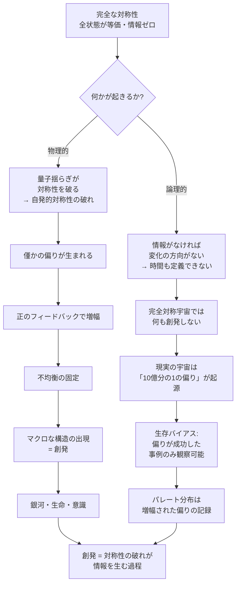

## 1. 概要 (Abstract)

宇宙の始まりに、完全に対称な状態があったとしよう。物質と反物質が完全に等量で、密度揺らぎがゼロで、分子のキラリティに偏りがなく、あらゆる方向・状態が等価である——そのような宇宙で、何かが「創発」するだろうか。

この問いに対する答えは、おそらく「何も起きない」である。

創発とは、ミクロな相互作用の積み重ねがマクロな構造や性質を生み出す過程だ。しかしそのためには、どこかに「偏り」が必要だ。完全に対称な系では全ての状態が等価であり、情報が存在せず、変化の方向も生まれない。宇宙の全ての構造——銀河・生命・意識——は、ごく僅かな非対称性が増幅されることで出現したと考えられる。

逆に言えば、**創発とは「僅かの偏りが不均衡に成長する過程」**である、という仮説が浮かぶ。

---

## 2. 実現不可能性の根拠 (Infeasibility Rationale)

- **物理的限界:** ハイゼンベルクの不確定性原理は、位置と運動量を同時に確定することを禁じる。完全な対称性を実現するには全ての自由度を同時に制御する必要があるが、量子力学はそれを根本的に妨げる。真空でさえゼロ点エネルギーによって揺らいでおり、完全な静止も完全な均一も物理的に成立しない。対称性の破れは宇宙の設計ではなく、量子論の必然的な帰結である。

- **技術的限界:** 仮に任意の領域で対称性を強制的に維持しようとすれば、全ての揺らぎを検出して即座に打ち消す操作が必要になる。これは無限の自由度に対して無限の情報処理を行うことを意味し、ベッケンシュタイン限界——有限の領域が保持できる情報量の上限——を超える。有限のシステムが完全な対称性を維持することは情報論的に不可能である。

- **論理的限界:** 完全な対称性とは「全ての状態が等価である」ことを意味する。等価な状態の間に情報の差異はなく、情報がなければ変化の方向も存在しない。時間の概念すら「前の状態と後の状態が区別できること」を前提とするため、完全な対称性の下では時間の流れ自体が定義できなくなる。「完全な対称性の中で創発が起きるか」という問いは、「情報のない場所で情報が生まれるか」という問いと等価であり、論理的に自己矛盾を含む。

---

## 3. 実験の設定 (Setup)

1. **宇宙の初期条件を制御する:** 現実の宇宙では、ビッグバン直後に物質が反物質より10億分の1だけ多かった（CP対称性の破れ）。この偏差をゼロにした宇宙を想定する
2. **密度揺らぎをゼロにする:** 現実の宇宙では、インフレーション期の量子揺らぎが密度の微細な不均一を生み、それが銀河・恒星・惑星の種になった。この揺らぎも取り除く
3. **分子キラリティの偏りをなくす:** 現実の生命はL型アミノ酸とD型糖だけを使う。この偏りも消し去る
4. **観察する:** このような完全に対称な宇宙が、数十億年後にどのような状態になるかを考察する

---

## 4. 考察と予測 (Speculation)

### 物質が存在しない宇宙

物質と反物質が完全に等量ならば、宇宙の誕生直後に全て対消滅して光子だけが残る。銀河も星も惑星も生まれない。構造の種となる密度揺らぎもゼロなら、膨張する光子の海だけが存在し続ける。

現実の宇宙が存在するのは、その「10億分の1の偏り」のおかげだ。

### パレートの法則と偏りの関係

生態系や経済で観察されるパレート分布——少数が全体の大部分を支配する構造——も、同じ原理から生まれると考えられる。最初の微細な優位性が正のフィードバックを生み、差異が増幅されていく。完全に平等な条件から出発しても、最初の僅かな揺らぎが「勝者」と「敗者」を分ける種になる。

ただしここで生存バイアスに注意が必要だ。我々が「法則」として観察しているのは、偏りが成功した事例の記録である。偏りが失敗した無数の事例は消えて不可視になる。パレート分布は「偏りの成功分布」であり、全ての偏りの試みの分布ではない。

### 分子から意識へ——キラリティの連鎖

地球生命がL型アミノ酸だけを使う理由は完全には解明されていないが、最初の僅かな偏りが自己触媒的に増幅されたと考えられている。完全に対称な化学環境からは、L型とD型が混在したポリペプチドしか生まれない。混在したポリペプチドから精密なタンパク質は折り畳めない。タンパク質がなければ細胞膜も酵素も遺伝情報の複製も成立しない。

意識の創発も、この長い連鎖の延長線上にある。偏りが偏りを呼び、スケールを超えて増幅されていく——その結果が、今ここで「完全な対称性」を思考できる知性体である。

### 創発の定義を書き換える

これらを総合すると、**創発とは対称性の破れが情報を生む過程**と再定義できるかもしれない。

情報理論では、全ての事象が等確率な系はシャノンエントロピーが最大の状態にある。このとき系は完全にランダムであり、予測可能なパターンも構造的な相関も存在しない——構造情報という意味での有用な情報はゼロに等しい。偏りが生じて一部の事象が他より起きやすくなると、エントロピーが下がり、パターンと構造が生まれる。構造・秩序・意識は全て、この「情報の生成」の連続的な積み重ねではないか。

完全な対称性とはすなわち情報のない宇宙であり、そこから何かが創発することは情報論的に原理的に不可能と考えられる。

### 哲学的な問い

- 「偏りのない公平な社会」を目指すことは、創発を抑圧することと同義になるか
- 人間の傾倒・専門化・執着は、局所的な対称性の破れとして創発を駆動する行為か
- 宇宙の全ての構造が「10億分の1の偏り」に由来するなら、「完全な公平」は存在の消滅と等価か

---

## 6. 図解 (Diagrams)

---

## 7. 関連記事 (Related)

- [カオスの創発文法——階層的折り畳み評価が相転移を起こすとき（wiim_054）](../physics/wiim_054.md)
- [自由意志とスケールの逆転——光子から宇宙まで、「決まっている」とは何か（wiim_040）](wiim_040.md)
- [負のエネルギーを制御できたなら何が変わるか（wiim_088）](../physics/wiim_088.md)
- [宇宙を振動させただけ——痕跡なし振動と粒子の起源（wiim_099）](../quantum/wiim_099.md)
- [星は銀河の歌を聞くが、隣の星の歌は聞こえない（wiim_101）](../cosmology/wiim_101.md)
