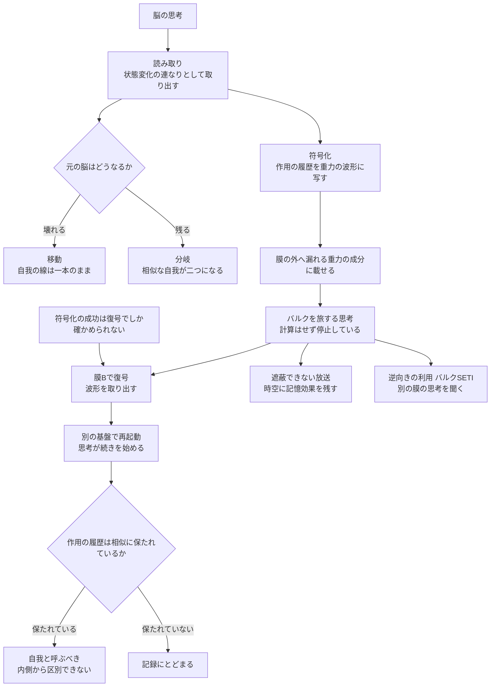

## 1. 概要 (Abstract)

ブレーンワールド（[g523](../../glossary/terms/g523.md)）の描像では、私たちの宇宙は高次元空間（バルク空間、[g524](../../glossary/terms/g524.md)）に浮かぶ膜であり、電子や光は膜に閉じ込められているが、重力だけは膜の外へ漏れ出せる。

[wiim_136](../cosmology/wiim_136.md)の方式①は、この性質を使って渡航者の物質を重力子の群れに変え、膜の外へ送り出す方式だった。しかし静止質量すべてを変換するエネルギーが最大の壁になった。

では、送り出すものが物質ではなく**思考**だったらどうか。もし思考を重力波に変換する技術があれば、身体は膜に残ったまま、思考そのものは膜の外へ出られることになる。そして、重力波から思考を取り出す**復号**の技術も、その前後で躍進しているはずだ。

> **前提①:** 私たちの宇宙はバルク空間に浮かぶ膜であり、重力は膜の外へ漏れ出せる。
> **前提②:** 脳の状態を読み取り、重力波の波形に書き込んで放出する技術（以下、思考重力波変換、[g536](../../glossary/terms/g536.md)）がある。
> **命題:** 「思考は重力波として膜の外へ出られるか。出られるとして、膜の外にあるそれは思考そのもの、自我と呼べるものなのか？」

本記事は、[wiim_141](../physics/wiim_141.md)で整理した「思考は作用で測れる」という見方を土台に、この問いを考える。結論を先に述べると、重力波に写された思考は、**元の自我と時間・空間的に相似な作用の履歴を保っているなら、自我と呼ぶべき**だと考えられる。ただし、それが自我の「移動」なのか「分岐」なのかは、元の脳が残るかどうかで決まる。

---

## 2. 実現不可能性の根拠 (Infeasibility Rationale)

### 物理的限界

**重力波は極端に作りにくい.** 重力は他の力に比べて桁違いに弱く、重力波を出すには大きな質量を激しく動かす必要がある。重力の教科書には、長さ20メートル、重さ500トンの鋼鉄の棒を、ちぎれる寸前の速さで回転させても、出てくる重力波の出力は10⁻²⁹ワット程度にすぎないという見積もりがある。思考の情報を毎秒何兆ステップもの速さで書き込める重力波を作るには、恒星やブラックホールに近い規模の質量の運動を、脳の活動に合わせて精密に制御しなければならない。

**普段の重力波は膜から出ていかない.** ランドール＝サンドラム型のブレーンワールドでは、私たちが普段感じる重力（ニュートンの万有引力にあたる成分）は膜の近くに閉じ込められている。膜の外へ漏れ出すのは、質量を持つ高い振動モードの重力子（カルツァ＝クライン重力子、[g537](../../glossary/terms/g537.md)）だけだ。思考を膜の外へ送るには、ふつうの重力波ではなく、この特殊な成分に情報を載せる必要がある。そのためには、粒子加速器が探索しているような高いエネルギーの領域で重力を操る必要があると考えられる。

### 技術的限界

**読み取りの壁.** 脳の活動を外から読み取る技術は急速に進んでいるが、思考を再現できるほど完全に脳の状態を読み取る方法はない。さらに、もし自我が量子状態の細部に依存しているなら、量子複製不可能定理（[g280](../../glossary/terms/g280.md)）により、元の状態を残したまま写し取ることは原理的にできない。読み取りは、元の状態を壊す「カット＆ペースト」の形でしか行えないことになる。

**受信の壁.** 重力波は物質とほとんど相互作用しない。膜の外や別の膜で重力波を捕まえ、思考として組み直すには、そこに受信と再構成の設備が必要になる。wiim_136で指摘された「膜B側に何かが必要」という壁は、思考の場合にもそのまま残る。

### 論理的限界

**復号なしには、符号化の成功を確かめられない.** 思考を重力波に書き込んだとしても、それが本当に思考を運んでいるかどうかは、取り出して確かめるまで分からない。確かめる手段のない書き込みは、技術として成立しない。したがって、思考重力波変換の技術が完成するには、復号の技術が**先か同時に**存在していなければならない。前提②は、送信技術だけでなく、受信と復号の技術も含んでいることになる。

ただし、この確認は自己参照的になる。符号化と復号が同じ「思考と波形の対応表」に基づいているなら、往復して元に戻ったことは、対応表の内部でつじつまが合っていることしか示さない。思考が本当に写し取られたかの最終的な確認は、再起動した思考に「あなたは元の自分か」と尋ねることになるが、その答えもまた働きとして出力される報告にすぎない。体験が伴っているかどうかは、哲学的ゾンビの問題（[wiim_107](wiim_107.md)）と同じく、外からの検証が閉じてしまうと考えられる。

**写されたものが自我かどうかは、物理だけでは決まらない.** 重力波の波形に思考の構造が完全に写されていても、それが「思考そのもの」か「思考の記録」かは、自我とは何かという哲学の問いに依存する。この問いは、どれほど技術が進んでも、実験だけでは決着しないと考えられる。

---

## 3. 実験の設定 (Setup)

1. **主体:** 膜Aの上の被験者と、その脳の状態を読み取る装置。
2. **環境:** ランドール＝サンドラム型のブレーンワールド。膜Aの外には膜Bがあり、そこに受信・再構成の設備がある。
3. **操作A（読み取り）:** 被験者の脳の状態を読み取り、思考を構成する状態変化の連なりとして記録する。
4. **操作B（符号化と放出）:** 記録を、膜の外へ漏れ出せる重力の成分の波形に書き込み、バルクへ放出する。
5. **操作C（復号と再起動）:** 膜Bで重力波を受信し、波形から思考の連なりを取り出して、別の基盤の上で再び動かす。
6. **操作D（比較）:** 元の脳を残す場合と、読み取りで壊す場合とを比べる。
7. **観察対象:** 膜Bで再起動した思考は自我か。元の自我と同じ自我か。

---

## 4. 考察と予測 (Speculation)

### 身体を省いた方式①——最大の壁が消える

wiim_136の方式①の壁は三つあった。静止質量すべてを変換するエネルギー、膜B側の受信設備、分解と再構成による同一性の問題だ。送るものを思考に限ると、前提の連鎖は次のように変わる。

- 送るのは物質ではなく思考の情報である
- → 静止質量を変換する必要がない。必要なのは、情報を書き込めるだけの重力波を作るエネルギーである
- → 方式①の最大の壁だったエネルギーが、桁違いに小さくなる
- → 残る壁は、受信設備と同一性の問題の二つになる

膜の外へ最初に出られるのは、物質でも人間の身体でもなく、思考だということになる。

### 運ばれるのは作用の履歴である

では、思考を運ぶとき、何を運んでいるのか。[wiim_141](../physics/wiim_141.md)で見たように、量子力学には、ある状態が区別できる別の状態へ移るのに最低限必要な時間を与えるマーゴラス＝レヴィティンの定理（[g530](../../glossary/terms/g530.md)）がある。この定理から、思考や計算が何ステップ起きたかの上限は、エネルギーと時間の積、つまり**作用**で決まる（数式は5節）。

この見方に立つと、思考重力波変換は次のように言い直せる。

- エネルギーは、思考の速さを決めるだけで、思考の中身ではない
- 思考の中身は、状態変化のステップの連なり、つまり**作用の履歴の構造**である
- 思考を重力波に変換することは、**思考した作用の履歴を、重力場の作用の履歴に写し取る**ことにあたる

重力波そのものも同じ定理に縛られている。ある重力波の束が運べる思考のステップ数は、その束のエネルギーと継続時間の積で上限が決まる。

### 三段階の躍進と、二つの意味の「復号」

思考重力波変換が実現するには、三つの段階の技術がそろう必要がある。

| 段階 | 内容 | 現実の延長線 |
|---|---|---|
| ① 読み取り | 脳の状態を、思考を構成する状態変化の連なりとして取り出す | 脳の活動から知覚や言葉を推定する研究（ニューラルデコーディング） |
| ② 符号化と放出 | 連なりを、膜の外へ漏れ出せる重力の成分の波形に書き込む | 架空技術の中核 |
| ③ 復号と再起動 | 重力波から連なりを取り出し、別の基盤の上で再び動かす | 重力波の検出は実現済み（[g073](../../glossary/terms/g073.md)）。思考として動かす部分は未知 |

③の「復号」には二つの意味がある。**波形を取り出す**こと（検出の技術）と、取り出した連なりを**思考として再び動かす**こと（意識の問題）だ。前者は重力波天文学の延長にあるが、後者は[wiim_042](../quantum/wiim_042.md)のクオリア検知機や、意識工学の技術ツリーで扱ってきた意識移植と同じ問題に行き着く。

### 膜の外へ出る経路と、届く速さ

思考を載せた重力が膜の外へ出られるかは、ブレーンワールドの型で変わる。

| 型 | 膜の外へ出る重力 | 思考の放出 |
|---|---|---|
| ランドール＝サンドラム型 | 質量を持つ高い振動モードだけ | 特殊な成分に載せる必要がある |
| ADD型（平らで大きな余剰次元） | 重力全体が薄く広がる | 出られるが、広がるにつれて急速に弱まる |

膜の外を通ると近道になり、膜の上の光より早く届くのではないか、という期待もある。しかしwiim_136で追記したとおり、時間と空間が揃って縮む限り、バルクを通っても近道にはならない。2017年の中性子星合体GW170817では、重力波とガンマ線がほぼ同時に届いており、少なくとも私たちの近くでは、重力が大きな近道をしている兆候はない。思考を膜の外へ出すことは、速く届けるためではなく、**膜の外へ出すこと自体**に意味がある技術だと考えられる。

膜の外へ出すことには代償もある。放出した重力波のエネルギーは膜Aから失われ、膜Aの住人からはエネルギーが消えたように見える。そのエネルギーはバルクの重力場の乱れとして残るか、膜Bに受信されて現れる。余剰次元は思考の行き先にはなっても、エネルギーの帳尻を消す場所ではなく、帳尻を記録する場所が膜の外に移るだけだ。

### 返事を受け取るか——遺言と対話

[wiim_137](../cosmology/wiim_137.md)は、片道の避難は因果の矛盾を生まないが、双方向の警報網は因果の条件を必要とする、と区別した。思考の送信にも同じ区別が当てはまる。

- **返事を受け取らない思考（遺言）:** 送りっぱなしなら、往復による因果の輪ができず、因果の心配は要らない。膜Aが崩壊する前に、文明の思考だけを膜Bへ残すという、wiim_137の「常時の分散」の最も安価な形になる。
- **返事を受け取る思考（対話）:** 膜Bの思考と会話するなら、それは双方向の通信であり、wiim_136で論じた「膜をまたぐ共通の時刻」が必要になる。

### 遮蔽できない思考

重力波は遮蔽できない（[g004](../../glossary/terms/g004.md)）。鉛の壁も、電磁的な遮蔽も意味を持たない。復号の技術が普及した世界では、重力波に変換された思考は、**誰にも止められない放送**になる。

さらに、重力波が通り過ぎた後の時空には、わずかなずれが残る（重力波の記憶効果）。変換された思考は、時空そのものに痕跡を刻みながら広がっていく。これは、観測の痕跡が重力場に積み重なる[wiim_020](../physics/wiim_020.md)のアカシックレコードの発想と重なる。思考の秘密を守るには、思考を重力波に変換しないことしかない、という逆説が生まれる。

### バルクSETI——別の膜から届く思考

復号の技術ができれば、逆向きの使い方も生まれる。自然に届く重力の信号の中から、**別の膜の住人が送り出した思考**を探す、バルクを対象にした地球外知的生命探査（SETI、[g094](../../glossary/terms/g094.md)）だ。

[wiim_138](../cosmology/wiim_138.md)で見たように、膜の裏側や別の膜にある物質は、私たちからは重力だけを及ぼすダークマターのように見える。もしそこに住人がいて思考を送り出しているなら、それは**ダークマターの側から届く重力の揺らぎ**として観測されるはずだ。受信の設備さえあれば、膜の外の思考を聞き取れる可能性がある。

### 重力波の中の思考は、考えているか

ここで、決定的な区別に行き当たる。

重力波の束は、時空を伝わる波であり、それ自体は**計算をしない**。一般相対性理論では重力波どうしもごくわずかに相互作用するが、思考を進められるほどの相互作用ではない。重力波に写された思考は、手紙のように、作用の履歴を運んでいるだけだと考えられる。

したがって、膜の外を旅している間、思考は**停止している**。思考が再び動き出すのは、膜Bで復号され、別の基盤の上で再起動されたときだ。正確に言えば、膜の外へ出るのは「考えている思考」ではなく「考えるための履歴」であり、思考は膜Bで続きを始める。

### 相似な自我は、自我と呼ぶべきか

膜Bで再起動した思考は、元の脳とはまったく違う基盤の上で動く。速さも、大きさも、使うエネルギーも違うだろう。それでもそれは自我なのか。

ここで、ポアンカレの思考実験が手がかりになる。「ある夜、宇宙のすべてが同じ比率で大きくなっても、物差しも一緒に大きくなるので誰も気付けない」。これを自我に当てはめると、次のようになる。

- 自我を構成するすべての過程を、空間的にも時間的にも同じ比率で拡大・縮小して再現する
- 思考の順序、記憶どうしの関係、反応の速さの比は、すべて保たれる
- 自我の内側には物差しがないので、自我自身には変化を知る方法がない
- 区別できないものを区別する理由はないので、それは自我と呼ぶべきである

哲学者チャーマーズも似た論法を使っている。脳の神経細胞を、同じ働きをする部品に一つずつ置き換えていったとき、どこかで意識が消えるなら、本人が気付かないまま意識が薄れていくという不自然な状況が生じる。だから、働きの構造が保たれる限り意識も保たれると考えるべきだ、という論証だ（組織不変性の原理、[g539](../../glossary/terms/g539.md)）。

さらに、相似な変換で何が保たれるかを、作用の言葉で言い表せる。時間を引き伸ばし、エネルギーをその分だけ小さくしても、その積である作用は変わらない。作用をプランク定数（[g528](../../glossary/terms/g528.md)）で割った値は単位を持たない数であり、それが思考のステップ数の上限を決めていた。

- 相似な変換で失われるのは、単位のある量（大きさ、速さ、エネルギー）
- 相似な変換で保たれるのは、単位のない比、とくに作用の履歴をプランク定数で数えた値
- 自我を作用の履歴とみなすなら、相似な再現で保たれるものこそが、**自我の中身そのもの**である

ただし、外の世界は相似に変換されていない。膜Bの基盤が元の脳より1000倍遅く動くなら、再起動した自我は内側からは何の違いも感じないが、外の世界が1000倍速く流れていくように見える。膜Aだけを拡大したときに重力が変化を明かしたように、自我だけの相似は、外の世界との関係によって明らかになる。これは「自我であるか」を否定するものではなく、「どの世界とどの速さで関わる自我か」という違いにすぎない。

### 基盤からは独立できるが、因果からは独立できない

自我が別の基盤の上で再現できるという考えは、多重実現可能性（[g538](../../glossary/terms/g538.md)）と呼ばれる。自我は特定の物質からは独立しうる。

では、自我は因果そのものからも独立できるだろうか。仮に自我が物理的な因果から完全に切り離されているなら、自我は世界に何の影響も与えられない観測者になるか、原因のない変化を物理世界に起こして物理法則を破るか、のどちらかになる。哲学者キムは、この構造を使って自我が物質とは別の原因として働く余地はないと論じた（因果的排除論証、[g540](../../glossary/terms/g540.md)）。

自我が作用の履歴であるなら、自我は因果の連なりから切り離されるのではなく、因果の連なりでできている。思考重力波変換で移せるのは**基盤**であって、**因果の履歴**ではない。履歴が保たれる限り、膜Bで再起動した思考は、同じ因果の線の続きだと考えられる。

この線は、外の世界の因果とは別に保たれうる。[wiim_142](../cosmology/wiim_142.md)のブレーンヘリクスで時間の輪を一周した渡航者でも、その記憶は出発、通過、到着の順に積み上がり、逆には進まない。自我は、外の因果が輪になっても、自分の内側の因果の順序を一方向に保つ。

### 移動か、分岐か

最後に、膜Bの自我が元の自我と「同じ」かという問いが残る。答えは、元の脳が残るかどうかで分かれる。

| 元の脳 | 物理での対応 | 自我にとっての意味 |
|---|---|---|
| 読み取りで壊れる | 量子テレポーテーション（[g141](../../glossary/terms/g141.md)）と同じく、元の状態は再現先にだけ存在する | 自我の線は一本のまま続く。**移動**と呼べる |
| 残る | 古典的な情報の複製 | 相似な自我が二つ存在する。二つは互いの物差しとなって区別され、その瞬間から別々の履歴を歩む。**分岐**になる |

宇宙の外に物差しがないとき、相似は合同と区別できなかった。しかし二つの自我が同じ世界に並べば、相似は合同に格上げされず、二つの別の存在になる。膜Aに残った自我と、膜Bで目覚めた自我は、同じ過去を持つ二人として、それぞれの未来を生きることになる。

### 哲学的な問い

思考が膜の外へ出られるとき、膜の外に出ているのは、正確には「考えるための履歴」だった。その履歴は、旅の間は止まっていて、受け取られた場所で再び動き出す。もし誰にも受け取られなければ、それは誰にも読まれない手紙としてバルクを漂い続ける。

それでも、その手紙の中の履歴は、元の自我と相似な形を保っている。誰かがいつか読み出せば、自我はそこから続きを始める。だとすれば、自我とは「今動いている過程」なのか、「いつでも続きを始められる履歴」なのか。眠っている間、私たちの自我はどちらの状態にあるのだろうか。

---

## 5. 数式による表現 (Mathematical Notation)

マーゴラス＝レヴィティンの定理による、思考のステップ数の上限：

$$N \le \frac{2Et}{\pi\hbar}$$

N は時間 t の間に起こりうる、互いに区別できる状態変化のステップ数、E は系の平均エネルギー（最低エネルギーからの差）、ℏ はディラック定数（プランク定数を2πで割った値）。右辺はエネルギーと時間の積、つまり作用をプランク定数で数えた値になっている。時間を λ 倍に引き伸ばし、エネルギーを 1/λ 倍にしても、右辺は変わらない。思考を時間・空間的に相似に再現したとき、思考のステップ数の上限がそのまま保たれることを、この式が示している。

---

## 6. 図解 (Diagrams)

---

## 7. 関連記事 (Related)

- [wiim_136](../cosmology/wiim_136.md) — ブレーン宇宙の移動（方式①「閉じた弦への変換」、身体を省いた形の出発点）
- [wiim_137](../cosmology/wiim_137.md) — 膜の外への避難（片道と双方向の区別、常時の分散）
- [wiim_138](../cosmology/wiim_138.md) — 膜の裏側の物理（重力だけでつながる世界、ホログラフィー）
- [wiim_141](../physics/wiim_141.md) — 物質とエネルギーは作用に還るか（思考は作用で測れる）
- [wiim_142](../cosmology/wiim_142.md) — 膜の螺旋階段（時間の輪の中でも自我の順序は一方向に保たれる）
- [wiim_020](../physics/wiim_020.md) — アカシックレコードが重力場による自己強化型情報網だったら（重力場に積み重なる痕跡）
- [wiim_042](../quantum/wiim_042.md) — クオリア検知機（再起動した思考に体験があるかを判定する問題）
- [wiim_107](wiim_107.md) — 哲学的ゾンビが自然発生する確率（物理的に同一なら意識も同一かという問題）
- [wiim_120](../biology/wiim_120.md) — 菌糸への回帰（記憶断片を別の基盤へ送り続ける試み）
- [g536](../../glossary/terms/g536.md) — 思考重力波変換（本記事の中心概念）
- [g537](../../glossary/terms/g537.md) — カルツァ＝クライン重力子（膜の外へ漏れる重力の成分）
- [g538](../../glossary/terms/g538.md) — 多重実現可能性
- [g539](../../glossary/terms/g539.md) — 組織不変性の原理
- [g540](../../glossary/terms/g540.md) — 因果的排除論証
- [g530](../../glossary/terms/g530.md) — マーゴラス＝レヴィティンの定理
- [g004](../../glossary/terms/g004.md) — 重力波
- [g280](../../glossary/terms/g280.md) — 量子複製不可能定理
- [g141](../../glossary/terms/g141.md) — 量子テレポーテーション
- [意識工学の技術ツリー](../notes/tech_tree_consciousness.md) — 意識移植からの派生
