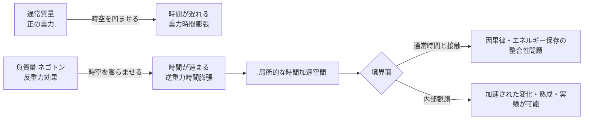

## 概要 (Abstract)

通常の質量を持つ物体の周囲では、重力によって時間の進みが遅くなる（重力時間膨張）。では、その逆——**負の質量を持つ粒子**が存在し、それを用いて特定の空間に「反重力」的な場を形成できたとしたら？

理論上、重力と逆向きの効果は時間を遅らせるのではなく**速める**方向に働くと考えられる。タキオン（虚数質量を持つ仮説上の粒子）の「逆」として発想されたこの粒子は、厳密には虚数質量の反転ではなく、**負の実質量**あるいは**負のエネルギー密度を生成できる粒子**として定式化される。

この思考実験は、wiim_002「相対的に時間を進められる空間」の物理的メカニズムとして、最も理論に近い候補を検討する。

---

## 実現不可能性の根拠 (Infeasibility Rationale)

### 物理的限界

一般相対性理論において、時間の進みを決めるのは「エネルギー密度（質量・エネルギーの分布）」である。通常の正の質量は時空を「へこませ」、時間を遅らせる。負の質量は時空を「盛り上げ」、理論的には時間を速める方向に作用すると考えられる。

ただし、負の質量を持つ粒子は**安定して存在できない**と考えられている。正の質量と負の質量の粒子が近づくと、正の質量は引き付けられ、負の質量は反発するという奇妙な「暴走加速（runaway motion）」が生じ、エネルギー保存則と矛盾する振る舞いを示す。

カシミール効果では2枚の金属板の間に微小な負のエネルギー密度が生じることが実験的に確認されているが、その量は巨視的な時間操作に利用できるスケールには程遠い。

### 技術的限界

仮に負質量粒子を生成できたとしても、それを「特定の空間を囲む形」で安定的に配置・制御する技術は存在しない。アルクビエレ・ドライブ（ワープドライブ理論）もエキゾチック物質の使用を前提とするが、必要とされるエネルギー量は木星の質量に相当するとされており、工学的実現の見通しは立っていない。

また、負質量粒子が放射・崩壊した場合に周囲の空間に与える影響は未知であり、制御不能な時空間の歪みを引き起こす可能性がある。

### 論理的限界

「時間を局所的に速める空間」と「通常時間の空間」が接する境界面では、wiim_002 で論じたものと同様の因果律の問題が生じる。加えて、負質量粒子が「時間を速めた空間」の内部に存在する場合、その粒子自身も加速された時間の中で変化・崩壊することになり、効果が自己消滅するパラドックスが考えられる。

---

## 実験の設定 (Setup)

- **主体**: 負質量粒子を生成・制御できる技術を持つ研究者
- **材料**: 負の実質量を持つ思考実験上の粒子（便宜上「ネゴトン」と呼ぶ）
- **操作**: ネゴトンを対象空間の周囲に球状に配置し、内部に「時間加速場」を形成する
- **効果**: 内部空間では外部の N 倍の速度で時間が進む
- **観察**: 外部から内部を透過型センサーで観察し、時間経過の差を記録する

想定される配置イメージ：

| 層 | 内容 |
|----|------|
| 最外層 | 観測・制御設備（通常時間） |
| 中間層 | ネゴトン配置リング（時間勾配の発生源） |
| 内部空間 | 時間加速域（対象物が置かれる） |

---

## 考察と予測 (Speculation)

### タキオンとの本質的な違い

タキオンは「光速を超えた運動」によって一部の基準系で過去に情報を送る可能性を持つ。一方、ネゴトンが作用するのは時空の「曲率」であり、運動速度ではなく**空間そのものの構造**を変化させる点が異なる。タキオンが「粒子の速度の問題」であるのに対し、ネゴトンは「場の問題」である。

この区別は重要で、タキオンが因果律を破る可能性があるのに対し、ネゴトンによる時間加速は因果律の「順序」は保ちつつも「速度」を変えるという、より穏やかな違反にとどまる可能性がある。

### カシミール効果との連続性

カシミール効果が示すように、「負のエネルギー密度」は完全に非物理的ではなく、量子場理論の枠組みでは自然に出現する。これはネゴトンが全くの空想ではなく、その極めて微小な版がすでに現実に観測されていることを意味する。規模の問題は工学的に解決可能かもしれない——という希望的観測は、他の思考実験より幾分根拠を持つ。

### 哲学的問い

もし負質量粒子によって時間を局所的に操作できるなら、「時間の速さ」は物質の配置によって決まる制御可能な変数ということになる。これは「時間は一様に流れる」という日常感覚を根本から覆し、「時間の濃淡がある宇宙」という世界観を提示する。空間によって時間の密度が違うなら、「同時」という概念はどこまで意味を持つのか。

---

## 図解 (Diagrams)

---

## 関連記事 (Related)

- [wiim_001](wiim_001.md) — 光速を超えた場合の因果律への影響（タキオンとの比較）
- [wiim_002](wiim_002.md) — 相対的に時間を進められる空間（本記事の応用シナリオ）
- （未作成）ワームホールの入口に入ったらどうなるか
- （未作成）アルクビエレ・ドライブは本当に光速を超えているのか
- （未作成）カシミール効果を巨視的スケールに拡大できるか
