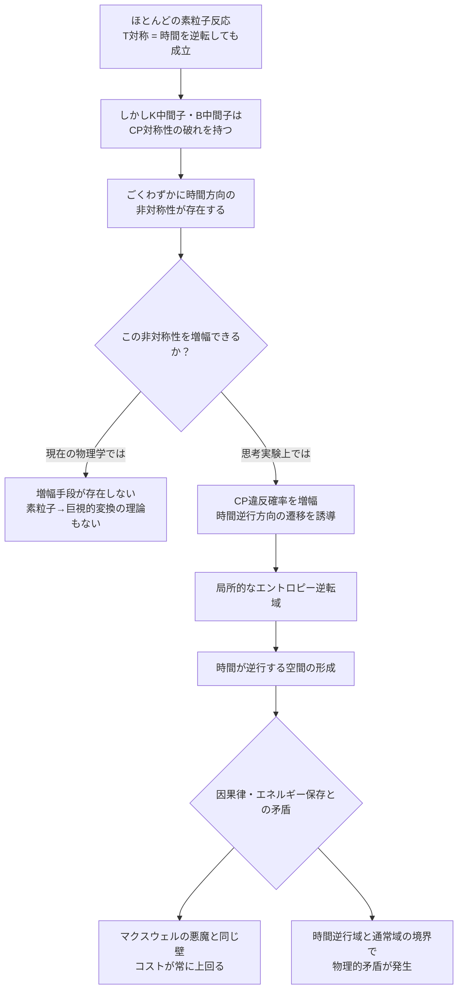

## 概要 (Abstract)

素粒子物理学には、きわめて興味深い事実がある。ほとんどの素粒子反応は「時間を逆回しにしても成立する」——物理学的には時間反転対称（T対称）と呼ばれる性質だ。しかし一部の粒子、特に**K中間子**や**B中間子**は、CP対称性の破れ（弱い力が時間の向きを完全に区別しないわずかな非対称性）を通じて、時間の方向性をわずかに「知っている」ように振る舞う。

この思考実験では次の問いを立てる。もしこの「時間遡行的な確率」を持つ粒子を大量に集め、そのエントロピーを人工的に増大させる方向へ誘導することで、局所的に時間の流れを逆転させ、タイムマシンの基礎理論とすることは可能か。

---

## 実現不可能性の根拠 (Infeasibility Rationale)

### 物理的限界

熱力学第二法則は「孤立系のエントロピーは増大し続ける」と定める。これが私たちの感じる「時間の矢」の正体だとされている。コーヒーは冷め、氷は溶け、割れた茶碗は元に戻らない——すべてエントロピーが低い状態から高い状態へ一方向に流れるからだ。

CP対称性の破れは確かに実在する現象だが、そのスケールは素粒子反応の確率がほんのわずか（0.1〜0.3%程度）非対称になる程度に過ぎない。これは「時間が逆行する」のではなく、特定の反応経路の頻度が微妙に違うというものだ。エントロピーの巨大な流れを逆転させる駆動力には、桁違いに力が足りない。

### 技術的限界

「エントロピーを増大させることで時間を逆転させる」というアイデアは、直感に反するように見える。通常、エントロピーを局所的に**減少**させること（例：冷蔵庫が熱を外に追い出す）が「秩序を回復する」行為に対応する。エントロピーを増大させると系はより無秩序になり、時間を「前方向」により強く進めることになる——逆ではない。

この思考実験の解釈として最も自然なのは、「CP対称性の破れを増幅し、時間逆行方向への遷移確率を人工的に高める」というものだろう。しかし現状、CP違反の増幅メカニズムは存在せず、K中間子・B中間子の生成自体に巨大な粒子加速器が必要だ。

### 論理的限界

仮に局所的な時間逆行が実現したとしても、因果律の問題は免れない。時間を遡行した領域では「結果が原因より先に存在する」状況が生まれ、情報が過去に伝達される可能性が出てくる。これはwiim_001で論じた光速超過の問題と同じ構造を持つ。

また、時間が逆行する領域と通常時間の領域が境界を接するとき、その境界面でエントロピーの方向が反転するという物理的矛盾が生じ、エネルギー保存則との整合性が問われる。

---

## 実験の設定 (Setup)

- **材料**: CP対称性の破れを示す粒子（K中間子・B中間子）を大量生成・集積する
- **操作1**: 時間逆行方向への遷移確率を増幅する外部場を印加する
- **操作2**: 増幅した時間逆行性を周囲の物質へ「伝播」させ、巨視的なエントロピー減少域を形成する
- **目標**: 対象空間内の時間の流れを逆転させ、過去状態への回帰を観測する

| フェーズ | 内容 | 現在の実現性 |
|---------|------|------------|
| K/B中間子の大量生成 | LHC規模の加速器で可能 | ◎ 実現済み（ただし微量） |
| CP違反確率の増幅 | 外部場による制御 | ✗ 未知 |
| 巨視的時間逆行への変換 | 素粒子→巨視的スケールの橋渡し | ✗ 理論的根拠なし |
| 時間逆行域の安定維持 | 境界面の物理的矛盾を解決 | ✗ 不可能と考えられる |

---

## 考察と予測 (Speculation)

### 「時間の矢」は何枚あるか

物理学者はしばしば、時間の方向性を定める「矢」が複数あると指摘する。

- **熱力学の矢**: エントロピーが増大する方向
- **宇宙論の矢**: 宇宙が膨張している方向
- **電磁気の矢**: 光が過去から未来へ放射される方向（遅延波のみが観測される）
- **CP違反の矢**: K中間子・B中間子が示す微弱な時間非対称性

この思考実験は「CP違反の矢」を操作することで他の矢を逆転させようとする試みとも言える。しかし現在の物理学では、これらの矢は独立に定義されており、一つを操作しても他が連動して逆転する仕組みは知られていない。

### マクスウェルの悪魔との接点

19世紀の思考実験「マクスウェルの悪魔」は、情報を使ってエントロピーを局所的に減少させられるかを問うた。現代の情報物理学では「悪魔が情報を消去するコストで結局エントロピーは増大する」と結論づけられている（ランダウアーの原理）。

CP違反粒子の操作による時間逆行も、同様の構造を持つかもしれない。局所的に時間を逆行させるために費やすエントロピーのコストは、逆行によって取り戻せるエントロピーを必ず上回る——それがこのアイデアが直面する根本的な壁だと考えられる。

### それでも「ほんのわずか」は本物だ

ここで強調しておきたいのは、CP対称性の破れは思考実験の材料ではなく、実験で繰り返し確認された**現実の現象**だという点だ。宇宙に反物質ではなく物質が優勢に存在する理由も、このわずかな非対称性に起因すると考えられている。

「時間の方向性を知っている粒子が存在する」という事実は、時間遡行の完全な不可能性に小さな亀裂を入れているとも言える。現在の物理学がその亀裂を広げる方法を知らないだけで、将来の理論がここに足がかりを見出す可能性を、完全に否定することはできない。

---

## 図解 (Diagrams)

---

## 関連記事 (Related)

- [wiim_001](wiim_001.md) — 光速を超えた場合の因果律への影響（時間遡行と因果律の共通問題）
- [wiim_002](wiim_002.md) — 相対的に時間を進められる空間（時間の加速と逆行の対比）
- （未作成）マクスウェルの悪魔は本当に封じ込められたか
- （未作成）宇宙に物質が多く反物質が少ない理由——CP違反の宇宙論的意味
- （未作成）時間対称な宇宙では記憶は存在できるか
