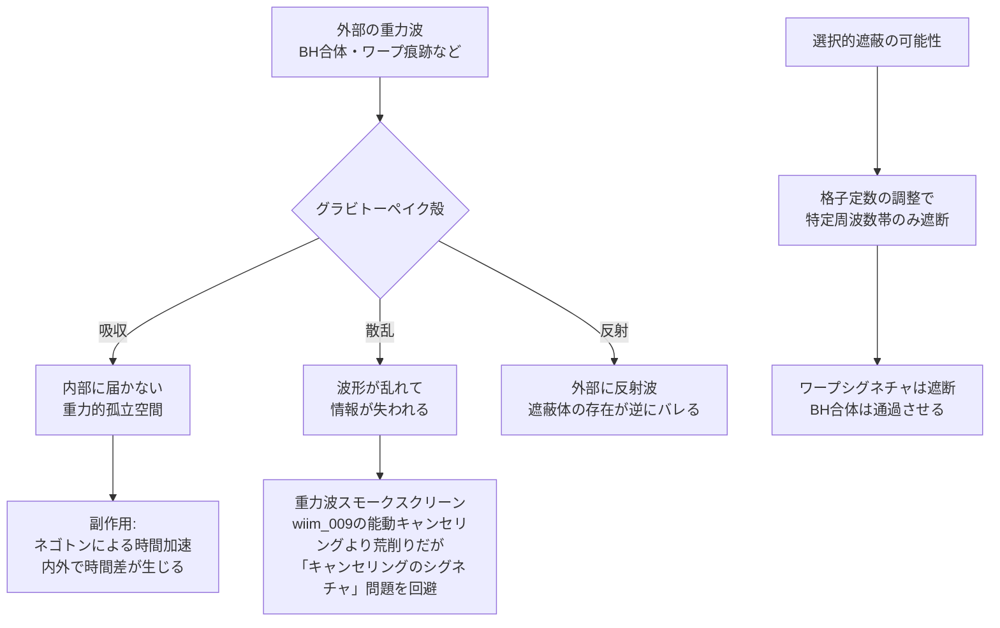

## 概要 (Abstract)

X線は鉛で遮蔽でき、電磁波はファラデーケージで封じられ、中性子線も高密度ポリエチレンで散乱させられる。では重力波は？

答えは簡潔だ——現在知られているいかなる物質も、重力波をほとんど遮蔽できない。LIGOが検出した重力波は、途中で銀河を丸ごと通り抜けてきたにもかかわらず、波形に乱れがなかった。鉛1光年分の壁があっても、通過する重力波のエネルギーはほぼ減衰しない。

電磁波と物質の相互作用は電子を介する。しかし重力波は時空の歪みそのものであり、物質の「中」ではなく物質が存在する「時空」を伝わる。これを遮るには、物質の電気的性質を変えるのではなく、**時空そのものの応答性を変える**物質が必要になる。

この思考実験では、そのような「重力的不透明体」が存在したとき何が可能になり、そして何が失われるかを問う。

---

## 実現不可能性の根拠 (Infeasibility Rationale)

### 物理的限界

電磁波を遮蔽できるのは、光子が物質中の電子と強く相互作用するからだ。重力波（グラビトン）と物質の結合定数は、電磁力と比べて**約40桁小さい**。これは「全く相互作用しない」に等しく、通常の物質では遮蔽の原理自体が成立しない。

なお本記事が用いる「電磁遮蔽との類比」は理解の補助であり、厳密な対応ではない。電磁遮蔽は自由電子が外部電場と逆向きの場を能動的に発生させる機構であり、遮蔽体自体は電磁場の影響を受けつつも応答する。重力の場合は遮蔽体そのものが質量（エネルギー）を持つため重力源になってしまい、等価な応答機構が原理的に存在しない。類比はスケールの違いを直感的に示すための比喩として扱うこと。

遮蔽を実現するには、重力波と異常に強く結合する物質が必要だ。これは言い換えれば「重力結合定数が極端に大きい物質」であり、そのような物質は一般相対性理論や量子重力理論の枠内では予測されていない。

### 技術的限界

wiim_003で論じたネゴトン（負の実質量を持つ仮説上の粒子）を格子状に配列すれば、局所的な時空曲率の変動を増幅・散乱させる「重力波格子」を構成できるという理論上の可能性がある。しかしネゴトン自体が未観測であり、さらにそれを安定した格子構造に維持する技術は二重の意味で存在しない。

### 論理的限界

最も根本的な問題は、重力波を「遮断する」ことの意味だ。電磁波を遮断しても時空は変わらない。しかし重力波を遮断するとは、**時空の歪みが伝わらない領域を作る**ことを意味する。その領域の内側では、外部の質量分布の変化が届かない——重力的な意味で外界から切り離された空間が生まれる。これは「情報の遮断」という以上に、物理法則の局所的な書き換えに近い。

---

## 実験の設定 (Setup)

- **材料**: ネゴトンを規則的な格子構造に配列した「重力波格子素材」（便宜上「グラビトーペイク」と呼ぶ）
- **構造**: 重力波の波長（数百km〜数千km）に比べて十分な厚みを持つ球殻状の遮蔽体
- **内部**: 通常の物質・観測装置・生命体を収容する
- **目的**: 外部からの重力波を散乱・吸収させ、内部を「重力的に静寂な空間」にする

| 遮蔽効果 | 内部への影響 | 外部への影響 |
|---------|------------|------------|
| 重力波の吸収 | 外部の質量変動が届かない | 内部の重力波も外に漏れない |
| 重力波の散乱 | 波形が乱れて情報が読めない | 内部の「シグネチャ」が拡散する |
| 重力波の反射 | 内部で定在波が生じる可能性 | 反射波が外部に放出される |

---

## 考察と予測 (Speculation)

### 重力的孤独——外の宇宙が「見えなくなる」

遮蔽体の内側では、外部の重力波が届かない。これは単に「静かになる」ことではない。

重力波は宇宙のあらゆる質量の運動を伝える。ブラックホールの合体、中性子星の衝突、銀河の衝突、さらにはワープ航法のシグネチャ（wiim_004参照）——これらの情報は全て遮断される。内部の存在は、外の宇宙で何が起きているかを**重力的手段では一切知ることができない**。

これは電磁遮蔽（ファラデーケージ）が電波を遮るのとは次元が違う。電磁波で情報を送ることはできても、重力波で情報を送ることはできない——つまり「外から助けを呼ぶ手段が一つ消える」のではなく、「宇宙の大質量天体と完全に対話できなくなる」ことを意味する。

### 遮蔽体自体が時空を歪める

グラビトーペイクがネゴトンで構成されているなら、遮蔽体そのものが強烈な反重力場を持つ。内部空間の時間は外部より速く流れる（wiim_003の時間加速効果）。

つまりこの遮蔽体は「重力波シールド」であると同時に「時間加速チャンバー」でもある。遮蔽の副作用として、内外で時間のずれが生じ、遮蔽体を出入りするたびに相対的な時間差が蓄積される。長期間この中にいた存在は、外の世界から見て「未来から来た」ことになる。

この時間歪曲を抑制する工学的手段として、**ネゴトンの充填密度を低くする**方法が考えられる。密度が低ければ反重力場は弱まり、内外の時間差は実用許容範囲に収まりうる。しかし密度を下げると格子の重力波散乱効率も低下し、遮蔽性能そのものが劣化する。**完全遮断と時間同期の両立は原理的に不可能**であり、実用的なグラビトーペイクは「許容できる時間歪曲の範囲で最大の遮蔽性能を得る」というトレードオフの中で設計されることになる。

### 散乱体として使う——重力波のスモークスクリーン

完全な遮断ではなく「散乱」を目的とするなら、全く異なる用途が生まれる。

重力波を散乱させる物質を宇宙空間に撒布すれば、wiim_004で論じた重力波センサー網を無力化できる。ワープ艦隊の周囲に散乱体を展開することで、自艦の重力波シグネチャを「霧の中に消す」——これは重力波版のスモークスクリーンだ。

能動的なキャンセリング（wiim_009）が「逆位相を出して消す」精密な技術だとすれば、散乱体は「情報を壊して読めなくする」荒削りな技術だ。しかし荒削りゆえに、wiim_009が抱える「キャンセリング自体がシグネチャを生む」という逆説を回避できる可能性がある。

### 重力波の「色」と選択的遮蔽

電磁波の遮蔽は波長に依存する——X線を通すが可視光は遮る物質があるように、重力波も波長によって散乱特性が変わりうる。

低周波の重力波（ブラックホール合体由来、周波数：数十Hz以下）と高周波の重力波（ワープ航法由来、周波数：未知）では波長が大きく異なる。格子定数を調整することで「特定の周波数帯の重力波だけを遮断する」選択的遮蔽が理論上可能かもしれない——天然物質が光の特定波長を吸収するのと同じ原理で。

---

## 図解 (Diagrams)

---

## 関連記事 (Related)

- [wiim_003](wiim_003.md) — 負の質量を持つ粒子による局所的時間加速（ネゴトンの定義・エキゾチック物質との違い）
- [wiim_009](../cosmology/wiim_009.md) — 重力波をキャンセルする（能動的消去との対比）
- [wiim_004](../cosmology/wiim_004.md) — ワープ航法の痕跡を重力波で追跡できる世界（スモークスクリーンの応用先）
- （未作成）ブラックホールを人工的に生成・制御できるか
- （未作成）時空の屈折率——光以外の波を曲げる媒質は存在するか
- [wiim_012](wiim_012.md) — 近光速回転シールド——時間膨張を鎧にする
- [wiim_022](wiim_022.md) — アンキロン——時空の計量に錨を打つ架空粒子
- [wiim_031](wiim_031.md) — 真空非対称牽引ビーム——誘導重力が正しければカシミール効果はトラクタービームになる
- [wiim_034](wiim_034.md) — エキゾチック物質音響実験——負屈折チャンバーとコーラ粒子音響搬送の試み
- [wiim_035](wiim_035.md) — グラビトーペイクの逆説——遮断した重力波エネルギーはどこへ行くのか
- [wiim_037](wiim_037.md) — レトロン——負のエントロピーを持つ粒子と因果の逆行
- [wiim_038](wiim_038.md) — 静かな対消滅——パランティ粒子による完全無効化
- [economy_um_currency](../notes/economy_um_currency.md) — 世界観：UM通貨制度とエキゾチック物質単価
- [wiim_022_tactical](../notes/wiim_022_tactical.md) — 補遺: アンキロンの戦術応用——計量バリケードの強度設計と反アンキロン除去
- [wiim_063](wiim_063.md) — 架空粒子による大気圏突入緩和——ネゴトン・カシミールフォージ・レトロンは再突入熱と重力を制御できるか
- [wiim_064](wiim_064.md) — ネグレーザー——真空ゆらぎのコヒーレント化による引力・反重力ビームは実現できるか
- [wiim_065](wiim_065.md) — 反重力天体——エキゾチック物質とカシミールフォージで斥力場を生成できるか
- [wiim_066](wiim_066.md) — ネゴトン凝縮体の外部照射構築法——ネゴトロンビームで反重力天体を組み上げる

