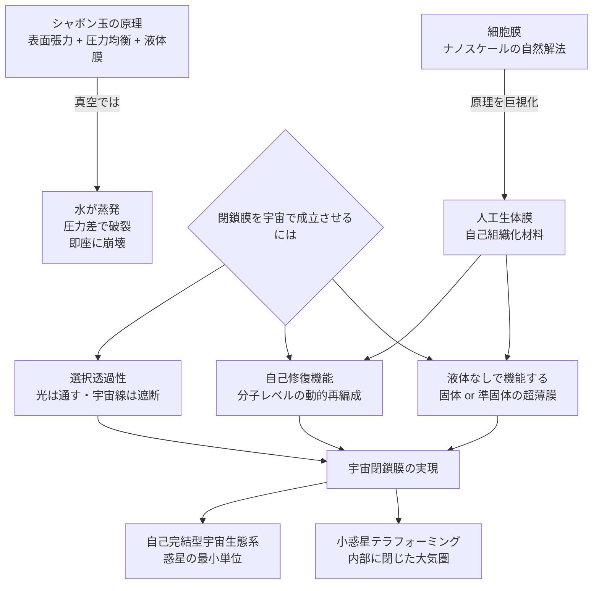

## 概要 (Abstract)

シャボン玉は美しく、そして儚い。その薄さは数百ナノメートル——髪の毛の直径の数百分の一だ。しかしシャボン玉が「膜」として成立するのは、内外の空気圧が均衡し、水分が蒸発せず、表面張力が形を保てる地球の大気圏という環境あってのことだ。

真空中ではシャボン玉は0.1秒以内に消える。水分は沸騰して蒸発し、圧力差を支えるものが何もなく、膜は崩壊する。

では問う——もし真空・宇宙空間においても「閉鎖膜」を維持できる材料・技術が存在したとしたら？ 小惑星を丸ごと包む大気圏の種、宇宙を漂う自己完結した生態系の泡、あるいは恒星間を旅する薄膜の世界——その可能性と不可能性の境界を探る。

---

## 実現不可能性の根拠 (Infeasibility Rationale)

### 物理的限界

地球上のシャボン玉が成立する条件は三つだ——①内外の圧力差が小さい、②水の表面張力が膜を支える、③蒸発速度が遅い。宇宙空間ではこの三つが全て崩れる。

真空では液体は沸点に関わらず即座に気化する。また膜の内部に気体を封じると、外側が真空なので膜は内部圧力で膨らみ続け、材料の引張強度の限界を超えた時点で破裂する。既知の材料で「シャボン玉のように薄く、かつ内部圧力に耐えられる膜」を作ろうとすれば、カーボンナノチューブの理論強度でさえ、大気圧1気圧の内部圧力を支えるには数十ナノメートル厚の球体で限界に達する。

### 技術的限界

宇宙環境は膜にとって最悪の条件が重なる。太陽光の当たる面は約+150℃、影の面は約−130℃という温度差が数十分周期で繰り返され、熱膨張収縮による疲労が材料を劣化させる。さらに太陽風・宇宙線・紫外線が高分子材料を分子レベルで破壊し、微小隕石（宇宙塵）が無数に飛来する。

現在のBigelow Aerospaceなどが開発する「膨張式宇宙モジュール」は、多層の分厚い壁（厚さ数十cm）で成立している。これはシャボン玉とは対極の「頑丈な圧力容器」だ。

### 論理的限界

「シャボン玉的な薄膜」の本質は**動的平衡**にある。シャボン玉が壊れないのは、表面張力が常に膜の厚さを均一に保つよう液体分子を再配置し続けるからだ。これを真空・宇宙で実現するには、膜を構成する分子が常に能動的に動いて自己修復する必要がある——つまり膜自体が「生きている」に等しい振る舞いをしなければならない。

---

## 実験の設定 (Setup)

膜の成立に必要な性質を段階的に考える：

| 要件 | 内容 | 現在の材料科学との距離 |
|------|------|----------------------|
| 真空耐性 | 液体成分なしで膜を維持できる | グラフェン等の単原子層膜が候補 |
| 圧力耐性 | 内部大気圧（約100kPa）を超薄膜で支える | カーボンナノチューブ理論値に近い |
| 自己修復 | 微小隕石の穴を数秒以内に塞ぐ | 自己修復ポリマーは研究中だが宇宙環境未対応 |
| 熱安定性 | ±200℃の温度サイクルに耐える | 既存材料では劣化が避けられない |
| 放射線耐性 | 宇宙線・UV による分子破壊を防ぐ | 現状は遮蔽が必要で薄膜では困難 |

全条件を同時に満たす材料は現時点で存在しない。

---

## 考察と予測 (Speculation)

### 生命はすでにナノスケールで解決している

実は「真空に近い環境で閉鎖膜を維持する」問題を、地球上の生命は何十億年も前に解決している——**細胞膜**だ。

細胞膜はリン脂質二重層という厚さ約5ナノメートルの膜で、細胞内液と細胞外液を隔てている。完全な真空ではないが、内外の浸透圧差・pH差・イオン濃度差というきわめて大きな物理化学的ストレスをかけながら、自己修復・自己組織化によって膜の完全性を維持する。細胞膜が破れた部分は数秒で脂質分子が自発的に再集合して塞がれる。

生命が用いた解法——分子の**自己組織化と動的再編成**——は、宇宙の閉鎖膜に必要な性質と驚くほど一致する。スケールは8桁（ナノメートル→メートル）以上異なるが、設計思想の類似は偶然ではないかもしれない。もし細胞膜の原理を巨視的スケールに拡大する材料工学が実現すれば、それは事実上「人工生体膜」の誕生だ。

### 小惑星を包む——テラフォーミングの最小単位

この技術の最も劇的な応用は、**小惑星や月の一部を閉鎖膜で包み、内部に大気を閉じ込める**ことだ。

直径1kmの小惑星を球形の膜で包んだとすると、膜の面積は約300万平方メートル。内部に窒素・酸素の混合気体を充填すれば、微小重力ではあるが閉じた大気圏を持つ空間が生まれる。太陽光は透過させ、宇宙線は遮断する選択透過性を持たせれば、内部で植物の光合成が可能になる。

これは惑星規模のテラフォーミング（火星に大気を与えるなど）とは対極の発想だ——惑星を変えるのではなく、**宇宙空間に「惑星の最小単位」を浮かべる**。

### 膜の厚さと内包できる世界の関係

膜を維持するために必要なエネルギー（自己修復・構造維持）は、膜の面積に比例して増える。半径が10倍になると面積は100倍になり、必要エネルギーも100倍に膨らむ。

これは「どこまで大きな泡を作れるか」という問いに対して、エネルギー供給量という上限を与える。太陽系内で太陽エネルギーを利用できる範囲では、直径数百kmまでの「宇宙泡」が理論上の上限かもしれない——それは小さな衛星に匹敵する規模だ。

---

## 図解 (Diagrams)

---

## 関連記事 (Related)

- [wiim_008](../biology/wiim_008.md) — 菌糸ネットワークが宇宙空間で分散知性に進化したら（宇宙生命・自己組織化の共通テーマ）
- [wiim_006](../quantum/wiim_006.md) — パウリの排他原理が局所的にオフになる空間（物質の極限的操作）
- （未作成）細胞膜の原理を巨視化できるか——自己組織化材料の限界
- （未作成）小惑星帯を農地にできるか
- （未作成）選択透過膜で恒星風を「ろ過」できるか
- [wiim_019](wiim_019.md) — 居住しない惑星——エネルギー用途のテラフォーミング
- [wiim_031](wiim_031.md) — 真空非対称牽引ビーム——誘導重力が正しければカシミール効果はトラクタービームになる
- [wiim_032](wiim_032.md) — コーラバブルワープ——コーラ粒子場に包まれた船が余剰次元を跳躍する
- [wiim_017](../biology/wiim_017.md) — 胞子雨——菌類による惑星水循環の起動
- [wiim_018](../biology/wiim_018.md) — 胞子の宇宙——金星・タイタン・氷衛星への生物気候工学
- [wiim_025](../biology/wiim_025.md) — シェルマイセリウム——コスモシェルとコズミックマイスの共生が生む自律型宇宙生命体カプセル
- [wiim_043](../biology/wiim_043.md) — 宇宙ゴケ——地衣類とコズミックマイスの共生が生む自律型テラフォーミング艦
- [wiim_025_gravity_zone](../notes/wiim_025_gravity_zone.md) — 補遺: シェルマイセリウムの安定立地——重力圏内外のどこに膜を張るか

