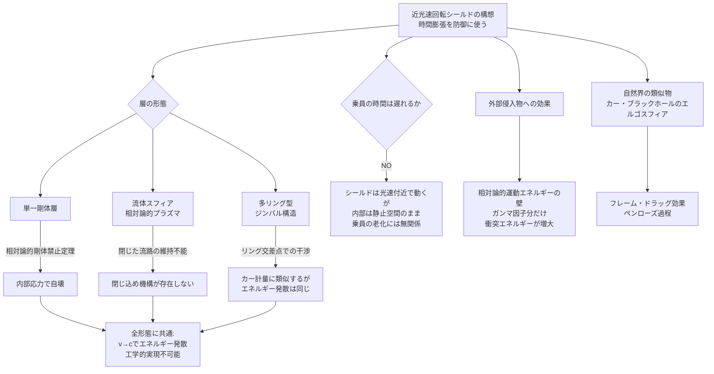

## 概要 (Abstract)

特殊相対性理論は「速く動くものの時間は遅れる」と告げる。では、宇宙船の周囲に光速に近い速度で回転・流動する物質の層を纏わせたとしたら——外部からの攻撃、放射線、あるいは時間そのものをシャットアウトする「鎧」として機能しうるだろうか？

直感的なイメージはこうだ。近光速で回転する層に向かって飛んでくるレーザーや砲弾は、層の粒子と衝突する際に相対論的なエネルギー差に直面する。外から見れば層はローレンツ収縮で薄く見え、時間膨張でゆっくり動いて見える——しかし侵入者にとっては、その層は極めて大きな運動エネルギーを持つ粒子の壁だ。

ところが、この「時間膨張の鎧」には深刻な逆説が潜んでいる。内部の乗員の時間が遅れることはない。守られるはずの人間は、シールドの恩恵を時間的には受けないのだ。

---

## 実現不可能性の根拠 (Infeasibility Rationale)

### 物理的限界

特殊相対性理論は**剛体の存在を禁じている**。剛体とは「一端を押したとき、もう一端が即座に動く物体」だが、信号の伝達速度は光速を超えられないため、真の意味での剛体は存在できない。これを近光速回転シールドに当てはめると、回転する物質層は内部応力に耐えられず、速度が増すにつれて自壊していく。これは「ベルのロケットのパラドックス」——加速する二台のロケットをつなぐ糸が必ず切れるという問題——の球殻版だ。

流体や粒子群で層を構成すれば剛性の問題は回避できるが、次の壁が現れる。粒子を光速に近づけるにつれて、その相対論的質量（エネルギー）は理論上無限大に発散する。層全体の質量・エネルギーが発散すれば、シールド自身が重力的に周囲を飲み込んでしまう。

### 技術的限界

球殻状に「閉じた流路」を維持するには、粒子を曲げ続ける求心力が必要だ。粒子がほぼ光速で運動するとき、必要な求心加速度は天文学的な値になる。現在知られているどんな磁場・電場・重力場もこれを担えない。

さらにエネルギーの問題がある。地球全体の年間発電量をはるかに超えるエネルギーを、宇宙船1隻のシールドに供給し続けなければならない。そして万一、層の流路が乱れれば、蓄積された相対論的エネルギーが即座に解放される——宇宙船を守るはずのシールドが、最大の脅威になる。

### 論理的限界

最も根本的な逆説は**非対称性**だ。

時間膨張は「速く動くものの時間が遅れる」現象だ。シールド層の粒子は光速に近い速度で動いているので、その時間は遅れる。しかし内部の乗員はシールドとともに運動していない——船の内部は通常の静止した空間だ。したがって、乗員の時間は遅れない。

「老化を防ぐ」という目的でこのシールドを使うなら、逆のアプローチが必要になる——乗員ごと光速に近い速度で運動させるしかない。しかしそれは「シールドに守られた宇宙船」ではなく、「丸ごと光速飛行する宇宙船」、すなわち wiim_002 の領域だ。

---

## 実験の設定 (Setup)

層の形態によって物理的挙動が根本的に異なる。三つの構造を比較する：

| 形態 | 原理 | 主な問題 |
|------|------|---------|
| **単一剛体層** | 固体シェルを高速回転 | 相対論的剛体禁止定理で自壊。内部応力が光速前に限界を超える |
| **流体スフィア** | 相対論的プラズマや粒子群の球殻流 | 剛性問題を回避できるが、球殻状の閉じた流路を維持する閉じ込め機構が存在しない |
| **多リング型（ジンバル）** | 複数のリングが異なる平面で回転し全方位をカバー | カー・ブラックホールのエルゴスフィアに最も近い構造。リング同士の交差点で衝突・干渉が生じる |

三形態とも、速度が光速に近づくほど必要エネルギーが発散するという根本問題を共有している。

---

## 考察と予測 (Speculation)

### 侵入者から見たシールドの「重さ」

外部から飛んでくる砲弾やレーザーがシールド層の粒子に衝突するとき、衝突のエネルギーはガンマ因子（ローレンツ因子）に比例して増大する。シールド粒子の速度が光速の99.9%なら、ガンマ因子は約22。つまり侵入物は、静止した粒子に衝突する場合の22倍のエネルギーを受ける——装甲としては極めて有効だ。

これは「時間膨張の盾」というより**「相対論的運動エネルギーの壁」**と表現する方が正確だ。時間の遅れが守るのではなく、粒子の途方もない運動エネルギーが守る。時間膨張はその副産物にすぎない。

### 乗員の時間は遅れない——逆説の核心

シールドの外から見ると、層の粒子は時間膨張しているように見える。内部の乗員が「そのシールドの中にいる」ならば老化も遅れそうに感じる——が、これは誤りだ。

乗員はシールドと同じ速度で動いていない。乗員が乗る宇宙船の内部は、シールドに対して相対的に静止している。内部空間は通常の時空のままだ。シールドを「老化防止」に使いたいなら、乗員ごとシールドと同じ速度で動かすしかなく、それはシールドの意味を失わせる。

「壁は光速で動いているが、壁の内側の部屋は静止している」——この奇妙な構図こそ、この思考実験の核心にある逆説だ。

### カー・ブラックホールとの類似

自然界には、これに最も近い構造が実際に存在する——**カー・ブラックホールのエルゴスフィア**だ。

回転するブラックホールの周囲には「エルゴスフィア」と呼ばれる領域がある。この領域では、時空自体がブラックホールの回転に引きずられており、光速以下で「静止する」ことが不可能になる。ブラックホールの回転が時空を引きずる現象（フレーム・ドラッグ）は、近光速回転シールドが引き起こす効果の重力論的な類似物だ。

ペンローズ過程——エルゴスフィアから回転エネルギーを取り出す理論——が実現可能ならば、逆に「エネルギーをエルゴスフィアに注入してシールドを維持する」という発想にも一定の物理的根拠が生まれる。回転するブラックホールを宇宙船の動力源兼シールドとして利用する——それはまた別の思考実験の扉を開く。

### シールドの「外れ方」

最後に、シールドが破綻したときの話をしよう。

相対論的速度で回転する粒子群が突然束縛を失った場合、蓄積されたエネルギーはほぼ光速の粒子ビームとして四方八方に放出される。これはシールドの崩壊ではなく、爆発だ——守られるはずの宇宙船を内側から破壊する可能性がある。

「最強の盾は、折れたとき最大の凶器になる」という逆説は、この思考実験が持つ最もSF的な示唆かもしれない。

---

## 図解 (Diagrams)

---

## 関連記事 (Related)

- [wiim_002](../cosmology/wiim_002.md) — 相対的に時間を進められる空間（時間膨張の別応用。乗員ごと高速移動させる場合はこちら）
- [wiim_003](wiim_003.md) — 負の質量を持つ粒子による局所的時間加速（ネゴトンによる時間操作との対比）
- [wiim_004](../cosmology/wiim_004.md) — ワープ航法の痕跡を重力波で追跡できる世界（シールドによるステルス性との関連）
- [wiim_010](wiim_010.md) — 重力波を遮断・散乱させる物質（別種のシールド概念。重力波版との比較）
- （未作成）カー・ブラックホールのエルゴスフィアからエネルギーを取り出せるか——ペンローズ過程の工学的利用
- （未作成）相対論的プラズマの閉じ込め——磁場の限界
- [wiim_016](../cosmology/wiim_016.md) — 時間同期技術——ウラシマ効果を逆用した時間的保護
- [wiim_021](wiim_021.md) — 切れないエネルギー紐——完全剛体なしに不変距離を定義する
- [wiim_022](wiim_022.md) — アンキロン——時空の計量に錨を打つ架空粒子
- [wiim_002_rotation_principle](../notes/wiim_002_rotation_principle.md) — クロノスフィアの回転原理——粒子・光子シェルによる時間差生成

