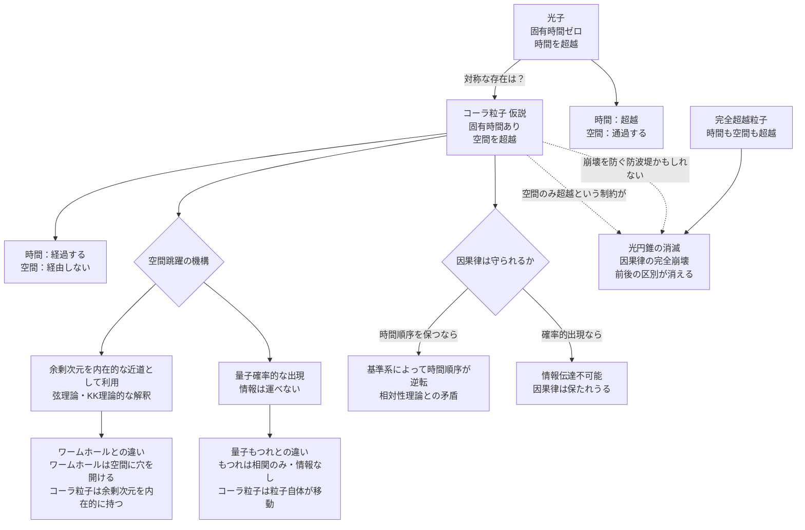

## 概要 (Abstract)

光子には奇妙な性質がある——光速で移動する光子の固有時間はゼロだ。光子の「視点」から見れば、アンドロメダ銀河から地球までの250万光年の旅は瞬時に終わる。光子は**時間を超越している**。

しかし光子は空間を超越できない。アンドロメダからの光は、250万年という時間をかけて宇宙空間を実際に旅し、その途中の物質に吸収されたり散乱したりしながら地球に届く。光子は時間の囚人ではなく、**空間の囚人**だ。

ならばこう問う——**時間は経過するが、空間を経由せずに別の場所へ出現する粒子**は、理論上どのような性質を持ちうるか？

この思考実験上の粒子を「コーラ粒子」と呼ぶ。「コーラ（χώρα）」はプラトンが対話篇『ティマイオス』において「空間そのもの・場所の器」を指すために用いた古代ギリシャ語だ。空間を超越するものに、空間を意味する言葉を冠するのは逆説的でもあり、本質的でもある。

---

## 実現不可能性の根拠 (Infeasibility Rationale)

### 物理的限界

現代物理学の基盤であるミンコフスキー時空では、時間と空間は「時空」として一体になっている。ある事象から別の事象への「距離」は、時間的な間隔と空間的な間隔を組み合わせた「時空間隔」として定義される。

光子が通る経路（光的経路）では時空間隔がゼロになり、これが「固有時間ゼロ」の意味だ。コーラ粒子が「空間をゼロにして時間だけを経過させる」ためには、時空間隔の空間成分だけを消去するような移動が必要になる——しかしこれは時空の幾何学的構造そのものと矛盾する。時間と空間は分離できない一体の構造として物理に組み込まれており、「空間だけ超越する」という操作の数学的な定式化すら困難だ。

さらに根本的な問題がある。空間的に離れた二点の間を有限の時間で移動する——これは結局のところ光速を超えた信号伝達を意味する。特殊相対性理論の枠内では、これは因果律の侵犯につながる。

### 技術的限界

仮にコーラ粒子が存在するとして、それを生成・制御する技術は二重の意味で存在しない。

まず、そのような粒子を生成するためのエネルギーや条件が全く不明だ。電子はさまざまな過程で生成でき、光子は電磁気的な加速で放出される。しかしコーラ粒子の「空間跳躍」を引き起こす相互作用の種類が、既知の四つの基本力（重力・電磁力・強い力・弱い力）のどれにも対応しない。

次に、粒子がどこに出現するかを制御できない。空間跳躍が確率的にしか定まらないなら、コーラ粒子は制御不能な「どこかに消える粒子」にすぎない。

### 論理的限界

コーラ粒子が直面する最も深い問題は「時間の矢は守られるか」という問いだ。

タキオン（虚数質量を持つ仮説上の粒子）は光速を超えて移動するが、ある基準系では「過去に向かって進む」ように見える。タキオンが因果律を破るのはこのためだ。コーラ粒子が「時間順序を守りながら空間を跳躍する」と仮定しても、相対性理論の「同時性の相対性」が問題を起こす。ある基準系で「A地点からB地点へ時間Tで空間跳躍した」と観測される事象は、別の基準系では「B地点からA地点へ時間T'（T'が負になりうる）で移動した」と解釈されうる。時間順序の保存は観測者の基準系に依存してしまう。

---

## 実験の設定 (Setup)

光子・タキオン・コーラ粒子を、時間と空間の超越性で比較する：

| 粒子 | 固有時間 | 空間移動 | 因果律 | 現実における対応物 |
|------|---------|---------|-------|-----------------|
| 光子 | ゼロ（時間超越） | 空間を通過する（非超越） | 保存される | 実在（電磁波の量子） |
| タキオン | 虚数（定義不能） | 光速超で空間通過 | 破壊される | 未観測の仮説上の粒子 |
| **コーラ粒子** | **有限（時間は経過）** | **空間を経由しない（超越）** | **基準系依存で不明** | **この記事の思考実験** |
| 「完全超越粒子」 | ゼロ | 空間も経由しない | 完全崩壊 | 光円錐の消滅を意味する |

コーラ粒子は「時間は持つが空間は持たない粒子」——時間軸にのみ存在し、空間軸は無意味になる存在とも言える。

---

## 考察と予測 (Speculation)

### 余剰次元という脱出路

コーラ粒子の最も物理に近い解釈は、**余剰次元を内在的な移動路として持つ粒子**というものだ。

弦理論やKaluza-Klein理論は、私たちが知覚する3次元空間の外に、極めて小さく丸まった余剰次元が存在する可能性を示す。これらの余剰次元の「長さ」は原子核よりはるかに小さいため、日常スケールでは感知できない。

コーラ粒子がこの余剰次元を「近道」として使えるとしたら——3次元空間のA地点からB地点まで光年単位の距離があっても、余剰次元方向の距離はほぼゼロかもしれない。3次元の地図では遠く離れた二都市が、球面を折り畳んだ紙の上では隣り合う——そのような構造を粒子が利用する、という発想だ。

これはワームホールとも異なる。ワームホールは3次元空間に「穴を開ける」ことで近道を作る。コーラ粒子はワームホールを必要とせず、余剰次元の利用を**粒子の内在的な性質**として持つ。ワームホールは宇宙に作られる構造物だが、コーラ粒子は「生まれながらに余剰次元に住む粒子」だ。

### 量子もつれとの比較——情報は運べるか

量子もつれは、遠く離れた二つの粒子が瞬時に相関する現象だ。「空間を飛び越えて影響が伝わる」ように見えるが、この相関を使って情報を伝達することはできない——観測結果は確率的であり、送りたいメッセージを乗せる方法がない。

コーラ粒子が情報を担える場合、状況は根本的に異なる。コーラ粒子は確定的な情報（質量・エネルギー・スピン状態など）を持って空間跳躍できるかもしれない。もしそうなら、これは光速を超えた情報伝達であり、特殊相対性理論との直接的な衝突になる。

逆に、コーラ粒子の出現場所が量子力学的に確率的にしか定まらないならば——量子もつれと同様に情報を運べない「確率的空間跳躍粒子」になる。それはそれで奇妙な存在だが、因果律との折り合いはつくかもしれない。

### 光子の「逆数」としてのコーラ粒子

光子とコーラ粒子を対称的に見ると、宇宙の「粒子の可能性空間」に一つの空白が見えてくる。

時間を超越する粒子（光子）は実在する。では空間を超越する粒子は？ 数学的な対称性は必ずしも物理的な実在を保証しない——しかし、これほど明確な対称構造に対応物がないとしたら、それは「対称性が破れている理由」を問う新たな問いを生む。

なぜ宇宙は「時間を超越できる粒子」を許し、「空間を超越できる粒子」を許さないのか。時間と空間はミンコフスキー時空でほぼ対称に扱われるにもかかわらず、この非対称性はどこから来るのか。コーラ粒子の不在は、時間と空間の非対称性——時間には「矢」があり空間にはない——の深層を反映しているのかもしれない。

### 派生的用途と統一解釈

コーラ粒子は本記事以降の複数の思考実験で異なる文脈に登場するが、すべて「**余剰次元に内在的な足場を持つ粒子**」という統一原理から導かれる派生的性質として理解できる。

| 用途 | 記事 | 余剰次元との関係 |
|------|------|----------------|
| ①空間跳躍・FTL通信の媒体 | [wiim_029](../physics/wiim_029.md), [wiim_032](../physics/wiim_032.md) | 余剰次元を近道として移動・伝播する本来の性質 |
| ②エネルギー転嫁・熱管理 | [wiim_044](../physics/wiim_044.md), [wiim_045](../physics/wiim_045.md) | 3次元空間のエネルギーを余剰次元方向へ逃がす |
| ③波動関数の外部成分（Δφ） | [wiim_042](../quantum/wiim_042.md) | 余剰次元上の自由度が標準的な量子状態記述に現れない残差として観測される |

①はコーラ粒子の「空間超越」そのものであり、②は余剰次元上の足場がエネルギー担体として機能する応用、③は余剰次元上の自由度が量子測定に微細な痕跡を残す帰結だ。三つは矛盾せず、同一粒子の異なる現れ方と考えられる。

ただし「余剰次元上の足場」の具体的な構造（コンパクト化の形状、余剰次元上での結合定数など）は未定義であり、各用途が同一の足場によるものかどうかは今後の思考実験の拡張に委ねる。

### 「完全超越粒子」——光円錐の消滅

もし時間も空間も超越する粒子が存在したら、それはどんな意味を持つか。

光円錐とは、ある事象から因果的に影響を与えられる（または受ける）事象の集合を図示したものだ。光速という制限が光円錐の形を決める。時間も空間も超越する粒子は光円錐の概念を完全に無効化する——全ての事象が全ての事象と因果的に接続できることになり、「前」と「後」の区別が消える。

これは物理法則の局所的な書き換えではなく、時空構造の根本的な崩壊だ。コーラ粒子が「空間だけ超越する」という中途半端な制約は、実はこの崩壊を防ぐための最後の防波堤かもしれない。

---

## 図解 (Diagrams)

---

## 関連記事 (Related)

- [wiim_001](../cosmology/wiim_001.md) — 光速を超えた場合の因果律（タキオンとの比較。コーラ粒子はタキオンと異なる形で光速超問題に直面する）
- [wiim_005](../cosmology/wiim_005.md) — 時間遡行粒子のエントロピー増大によるタイムマシン（時間の矢と因果律の共通テーマ）
- [wiim_006](../quantum/wiim_006.md) — パウリの排他原理が局所的にオフになる空間（空間の物理的性質の極限的操作）
- （未作成）ワームホールの入口に入ったらどうなるか——空間の位相的変形との比較
- （未作成）余剰次元は観測できるか——Kaluza-Klein理論の実験的検証
- （未作成）量子もつれで情報を伝達できない理由——「測定」という壁
- （未作成）時間の矢はなぜ一方向か——エントロピーと空間の非対称性
- [wiim_016](../cosmology/wiim_016.md) — 時間同期技術——ウラシマ効果を逆用した時間的保護
- [wiim_014](wiim_014.md) — 宇宙のルート権限を奪取せよ——物理定数ハッキングによる超光速航法
- [wiim_021](wiim_021.md) — 切れないエネルギー紐——完全剛体なしに不変距離を定義する
- [wiim_022](wiim_022.md) — アンキロン——時空の計量に錨を打つ架空粒子
- [wiim_027](wiim_027.md) — ストレンジスター・ワープゲート——重力チューニングによる固定式時空歪曲点
- [wiim_034](wiim_034.md) — エキゾチック物質音響実験——負屈折チャンバーとコーラ粒子音響搬送の試み
- [wiim_035](wiim_035.md) — グラビトーペイクの逆説——遮断した重力波エネルギーはどこへ行くのか
- [wiim_037](wiim_037.md) — レトロン——負のエントロピーを持つ粒子と因果の逆行
- [wiim_039](../quantum/wiim_039.md) — 量子永久機関——非対称カシミール板と真空エネルギーの搾取
- [wiim_033](../biology/wiim_033.md) — コズミックマイス菌糸誘導通信——生きたネットワークが宇宙をつなぐFTLインフラ
- [ancient_beings_cosmic_horror](../notes/ancient_beings_cosmic_horror.md) — 世界観メモ：WIIM宇宙の古代存在——コズミックホラーの系譜
- [economy_um_currency](../notes/economy_um_currency.md) — 世界観：UM通貨制度とエキゾチック物質単価
- [wiim_022_tactical](../notes/wiim_022_tactical.md) — 補遺: アンキロンの戦術応用——計量バリケードの強度設計と反アンキロン除去
- [wiim_042_clone_consciousness](../notes/wiim_042_clone_consciousness.md) — 補遺: クローン意識コピーのp-ゾンビ混入問題——Δφ再現率と意識転写の確率論
- [wiim_044_thermal_unit](../notes/wiim_044_thermal_unit.md) — 自律熱管理ユニット——カシミール給電型双方向テルモクラシス系の設計論
- [wiim_063](wiim_063.md) — 架空粒子による大気圏突入緩和——ネゴトン・カシミールフォージ・レトロンは再突入熱と重力を制御できるか
- [wiim_070](wiim_070.md) — 核融合生成物の即時中性化——アルファ固着をゼロにすればミュオン触媒核融合は実用化するか
- [wiim_072](../quantum/wiim_072.md) — エイソンによる非崩壊量子マッピング — 電子の分布を壊さずに読めるか
- [wiim_074](wiim_074.md) — ワープゲート基礎理論——コーラ粒子のマヨラナ的自己対とエニオンブレイドによるトポロジー接続
- [wiim_075](../biology/wiim_075.md) — コズミックマイスは歌うか——菌糸振動が音楽・通信・癒しに転化する世界
- [wiim_077](wiim_077.md) — 架空粒子を掴む——光ピンセットから場の閉じ込めへ
- [wiim_081](wiim_081.md) — コーラ粒子は事象の地平線を抜けられるか——ブラックホール内外の空間超越と因果律の衝突
- [wiim_089](../cosmology/wiim_089.md) — ブラックホール潜入とワームホール開通——潮汐力シールドから因果構造の書き換えまで

