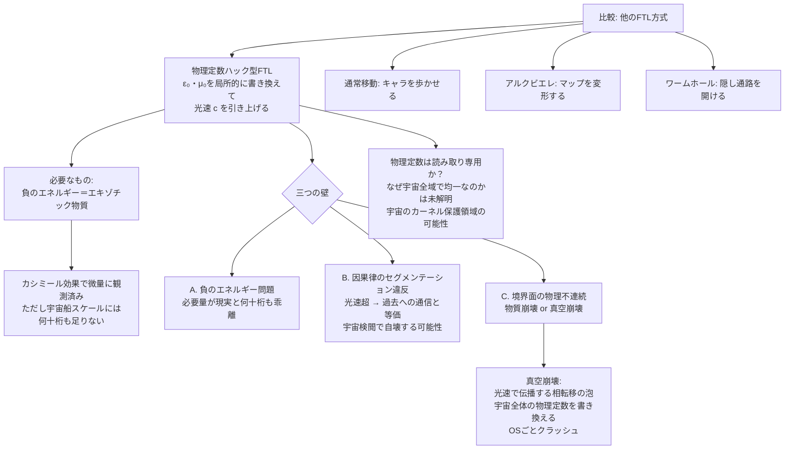

## 概要 (Abstract)

光の速さ c は、真空がもつ二つの定数——**誘電率（ε₀）と透磁率（μ₀）**——によって決まっている。これは物理の教科書に載る確立した事実だ。誘電率は「真空が電場をどれだけ通しにくいか」、透磁率は「真空が磁場をどれだけ通しにくいか」を表す。この二つの積の平方根の逆数が光速に等しい——つまり光速とは、真空という「媒質」の性質から決まる値にすぎない。

ならば問う。その媒質の性質を、局所的に書き換えることはできないか？

通常の移動が「空間の中をキャラクターが歩く」もので、アルクビエレ・ドライブが「マップのメッシュを物理的に変形する」ものだとすれば、この発想は**「ゲームエンジンの変数を直接書き換えて、このエリアだけ移動速度の上限を撤廃する」**ことに相当する。宇宙を巨大なプログラムとして見なし、その物理定数というソースコードにルート権限でアクセスする——これが「物理定数ハッキング型超光速航法」の核心だ。

---

## 実現不可能性の根拠 (Infeasibility Rationale)

### 物理的限界——負のエネルギーという要件

真空の誘電率・透磁率を変えるには、真空のエネルギー状態そのものを変化させる必要がある。現在の真空は「最も安定した低エネルギー状態」として存在しており、これを「別の状態」に変えるためには、エネルギーを加えるのではなく逆に**負のエネルギー（エキゾチック物質）を注入する**ことが必要になると考えられる。

負のエネルギーは完全に非物理的ではない。カシミール効果——二枚の金属板を極めて近づけると板の間の空間に微小な引力が生じる現象——は、量子場理論が予測する真空エネルギーの揺らぎによって説明され、実験的にも確認されている。しかしこの効果で生じる負のエネルギーは、ナノメートルスケールの板の間で、原子核一個分の質量エネルギーにも遠く及ばない微量だ。宇宙船を包む数十メートルのバブルの物理定数を変えるために必要な量との差は、何十桁にも及ぶ。

### 技術的限界——書き換え領域の境界問題

仮に局所的な物理定数の書き換えが可能だとしても、致命的な問題が境界面に生じる。

書き換えられた領域（光速が通常の c より大きい）と、通常の宇宙（光速 c）が接する境界では、物理定数が不連続に変化する。物理定数が不連続な領域では、電子の軌道、原子核を束ねる力、化学結合の強さが全て境界面で急激に変化する。境界を通過する物質は原子・分子レベルで崩壊する可能性がある。

さらに悪い可能性もある。書き換えが現在の真空状態（偽の真空）をより低いエネルギー状態（真の真空）へと相転移させるトリガーになりうる——これが「**真空崩壊**」だ。真空崩壊は光速で伝播する泡状の相転移面として宇宙全体に広がり、通過した領域では電磁気力の強さから素粒子の質量まで全ての物理定数が書き換わる。宇宙というOSを起動したまま、カーネルの根幹を変更しようとして——OSごとクラッシュさせる。

### 論理的限界——因果律のセグメンテーション違反

光速を局所的に引き上げると、その空間を通じて光速を超えた情報伝達が可能になる。特殊相対性理論によれば、光速を超えた情報伝達は「ある基準系では過去への通信」と等価だ。

書き換えられた空間を使って目的地に「瞬時に」到達したとき、ある観測者の基準系では「出発するより前に到着した」ように見える。これは単なる視覚的な錯覚ではなく、その到着という事象が出発という事象の「原因」になりうることを意味する——因果律が循環する。

プログラムの比喩で言えば、これは変数への書き込みが、その変数が宣言される前の行に影響を与えるような状態だ。まともなシステムならセグメンテーション違反として強制終了する。宇宙も同様に、因果律を侵犯する書き換えを「宇宙検閲」と呼ばれるフィードバック機構で自壊させるという説がある——ホーキングの「時間順序保護仮説」だ。

---

## 実験の設定 (Setup)

超光速航法の各方式を、プログラミングの比喩で分類する：

| 方式 | プログラム比喩 | 物理的操作 | 主な問題 |
|------|-------------|-----------|---------|
| 通常の移動 | キャラクターを歩かせる | 空間の中を加速 | 光速の壁 |
| アルクビエレ・ドライブ | マップのメッシュを変形する | 時空曲率を操作 | エキゾチック物質が木星質量分必要 |
| **物理定数ハック** | **ゲームエンジンの変数を書き換える** | **ε₀・μ₀を局所変更** | **境界崩壊・真空崩壊・因果律違反** |
| ワームホール | マップに隠し通路を開ける | 時空の位相を変える | 負のエネルギーで喉を維持する必要 |

物理定数ハックが他の方式と本質的に異なるのは、「空間を操作する」のではなく「空間の**性質を定義するルールを変更する**」点だ。これは最も根本的な介入であり、最も大きなリスクを孕む。

---

## 考察と予測 (Speculation)

### 光速は本当に定数か——変動光速理論

実は「光速は宇宙の歴史を通じて一定だったか」は、物理学の一部で真剣に議論されている。変動光速理論（VSL理論）は、宇宙誕生直後のインフレーション期に光速が現在よりはるかに速かったと仮定することで、地平線問題（宇宙が大規模スケールで均一な理由）を説明しようとする。

もし光速が宇宙の歴史の中で実際に変化したとすれば、それは「物理定数が変わりうる」ことの証拠になる。ただしVSL理論が正しくても、「任意の場所で任意の時刻に光速を書き換えられる」ことは全く別の話だ。宇宙が自然に変化するのと、知性体が局所的に変更を加えるのとでは、必要なエネルギースケールも副作用も次元が違う。

### 「読み取り専用」の宇宙

ハッキングの比喩を突き詰めると、一つの可能性が浮かぶ——物理定数は「読み取り専用（read-only）」として実装されているのではないか。

オペレーティングシステムのカーネルには、ユーザープロセスが書き込めない保護メモリ領域がある。どんなに高い権限を持つプログラムも、その領域への書き込みを試みると例外が発生してプロセスが終了する。真空崩壊と宇宙検閲は、宇宙がそのような保護機構を持つことを示唆しているように見える。

物理定数が読み取り専用であることの「理由」は、現在の物理学では説明されていない。なぜ誘電率はこの値なのか、なぜ宇宙全域で均一なのかを説明する理論は存在しない——ただそうである、という観測事実があるだけだ。これはある意味で「なぜプログラムがこのように書かれているか」を、プログラムの内側から理解しようとする試みに等しい。

### 成功した場合に起こること

もし何らかの方法で物理定数の局所的書き換えが成功したとして、宇宙船の内部ではどうなるか。

書き換えられた空間では光速が大きくなるため、電子の動き、化学反応の速度、神経信号の伝達速度もすべて変わりうる。乗員の生物学的プロセスが加速または変質する可能性がある。さらに内部から外部を「見る」と、境界面でローレンツ変換が不連続になるため、外の宇宙が奇妙に歪んで見えるはずだ——光が境界面で「屈折」するように。

成功した「物理定数ハック」は、超光速航法というより、「局所的に異なる物理法則を持つ宇宙の泡の中に閉じ込められる」体験かもしれない。

---

## 図解 (Diagrams)

---

## 関連記事 (Related)

- [wiim_001](../cosmology/wiim_001.md) — 光速を超えた場合の因果律（因果律違反の詳細。本記事の「セグメンテーション違反」の物理的背景）
- [wiim_003](wiim_003.md) — 負の質量を持つ粒子による局所的時間加速（エキゾチック物質・カシミール効果との共通テーマ）
- [wiim_004](../cosmology/wiim_004.md) — ワープ航法の痕跡を重力波で追跡できる世界（アルクビエレ・ドライブとの対比。本記事のFTLが残す痕跡は何か）
- [wiim_013](wiim_013.md) — 空間を超越する粒子・コーラ粒子の仮説（別の形での空間超越との比較）
- （未作成）真空崩壊は本当に起こりうるか——偽の真空と宇宙の寿命
- （未作成）宇宙定数はなぜこの値か——微調整問題と人間原理
- （未作成）アルクビエレ・ドライブは本当に光速を超えているのか
- [wiim_027](wiim_027.md) — ストレンジスター・ワープゲート——重力チューニングによる固定式時空歪曲点
- [wiim_024](../biology/wiim_024.md) — マイコプラズマギカ——最小生命体による生物的核変換が可能な世界
- [forbidden_zone_treaty](../notes/forbidden_zone_treaty.md) — 禁域条約——宇宙戦争を終わらせた二国消滅事件
- [wiim_067](wiim_067.md) — ネゴトンホワイトホール——排除地平線が閉じるとき、反重力天体はビッグバンを起こすか

