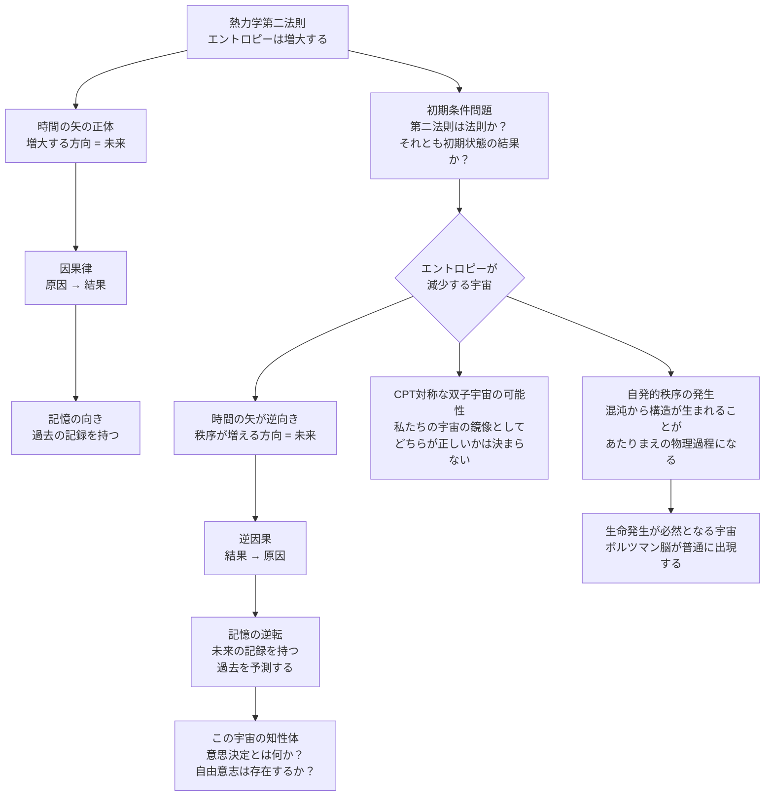

## 概要 (Abstract)

割れた卵は元に戻らない。煙は拡散するが集まらない。熱いコーヒーは冷めるが、冷めたコーヒーが自然に熱くなることはない。これらは全て同じ法則——**熱力学第二法則（エントロピー増大の法則）**——の表れだ。

エントロピーとは「乱雑さの度合い」と説明されることが多いが、より正確には「ある状態を実現するミクロな配置の数」を表す量だ。割れた卵は「割れた状態を実現する配置」が「完全な卵の状態を実現する配置」よりも圧倒的に多いため、自発的に起こる。宇宙はより「ありふれた状態」へと流れ続ける。

そしてこの一方向の流れこそが「時間の矢」の正体だ——物理学者のアーサー・エディントンがそう主張した。「過去」とはエントロピーが低かった方向であり、「未来」とはエントロピーが高くなる方向だ。エントロピーがなければ、時間に方向はない。

では問う。**エントロピーが自発的に減少することが宇宙の法則である世界では、何が起きるか。**

---

## 実現不可能性の根拠 (Infeasibility Rationale)

### 物理的限界

熱力学第二法則は統計的な法則だ。気体分子が容器の半分に偏って集まることは確率ゼロではないが、分子の数が膨大なため事実上起こらない。「エントロピーが自発的に減少する」ことは、確率的には起こりうる——しかし現実的な時間スケールでは観測不可能なほど稀だ。

ボルツマンはこのことを深く理解していたが、「ならばなぜ宇宙全体としてエントロピーが増大し続けるのか」という問いに正面から向き合った。彼の答えは「宇宙の初期状態が偶然に極めて低いエントロピーを持っていた」というものだった——それが現在まで続く一方向の流れの源泉だ。

この見方では、熱力学第二法則は「宇宙の根本的な法則」ではなく「宇宙の初期条件の結果」になる。素粒子のミクロな法則は時間反転に対してほぼ対称的であり、エントロピー増大の向きを根本的に決める法則は、実は存在しない。

### 技術的限界

マクスウェルの悪魔——分子を観察して速い分子と遅い分子を仕分けることでエントロピーを局所的に減少させる思考実験上の存在——は、「情報を得ること自体にエントロピー増大が伴う」というランドーアーの原理によって反論された。観測・記録・消去の全過程を含めれば、悪魔がいてもエントロピーの総量は増大する。

「エントロピーを減少させる機械」を作ろうとするあらゆる試みは、この情報とエントロピーの等価性という壁に突き当たる。情報処理そのものがエントロピーを生む限り、系全体としての減少は起こらない。

### 論理的限界

最も深い問題は因果律だ。

「原因は結果に先行する」という因果律は、私たちが自明視する前提だが、物理法則そのものには刻まれていない。エントロピー増大の向きが時間の矢を作り、時間の矢が「原因→結果」の順序を決めている——という解釈が有力だ。

エントロピーが減少する宇宙では、因果の矢も逆向きになる可能性がある。「結果が先に起きて、原因が後に来る」。これは単なる時間の逆再生ではなく、因果の構造そのものが変わることを意味し、「物理法則の記述」という概念自体が揺らぐ。

---

## 実験の設定 (Setup)

エントロピー減少宇宙を私たちの宇宙と比較する：

| 性質 | 私たちの宇宙（増大） | エントロピー減少宇宙 |
|------|-------------------|-------------------|
| 初期状態 | 低エントロピー（ビッグバン直後） | 高エントロピー（混沌から始まる） |
| 自発的変化の向き | 無秩序へ | 秩序へ |
| 時間の矢 | 過去→未来（エントロピーが増える方向） | 「未来」→「過去」（秩序が増える方向） |
| 因果の向き | 原因→結果 | 結果→原因（逆因果） |
| 記憶の向き | 過去の記録を持つ | 「未来」の記録を持つ |
| 複雑な構造の発生 | 自発的には起きにくい（秩序は壊れる） | 自発的に秩序・複雑さが生まれる |

ただし「エントロピー減少宇宙」を外から観察するとき、その宇宙の住人は自分たちの「時間の向き」を増大宇宙と逆とは感じない可能性が高い。彼らも「記憶のある方向」を過去と呼ぶだろう——ただその方向が、私たちから見て逆なだけだ。

---

## 考察と予測 (Speculation)

### CPT定理——逆再生宇宙は「別の宇宙」か「同じ宇宙」か

素粒子物理学には CPT 定理がある。C は電荷共役（粒子と反粒子を入れ替える）、P は空間反転（鏡像に変える）、T は時間反転を意味する。この三つを同時に行うと、物理法則は変わらないという定理だ。

これはエントロピー減少宇宙に対して重要な示唆を与える。私たちの宇宙をCPT変換した宇宙——電荷が逆、空間が鏡像、時間が逆向き——は全く同じ物理法則に従う。つまり「エントロピーが減少する宇宙」は、私たちの宇宙のCPT対称な双子かもしれない。

実際、2018年に提唱されたある宇宙論モデルでは、ビッグバンから「正の時間方向」に私たちの宇宙が広がり、同時に「負の時間方向」にCPT対称な鏡像宇宙が広がるという構造を提案している。その鏡像宇宙の住人にとっては、私たちの宇宙こそが「時間が逆向き」に見える。どちらが「正しい」時間の向きかを決める絶対的な基準はない。

### 秩序が自発的に生まれる世界

エントロピー減少宇宙では、混沌から秩序が**自発的に**生まれる。

私たちの宇宙では、星が生まれ、惑星が形成され、生命が発生するには莫大なエネルギーの流れと長い時間が必要だ。それでもこれらは「局所的なエントロピー減少」に過ぎず、宇宙全体のエントロピーは必ず増大している。

しかしエントロピー減少宇宙では、構造の発生が「ありふれた」こととなる。ランダムな粒子の集まりが自発的に複雑な分子になり、分子が細胞になり、細胞が生命体になる——これが「下り坂」として自然に起きる。生命の発生が例外的な奇跡ではなく、普通の物理過程になる宇宙だ。

### 未来の記憶を持つ知性体

この宇宙で最も奇妙な存在は、その宇宙に生まれた知性体だ。

記憶とは「低エントロピーな状態（記録）が高エントロピーな状態（忘却・消去）へ向かうことによって生じる痕跡」だという見方がある。エントロピー減少宇宙では、この向きが逆になる——知性体は「これから起きること（私たちの未来）」を記憶し、「すでに起きたこと（私たちの過去）」を予測する。

この知性体は「私は昨日、明日のことを覚えた」と言う。彼らの「学習」は経験から知識を得ることではなく、持っている知識が経験として実現されていくことだ。意思決定とは「何を選ぶか」ではなく「選ばれることが決まっているものを認識する」プロセスになるかもしれない——自由意志の概念が根本から変わる。

### ボルツマン脳との接点

エントロピーの揺らぎによって、宇宙のどこかに突然「完全に機能する脳」が量子的ゆらぎとして出現する——これを「ボルツマン脳」と呼ぶ。現在の宇宙でもこれは確率的にゼロではないが、宇宙年齢より遥かに長い時間を待たなければならない。

エントロピー減少宇宙では、ボルツマン脳の出現が「当たり前」になる。秩序が自発的に生まれる宇宙では、複雑な構造が至る所で自然発生し、その中には意識を持つ構造も含まれうる。この宇宙では「生命は奇跡ではなく必然」だが、同時に「個体の同一性」という概念も揺らぐ——今ここにいる私は偶然生まれた構造なのか、それとも宇宙の秩序化の一過程として必然的に生まれたのか。

---

## 図解 (Diagrams)

---

## 関連記事 (Related)

- [wiim_005](../cosmology/wiim_005.md) — 時間遡行粒子のエントロピー増大によるタイムマシン（局所的な逆説との対比。本記事は宇宙全体の話）
- [wiim_001](../cosmology/wiim_001.md) — 光速を超えた場合の因果律（因果律の逆転という共通テーマ）
- [wiim_002](../cosmology/wiim_002.md) — 相対的に時間を進められる空間（時間の方向性・時間の矢との関連）
- [wiim_007](../quantum/wiim_007.md) — 排他原理が10%だけ弱い宇宙（物理定数・宇宙の初期条件が違う宇宙の比較）
- （未作成）マクスウェルの悪魔は本当に封じられたか——情報とエントロピーの等価性
- （未作成）ビッグバンはなぜ低エントロピーだったのか——宇宙の初期条件問題
- （未作成）意識はエントロピーを生むか——情報処理と熱力学の境界
