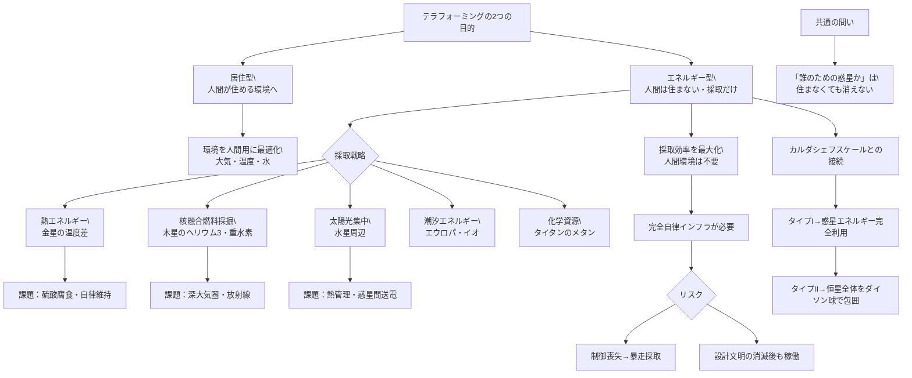

## 概要 (Abstract)

テラフォーミング（惑星改造）の議論は常に「人間が住める環境を作る」ことを目標にしてきた。大気を整え、気温を調整し、水を確保し、最終的に人類が移住できる惑星を用意する——これが従来の文脈だ。

この思考実験は前提を外す。**人間が住む必要はない。惑星や衛星をエネルギー生産・資源収穫の装置として改造するならば、どんな可能性が開くか。**

金星の表面温度465℃を「廃熱として捨てる問題」ではなく「熱エネルギー源として利用する機会」として見るとき、木星の大気を「宇宙船が通過できない障壁」ではなく「大気圧差エネルギーの貯蔵庫」として見るとき、改造の戦略は根本から変わる。居住型テラフォーミングが「惑星を人間用に最適化する」なら、エネルギー型テラフォーミングは「人間を惑星の外に置いたまま、惑星を発電所に変える」だ。

---

## 実現不可能性の根拠 (Infeasibility Rationale)

### 物理的限界

エネルギー採取の規模と輸送の問題は、地球から見ると途方もない。

太陽から受け取るエネルギーを惑星が完全に利用できるとして、金星が受ける太陽エネルギーは地球の約1.9倍だ。しかし問題は変換効率と輸送にある。発電した電力を地球に送るにはどうするか——電磁波（マイクロ波・レーザー）での無線送電が理論上は可能だが、惑星間距離（数千万km〜数億km）に渡る高密度ビームの維持は現代技術をはるかに超える。

木星の大気圧差エネルギーや熱エネルギーも、採取するインフラを木星の過酷な環境に長期間維持する技術が存在しない。木星は強烈な放射線帯（主にイオ由来のプラズマ）に囲まれており、現代の宇宙船でさえ接近するだけで電子機器が損傷する。

### 技術的限界

エネルギー用テラフォーミングには、居住型テラフォーミングにはない固有の課題がある。

**インフラの自律維持**だ。人間が住まない惑星のエネルギー設備は、修理のために人間が赴けない環境に設置される。自律的に自己修復・自己拡張するロボット/ナノマシンシステムが必要で、それは「フォン・ノイマン機械」（自己複製機械）と呼ばれる概念的な装置に近い。フォン・ノイマン機械が制御を失えば、エネルギー収穫を目的として設計されたシステムが惑星全体を「解体」し続ける最悪シナリオも考えられる。

**エネルギー収支**の問題もある。遠い惑星のエネルギーを採取・輸送するコストが、得られるエネルギーを上回る場合、事業として成立しない。木星や土星から核融合燃料（重水素・ヘリウム3）を採掘して輸送するシナリオは、理論的なエネルギー密度は高いが、採掘・輸送コストが実用的かどうかは現在の物理・工学では計算できない。

### 論理的限界

「居住しない惑星改造」の最も根本的な問題は**目的と代理人の分離**だ。

地球から数億km離れた惑星の自律システムに「エネルギーを採取する」という命令を与えたとき、そのシステムが設計者の意図通りに動き続けることを誰が保証するか。数世代にわたる運用では、設計者文明が消滅・変容している可能性がある。また、採取したエネルギーを誰が受け取り、誰のために使うかという経済的・政治的問いは、技術的問いと切り離せない。

「惑星改造」を始めた文明と「完成した惑星から恩恵を受ける文明」が別の主体になる場合——これは数百年・数千年のプロジェクトでは避けられない——、プロジェクトの正当性はどこに根拠を置くのか。

---

## 実験の設定 (Setup)

エネルギー用テラフォーミングの主な戦略を比較する：

| 戦略 | 対象天体 | 採取するエネルギー/資源 | 主な技術課題 | 関連概念 |
|-----|---------|---------------------|----------|---------|
| **熱エネルギー採取** | 金星 | 高温大気・表面の熱差 | 高温環境でのインフラ維持 | 熱電変換 |
| **太陽光集中** | 水星周辺 | 強烈な太陽光 | 熱管理・送電 | ダイソン球の部分版 |
| **大気圏核融合燃料採掘** | 木星・土星 | ヘリウム3・重水素 | 深大気圏での採掘・放射線 | スコープ核融合 |
| **潮汐エネルギー採取** | エウロパ・イオ | 木星の潮汐力 | 氷殻・高放射線 | — |
| **化学エネルギー採取** | タイタン | メタン・有機化合物 | 極低温・輸送コスト | — |
| **重力エネルギー** | 中性子星・白色矮星（超遠未来） | 極端な重力場 | 現代物理を超える | — |

居住型と非居住型の比較：

| 観点 | 居住型テラフォーミング | エネルギー型テラフォーミング |
|-----|---------------------|------------------------|
| 目標 | 生命が住める環境 | エネルギー/資源の継続採取 |
| 最適化方向 | 人間に近い環境へ | 採取効率の最大化 |
| インフラ維持 | 居住者が行う | 完全自律システム |
| タイムスケール | 数百〜数千年 | 数十年〜（設備寿命依存） |
| 制御の複雑さ | 人間が現地判断 | 遠隔/自律制御 |
| リスク | 生命維持の失敗 | 制御喪失・暴走 |

---

## 考察と予測 (Speculation)

### 金星——発電所としての可能性

金星は居住型テラフォーミングの最難関天体だが、エネルギー採取の文脈では魅力的な候補だ。

地表温度465℃と大気圏上部（〜20℃）の温度差は約450℃に及ぶ。この巨大な温度差を熱機関で利用できれば、理論効率は相当高い。問題は「高温環境で長期稼働する熱機関」の材料と設計だ。金星の大気は腐食性の硫酸液滴を含み、現在の耐熱合金でも数時間から数日で腐食する。

しかし視点を変えると、金星の大気が「ほぼ完全なCO₂」であることは重要だ。CO₂はドライアイスとして圧縮・輸送が可能で、工業的に需要がある。金星大気を「CO₂採掘サイト」として見れば、雲層（高度50km）で直接採取して軌道上のタンクに移送するシステムは、未来の宇宙工業として意味を持つかもしれない。

### 木星——「星」に近い惑星のエネルギー

木星は全太陽系の惑星の中で最も多くのエネルギーを内部から放出している——太陽から受け取る熱よりも多い熱を内部から発している。これは重力収縮によるエネルギー放出で、木星は非常にゆっくりと収縮し続けている。

もし木星の大気圏から重水素とヘリウム3を採掘し核融合燃料として利用できれば、木星のガスは理論上、人類が数百億年消費できるエネルギー量に相当する。これは「カルダシェフスケールのタイプII文明」が行う典型的なエネルギー採取シナリオだ。

問題は深大気圏での採掘だ。木星の大気は圧力が深くなるほど急激に上昇し、数百km深では超臨界流体になる。採掘装置は地球の海底油田技術とは比較にならない圧力・温度・放射線に耐えなければならない。

### カルダシェフスケールとの接続

エネルギー型テラフォーミングの究極形は「惑星を超えた」システムだ。

ニコラス・カルダシェフが1964年に提唱したカルダシェフスケールでは、タイプI文明が惑星エネルギーを完全利用し、タイプII文明が恒星エネルギーを完全利用する。「居住しない惑星のエネルギーを採取する」ことはタイプI文明に向けた一歩だが、タイプII文明の概念（ダイソン球）は「居住」という概念を完全に捨て去っている——恒星全体をエネルギー源として包囲するが、そこには誰も「住む」場所はない。

エネルギー型テラフォーミングの論理を突き詰めると、「人間が住む惑星」という概念を解体し、「人間のエネルギーを供給する機械としての天体」という完全に工業的な宇宙観に到達する。これは倫理的・哲学的に問題をはらむ——宇宙が「人間のリソース」として存在するという前提は、宇宙に固有の価値や他の生命の可能性を無視する。

### 自律システムの哲学——誰のための惑星か

エネルギー型テラフォーミングが最終的に突き当たる問いは、居住型と同じだ。

改造された惑星は誰のものか。地球を離れて生活する人類、地球に残る人類、生まれる前の未来世代、あるいは太陽系の他の生命体——全てが利害関係を持ちうる。「誰も住まない」ことで「環境正義」の問いは消えるかと言えば、そうではない。木星のヘリウム3を採掘することは、木星の固有の天文学的・生物学的可能性を永遠に変えることだ。

居住型テラフォーミングが「誰かのためのフォーミング」なら、エネルギー型テラフォーミングは「何かのためのフォーミング」だ。その「何か」が経済的価値だけであるとき、宇宙は工場になる。

---

## 図解 (Diagrams)

---

## 関連記事 (Related)

- [wiim_017](../biology/wiim_017.md) — 胞子雨——菌類による惑星水循環の起動（生物気候工学：生命を使ったテラフォーミング）
- [wiim_018](../biology/wiim_018.md) — 胞子の宇宙——金星・タイタン・氷衛星への生物気候工学
- [wiim_011](wiim_011.md) — 真空中に閉鎖膜を作る（トップダウン型テラフォーミングとの対比）
- （未作成）ダイソン球の内側——恒星をエネルギー源として包囲する文明
- （未作成）フォン・ノイマン機械——自己複製する宇宙インフラの可能性とリスク
- （未作成）カルダシェフスケールの現実——タイプI文明になるには何が必要か
- （未作成）宇宙は誰のものか——惑星改造の倫理と所有権
- [wiim_026](../biology/wiim_026.md) — コズミックマイスのテラフォーミング——シェルマイセリウムの大気圏降下と惑星統合
- [wiim_023_strange_matter_warp](../notes/wiim_023_strange_matter_warp.md) — 補遺: ストレンジ物質とワープドライブ——生成・採取・遠隔利用の可能性

