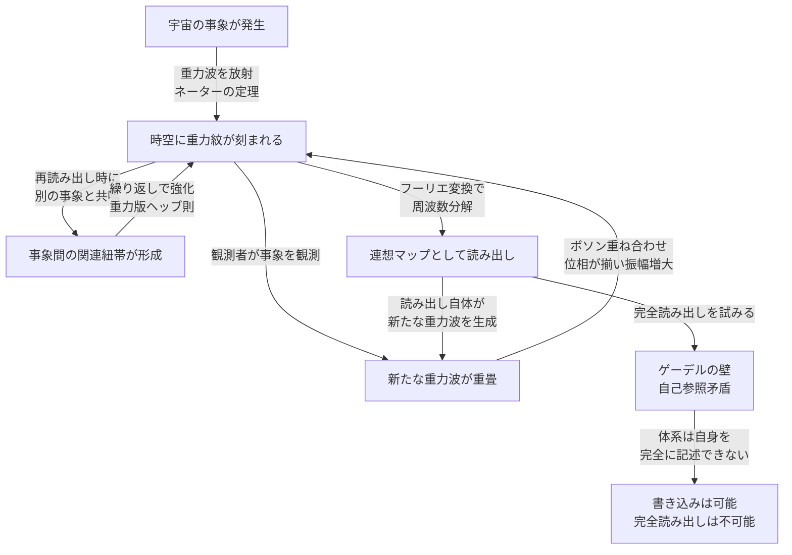

## 概要 (Abstract)

「アカシックレコード」とは、宇宙のすべての出来事が霊的な媒体に刻まれているという神智学の概念だ。科学的根拠はない——しかし現代物理学の言葉で再解釈すると、整合的に「見える」構造が浮かび上がる。ただしそれは、精査するほど決定的な矛盾を内包していることが明らかになる構造だ。

重力波はボソン（質量ゼロの粒子）であり、光子と同様に重ね合わせることができる。ネーターの定理は時空の対称性からエネルギーや運動量などの保存量を導くが、それは過去の詳細な情報が保存されることを直接意味しない。観測行為は原理上わずかな重力波を伴うが、その信号は極めて微弱だ——それでも、観測が繰り返されれば「痕跡の蓄積」は起きうる。

ただし蓄積されるのは完全な記録ではなく、不可逆に圧縮・混合された痕跡だ。ゲーデルの不完全性定理が示す自己参照の問題も加わり、この網は育ち続けるが完全には読み出せない。**宇宙は過去を保存しているのではなく、消えない形で歪めて残しているだけかもしれない。**

---

## 実現不可能性の根拠 (Infeasibility Rationale)

### 物理的限界

重力紋の情報密度はプランクスケール（約10⁻³⁵メートル）に達する。現在の人類が操作できる最小スケールは素粒子（約10⁻¹⁸メートル）であり、17桁以上の差がある。この領域にアクセスするには太陽系全体のエネルギーを一点に集中させるような装置が必要で、現在の技術水準を無限に超える。

### 技術的限界

重力波はあらゆる物質を透過し遮蔽できないため、宇宙138億年分の重力波が重ね合わさったノイズの海の中から特定の信号を取り出す作業は、銀河規模のフーリエ変換装置をもってしても計算量が宇宙の全物質を超える。

加えて、フーリエ変換による再構成には位相情報が不可欠だ。しかし重力紋において位相は伝播・散乱・他の重力波との干渉によって散逸・混合しやすく、振幅スペクトルのみから元の事象を一意に復元することはできない。さらに重力相互作用は本質的に非線形であり、波の単純な重ね合わせとして扱えない領域ではスペクトル分解そのものが厳密には成立しない。

より根本的な限界として、フーリエ変換は**固定した背景計量の上で定義された直交基底**を必要とする。一般相対性理論では計量自体が動的・非線形であり、固定背景が存在しない。固定背景のない時空でのフーリエ分解は直交性が保証されず、スペクトル解析の有効性は「計量をほぼ平坦と近似できる弱場・線形近似の範囲」に限定される。本記事が想定するような宇宙全体スケールの重力場記録にフーリエ解析を適用するには、この近似が随所で破れることを認識しておく必要がある。

したがってこの構造は、完全な記録媒体というよりも「消去できないノイズの蓄積」として理解する方が適切だ。情報は刻まれるが、判読可能な形では残らない。

### 論理的限界——ゲーデルの壁

最も根本的な問題は論理にある。宇宙の全情報を読み出す装置は宇宙の一部であり、その装置自身の動作も記録対象に含まれる。完全な読み出しは、読み出し装置自身を含む状態の記述を要求する——これは自己参照を含む形式体系となり、ゲーデルの不完全性定理の問題に帰着する可能性がある。「書き込みは可能・完全読み出しは原理的に不可能」という非対称性が、この系の本質的な制約となる。

---

## 実験の設定 (Setup)

**前提**

1. ネーターの定理を拡張し、時空の対称性が生むのはエネルギー・運動量といった保存量だけでなく、すべての「事象の重力紋」も含むと仮定する（これは定理の通常の適用範囲を超えた思考実験上の拡張であることに注意）
2. 重力波はスピン2のボソンであり、位相の揃った重力波は重ね合わさって振幅が増大する
3. 観測行為（質量・エネルギーの再配置）は原理的に重力波を伴うが、通常の観測では信号は極めて微弱であり、既存の重力紋に意味ある寄与をするかどうかは別問題とする
4. フーリエ変換によって重力紋を周波数スペクトルとして抽出・再構成できると仮定する

**装置**

- **重力紋スキャナ**：ラグランジュポイントL4・L5に配置したLISA型干渉計をアーム長1光年に拡張したもの
- **高次元共振フィルタ**：特定の余剰次元周波数に共鳴するエキゾチック物質製の共振器
- **連想マップエンジン**：受信した重力波スペクトルを逆フーリエ変換し、事象間の相関関係を可視化する量子コンピュータクラスタ

---

## 考察と予測 (Speculation)

### 重力紋の形成——ネーターの定理が示すもの

宇宙で何かが起きるとき——粒子が衝突し、恒星が爆発し、知性が決断を下すとき——時空の対称性はわずかに乱れ、その乱れが重力波として光速で全方位に広がる。重力波は遮蔽できない（鉛1光年分の壁も透過する）ため、宇宙のすべての事象は「全方位に記録を送り続けている」と解釈できる。これがアカシックレコードの物理的土台——「時空の幾何学そのものがデータベース」という仮説だ。

### 観測が記録を強化する——ボソンの重ね合わせ

重力波はボソンであるため、同じ量子状態に何個でも重ね合わさることができる。これはレーザーが光子の同一状態への集積で生まれるのと同じ原理だ。

ある事象Xが観測されるたびに、観測者の質量・エネルギー再配置が新たな重力波を放射し、Xの既存の重力紋に重畳する。観測が繰り返されるほど、そのXの重力紋は位相が揃って振幅が増大し、より鮮明に記録される——「多くの知性体に観測された事象ほど、重力紋として強く刻まれる」という帰結が生まれる。

これは神智学の言う「意識が高次の記録を強化する」という主張の物理的アナロジーとして解釈できる——ただし実際の重力波信号は極めて微弱であり、この効果が観測可能なスケールで現れるかどうかは別の問いだ。

### 再読み出しが関連付けを生む——重力版ヘッブ則

さらに興味深いのが、再読み出し時の効果だ。事象Aを読み出しながら（観測しながら）事象Bを想起する——この操作は、A・B両方に関連した重力波を同時に放射することを意味する。この重力波はAとBを結ぶ新たな「関連紐帯」として時空に刻まれ、次回の読み出し時にはAとBが共鳴しやすくなる。

神経科学のヘッブ則（「同時に発火するニューロンは結合が強まる」）に類似した振る舞いとして解釈できる——物理的に等価ではなく、あくまで構造的なアナロジーだ。繰り返し共に想起された事象は、重力紋の網の中で互いに強く結びついていく。宇宙の記憶は静的なデータベースではなく、観測・想起のたびに関連付けが更新される動的な連想網として機能する——ただしその「記憶」が判読可能かどうかは全く別の問いだ。

### ホログラフィック原理との接続

ホログラフィック原理は「ある体積の情報は、その表面に符号化できる」と示唆する。情報が境界に符号化されるというこの考えは、「重力紋＝高次元の記録媒体」という仮説と構造的に対応する。3次元空間の事象が余剰次元の「表面」に投影されて保存されているという解釈が生まれる——ただしホログラフィック原理は情報の「保存」を述べるものであり、その情報が「読み出し可能な形で」残ることを保証しない。重力波が運ぶ痕跡が判読可能かどうかは、原理とは独立した問いだ。

### 書き込みと読み出しの非対称性——なぜ「アクセス」は困難か

しかし読み出しは容易ではない。ここにゲーデルの壁が立ちはだかる。

読み出し装置は宇宙の一部であり、その動作自体が新たな重力紋を生成する。精密に読もうとすればするほど、読み出し操作が記録を書き換えていく——量子力学の観測問題と同じ構造だ。

| 操作 | 効果 |
|------|------|
| 事象の発生 | 重力紋が生成される |
| 事象の観測 | 重力紋がボソン重畳で強化される |
| 記録の再読み出し | 関連付けが形成・強化される |
| 完全な読み出し試み | 自己参照矛盾によって不可能 |

書き込みは自律的に続き、関連付けは深まり続ける——しかし「すべてを読む」ことは原理的にできない。これが物理学の言葉で語るアカシックレコードの本質的な構造だ。

---

## 図解 (Diagrams)

---

## 関連記事 (Related)

- [wiim_004](../cosmology/wiim_004.md) — ワープ航法の痕跡を重力波で追跡できる世界
- [wiim_009](../cosmology/wiim_009.md) — 重力波をキャンセルする——時空のノイズキャンセリング
- [wiim_015](../physics/wiim_015.md) — エントロピーが減少する宇宙

**関連用語（用語集）**
- アカシックレコード (g086)
- ネーターの定理 (g089)
- フーリエ解析 (g087)
- ゲーデルの不完全性定理 (g090)
- 重力波 (g004)
- 重力波検出器 (g073)
- ボソン／フェルミオン (g064)
- 質量ゼロの粒子 (g065)
- 人間原理（用語集参照）
- [wiim_052](wiim_052.md) — カオスを制御するカオスの悪魔の方程式——確率的粒子誘導と対消滅工学の限界
- [ninshiki_chiheisen](../notes/ninshiki_chiheisen.md) — 認識可能性の地平——自己言及が引き起こす原理的限界の地図

