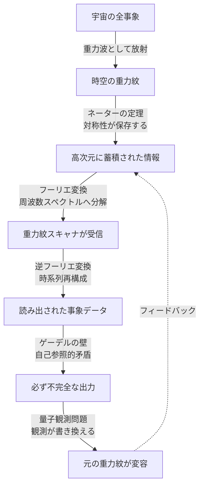

## 概要 (Abstract)

「アカシックレコード」とは、宇宙に起きたすべての出来事が霊的な媒体に刻まれているという神智学の概念だ。科学的根拠はない——しかし「もし現代物理学の言葉で再解釈したらどうなるか」という思考実験として考えると、驚くほど整合的な構造が見えてくる。

ネーターの定理は「対称性がある限り情報は保存される」と言う。フーリエ解析は「どんな複雑な信号も周波数に分解できる」と言う。そしてゲーデルの不完全性定理は「しかしその体系を完全に読み出すことはできない」と言う。

この三つを組み合わせると、アカシックレコードとは何か、そしてなぜ原理的にアクセスできないのかが、物理学の文脈で語れるようになる。

---

## 実現不可能性の根拠 (Infeasibility Rationale)

### 物理的限界

重力場が宇宙の全情報を保存するとしても、その情報密度はプランクスケール（約10⁻³⁵メートル）の解像度に達する。現在の人類が操作できる最小スケールは素粒子（約10⁻¹⁸メートル）であり、17桁以上の差がある。プランクスケールの情報にアクセスするには、太陽系全体のエネルギーを一点に集中させるような加速器が必要になると見積もられる。

また情報を「読み出す」際には、読み出し操作そのものが時空を乱し、保存された情報を書き換えてしまうという量子論的問題がある。観測が対象を変容させるという量子力学の根本原理が、ここでも立ちはだかる。

### 技術的限界

重力波検出器LIGOは4kmのアームを光が往復する経路の変化を陽子直径の1000分の1の精度で測定する。それでも宇宙の「全事象の重力紋」を解読するには、銀河規模のフーリエ変換装置が必要になる。信号処理の観点でも、宇宙138億年分の重力場を逆変換して意味のある情報を取り出すには、宇宙の全物質をコンピュータに変換しても足りない計算量が必要だとされる。

### 論理的限界——ゲーデルの壁

最も根本的な問題は論理にある。ゲーデルの不完全性定理が示すように、ある体系はその体系自身を完全に記述できない。宇宙のすべての情報が重力場に保存されているとしても、その情報を読み出す装置もまた宇宙の一部である。読み出し装置自身の状態も記録対象に含まれるため、完全な読み出しは自己矛盾を引き起こす。アカシックレコードは「存在するが、完全にはアクセスできない」という構造を持つことになる。

---

## 実験の設定 (Setup)

思考実験の主体・環境・操作を以下のように設定する。

**前提**

1. ネーターの定理を拡張解釈し、時空の対称性が保存するのはエネルギー・運動量だけでなく、すべての「事象の印（重力紋）」も含むと仮定する
2. 宇宙は4次元時空に加えて圧縮された余剰次元を持ち（超弦理論的な仮定）、そこに重力紋が蓄積されていく
3. フーリエ変換によって時間・空間領域に分散した重力紋を周波数スペクトルとして抽出できると仮定する

**装置の設計**

- **重力紋スキャナ**：ラグランジュポイントL4・L5に配置した三角形のLISA型干渉計を銀河規模に拡張したもの。アーム長は1光年
- **高次元フィルタ**：特定の余剰次元周波数に共鳴するエキゾチック物質製の共振器
- **逆フーリエ変換エンジン**：受信した重力波スペクトルを時系列の「事象データ」に変換する量子コンピュータクラスタ

**操作手順**

1. スキャナが宇宙背景重力場の全周波数成分を取得
2. 高次元フィルタで余剰次元成分を分離
3. 逆フーリエ変換エンジンで時系列再構成
4. 出力された「事象データ」を解析

---

## 考察と予測 (Speculation)

### 「重力紋」とは何か

ネーターの定理が教えるのは、「対称性が破れるたびに何かが生まれる」という原理だ。宇宙で何かが起きるとき——粒子が衝突し、恒星が爆発し、知性が決断を下すとき——時空の対称性はわずかに乱れ、その乱れが重力波として光速で広がる。重力波は遮蔽できない（鉛1光年分の壁も透過する）ため、宇宙の全事象はある意味で「全方位に記録を送り続けている」と解釈できる。

アカシックレコードをこの枠組みで読むと、「宇宙そのものが、すべての出来事を重力場の重ね合わせとして保有しているデータベース」になる。神智学が霊的な媒体と呼んだものは、時空の幾何学そのものだった——という解釈だ。

### フーリエ変換で「過去」を読む

重力波は周波数ごとに異なる情報を運ぶ。低周波は宇宙規模の大事象（銀河合体・ビッグバンの残響）を、高周波は素粒子スケールの微細な相互作用を担う。フーリエ解析によってこの周波数成分を分離できれば、原理的には「どの時代の・どのスケールの・どの場所の」出来事かを特定できるはずだ。

現実の問題はS/N比（信号対雑音比）だ。目的の信号は宇宙138億年分の重力波の海に溺れている。LIGOが行っているのはまさにこの作業——広大なノイズの中から特定のパターンを掘り出すこと——であり、アカシックレコードの「読み出し」は同じ原理の、天文学的スケールへの拡張と言える。

### ゲーデルの壁と不完全なアクセス

しかし読み出した情報は必ず不完全だ。ゲーデルの第一不完全性定理が示すように、十分に複雑な体系には証明も反証もできない命題が存在する。「宇宙の全事象データ」を収めたデータベースを宇宙内の装置で解析するとき、その装置自身の動作も記録対象の一部となる——これは無限後退を生む。

さらに量子力学的には、観測行為そのものが波動関数を収縮させ、「観測前の状態」を取り返しのつかない形で変化させる。過去の重力紋を精密に読もうとすればするほど、現在の時空が乱される。完全なアカシックレコードのアクセスは「そのアクセス行為によって書き換えられる」という自己参照的な矛盾を内包している。

これはある意味で、アカシックレコードが「存在する」ことと「完全には読めない」ことの両方を同時に保証する構造だ。神秘主義の言葉では「高次の意識状態でのみアクセス可能」と表現されるが、物理学の言葉では「ゲーデル的不完全性が観測者を制約している」と言い換えられる。

---

## 図解 (Diagrams)

---

## 関連記事 (Related)

- [wiim_004](../cosmology/wiim_004.md) — ワープ航法の痕跡を重力波で追跡できる世界
- [wiim_009](../cosmology/wiim_009.md) — 重力波をキャンセルする——時空のノイズキャンセリング
- [wiim_015](../physics/wiim_015.md) — エントロピーが減少する宇宙

**関連用語（用語集）**
- アカシックレコード (g086)
- ネーターの定理 (g089)
- フーリエ解析 (g087)
- ゲーデルの不完全性定理 (g090)
- 重力波 (g004)
- 重力波検出器 (g073)
- フーリエ解析 (g087)
