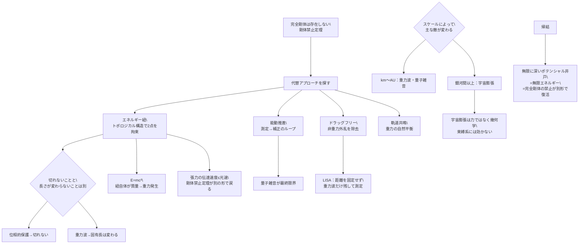

## 概要 (Abstract)

「宇宙の2点間に不変の距離を定義したい」——この問いに対し、物理学は即座に壁を提示する。完全剛体は存在できない（剛体禁止定理）。距離は観測者によって変わる（相対性理論）。時空そのものが歪む（重力波）。

しかし問い方を変えよう。**完全剛体を使わずに、2点間の距離を固定する方法はないか。**

思考実験として「切れないエネルギー紐」を仮定する。質量を持たず、振動せず、物質的な疲労もない——純粋にエネルギーの構造として2点を繋ぎ、固有の長さを保とうとする紐だ。何もない空間上の2点を、物質ではなく場の位相的な構造で結ぶ。

この紐はどこまで「距離の固定」に使えるか。そして最終的に何に敗れるか。

---

## 実現不可能性の根拠 (Infeasibility Rationale)

### 物理的限界

「エネルギー紐」の物理的な実装として最も近い概念は、素粒子物理学における**色閉じ込め（カラーコンファインメント）**だ。

クォーク同士はグルーオンのフラックスチューブ——エネルギーの紐——で繋がれている。この紐は距離が伸びても引力が衰えない（バネと逆で、引き離すほど強くなる）。エネルギー密度は距離によらずほぼ一定で、切ろうとすると紐がちぎれる代わりに新しいクォーク対が生まれ、端点が増える。位相的に保護された構造だ。

しかしこれは10⁻¹⁵mスケールの現象だ。宏観（マクロ）スケールに拡張すると根本的な問題が現れる。

**エネルギー紐自体が質量を持つ。** E=mc²により、エネルギーは質量と等価だ。紐が持つエネルギーは重力場を生成し、2点間の空間を歪める。「何もない2点間を繋ぐ」はずが、紐自体が空間を変形させてしまう。紐が長く・高エネルギーになるほどこの効果は大きくなる。

**宇宙ひも（コズミックストリング）**は、この概念の宇宙論的なバージョンだ。初期宇宙の相転移で生じたとされる1次元のトポロジカル欠陥で、線密度が極めて高く（単位長さあたり10²¹kg/m程度）、光速に近い速度で運動する。もし宇宙ひもが存在するなら、それは「切れないエネルギー紐」の自然な実装だ——しかしその重力的影響は宇宙規模で光の経路を曲げ、距離の概念を複雑にする。

### 技術的限界

**応答速度の問題**が残る。2点間の距離が変化したとき、紐が「知る」のは信号が伝わってからだ。エネルギー紐の中を情報が伝わる速度は光速を超えられない。一端が動いても他端がその変化に追いつくまでにタイムラグがある——これは剛体禁止定理が言い換えた形で現れる。

完全剛体が不可能な理由は「力の伝達速度が有限」だ。エネルギー紐も同じ制約の中にある。紐の「張力」（固有長に戻ろうとする力）が伝わる速度が遅ければ、短期的な距離変動は抑えられない。

### 論理的限界

最も根本的な壁は**重力波**だ。

重力波は時空の計量そのものを変える——2点間の「固有距離」を物理的に変化させる。どんな構造物も、エネルギー紐であれ物質であれ、時空の伸縮に乗せられる。LIGOが4kmの腕で検出する変化（10⁻¹⁸m）は、検出器の「距離」が本当に変化した結果だ。

エネルギー紐の「切れない」性質は位相的に保護できるかもしれない。しかし位相は保護できても、紐の固有長は時空の歪みに従う。「切れない」ことと「長さが変わらない」ことは別の性質だ。

---

## 実験の設定 (Setup)

完全剛体なしに距離を固定するアプローチを比較する：

| アプローチ | 原理 | 重力波への耐性 | 宇宙膨張への耐性 | 実用スケール |
|-----------|-----|-------------|--------------|-----------|
| **エネルギー紐（思考実験）** | 場のトポロジカル構造で2点を拘束 | ✗（時空歪みに従う） | △（束縛エネルギーで局所的に対抗） | 未知 |
| **能動推進フォーメーション** | 測定→誤差→推進で補正 | △（検出後に補正） | ○（銀河内スケール） | AU〜数AU |
| **ドラッグフリー自由落下** | 非重力外乱を除去し重力のみ残す | ✗（これを測定対象にする） | ○ | AU（LISA） |
| **軌道共鳴** | 引力の自然平衡で距離比を固定 | ✗ | ○ | 太陽系内 |
| **色閉じ込め（フラックスチューブ）** | QCDの位相的拘束 | 不明（プランクスケール以下） | — | 10⁻¹⁵m |

スケールによって「不変距離の敵」も変わる：

| スケール | 主な敵 | 宇宙膨張の影響 |
|---------|-------|-------------|
| km〜AU | 重力波・量子雑音 | ほぼゼロ（重力が束縛） |
| 光年 | 恒星間重力・重力波 | 無視できる |
| メガパーセク以上 | ハッブル膨張 | 支配的 |

重要な点：宇宙膨張は「力」ではなく「空間の幾何学の変化」であり、重力で束縛された系（太陽系・銀河）には適用されない。宇宙膨張と戦うべきスケールは銀河間以上に限られ、実用的な不変距離の問題では量子雑音や重力波の方がずっと手前に立ちはだかる。

---

## 考察と予測 (Speculation)

### 「切れない」と「変わらない」は別の性質

エネルギー紐の思考実験が明らかにする最初の洞察はここにある。

位相的に保護された構造——コズミックストリングやフラックスチューブ——は「切れない」。しかし切れないことは、長さが変わらないことを意味しない。重力波が通過すれば紐の固有長は変化する。引き伸ばされた紐は「繋がったまま」だが「元の長さ」ではない。

エネルギー紐が本当に「長さを固定する」には、重力波に対しても固有長を保つ性質——時空計量の変化に抵抗する性質——が必要だ。これは既知の物理には存在しない。固有長は時空計量の関数であり、計量が変われば長さも変わる。

### 用途を限定すれば成立するか

「何もない真空の2点間」という条件を真剣に取ると、状況は少し変わる。

重力波の振幅は距離の逆数で減衰する。銀河合体が生む重力波でさえ、地球では10⁻²¹程度の歪みしか引き起こさない。太陽系内の「静かな」領域では、重力波による距離変動は天文学的な精度の測定でのみ意味を持つ。

エネルギー紐を「重力波検知以下の精度での距離固定」に使うなら、重力波は実質的な壁にならない。工学的・熱的ノイズを除去した純粋なエネルギー構造は、太陽系内の静的な環境では「十分に不変」に近い距離を保てるかもしれない。

ただしそのとき「エネルギー紐」と「能動推進フォーメーション」の違いは何かという問いが生じる。どちらも代償を払いながら距離を維持する——前者はエネルギー構造の維持コスト、後者は推進剤と燃料だ。

### LISAの逆説——距離を固定するために、距離の変化を測る

重力波検知装置LISAのアプローチは、エネルギー紐の思考実験と対比して際立つ。

LISAは「重力波以外の全ての変動を消す」ことで、残った変動（重力波）を測定する。ドラッグフリー技術で宇宙船本体が全ての非重力外乱を吸収し、内部の試験質量を純粋な自由落下状態に置く。距離を「固定する」のではなく、重力以外のノイズを除いた後の「自然な距離」を精密に測定する。

エネルギー紐が「距離を固定しようとする」のに対し、LISAは「距離が何に動かされているかを区別する」。前者は抵抗、後者は選別だ。どちらのアプローチが「距離の不変性」という問いに対してより誠実かは、用途と哲学によって変わる。

### 完全剛体の代わりに何があるか

物理が完全剛体を禁じる理由は「力の伝達速度が有限」だ。しかしこれは必ずしも「距離固定が不可能」を意味しない。光速での応答で十分なら、エネルギー紐の「張力」は光速で伝わる——それは実質的に場（フィールド）だ。

場で2点を繋ぐとき、固有長は「場のエネルギーが最小になる距離」として定義される。2点が近づきすぎれば反発力が、遠ざかりすぎれば引力が働く——これは単純なポテンシャル井戸だ。問題は、このポテンシャル井戸の「壁の高さ」が有限であれば、重力波などの十分に大きな外乱は壁を超えて距離を変えてしまうことだ。

「無限に深いポテンシャル井戸」——完全に距離変化に抵抗する場——は、無限のエネルギーを必要とする。これは完全剛体の禁止が、別の形で戻ってきた姿だ。

---

## 図解 (Diagrams)

---

## 関連記事 (Related)

- [wiim_009](../cosmology/wiim_009.md) — 重力波をキャンセルする（重力波が「距離を変える」根本問題）
- [wiim_012](wiim_012.md) — 近光速回転シールド（剛体禁止定理を扱った記事）
- [wiim_013](wiim_013.md) — 空間を超越する粒子——コーラ粒子の仮説（場のトポロジカル構造との接点）
- （未作成）宇宙ひも——初期宇宙のトポロジカル欠陥と切れない構造
- （未作成）色閉じ込めと閉じ込め相転移——クォークを解放できない理由
- （未作成）スクィーズド光——量子雑音を騙す測定技術
