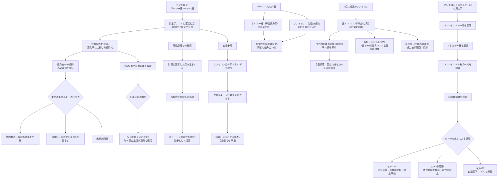

## 概要 (Abstract)

既知の粒子は全て、エネルギーや電荷や質量を通じて互いに・時空と相互作用する。重力は質量と結合し、電磁力は電荷と結合し、強い力はカラー荷と結合する——いずれも「物質の属性」を介した結合だ。

この思考実験は全く異なる粒子を仮定する。**アンキロン（Ankyron）**——ギリシャ語 ἄγκυρα（ankyra：錨）に由来する架空粒子。アンキロンは物質の属性ではなく、**時空の計量テンソルそのもの**に結合する。計量が変化しようとするとき、アンキロンはそれに抵抗する粘性力を発揮する——時空に錨を打つ粒子だ。

アンキロンを2点以上に配置すれば、それらの点は時空計量の変化に抗い、互いの固有距離を維持しようとする。完全剛体なしに不変距離を定義する、一つの仮説的な解答だ。

しかし計量を「固定する」ことは、計量を「決定する」一般相対性理論の根幹に触れる。アンキロンの定義は、どこかで物理の基本構造と衝突する。

---

## 実現不可能性の根拠 (Infeasibility Rationale)

### 物理的限界

**等価原理との矛盾**がアンキロンの最初の壁だ。

一般相対性理論の土台である等価原理は「局所的には、重力と加速度を区別できない」と述べる。これは「局所的な計量の変化は、座標系の選び方と区別できない」ことを意味する。計量に結合するアンキロンは、この「局所的な区別不能性」を破る——重力波が通過しても計量が変わらない場所が生まれるなら、そこは他の場所と物理的に異なる特権的な点になる。

これは相対性の根本を壊す。全ての座標系が等価であるという原理が崩れ、アンキロンが存在する点は「宇宙の絶対的な参照点」になってしまう。ニュートンの絶対空間が、粒子の形で復活する。

**計量の自己矛盾**も深刻だ。一般相対性理論では計量はアインシュタイン方程式によって決定される——計量は時空の曲がりを記述するが、その曲がりはそこにある質量・エネルギーが作り出す。アンキロンも質量・エネルギーを持つ（持たなければ何とも相互作用できない）。するとアンキロン自身が計量を変形させる。「計量に固着する」粒子が、その計量を変えてしまう——固着する床を自ら動かす矛盾だ。

### 技術的限界

**重力波エネルギーの行き先**が未解決だ。

重力波は時空計量の振動であり、エネルギーを運ぶ。アンキロンが計量変化に抵抗するなら、重力波のエネルギーを吸収することになる。しかしそのエネルギーはどこへ行くのか。熱として散逸するなら周囲の時空を加熱し（重力的加熱）、新たな計量の変化を引き起こす。放出するなら、放出された重力波が別のアンキロンを揺らす。エネルギー保存が閉じない可能性がある。

**錨の効果範囲**も問題だ。2点のアンキロンが「互いの距離を固定しようとする」力は、どのように伝わるのか。光速を超えられない制約の下では、一方のアンキロンが何らかの変動を受けたとき、その情報がもう一方に届くまでに時間がかかる——剛体禁止定理が、別の形で戻ってくる。

### 論理的限界

**計量は「背景」ではない**という事実が根本的な限界を設ける。

ニュートン力学では、空間は物体の動きに影響されない固定した背景だった。しかし一般相対性理論では、計量は物質と相互作用しながら動的に変化する「場」だ。アンキロンが計量に結合するということは、アンキロンと計量が双方向に影響し合うことを意味する。固着しようとする床が、固着する力によって変形する——この循環から逃げられない。

> 戦術応用（封鎖兵器・強度設計・反アンキロン除去）については補遺ノート [wiim_022_tactical.md](../notes/wiim_022_tactical.md) を参照。

---

## 実験の設定 (Setup)

アンキロンの基本パラメータを定義する：

| パラメータ | 記号 | 定義 |
|-----------|------|-----|
| **計量結合定数** | κ_A | アンキロンが計量テンソルと結合する強さ。既知の粒子は全てκ_A = 0 |
| **計量粘性係数** | η_A | 計量変化率に比例する抵抗力の大きさ |
| **固有距離保存半径** | r_A | 2点のアンキロン間で固有距離保存効果が支配的になる範囲 |
| **計量エネルギー密度** | ρ_A | アンキロンが局所計量に蓄えるエネルギー密度 |

アンキロンを他の架空粒子・既知粒子と比較する：

| 粒子 | 結合対象 | 主な効果 | 時空への影響 |
|-----|---------|---------|-----------|
| **電子** | 電磁場・ヒッグス場 | 電磁相互作用・質量 | 質量による計量曲げ |
| **グラビトン（仮説）** | 計量テンソル（量子化） | 重力の媒介 | 計量の量子的励起 |
| **ネゴトン（wiim_003）** | 重力場（負の質量で） | 局所的な重力反発・時間膨張 | 計量を逆向きに曲げる |
| **コーラ粒子（wiim_013）** | 空間座標（超越） | 空間的距離をゼロにする | 空間次元をバイパス |
| **アンキロン（この記事）** | 計量テンソルの変化率 | 計量変化への抵抗（粘性） | 計量を現状に固定しようとする |

アンキロン配置のシナリオ：

| 配置 | 期待される効果 | 問題 |
|-----|-------------|-----|
| 真空中の2点 | 固有距離の保存 | 伝達速度・自己重力 |
| 重力波検知装置の端点 | 重力波以外の距離変動を除去 | 重力波も吸収してしまう |
| ブラックホール事象の地平線付近 | 計量の凍結 | アンキロン自身が特異点に落ちる |
| 宇宙膨張の境界 | 局所的な膨張の抑制 | 宇宙規模のエネルギーに対抗できない |

---

## 考察と予測 (Speculation)

### 計量粘性——時空の「抵抗」とは何か

アンキロンが発揮する「計量粘性」を直感的に理解するには、通常の粘性との対比が助けになる。

通常の粘性は「流体中を動く物体への抵抗」だ。速く動くほど抵抗が大きい。アンキロンの計量粘性は「計量が変化することへの抵抗」だ——計量の変化率（時間微分）に比例する力が、変化を打ち消す方向に働く。重力波のように急激に計量を変えようとするほど、アンキロンは強く抵抗する。

この性質が面白い帰結をもたらす。**重力波の振動数が高いほど、アンキロンは強く抵抗する**。低周波の重力波（ゆっくりした計量変化）は比較的通り抜けやすく、高周波の重力波（急激な変化）は強く阻まれる。アンキロンは重力波の「周波数フィルター」として機能する。

LIGOが検出する重力波の周波数は10〜1000Hz程度で、宇宙論的な規模での計量変化（宇宙膨張）は事実上ゼロHzだ。十分に高いη_Aを持つアンキロンを配置すれば、「重力波には抵抗するが宇宙膨張には従う」フィルターとして使えるかもしれない。

### 絶対静止の幽霊——ニュートン空間の復活

アンキロンが存在する宇宙で最も哲学的に深刻な問題は、**絶対空間の復活**だ。

特殊相対性理論はニュートンの絶対空間を否定した——「絶対的な静止」は存在せず、全ての運動は相対的だ。しかしアンキロンが計量に固着するなら、アンキロンの「静止状態」は計量によって定義される——これは実質的に「宇宙の特権的な参照系」を物理的な粒子として具現化することだ。

マッハの原理は「慣性は宇宙の全質量分布に対する相対的な運動から生まれる」と述べる。アンキロンはこれとも衝突する——アンキロンの慣性は質量分布ではなく計量そのものに対して定義されるからだ。

逆説的だが、アンキロンは「場の理論の論理を完結させる粒子」でもある。量子場理論では全ての相互作用は「場への結合」として記述される。計量は確かに場だ（計量場）。アンキロンはその場へ直接結合する——これは既知の物理の拡張として定式化する余地がある。実際、超弦理論では計量の量子化（グラビトン）を扱い、計量テンソルへの特殊な結合を持つ弦の状態が存在する。アンキロンはその延長線上にある仮説的状態と見なすこともできる。

### アンキロン＋エネルギー紐——チューナブル計量検出器

アンキロンとエネルギー紐（wiim_021）を組み合わせると、架空物理の範囲で一つの測定系が構成できる。

点Aにアンキロンを置き、そこからエネルギー紐を展張して点Bのアンキロンに繋ぐ。両端は計量に固着され、紐はその間を繋ぐ——距離固定の装置としては理想的に見える。しかしここに逆説が潜んでいる。

**アンキロンが強いほど、測定できるものが消える。**

η_Aが無限大に近ければ、両端のアンキロンは計量変化を完全に阻む。重力波が通過しても端点は動かない。紐は伸縮せず、測定値はゼロだ——正確に固定されているため、何も測れない。η_Aがゼロなら端点は自由落下し、重力波に完全に従って動く。紐の伸縮量は最大になるが、それはLIGOが試験質量をドラッグフリーにする設計と等価だ。アンキロンの存在意義が消える。

最も情報が豊かな状態は中間にある。η_Aが有限の適切な値をとるとき、アンキロンは計量変化の一部を吸収し、残差だけが紐の伸縮として現れる。その残差は「アンキロンが抵抗できなかった計量変化の量」——言い換えれば、アンキロンの計量粘性係数η_Aと、外力（重力波の振幅・周波数）の比によって決まる信号だ。

この構造は電気回路や音響における**インピーダンス整合**と同型だ。センサーのインピーダンス（η_A）が測定対象の「硬さ」と整合するとき、最大の信号が取り出せる。アンキロンとエネルギー紐の系は、η_Aを調整することで感度帯域を変えられる**チューナブル計量検出器**として機能する。

また、紐の伸縮量だけでなく**伸縮の非対称性**も情報を持つ。重力波は直交する方向を逆位相で伸縮させる（一方が伸びるとき他方が縮む）。複数方向にアンキロン＋紐の系を配置すれば、重力波の偏光・方向・波形を同時に取得できる——LISAが3機の宇宙船で正三角形を組む理由と同じ論理だ。

### A点に複数のアンキロン——自己参照する計量プローブ

一点に複数のアンキロンを密集させると、さらに興味深い構造が現れる。

「同じ点」に置かれた2つのアンキロン——正確にはごく微小な間隔δで並んだA₁とA₂——は、それぞれわずかに異なる計量値に固着する。重力波が通過すると、A₁とA₂の間の計量が変化し、2者間の固有距離が変動する。この変動量を測れば、**点A周辺の計量の局所的な勾配**——つまり局所的な時空の曲率——が読み取れる。

ここに自己参照的な逆説が生まれる。アンキロン同士の距離変化は「アンキロンが防ぎきれなかった計量変化の量」だ。センサーが自分自身の失敗を記録する——計量を固定しようとする粒子が、固定できなかった分だけを信号として出力する。

**アンキロンの数と情報量の関係**も際立つ。3次元空間で4個のアンキロンを四面体状に配置すると、6組のペア距離が得られる。これは3次元の計量テンソル（独立成分6個）を完全に決定するのにちょうど足りる数だ。時空の曲率テンソル（リーマンテンソル）の全成分を再構成するにはさらに多くが必要だが、原理上は有限個のアンキロンクラスターで局所的な時空の幾何学を完全に「撮影」できる。

| クラスター構成 | ペア数 | 測定可能な情報 |
|-------------|-------|-------------|
| 2個（線） | 1 | 1方向の計量変化 |
| 3個（三角形） | 3 | 2次元の計量テンソル |
| 4個（四面体） | 6 | 3次元の計量テンソル（完全） |
| N個 | N(N-1)/2 | 高次の曲率成分・非線形項 |

**密度が上がると「計量の結晶化」が起きる**という別の帰結もある。多数のアンキロンが狭い領域に密集すると、各点の計量が互いに固着し合い、局所的な時空の幾何学が「凍結」する——計量の変化に対して集団的に抵抗する相が生まれる。少数では「計量の粘性流体」、高密度では「計量の固体」に相転移する。重力波はこの「凍結領域」を通過できず、迂回するか反射するかしなければならない——アンキロン密度によって重力波の経路が曲げられる光学素子のような振る舞いだ。

### 2点配置——最もシンプルな応用

思考実験として最も明快なのは「真空中の2点にアンキロンを1個ずつ置く」シナリオだ。

2つのアンキロンは、それぞれの位置での計量を「現状に固定しようとする」。互いの距離が変化しようとすると——どちらかの点の計量が変化しようとすると——アンキロンが抵抗する。重力波が通過しても、熱的変動があっても、アンキロンは計量を元に戻そうとする。

ただし「完全な固定」は不可能だ。η_Aが有限である限り、十分に大きな外乱はアンキロンの抵抗を上回る。アンキロンは「弾性体ではなく粘性体」として振る舞う——完全に動かないのではなく、変化に時間をかけて抵抗し、エネルギーを散逸させながら緩やかに変形を許す。

これは「切れないエネルギー紐」（wiim_021）との違いでもある。エネルギー紐は2点を「繋いで引き戻す」弾性的な拘束だ。アンキロンは各点の計量を「固着させる」粘性的な抵抗だ。弾性 vs 粘性——両者を組み合わせれば「粘弾性的な距離固定」が生まれる。

---

## 図解 (Diagrams)

---

## 関連記事 (Related)

- [wiim_021](wiim_021.md) — 切れないエネルギー紐（アンキロンが生まれた思考実験。弾性的拘束との対比）
- [wiim_013](wiim_013.md) — コーラ粒子の仮説（同じく架空粒子。空間超越 vs 空間固着という対極）
- [wiim_003](wiim_003.md) — 負の質量を持つ粒子（ネゴトン。計量を逆向きに曲げる粒子との対比）
- [wiim_009](../cosmology/wiim_009.md) — 重力波をキャンセルする（アンキロンは重力波を「吸収」する別アプローチ）
- [wiim_010](wiim_010.md) — 重力波を遮断・散乱させる物質（計量への結合という共通テーマ）
- [wiim_012](wiim_012.md) — 近光速回転シールド（剛体禁止定理を別角度から扱う）
- [wiim_035](wiim_035.md) — グラビトーペイクの逆説（アンキロン固着層・封鎖兵器としての応用と限界）
- （未作成）グラビトンの量子化——計量テンソルを粒子として扱う試み
- （未作成）マッハの原理——慣性は宇宙の質量分布から生まれるか
- （未作成）絶対空間の復権——相対性理論後に「固定点」を定義できるか
- [wiim_022_tactical.md](../notes/wiim_022_tactical.md) — 戦術応用補遺（封鎖兵器・強度設計・反アンキロン除去）
- （未作成）反アンキロンの生成——カシミールフォージによる対粒子製造の可能性
