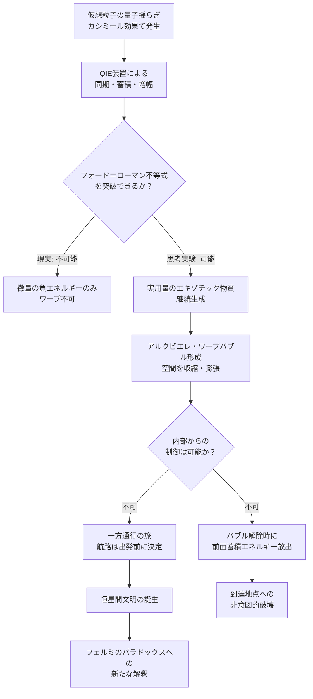

## 概要 (Abstract)

カシミール効果が示すように、仮想粒子による量子揺らぎは局所的に負のエネルギー密度——エキゾチック物質的な状態——を生み出す。しかし現実では「フォード＝ローマン不等式」と呼ばれる量子不等式が、生成できる負エネルギーの量と持続時間に厳しい上限を設けており、ワープドライブに必要な規模には遥かに届かない。

では、もしこの制約を突き破り、仮想粒子の増幅・同期によってエキゾチック物質を実用規模で量産できる技術が確立されたとしたら？アルクビエレ・ドライブ（ワープドライブ）は現実の技術となり、人類は光速を超えることなく宇宙を「空間ごと」移動できるようになるかもしれない。

---

## 実現不可能性の根拠 (Infeasibility Rationale)

**物理的限界**
フォード＝ローマン不等式は量子場理論から厳密に導かれる制約で、負のエネルギー密度の大きさと持続時間の積に上限を課す。カシミール効果で得られる負エネルギーは極めて微量であり、アルクビエレ・ドライブが必要とする量（太陽質量の10倍以上に相当するエネルギーとも試算される）との差は文字通り天文学的だ。

なお「仮想粒子を増幅・同期してエキゾチック物質を生成する」という本記事の描写は直感的・比喩的な表現である。QFTがカシミール効果として記述するのは、二枚の導体板が境界条件を設けることで**板間の真空モード密度が外部より低下する**という現象であり、個別の仮想粒子が「生成」されたり「増幅」されたりするわけではない。「仮想粒子」という言葉はファインマンダイアグラムの計算上の媒介子を指す専門用語であり、実在して操作できる粒子ではない。より正確には、本記事が想定する技術は「真空の局所的なモード密度を能動的に操作し、その非対称性からエキゾチック物質相当の効果を引き出す」試みとして読み替えるのが適切だ。

**技術的限界**
仮想粒子は観測できない中間状態であり、「増幅」や「同期」のための操作手段が理論的にも存在しない。レーザーが光子の誘導放出を使えるのはボソンの性質によるが、仮想粒子は実粒子と異なりエネルギー・運動量の関係式を満たさず、同様の制御を適用できない。

**論理的・因果律的限界**
アルクビエレ・ドライブが実現すると因果律の破れが生じる可能性がある。ワープバブル内では因果的に孤立した閉じた時間的曲線（CTC）が形成されうるとされ、情報の過去への送信——タイムパラドックス——が原理的に許容されてしまう。多くの物理学者はこれを「物理法則が自己矛盾しないよう何らかの機構がワープを禁じているはずだ」という根拠と見なす。

---

## 実験の設定 (Setup)

- **技術的前提**：「量子不等式増幅装置（QIE: Quantum Inequality Enhancer）」が開発されたと仮定する。高度に制御された多層カシミール共振器が仮想粒子の量子揺らぎを同期・蓄積し、実用量の負のエネルギー密度を持続的に生成できる
- **ドライブの構造**：船体を包む「ワープバブル」の前方では空間を収縮させ、後方では膨張させる。バブル内の乗員・乗船は局所的には静止しており慣性力を受けない
- **エネルギー供給**：QIE装置の動力はダイソン球規模の恒星エネルギー採取を想定（カルダシェフスケール タイプII文明相当）
- **航法計算**：ワープバブルの形成・維持・解除は外部からの制御に依存する。バブル内からの操作手段は理論上存在しない

---

## 考察と予測 (Speculation)

**航法上の根本的問題**
ワープバブルは一度形成されると、内部から修正・停止できないと考えられている。乗員はバブルの外側の空間と因果的に切断されるためだ。出発前にすべての航路を決定する「一方通行の旅」となり、宇宙航法の概念が根本から変わるだろう。

**到着時の衝撃波問題**
バブルの前方では空間が収縮するため、航行中に宇宙線・塵・光子が前面に蓄積される。バブルを解除した瞬間、これらが高エネルギービームとして目的地方向に放出される。ワープ航法は「目的地への大量破壊」を伴う可能性があり、軍事的な文脈での使用が最初に現実化するかもしれない。

**時間の非対称性**
相対性理論的な時間遅延は発生しないが、バブル内外での時間の流れが微妙にずれる可能性がある。長距離ワープを重ねた乗員は「失われた時間」なしに別の星系に到達できる一方、帰還後の社会・技術の変化には追いつけないという新たな疎外感が生まれるだろう。

**文明スケールの影響**
太陽系外惑星への往復が数日で可能になれば、人類は恒星間文明に踏み出す。しかしワープ技術はカルダシェフタイプII以上の文明にしか維持できないとすれば、フェルミのパラドックスの答えの一つが「ワープ文明は自分たちが到達できる以前の段階では存在を隠す」という形で導かれるかもしれない。

---

## 図解 (Diagrams)

---

## 関連記事 (Related)

- [wiim_001](../cosmology/wiim_001.md) — 光速を超えた場合の因果律
- [wiim_004](../cosmology/wiim_004.md) — ワープ航法の痕跡を重力波で追跡できる世界
- [wiim_028](../cosmology/wiim_028.md) — 重力子と光子の二重搬送FTL通信——エキゾチック物質チャネルによる宇宙際通信
- [wiim_027](wiim_027.md) — ストレンジスター・ワープゲート——重力チューニングによる固定式時空歪曲点
- [wiim_030](wiim_030.md) — パラドックス粒子——エキゾチック物質の反動が生む因果矛盾の自動解消
- [wiim_031](wiim_031.md) — 真空非対称牽引ビーム——誘導重力が正しければカシミール効果はトラクタービームになる
- [wiim_034](wiim_034.md) — エキゾチック物質音響実験——負屈折チャンバーとコーラ粒子音響搬送の試み
- [wiim_038](wiim_038.md) — 静かな対消滅——パランティ粒子による完全無効化
- [wiim_039](../quantum/wiim_039.md) — 量子永久機関——非対称カシミール板と真空エネルギーの搾取
- [economy_um_currency](../notes/economy_um_currency.md) — 世界観：UM通貨制度とエキゾチック物質単価
- [forbidden_zone_treaty](../notes/forbidden_zone_treaty.md) — 禁域条約——宇宙戦争を終わらせた二国消滅事件
- [wiim_022_tactical](../notes/wiim_022_tactical.md) — 補遺: アンキロンの戦術応用——計量バリケードの強度設計と反アンキロン除去
- [wiim_023_strange_matter_warp](../notes/wiim_023_strange_matter_warp.md) — 補遺: ストレンジ物質とワープドライブ——生成・採取・遠隔利用の可能性
- [wiim_019](wiim_019.md) — 居住しない惑星——エネルギー用途のテラフォーミング
- [wiim_063](wiim_063.md) — 架空粒子による大気圏突入緩和——ネゴトン・カシミールフォージ・レトロンは再突入熱と重力を制御できるか
- [wiim_064](wiim_064.md) — ネグレーザー——真空ゆらぎのコヒーレント化による引力・反重力ビームは実現できるか
- [wiim_065](wiim_065.md) — 反重力天体——エキゾチック物質とカシミールフォージで斥力場を生成できるか
- [wiim_066](wiim_066.md) — ネゴトン凝縮体の外部照射構築法——ネゴトロンビームで反重力天体を組み上げる
- [wiim_067](wiim_067.md) — ネゴトンホワイトホール——排除地平線が閉じるとき、反重力天体はビッグバンを起こすか

