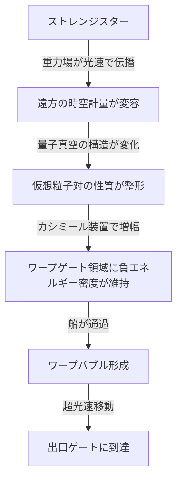
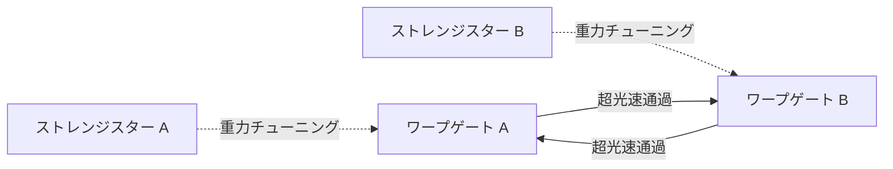

## 概要 (Abstract)

アルクビエレ・ドライブに代表されるワープ航法の最大の難題は、船が自前でエキゾチック物質（負のエネルギー密度を持つ物質）を大量に用意しなければならない点にある。

この記事では別のアプローチを考える——ストレンジ物質（g071）のみで構成されるとされる仮説上の天体「ストレンジスター」の重力場が、遠方の量子真空を恒常的に「チューニング」することで、特定の空間領域にワープに適した条件を自然に作り出すという思考実験だ。船はエキゾチック物質を搭載せず、**条件が整った場所を通過するだけ**でよい。宇宙における「港」としてのワープゲートが天文学的な地形に依存して存在する世界を問う。

---

## 実現不可能性の根拠 (Infeasibility Rationale)

### 物理的限界

ストレンジスターの重力は確かに遠方まで届くが、その強度は距離の二乗に反比例して減衰する。数光年先では通常の恒星と実質的に区別できないほど小さく、量子真空を有意に変容させられるかは未知だ。さらに、ストレンジスター自体が観測的に確認された天体ではなく、ウィッテン予想（ストレンジ物質が核物質より安定という仮説）の正否も未決着だ。

### 技術的限界

仮に真空のチューニングが起きていたとしても、その効果を「ゲート」として利用するには時空計量の変容を精密に計測・制御する技術が必要だ。現在の物理学では量子真空の局所的な状態を能動的に制御する手段がない。また量子不等式（フォード＝ローマン不等式）は負エネルギーの集中量と持続時間に厳しい上限を設けており、ゲートとして実用的な規模の時空歪曲を維持できるかも不明だ。

### 論理的限界

一般相対性理論のビルコフの定理により、球対称天体の外部時空はその内部組成によらず質量だけで決まる。同じ質量のストレンジスターと中性子星は表面より外側では原理的に同じ重力場を持ち、「重力の質が違う」とは言えない。ストレンジスターが有利な点は**極端な高密度ゆえに半径が小さく、同質量の通常天体より表面に近づけること**——つまりより深い重力ポテンシャルにゲートを設置できるという点に限られる。この程度の差が量子真空のチューニングに実用的な効果をもたらすかは未知だ。

---

## 実験の設定 (Setup)

### 主体と構成要素

- **ストレンジスター**：半径約10km・質量1〜2太陽質量のストレンジ物質天体。自ら近づくことはできないが、重力場は光速で伝播し遠方まで届く
- **ワープゲート構造体**：ストレンジスターから適切な距離に設置されたリング状または球殻状の構造物。カシミール型装置を内蔵し、チューニングされた真空を「増幅・固定」する役割を持つ
- **通過船**：エキゾチック物質を搭載しない。ゲート起動のための局所エネルギーのみを供給する

### メカニズムの流れ

### ゲートの適地条件

ゲートはストレンジスターの重力チューニング効果が最大化される距離に設置する必要がある。近すぎれば潮汐力と放射線でゲート構造体が破壊され、遠すぎれば効果が薄れる。さらに軌道安定性のためにストレンジスターのラグランジュ点L4/L5が候補地になる。

---

## 考察と予測 (Speculation)

### FTL移動がハブ&スポーク型になる

船載型ワープドライブが実現すれば任意の2点間を直接移動できるが、ストレンジスター・ワープゲートでは**ゲートが存在する場所にしか出入りできない**。これは航空ハブ空港のような構造を宇宙規模で生み出す。

主要なストレンジスター近傍に大ゲートが存在し、そこから先は低速航行で目的地に向かう——宇宙のインフラとしての「港湾都市」がストレンジスター周辺に形成される。

### 天文学的地形が政治を決定する

ゲートを設置できる場所が天文学的条件に縛られるということは、**ストレンジスターの分布が宇宙規模の覇権を左右する**ことを意味する。鉄道が敷かれた都市が栄え、港を持つ国家が海権を握ったように——ストレンジスターを発見・確保した文明が恒星間交通の要衝を独占する。

### 一方通行の非対称性

出口ゲートを設置する場所にも別のストレンジスターが必要か、あるいは入口側の重力場の影響が出口まで及ぶかは未解決だ。後者なら「片方のゲートだけにストレンジスターが必要」という非対称な構造が生まれ、ゲートが本質的に一方向的になりうる。

### ストレンジ物質の自己生成路線との組み合わせ

別の補遺（wiim_023_strange_matter_warp）で論じたように、ストレンジ物質はLHCが原理を実証しており、SF的にはスケールアップした加速器で人工生成できると想定できる。人工ストレンジスターを建造してゲートの重力源にする——天然天体を探す必要がなくなり、任意の場所にゲートを設置できる文明段階が想定される。

---

## 図解 (Diagrams)

---

## 関連記事 (Related)

- [wiim_023](wiim_023.md) — カシミールフォージ：エキゾチック物質の生成基盤となるカシミール効果の拡張
- [wiim_004](../cosmology/wiim_004.md) — ワープ航法の痕跡を重力波で追跡できる世界
- [wiim_003](wiim_003.md) — 負の質量を持つ粒子による局所的時間加速
- [wiim_013](wiim_013.md) — 空間を超越する粒子：コーラ粒子の仮説
- [wiim_014](wiim_014.md) — 物理定数ハッキングによる超光速航法
- [wiim_028](../cosmology/wiim_028.md) — 重力子と光子の二重搬送FTL通信——エキゾチック物質チャネルによる宇宙際通信
- [wiim_029](wiim_029.md) — コーラ粒子通信——ストレンジスターの重力勾配による余剰次元誘導
- [wiim_030](wiim_030.md) — パラドックス粒子——エキゾチック物質の反動が生む因果矛盾の自動解消
- [wiim_032](wiim_032.md) — コーラバブルワープ——コーラ粒子場に包まれた船が余剰次元を跳躍する
- [wiim_034](wiim_034.md) — エキゾチック物質音響実験——負屈折チャンバーとコーラ粒子音響搬送の試み
- [chronosphere_timeline](../notes/chronosphere_timeline.md) — クロノスフィア年表——発見から太陽系根付きまで
- [wiim_026_ecosystem_route](../notes/wiim_026_ecosystem_route.md) — 補遺: コズミックマイスの生態と回遊ルート——地球からトロヤ群へ
- [wiim_065](wiim_065.md) — 反重力天体——エキゾチック物質とカシミールフォージで斥力場を生成できるか

