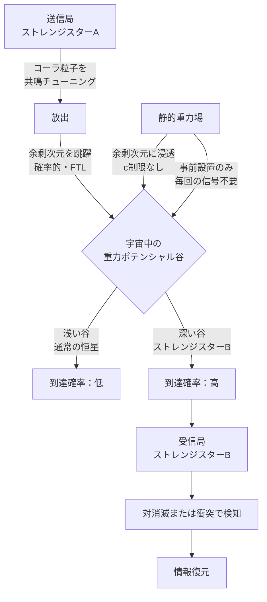

## 1. 概要 (Abstract)

コーラ粒子（[wiim_013](wiim_013.md)）は余剰次元を内在的な経路として使い、3次元空間を「跳躍」する仮説上の粒子だ。しかし出現先が確率的にしか定まらないという根本問題がある——情報を乗せて送っても、どこに届くか制御できない。

従来の解決策として「重力子を先行させ余剰次元に道を刻む」案があったが、重力子は光速cでしか伝播できないため、結果としてFTLの意味が失われる。

本記事ではその問題を一歩で解決する発想を問う。

> **前提1:** コーラ粒子が実在し、余剰次元の重力ポテンシャル勾配に沿って移動確率が変化する。
> **前提2:** 余剰次元に深い重力ポテンシャルの「谷」を形成できる質量天体（ストレンジスターなど）を通信局として利用できる。
> **命題:** 「静的な重力場が余剰次元に作る谷を宛先として、コーラ粒子はcを超えて誘導的に届けられるか？」

---

## 2. 実現不可能性の根拠 (Infeasibility Rationale)

### 物理的限界

コーラ粒子の実在は確認されていない。余剰次元そのものも——弦理論やKaluza-Klein理論が予言するものの——実験的証拠はプランクスケール以下に封じ込められており、直接観測された例はない。

ブレーンワールド理論では重力子のみが余剰次元（バルク空間）を自由に伝播でき、他の粒子は私たちの3次元ブレーン上に閉じ込められる。コーラ粒子がこの分類でどちらに属するかも未定義だ。仮にブレーンに閉じ込められる粒子であれば、余剰次元の経路を使うという前提自体が成立しない。

### 技術的限界

コーラ粒子を生成する方法が存在しない。既知の四つの基本力のいずれも、余剰次元を内在的経路として持つ粒子を生成する相互作用を持たない。また「共鳴周波数のチューニング」——特定の重力ポテンシャルの谷に向かいやすいようコーラ粒子の状態を整える操作——は概念として提示できても、その実装手段は現代物理学の外にある。

ストレンジスター自体の生成・制御も未解決だ（[wiim_027](wiim_027.md)）。ストレンジスターを通信局として使うには、まずストレンジ物質を安定して取り扱う技術が必要になる。

### 論理的限界（因果律との衝突）

余剰次元経由の空間跳躍は「有限の時間で空間を超越する」ことを意味し、特殊相対性理論の同時性の相対性と衝突する。ある慣性系で「A地点からB地点に時刻Tで到達」と観測される事象は、別の慣性系では「B地点からA地点に時刻T'（T'が負になりうる）で移動した」と解釈される。空間跳躍が確定的な情報を運べる場合、これは過去への通信と等価になる（[wiim_001](../cosmology/wiim_001.md)）。

---

## 3. 実験の設定 (Setup)

- **送信局（銀河系内）:** ストレンジスターを中心天体として持つ通信拠点。コーラ粒子生成装置と共鳴チューナーを備える。
- **受信局（目的地）:** 同じくストレンジスターを持つ拠点。その深い重力ポテンシャルが余剰次元に「谷」を形成している。
- **コーラ粒子:** 送信前に受信局ストレンジスターの重力ポテンシャル周波数に共鳴チューニングされ、放出される。
- **誘導機構:** 余剰次元内の重力勾配。送信前の事前信号は不要——受信局の質量が「存在するだけ」で谷は成立している。

### 重力誘導と信号送信の違い

| | 重力子を信号として送る | 静的重力場を谷として使う |
|--|-------------------|-------------------|
| 伝播速度 | c（光速） | 不要（場はすでにある） |
| 事前準備 | 毎回必要 | 一回（天体設置のみ） |
| FTL達成 | 不可（c制限） | 可（静的場はcを問わない） |

---

## 4. 考察と予測 (Speculation)

### 静的場という鍵

重力場を「送る」のと「置く」のは根本的に違う。光源を照らすには光速で光が届く必要があるが、質量が作る重力場はすでに宇宙に存在しており、新たに送り込む必要がない。ブレーンワールド理論においてこの重力場は余剰次元にも浸透しているため、コーラ粒子はその勾配を感知して「谷」へと引き寄せられると考えられる。

これはFTL通信における「c制限の抜け穴」ではなく、静的場という物理の基本的な概念を余剰次元に延長しただけだ——それが可能かどうかは、コーラ粒子と余剰次元の実在にかかっている。

### 特異性の問題——宇宙中の谷から選ぶ

あらゆる質量が余剰次元に谷を作るなら、コーラ粒子はなぜ特定の宛先に向かうのか。三つの解決候補がある。

**①深さによる圧倒:** ストレンジスターは通常の恒星の数倍の密度を持ち、同じ質量でもはるかに小さい半径に凝縮される。余剰次元の谷もそれに応じて深く急峻になり、近傍の恒星程度の谷を統計的に圧倒する。銀河内に複数のストレンジスター通信局があれば、最も深い谷が「最有力の宛先」として機能する。

**②変調による住所付け:** 通信局の質量分布を時間的にパターン変調させ、余剰次元の谷に固有の「振動パターン」を刻む。コーラ粒子はチューニング時にそのパターンを刻まれ、一致するパターンの谷にのみ高確率で到達する。

**③共鳴周波数による選択:** 余剰次元がコンパクト化されている場合、各周波数の共鳴モードが存在する。受信局ごとに異なる共鳴周波数を割り当て、送信時にコーラ粒子をその周波数に合わせる——余剰次元版の周波数多重通信だ。

### ストレンジスターが「宇宙際アンテナ」になる

この構想において、ストレンジスターは単なる重い天体ではない。深い重力ポテンシャルを持つことで余剰次元に際立った谷を作り、コーラ粒子通信の「受信アンテナ」として機能する。アンテナの利得に相当するのは「谷の深さ」——ストレンジスターが稠密であるほど指向性が高くなる。

wiim_027で論じたワープゲートとの組み合わせも考えられる。ストレンジスターの重力ポテンシャルをワープゲートの固定点として使いつつ、同じ重力場をコーラ粒子の誘導にも利用する——単一の天体が移動と通信の両方のインフラを兼ねる構造だ。

### スイングバイによる指向性付与——ストレンジスターをルーターにする

重力勾配誘導と同じ仕組みを使って、コーラ粒子に「方向性」を与えられる可能性がある。惑星スイングバイと同じ原理だ。

コーラ粒子が中継ストレンジスターの余剰次元の谷に引き寄せられたとき、捕捉されるほどのエネルギーがなければ谷を通過して散乱される。この散乱角はラザフォード散乱と同じ数学で記述でき、谷の深さと接近距離（衝突パラメータ）で決まる。深い谷ほど大きな角度変換が可能で、ストレンジスターはその稠密さゆえに理想的な「方向転換点」になる。

```
送信（大まかな方向）
　→ 中継ストレンジスターに引き寄せられる
　→ 捕捉されず散乱 → 方向が修正される
　→ 次のストレンジスターへ
　→ 中継を重ねて目的地へ到達
```

これはインターネットのパケットルーティングと同じ構造だ。ストレンジスターが「ルーター」として機能し、精密な初期照準なしに目的地へ到達できる。送信側は最初の中継点に「大まかに向ける」だけでよく、あとは各ルーターが経路修正を担う。

銀河系内に複数のストレンジスター通信局が存在すれば、それ自体がコーラ粒子網のトポロジーを決定する——天体の配置が通信インフラの設計図になる。

### 量子ゆらぎというノイズ——時空の泡との接点

「静的重力場」は古典的には滑らかな勾配だが、量子レベルでは**仮想重力子の絶え間ない生成・消滅**によって維持される動的な平衡だ。ファンデルワールス力が中性原子の電子雲の瞬間的な偏りから生まれるように、重力場にも局所的な一時的不均衡——量子重力ゆらぎ——が常に存在する。

プランクスケールでは**時空の泡（g146）**として知られるこの現象が極限まで達し、時空の位相（トポロジー）そのものが瞬間的に変化するとも考えられる。より大きなスケールでは、LIGOの測定精度が上がるにつれて実際の工学的障害として現れており、現在は「スクイーズド光」技術でこのノイズを管理している。

コーラ粒子にとってこの揺らぎは二つの顔を持つ：

- **ノイズとして**：谷への経路が量子的に乱され、到達確率が散らばる。チャネルに根本的な量子ノイズ下限が生じる。
- **助けとして**：適度なゆらぎが確率的共鳴（stochastic resonance）を生み、深い谷への捕捉を逆に助ける可能性がある——ノイズが信号検出を改善する非線形現象だ。

ストレンジスターの深い谷はゆらぎの振幅も大きく、量子ノイズと捕捉効果が同時に増幅される。これは通信設計において「深い谷を使うほどノイズも増えるが、正味の誘導効果はそれを上回る」というトレードオフを生む。

### 確率チャネルとしての限界

コーラ粒子が谷に引き寄せられる「確率の上昇」は100%ではない。谷が深くても、チューニングが精密でも、一定の割合は他の場所に到達する。これは雑音のあるチャネルであり、エラー訂正符号が必要になる。また到達のタイミングが確率的に散らばるため、情報レートに固有の上限が生じる。大量のコーラ粒子を同時放出することで統計的に補えるが、生成コストとのトレードオフになる。

---

## 5. 図解 (Diagrams)



---

## 6. 関連記事 (Related)

- [wiim_013](wiim_013.md) — コーラ粒子の仮説（余剰次元を経路として持つ粒子の基本概念）
- [wiim_027](wiim_027.md) — ストレンジスター・ワープゲート（深い重力ポテンシャルの応用）
- [wiim_028](../cosmology/wiim_028.md) — 重力子と光子の二重搬送FTL通信（重力子誘導との比較）
- [wiim_001](../cosmology/wiim_001.md) — 光速を超えた場合の因果律（空間跳躍と因果律違反の構造）
- wiim_??? — コーラ粒子通信網を持つ文明の情報論的限界（未執筆）
