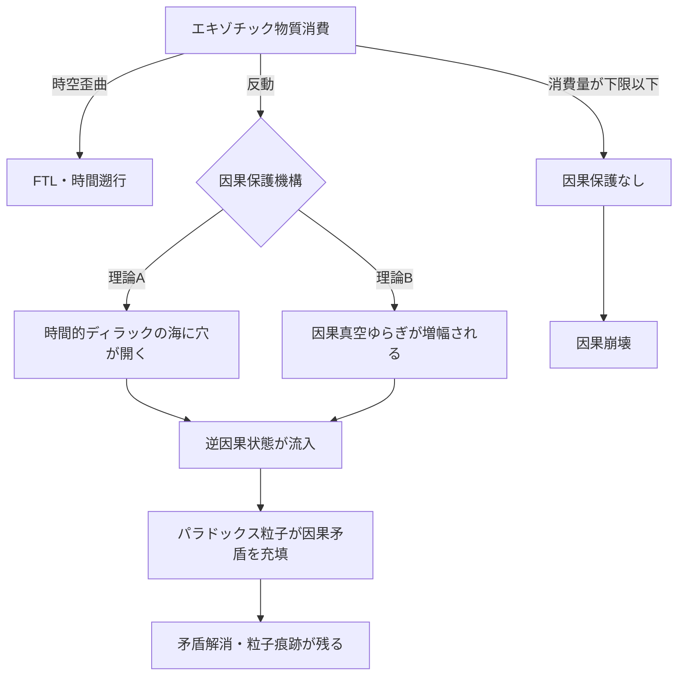

## 1. 概要 (Abstract)

FTL航法や時間遡行はそれ自体が因果律を破ると考えられてきた（[wiim_001](../cosmology/wiim_001.md)）。しかし思考実験の蓄積が示す奇妙な事実がある——エキゾチック物質を十分量消費してこれらの操作を行った場合、予測されるはずの因果矛盾が「発生していない」のだ。

操作後の時空には特異な粒子痕跡が残される。この痕跡を残す仮説上の粒子を**パラドックス粒子**と呼ぶ。

> **観測された事実:** エキゾチック物質による時空歪曲操作の後、因果矛盾に相当する事象が自動的に解消され、特異な粒子痕跡が残る。
> **命題:** 「パラドックス粒子はなぜ生まれ、どのように因果矛盾を解消するのか——二つの競合仮説は何を予言するか？」

重要なのは、パラドックス粒子の**存在と効果は観測可能**だが、**その生成機構については二つの理論が競合したまま決着がついていない**という点だ。量子力学が「使えるが解釈は未解決」であるように、パラドックス粒子もまた「働いているが理由が分からない」技術の最前線にある。

---

## 2. 実現不可能性の根拠 (Infeasibility Rationale)

### 物理的限界

パラドックス粒子の効果を発動させる前提として、エキゾチック物質（負エネルギー密度）の巨視的生成が必要だ（[wiim_023](wiim_023.md)）。カシミール効果（g009）で微量は実証されているが、時空を歪曲するほどの量を安定して維持する手段は現在存在しない。量子不等式（フォード＝ローマン不等式）が負エネルギーの存在時間と強度に厳しい制約を課すため、巨視的スケールでの維持は量子力学の根本から制限される。

### 技術的限界

パラドックス粒子の痕跡を検出するには、通常の粒子検出器では捉えられない特性を持つ検出系が必要になると考えられる。因果構造そのものに作用する粒子の痕跡は、エネルギーや運動量の従来的な測定では現れない可能性がある。また競合する二つの理論が異なる検出特性を予言しており、どちらの検出器設計が正しいかも未決定だ。

### 論理的限界（「使えるが分からない」という状況）

パラドックス粒子の最大の問題は物理的な壁ではなく、**「機構が分からないまま運用する」という倫理的・認識論的な限界**だ。エキゾチック物質が尽きた場合、因果保護が失われる——しかし「どの程度尽きたら危険か」の理論的計算が二つの仮説で異なる。誤った仮説を採用したまま運用を続けると、因果崩壊が起きた後に初めて誤りが判明する。

---

## 3. 実験の設定 (Setup)

### 観測の条件

- **操作:** エキゾチック物質を消費したFTL航法・時間遡行・ワープゲート通過
- **消費量:** 因果保護が発動するには「十分量」が必要。実験的に下限値は確認されているが理論的説明は未決定
- **痕跡の性質:** 操作完了後の時空に数ミリ秒〜数秒間残留する特異な粒子痕跡。エネルギーは極めて低く、従来の検出器では「何もない」と判定される
- **対照実験:** エキゾチック物質消費量が下限を下回った場合、因果矛盾が顕在化し痕跡は残らない

### エキゾチック物質消費量と因果保護の関係

| 消費量 | 因果保護 | パラドックス粒子痕跡 |
|--------|---------|-------------------|
| 十分量以上 | 完全 | 検出される |
| 下限付近 | 部分的 | 微弱に検出される |
| 下限以下 | なし | 検出されない・因果崩壊 |

---

## 4. 考察と予測 (Speculation)

### 理論A：時間的ディラックの海

ポール・ディラックが1930年に提唱したディラックの海（g145）では、負エネルギー状態がすべて電子で満員になっており、穴が開くと反粒子として現れる。理論Aはこれを時間軸に拡張する。

通常の時空では「逆因果方向」（未来→過去）の状態が負エネルギー状態として充填済みであり、因果律は「満員だから逆行できない」状態として維持されている。エキゾチック物質が負エネルギー密度を生成すると、この充填状態に「穴」が開く。穴は逆因果方向の空席であり、そこへパラドックス粒子が流入することで因果矛盾を「埋める」。

この理論が正しければ、パラドックス粒子の流入量はエキゾチック物質が開けた穴の大きさに正確に比例する。因果保護の計算が精密に可能になる反面、「時間的ディラックの海」という構造が実在することを別途証明しなければならない。

### 理論B：因果真空ゆらぎ

カシミール効果は「真空も揺らいでいる」ことを示した（g009）。二枚の金属板の間で一部の仮想光子モードが除外されるだけで、実測可能な力が生まれる。理論Bは因果律にも同様の真空ゆらぎが存在すると仮定する。

通常スケールでは「逆因果方向」のゆらぎは無視できるほど微小だ。しかしエキゾチック物質が巨大な負エネルギー密度を形成すると、この微小ゆらぎが時空の泡（g146）と相互作用しながら増幅される。増幅が因果矛盾の「大きさ」を超えた時点で解消が起きる——これがパラドックス粒子の痕跡として観測される。

この理論が正しければ、パラドックス粒子は完全に新しい粒子ではなく、因果真空ゆらぎが可視化された状態だ。新たな粒子種を仮定せずに説明できるため、理論的な節約性（オッカムの剃刀）では有利だ。ただし増幅のメカニズムが複雑で、消費量と保護能力の比例関係が非線形になる——「どのくらい使えば安全か」の計算が困難になる。

### 二つの理論が一致する予言と分岐する予言

| 予言 | 理論A | 理論B |
|------|-------|-------|
| 消費量と保護の関係 | 線形比例 | 非線形・閾値あり |
| 粒子の寿命 | 明確な減衰曲線 | ゆらぎ的・不規則 |
| 絶対零度に近い環境での挙動 | 変化なし | 真空ゆらぎ減少→保護低下 |
| 強重力場での挙動 | 変化なし | 時空の泡増大→保護増大 |

絶対零度環境と強重力場が決定的な実験環境になる。ストレンジスター（[wiim_027](wiim_027.md)）の近傍は強重力場であり、コーラ粒子通信と組み合わせた実験が理論の分岐を検証できる可能性がある。

### 「燃料切れ」という最大のリスク

パラドックス粒子の最も恐ろしい含意は、エキゾチック物質の枯渇だ。

FTL航行中にエキゾチック物質が下限を下回ると、進行中の操作への因果保護が失われる。どの時点で「矛盾が顕在化するか」は二つの理論で予測が異なり、乗員が気づく前に因果崩壊が完了している可能性がある。

これはワープ航法の「燃料計」が単なる航続距離の指標ではなく、**因果律の安全マージンの指標**でもあることを意味する。

### 「使えるが分からない」という状況の倫理

量子力学は解釈論争が未決着のまま核エネルギーや半導体に応用された。パラドックス粒子も同様に、機構が不明なまま実用化される可能性がある。しかし量子力学の場合は「どちらの解釈でも計算結果は同じ」だった。パラドックス粒子の二理論は**異なる予言を出す場合がある**——これは量子力学の状況よりも危険だ。

### 第三の不確定性——粒子か現象か

「パラドックス粒子」という名称はあくまで暫定的なものだ。「ダークマター」が「正体不明の質量源」を指す暫定名であるように、この名前は「因果矛盾を解消する何か」に対して便宜的につけられたラベルにすぎない。

機構の不明さには三つの層がある。

1. **効果は実在する**——因果矛盾が解消され、痕跡が残る（観測事実）
2. **機構が不明**——理論Aか理論Bか（解釈論争）
3. **存在様式が不明**——そもそも「粒子」なのか「現象」なのか

三層目の問いは理論AとBをさらに細分する。

| 組み合わせ | 描像 |
|-----------|------|
| 理論A × 粒子的 | 時間的ディラックの海に開いた穴を埋める、可算・離散的な粒子が流入する |
| 理論A × 現象的 | 時間的ディラックの海の集団的な再配置——個別粒子ではなく海全体の再構成 |
| 理論B × 粒子的 | 増幅された因果真空ゆらぎが量子化され、一個一個の粒子として離散化される |
| 理論B × 現象的 | 連続的な因果真空の流れ——量子化されない、場そのものの変化 |

現在の観測技術では痕跡が「複数の離散的なイベント」なのか「連続した変化の記録」なのかを区別できない。ここに技術的限界が根本的にある。

この三重の不確定性は「パラドックス粒子」を量子力学における「波か粒子か」問題と同型にする。波と粒子は矛盾せず、観測の文脈によって異なる側面を見せる——パラドックス粒子もまた、ある実験では粒子的に、別の実験では現象的に振る舞う可能性を排除できない。

---

## 5. 図解 (Diagrams)

---

## 6. 関連記事 (Related)

- [wiim_001](../cosmology/wiim_001.md) — 光速を超えた場合の因果律（FTLと因果律違反の基本構造）
- [wiim_023](wiim_023.md) — カシミールフォージ（エキゾチック物質の生成基盤）
- [wiim_027](wiim_027.md) — ストレンジスター・ワープゲート（強重力場での検証実験候補）
- [wiim_028](../cosmology/wiim_028.md) — FTL通信（因果保護が必要な操作の実例）
- [wiim_029](wiim_029.md) — コーラ粒子通信（ストレンジスター近傍での実験との接続）
- wiim_??? — パラドックス粒子を利用したタイムパラドックスマシンの設計（未執筆）
