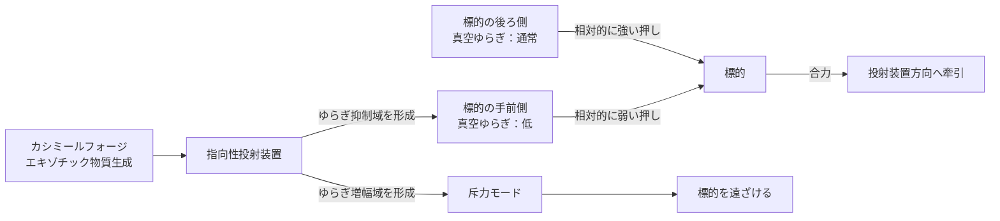

## 1. 概要 (Abstract)

SFに登場するトラクタービームは、反重力や謎のエネルギー場で物体を遠隔牽引する技術として描かれることが多い。しかし誘導重力（g149）という仮説が正しければ、まったく別の経路でトラクタービームを実現できる可能性がある——反重力も重力場操作も必要とせず、**真空の非対称だけを使って**。

> **命題：** 「誘導重力が正しければ、エキゾチック物質で真空ゆらぎの抑制域を指向性を持って投射し、物体の片側にカシミール効果を人工的に生成することで、反重力なしの牽引ビームが実現できるか？」

鍵になるのはカシミール効果（g009）だ。二枚の金属板が真空中で引き合うのは、板の間で一部の真空ゆらぎが抑制され、外側との圧力差が引力を生むからである。これはすでに実験室で確認されたミクロスケールの「トラクタービーム」だ。カシミールフォージ（wiim_023）でエキゾチック物質を量産できれば、この効果を距離を置いた標的に対して一方向から投射できる可能性がある。

---

## 2. 実現不可能性の根拠 (Infeasibility Rationale)

### 物理的限界

カシミール効果は距離の四乗に反比例して急激に減衰する。二枚の平行板が数ナノメートルの距離で生み出す力は測定可能だが、それを数メートル・数百メートルの距離に引き伸ばそうとすると、宇宙船を動かすために必要な力の何桁も下に落ちる。現在の物理では指向性を持たせることも難しく、平行板間の効果をビームとして「投射」する手段が存在しない。

### 技術的限界

この技術の前提として二つの壁がある。一つはエキゾチック物質の量産（wiim_023）であり、もう一つは真空ゆらぎの**指向性制御**だ。真空ゆらぎは等方的に存在するため、特定方向だけを選択的に抑制するには、その方向のゆらぎモードだけを遮断するジオメトリを空間に作り出す必要がある。これはカシミール効果を三次元的に成形する技術であり、現状では理論的な見通しもない。

### 論理的限界

誘導重力はまだ仮説段階の理論だ（g149）。「重力＝真空ゆらぎ×物質の相互作用」という描像が正しいとしても、その逆——「真空ゆらぎを外部から操作すれば任意の引力を作れる」——が成り立つかどうかは別問題だ。誘導重力の枠組みで真空ゆらぎの操作が重力と等価な力を生むことを示す理論的な橋渡しが必要になる。

---

## 3. 実験の設定 (Setup)

### 基本構成

- **投射装置：** エキゾチック物質を成形・投射できるカシミールフォージ派生装置
- **標的：** 宇宙船・小惑星・任意の物体
- **操作：** 標的の手前（投射装置側）に向けて「真空ゆらぎ抑制域」を形成する

### 牽引の原理

標的の手前側でゆらぎを抑制すると、標的は非対称な真空圧力を受ける：

| 方向 | 真空ゆらぎ | 標的への圧力 |
|------|-----------|------------|
| 手前側（投射装置側） | 抑制（低） | 小さい |
| 後ろ側 | 通常（高） | 大きい |

後ろ側からの「押し」が相対的に強くなり、標的は投射装置の方向へ引っ張られる。これは力を直接「引く」のではなく、**真空圧力の非対称によって生まれる合力**だ。

### 斥力への反転

ゆらぎを抑制する代わりに**増幅**した域を標的の手前に投射すれば、合力が逆転して斥力ビーム（リペルサービーム）になる。同一の装置で牽引と排除を切り替えられる。

---

## 4. 考察と予測 (Speculation)

### 誘導重力との等価性

誘導重力（g149）の描像では、重力は物質が周囲の真空ゆらぎを乱すことで生まれる。牽引ビームは装置が意図的に真空ゆらぎを非対称に歪めることで、**人工的な誘導重力を局所生成する**操作とも解釈できる。本物の重力と牽引ビームの引力は、同じ真空ゆらぎの非対称という起源を持つことになる。

これは「人工重力の生成」とも等価だ。宇宙船内部で床の方向にゆらぎ抑制域を形成すれば、反重力装置なしに居住性のある重力環境を作り出せる。

### グラビトーペイクとの対称性

グラビトーペイク（wiim_010）は重力波を遮断・散乱させる材料だ。牽引ビームはその逆——真空ゆらぎを意図的に非対称化して力を**生成**する。同じ「真空操作」の系譜にあるが、目的が防御から攻勢（牽引・排除）へ転じている。

### コスモシェルとの組み合わせ

コスモシェル（wiim_011）が真空中に閉鎖膜を作れるなら、その膜内部でゆらぎ環境を制御することができる。牽引ビームの「ゆらぎ抑制域」をコスモシェルで包んで形状を安定させれば、距離減衰の問題を部分的に補える可能性がある。

### 実用上の制約

牽引力の大きさはゆらぎ抑制の程度と抑制域の面積に比例すると考えられる。宇宙船サイズの標的を動かすには抑制域が巨大になるか、エキゾチック物質の投射密度が極めて高くなる必要がある。現行のカシミールフォージ技術の延長では、まず小惑星サイズの精密誘導から実用が始まると考えられる。

---

## 5. 図解 (Diagrams)

---

## 6. 関連記事 (Related)

- [wiim_023](wiim_023.md) — カシミールフォージ（エキゾチック物質の生成基盤・前提技術）
- [wiim_011](wiim_011.md) — コスモシェル（真空中の閉鎖膜・ゆらぎ制御との組み合わせ）
- [wiim_010](wiim_010.md) — グラビトーペイク（真空操作の防御的応用・対称概念）
- wiim_??? — 人工重力の生成——真空ゆらぎ制御による居住環境設計（未執筆）
