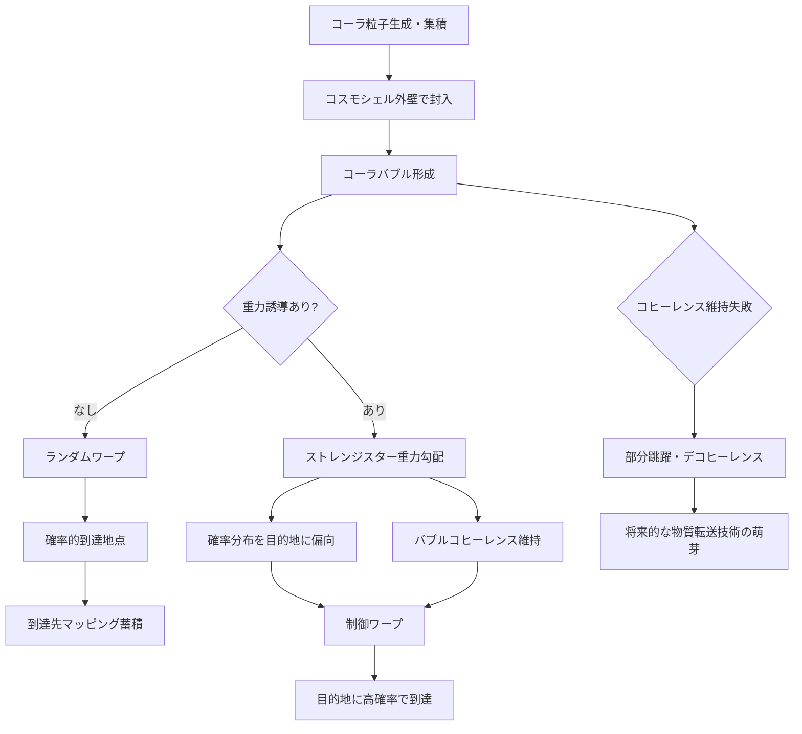

## 1. 概要 (Abstract)

コーラ粒子（wiim_013）は余剰次元を確率的に跳躍する仮説上の粒子だ。では、物体そのものをコーラ粒子化するのではなく、**高密度のコーラ粒子場で船全体を包み、場ごと跳躍させる**ことはできないか——これがコーラバブルワープの問いだ。

アルクビエレドライブが時空の計量ごと歪めることで船を動かすように、コーラバブルワープはコーラ粒子場ごと余剰次元を跳躍させる。船はバブルの内部で通常空間に静止したまま、場が移動の主体となる。

> **命題：** 「コスモシェルを外壁とするコーラ粒子バブルで船を包み、重力勾配による制御の有無によってランダムワープと制御ワープを使い分けられるか？」

この技術が実現するとすれば、ワープゲート（wiim_027）とは異なる第二の超光速移動手段が生まれる。ゲートがエキゾチック物質を大量消費する決定論的な移動であるのに対し、コーラバブルは確率的・インフラ依存型の移動となる。

---

## 2. 実現不可能性の根拠 (Infeasibility Rationale)

### 物理的限界

コーラ粒子は極めて低い確率でしか発生・維持できないと考えられる。それを船全体を覆うほどの高密度バブルとして巨視的スケールで維持するには、現在の物理では手段がない。コーラ粒子の生成・集積・形状制御を同時に実現する装置の設計は理論的な見通しすら立っていない。

### 技術的限界

最大の壁は**量子コヒーレンス**だ。コーラ粒子の跳躍は量子現象であり、バブル全体が一つの量子系として跳躍しなければ乗員ごと船が空間的に分解されるリスクがある。しかし巨視的な物体（宇宙船サイズ）で量子コヒーレンスを維持することは、現在の量子技術の延長では不可能だ。環境との相互作用が避けられないため、バブルはすぐにデコヒーレンスを起こす。

### 論理的限界

コーラ粒子自体がまだ仮説上の粒子であり（wiim_013）、その跳躍先を記述する余剰次元の存在も実験的に確認されていない。また、コスモシェル（wiim_011）で外壁を維持しながらコーラ粒子場を内部に充填できるかどうかも未知だ——コスモシェルとコーラ粒子場の界面が安定するかは別の問題として残る。

---

## 3. 実験の設定 (Setup)

### バブルの構成

```
[ コスモシェル外壁 ]
    外壁：形状・境界を固定する閉鎖膜
    内部：高密度コーラ粒子場（跳躍媒体）
    中心：船・乗員（通常空間のまま静止）
```

コスモシェルが果たす役割は二つある。一つはバブルの形状を維持することで、もう一つはコーラ粒子場が外部空間に漏出するのを防ぐことだ。

### ランダムワープ

外部からの重力誘導なしにバブルを跳躍させる。コーラ粒子の確率分布に従って到達先が決まるため、目的地の指定はできない。到達先の空間にすでに物質が存在した場合の対処も未解決だ。エキゾチック物質を必要としない可能性があるため、緊急脱出や探索的な長距離移動に使われると考えられる。

### 制御ワープ

ストレンジスターの重力勾配（wiim_029）を利用し、コーラ粒子の到達確率分布を目的地方向に偏らせる。重力勾配は方向誘導だけでなく**バブルのコヒーレンス維持**も担うと考えられる——強い重力ポテンシャルがバブルを「まとめる」アンカーとして機能するためだ。

### ワープゲートとの比較

| 項目 | ワープゲート wiim_027 | コーラバブルワープ |
|------|---------------------|-----------------|
| 移動原理 | 時空歪曲によるトンネル | 余剰次元の確率的跳躍 |
| 必要資源 | エキゾチック物質（大量） | コーラ粒子場・コスモシェル |
| 到達精度 | 決定論的 | 確率的（制御ワープで向上） |
| インフラ依存 | ゲート設備 | ストレンジスター網 |
| コスト構造 | 装置依存型 | ネットワーク依存型 |

---

## 4. 考察と予測 (Speculation)

### ランダムワープの用途と社会

到達先が確率的なワープは一見無価値に見えるが、実際にはいくつかの用途が考えられる。探索船が未踏領域に送り込まれる「宇宙くじ」的な探索手段、あるいは追跡から逃げるための緊急脱出手段だ。「どこかに跳んだが戻れない」というリスクを承知で使う状況は、航海時代の片道切符と同じ論理だ。

ランダムワープを繰り返して統計データを蓄積すれば、コーラ粒子の到達確率分布のマッピングが進む。これはコーラ粒子通信（g153）のチャネル設計にも応用できる。

### デコヒーレンスと「部分跳躍」

量子コヒーレンスが失われた状態でバブルが跳躍した場合、バブルの各部分が異なる座標に到達する「部分跳躍」が起きる可能性がある。これは船の分解を意味するが、別の角度から見れば**意図的な物質転送（テレポーテーション）の前駆技術**になりえる。制御されたデコヒーレンスで物質を任意の場所に分散させ、再構成するという発想だ。

### ストレンジスター網の戦略的価値

制御ワープが実用化された場合、ストレンジスター網の制覇が航路の覇権を意味する。ワープゲート網（技術ツリーT3A・T4A）とストレンジスター網は異なるインフラだが、どちらも「持つ者が移動を支配する」点で同型の地政学的問題を生む。

### アルクビエレドライブとの関係

アルクビエレドライブは時空の計量を直接操作する。コーラバブルは計量を変えず余剰次元を使う。両者が同時に実現した世界では、目的・資源・インフラに応じて使い分けが生まれる——大陸間移動に航空機と船舶が使い分けられるような形で。

---

## 5. 図解 (Diagrams)



---

## 6. 関連記事 (Related)

- [wiim_013](wiim_013.md) — コーラ粒子（空間超越粒子の基本仮説）
- [wiim_011](wiim_011.md) — コスモシェル（バブル外壁の前提技術）
- [wiim_027](wiim_027.md) — ストレンジスター・ワープゲート（比較対象・制御ワープのインフラ）
- [wiim_029](wiim_029.md) — コーラ粒子通信（ストレンジスター重力勾配の応用）
- wiim_??? — 制御デコヒーレンスによる物質転送（未執筆）
