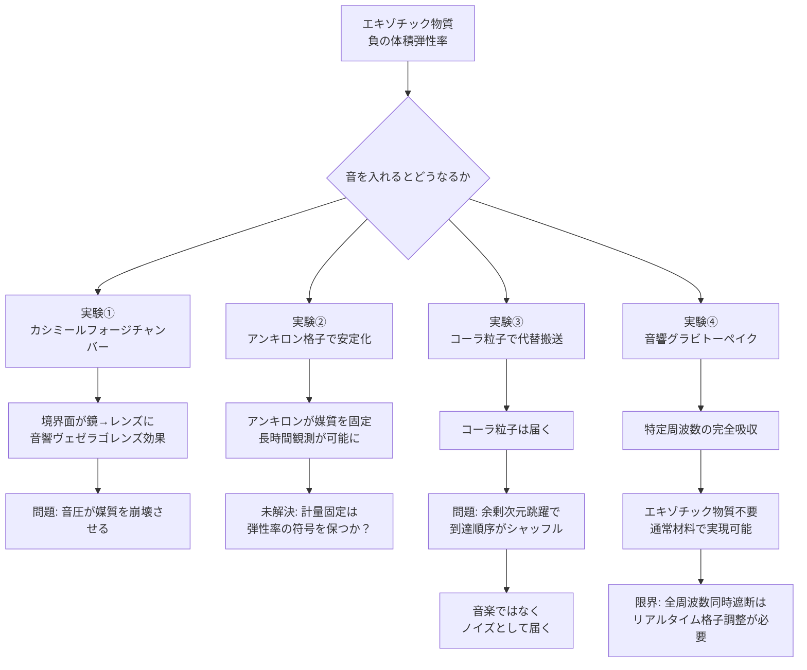

## 1. 概要 (Abstract)

音は媒質の圧力変動が伝わる波だ。空気中では分子が押し合い・引き合うことで圧縮と膨張の波が生まれ、耳へ届く。この「弾性」——圧縮への抵抗——が音を伝える根本だ。

ではエキゾチック物質はどうか。エキゾチック物質は負のエネルギー密度と負の圧力を持つ。通常の物質とは逆の弾性を持つとすれば、**体積弾性率が負になりうる**。負の弾性率を持つ媒質では、音波の振る舞いが根本から変わる——押すと収縮せず膨張し、引くと膨張せず収縮する。位相速度（波面の移動方向）とエネルギー速度（音の実体が進む方向）が逆を向き、境界面での屈折が「負」になる。

> **命題：** 「エキゾチック物質を音響媒質として利用し、負屈折・逆位相音波・真空音響搬送を実現できるか？」

この問いに答えるため、以下の4つの思考実験を順に検討する。いずれも既存のWIIM技術（カシミールフォージ・アンキロン・コーラ粒子・グラビトーペイク）を音響領域に転用しようとする試みだ。

---

## 2. 実現不可能性の根拠 (Infeasibility Rationale)

### 物理的限界

負の体積弾性率媒質は本質的に**不安定**だ。通常の媒質は圧縮されると反発し、元に戻ろうとする——これが安定の源だ。負の弾性率媒質は逆に、圧縮されるとさらに収縮しようとする。わずかな外乱が増幅されて制御不能になる。皮肉なことに、音波そのものが「わずかな外乱」であり、音を伝えようとする行為が媒質を崩壊させてしまう可能性がある。

### 技術的限界

カシミールフォージ（wiim_023）はエキゾチック物質の生成に成功しているが、それを**流体状態で安定維持**しながら音響実験するのは別次元の難しさだ。フォージの制御精度を現在の技術から何桁も向上させる必要がある上、エキゾチック物質の密度を均一に保ち続けるフィードバック制御系も必要になる。また実験中に音源や検出器を設置すること自体が媒質を乱すという根本的なジレンマがある。

### 論理的限界

コーラ粒子（wiim_013）を音響搬送子として使う試みには、より深い矛盾がある。コーラ粒子は余剰次元を確率的に跳躍する——「いつ届くか」が本質的にランダムだ。音は**時系列の圧力変動パターン**であり、タイミングが崩れれば音として成立しない。余剰次元跳躍の確率分布を制御して「音の波形」を再現しようとしても、位相情報が必然的に失われる。

---

## 3. 実験の設定 (Setup)

### 実験①——負屈折チャンバー（カシミールフォージ応用）

**設定：** カシミールフォージで生成したエキゾチック物質を密閉球形チャンバーに充填し、中央に点音源を置く。

**予測：** 通常媒質なら音は壁に達して反射し、球の中心に戻る。負の弾性率媒質では壁が「鏡」でなく「レンズ」として振る舞う——入射した音が反射するのではなく、壁を「通り抜けるように回り込み」、反対側の壁の外に点音源の完璧な像を結ぶ。これが**音響ヴェゼラゴレンズ効果**だ。

```
通常媒質チャンバー    負弾性率チャンバー
    ↗ 反射 ↖           音源の「像」
   ←音源→              ←音源→
    ↘      ↙                ↓（回り込み）
                         壁の外に結像
```

**問題：** 実験開始後、音圧が媒質崩壊のトリガーになる。フォージの出力を絞って極めて微弱なエキゾチック物質濃度を維持しながら実験するしかないが、その濃度では負屈折効果も微弱すぎて検出できない。

---

### 実験②——アンキロン格子による媒質安定化

**設定：** アンキロン（wiim_022）は時空計量に「錨」を打ち、空間を局所的に固定する粒子だ。これをエキゾチック物質の格子点に規則的に配置し、媒質が自己崩壊しないよう骨格を与える。

**予測：** アンキロン格子がエキゾチック物質の位置を固定することで、音圧による崩壊を防ぎながら音波を伝達できる。骨格があることで媒質は「弾性率が負の固体」に近い状態になり、実験①より長時間の観測が可能になると考えられる。

**未解決の問題：** アンキロンは計量そのものを固定するが、これは媒質の弾性率の**符号**も固定することを意味するのか否かが理論的に未決だ。計量を固定することでエキゾチック物質の「負の弾性」という性質が維持されるなら成功だが、逆に計量固定が負の弾性率を通常の正の値に引き戻すとすれば、アンキロン格子はむしろ「音響的に普通の固体」を作るだけになってしまう。

---

### 実験③——コーラ粒子音響搬送

**設定：** 真空中での音伝達を諦め、コーラ粒子（wiim_013）を「搬送子」として使う。音波の圧力波形を電気信号に変換し、その振幅パターンに合わせてコーラ粒子の放出タイミングを変調（パルス位置変調）する。受信側でコーラ粒子の到達間隔を計測し、元の音波形を復元する。

```
[音源] → 圧力波形 → 電気信号変換 → コーラ粒子変調放出
                                          ↓（真空・余剰次元跳躍）
[受信] ← 音響再生 ← 波形復元 ← コーラ粒子到達タイミング計測
```

**結果：** 粒子は届く。しかし音にならない。

コーラ粒子の余剰次元跳躍は確率的であり、放出順序と到達順序が保証されない。1番目に放出した粒子が3番目に届き、2番目が5番目に届くような順序の入れ替えが常に起きる。元の音波形は「シャッフルされた圧力サンプル列」に変わり、受信側では聞き取り不能なノイズとして再生されるだけだ。

音楽を送ると雑音が届く——これが実験③の結論だ。

---

### 実験④——音響グラビトーペイク

**設定：** グラビトーペイク（wiim_010）は重力波を散乱・遮断する物質だ。同じ発想を機械波（音波）に適用できないか。格子間隔が対象とする音波の波長と一致する構造体を作り、特定周波数の音を完全吸収する「音響グラビトーペイク」を設計する。

**評価：** これは実は既存の技術に近い。音響メタマテリアルの研究では、特定の格子構造が特定周波数の音を完全吸収することが実証されている。エキゾチック物質は**不要**であり、通常の材料工学の延長で実現可能だ。

**限界：** 特定周波数のみを遮断する構造は、周波数を変えられれば突破できる。全周波数を同時に遮断するには格子間隔をリアルタイムで変化させる必要があり、ワープ環境下や高速機動中の宇宙船では機械的追従が間に合わない。完全な「音響的不可視」は達成できない。

---

## 4. 考察と予測 (Speculation)

### 「音が届く」と「音として届く」の違い

実験③が示す最も根本的な教訓は、**搬送子が届くことと情報が届くことは別だ**という点だ。コーラ粒子は届く。しかし音楽は届かない。これはコーラ粒子通信（wiim_029）が「指向性を持った搬送」に限定されている理由とも繋がる——位相情報を保つには、粒子の到達順序が保証されなければならない。

### ワープバブル内部の音響環境

ワープバブル（wiim_027, wiim_032）の外殻がエキゾチック物質で構成されているとすると、バブル内部から外殻に向かって発した音は「回り込み」を起こし、乗員には奇妙な音響環境が生まれる可能性がある。反響が「壁から跳ね返る」のではなく「壁を通り抜けて反対側から回ってくる」ため、音源と反響の位置関係が完全に逆転する。船内で声を上げると、その声が「後方から」聞こえてくるような体験だ。

### 実験②の理論的意義

アンキロン格子が負の弾性率を維持できるか否かは、アンキロンの「何を固定しているのか」という根本的な問いに帰着する。計量を固定するということは、時空の伸縮を防ぐということだ。しかしエキゾチック物質の弾性率は時空構造から来るのか、それとも物質固有の性質から来るのか——この問いが解決されれば、実験②の可否だけでなく、エキゾチック物質全般の物性理解が大きく進む可能性がある。

---

## 5. 図解 (Diagrams)



---

## 6. 関連記事 (Related)

- [wiim_023](wiim_023.md) — カシミールフォージ（実験①の音響媒質生成源）
- [wiim_022](wiim_022.md) — アンキロン（実験②の媒質安定化候補）
- [wiim_013](wiim_013.md) — コーラ粒子（実験③の搬送子候補）
- [wiim_010](wiim_010.md) — グラビトーペイク（実験④の発想源）
- [wiim_031](wiim_031.md) — 真空非対称牽引ビーム（真空中での力の伝達・比較対象）
- [wiim_027](../physics/wiim_027.md) — ストレンジスターワープゲート（音響環境が変わるワープ構造）
- [wiim_032](wiim_032.md) — コーラバブルワープ（バブル内音響環境の考察先）
- wiim_??? — エキゾチック物質の物性——アンキロンと弾性率符号問題（未執筆）
