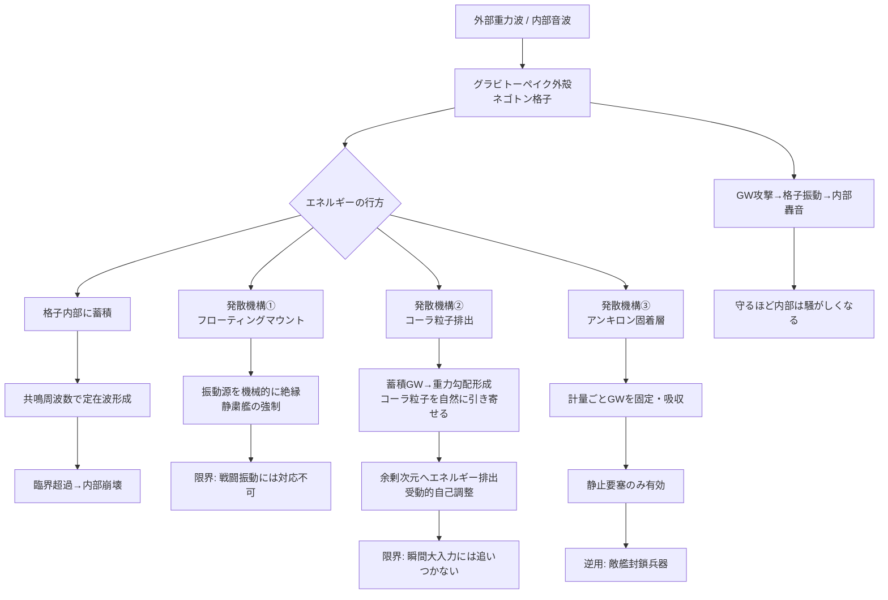

## 1. 概要 (Abstract)

グラビトーペイク（wiim_010）は重力波を遮断・散乱させる物質だ。しかしここに見落とされがちな問いがある——**遮断したエネルギーはどこへ行くのか。**

電磁波を鉛で遮蔽するとき、光子のエネルギーは鉛の原子を励起し、最終的に熱として放散される。エネルギーは消えない——形を変えて素材に吸収される。グラビトーペイクも同じ制約を受ける。ネゴトン格子が重力波を止めた瞬間、そのエネルギーは格子内部に蓄積し始める。

さらに厄介なのは、グラビトーペイク自体の内部からも重力波が生まれることだ。音波は質量の振動であり、振動する質量は微小重力波を放射する。通常なら即座に外部へ逃げるこの微小重力波も、グラビトーペイクの殻が閉じ込めてしまう。外からの敵と内からの自家発生——両方が同じ問題を引き起こす。

> **命題：** 「完璧な重力波遮断材は、自らが吸収したエネルギーによって内部から崩壊するのではないか？」

---

## 2. 実現不可能性の根拠 (Infeasibility Rationale)

### 物理的限界

エネルギー保存則は宇宙で最も頑強な法則のひとつだ。重力波を「止める」とは、波が運ぶエネルギーを素材が受け取ることを意味する。完璧な遮断が完璧であるほど、素材への蓄積も完璧になる。

ネゴトン格子が受け取ったGWエネルギーは、格子の共鳴周波数に対応する定在波を形成する。エネルギーが一定値を超えると共鳴が臨界に達し、格子は内部から崩壊する——最も頑丈な盾が、最も多くのエネルギーを受け取って最初に壊れるという逆説だ。

### 技術的限界

解決策として考えられるコーラ粒子（wiim_013）による余剰次元排出は、粒子の到達が確率的であるという根本的な不確かさを抱える。排出速度が蓄積速度を常に上回る保証はなく、瞬間的な大エネルギー入力（強力なGW攻撃）に対してコーラ粒子の排出が追いつかない状況が生じうる。安全弁の排出能力に上限がある以上、「完璧な防護」は原理的に成立しない。

### 論理的限界

最も根本的なトレードオフがここにある——**排出口は同時に侵入口だ。** GWエネルギーを余剰次元へ逃がす経路を設ければ、外部のGWも同じ経路から入ってくる可能性がある。完璧な遮断と安全な排出は、同じ穴を「出口専用」と「入口禁止」に同時に設定しようとする矛盾を内包している。

---

## 3. 実験の設定 (Setup)

### 音響共鳴による内部崩壊の観測

**ネゴトン格子は音響メタマテリアルでもある。**

ネゴトンは負の実質量を持つ（wiim_010）。質量が負の粒子が格子を構成する場合、体積弾性率が負になる可能性がある。体積弾性率が負の媒質は音響メタマテリアルとして振る舞い（wiim_034）、音波の位相速度とエネルギー速度が逆向きになる——格子は重力波の盾であると同時に、音響的に奇妙な媒質でもある。

グラビトーペイク製の密閉チャンバー内で音源を鳴らす実験を考える。

```
音源の振動
    ↓
チャンバー内に音波（正常に伝播）
    ↓
音波 = 質量の振動 → 微小重力波を放射
    ↓
グラビトーペイクが微小GWを内部に閉じ込める
    ↓
GWエネルギーが共鳴周波数で定在波を形成・蓄積
    ↓
臨界に達するとネゴトン格子が崩壊
```

「音を鳴らすことでグラビトーペイクが内部から壊れる」——これがグラビトーペイクの最初の音響的逆説だ。

また外部からのGW攻撃を受けた際、グラビトーペイクがGWを吸収する過程でネゴトン格子自体が振動する。この振動は通常の音として内部に伝わる。外からは静寂な攻撃が、内側の乗員には**轟音**として届く。装甲が守るほど、内部では激しい音響衝撃が走る。

---

### 発散機構①——フローティングマウント（パッシブ）

最もシンプルな解決策は、振動源をグラビトーペイク構造から機械的に切り離すことだ。

```
船体・エンジン・乗員区画
        ↕（フローティングマウント：振動を減衰）
グラビトーペイク外殻
```

振動がネゴトン格子に届く前に吸音材とマウントで減衰させれば、微小GWの発生量を抑えられる。潜水艦の消音設計と同じ発想だ——**グラビトーペイクを搭載した艦は、必然的に「静粛な艦」でなければならない。**

限界：エンジンの推進振動や武装の発砲衝撃は抑えきれない。戦闘中の艦が最も危険になるという皮肉がある。

---

### 発散機構②——コーラ粒子排出（移動艦向け）

より優雅な解決策が、コーラ粒子（wiim_013）による受動的自己調整だ。

内部に蓄積するGWエネルギーは局所的な重力勾配を形成する。wiim_029が示すように、コーラ粒子は重力勾配に引き寄せられ、余剰次元へ跳躍する性質を持つ。つまり——

> GWが蓄積するほど重力勾配が強まり、コーラ粒子がより多く引き寄せられ、余剰次元へより多くのエネルギーが排出される

蓄積量に応じて排出量が自動で増える**負のフィードバック機構**が受動的に成立する。能動的な制御装置は不要だ。

移動艦にも適合する。コーラ粒子は計量の固定を必要とせず、船が動いても機能を失わない。

限界：コーラ粒子の排出は確率的であり、瞬間的な大エネルギー入力（強力なGW兵器による一撃）に対しては排出が追いつかない場合がある。日常的な振動管理には有効だが、戦闘時の保証は不完全だ。

---

### 発散機構③——アンキロン固着層（静止要塞向け）

アンキロン（wiim_022）はGWの「揺れ」そのものを計量ごと固定することで、エネルギーの伝播を遮断する。

| 条件 | アンキロンの有効性 |
|------|-----------------|
| 銀河間深宇宙・完全静止 | 有効 |
| 重力圏内（惑星・恒星近傍） | 計量変動と競合し破綻 |
| ワープ航行中 | ワープは計量操作そのものであり根本的に矛盾 |
| 宇宙膨張域 | ハッブル膨張による計量変化に対応不能 |
| **移動艦** | **不適——船が動けば計量が変わる** |

アンキロンは移動体には使えない。恒久的な静止要塞、銀河間の深宇宙基地に限定された解だ。

**逆用——アンキロン封鎖兵器**

しかしこの「動けない」という性質は攻撃手段に転化できる。敵艦の周囲空間にアンキロンを散布して局所的に計量を固着させれば——

- ワープ不能（計量操作が封じられる）
- 機動不能（移動に必要な計量変化が起きない）
- 通常兵器で無力化できる状態に拘束

「計量の錨が移動の枷になる」。防御素材として設計されたアンキロンが、敵艦を静止させる補助兵器として機能する。

---

## 4. 考察と予測 (Speculation)

### 盾の強さと脆弱性の比例

グラビトーペイクが優秀であるほど——つまり遮断効率が高いほど——内部蓄積エネルギーも増大し、崩壊リスクも高まる。完璧な盾は最も早く壊れる。これはグラビトーペイク設計における根本的なトレードオフであり、実用的な装甲は「適度に透過させる」ことで内部蓄積を抑えるという逆説的な設計になると考えられる。

### 「静粛性」が戦力を決める宇宙戦

グラビトーペイク装甲艦において、エンジン・武装・乗員活動の振動がそのまま自己破壊リスクに繋がる。静粛に行動できる艦ほど長く戦える。これは宇宙戦の戦術設計に根本的な変化をもたらす——騒がしい艦は戦闘中に装甲が内側から崩れていく。

### コーラ粒子排気の検出可能性

コーラ粒子が余剰次元へ跳躍する際、わずかな重力勾配のシグネチャが外部に漏れる可能性がある。グラビトーペイク艦がコーラ粒子を「排気」している限り、その艦は完全なステルスを維持できない——重力波的には見えないが、コーラ粒子シグネチャで発見されるという新たな逆説だ。

### 仮説採用時の設計への展開

**以下は「発散機構②が定常運用下で有効に機能する」という仮説を採用した場合の議論であり、上述のパラドックスが解決されたわけではない。**

発散機構②——コーラ粒子による受動的エネルギー排出——が急激な入力のない定常状態では成立すると仮定するなら、同じ原理をより広い熱管理問題へ応用できる。

コーラ粒子格子が重力波エネルギーを余剰次元へ逃がす性質は、熱エネルギーに対しても同様に機能しうる。格子の共鳴閾値未満の入力が続く限り、格子は入力エネルギーを蓄積するのではなく余剰次元へ転嫁し続ける——これがテルモスタシス板（g194）の動作原理の物理的根拠となり、三層構造の宇宙船船体（wiim_044）の設計へとつながる。

ただしこの応用が成立するのは以下の条件下に限られる：

| 条件 | 備考 |
|------|------|
| 入力エネルギーが排出速度を超えない | 急激な大入力では本記事のパラドックスが再浮上する |
| 余剰次元バンクが飽和していない | wiim_039 の余剰次元容量問題と共通 |
| 排出口が侵入口に転化しない | §2 論理的限界の未解決問題が依然として残る |

wiim_044 はこの仮説採用を前提とした工学的検討であり、余剰次元転嫁が成立しない場合には設計の根拠が失われる。

---

## 5. 図解 (Diagrams)



---

## 6. 関連記事 (Related)

- [wiim_010](wiim_010.md) — グラビトーペイク（本記事の前提・ネゴトンの定義）
- [wiim_013](wiim_013.md) — コーラ粒子（発散機構②の主体）
- [wiim_022](wiim_022.md) — アンキロン（発散機構③・封鎖兵器の発想源）
- [wiim_029](wiim_029.md) — コーラ粒子の重力勾配誘導（排出機構の物理的根拠）
- [wiim_034](wiim_034.md) — 音響メタマテリアル実験（ネゴトン格子の音響的性質との接続）
- [wiim_009](wiim_009.md) — 重力波キャンセリング（能動的GW制御との比較）
- wiim_??? — アンキロン封鎖兵器の詳細戦術（未執筆）
