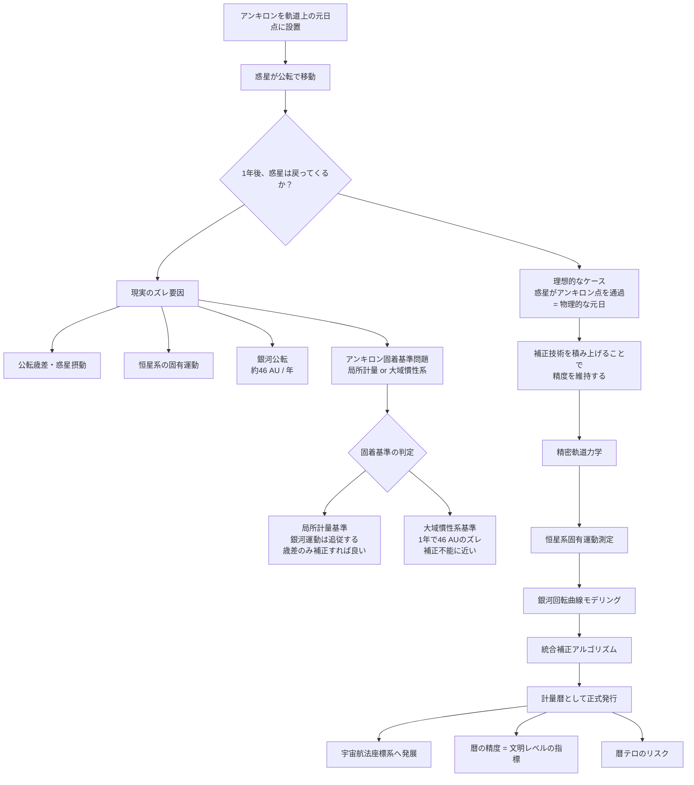

## 1. 概要 (Abstract)

現在の暦はひどく不正確だ。地球の公転周期は365日ぴったりではなく、4年に1度うるう年を挟み、さらにうるう秒で微調整を繰り返す。それでも誤差はゼロにならない——地球の自転は少しずつ遅くなり、公転軌道は他の惑星の引力で絶えず揺らいでいる。暦とは「ズレを飼いならす技術」であり、完璧な年の計測は原理的に難しい。

ではもし、空間の特定点を物理的に固定できる粒子が存在したら？

アンキロン（wiim_022）は時空計量に「錨」を打ち、局所的な空間を固定する思考実験上の粒子だ。惑星の公転軌道上にアンキロンを設置すると、惑星が1公転後に同一の時空点を通過する瞬間が「物理的な1年の終わり」として刻まれる。うるう秒も補正テーブルも不要な、計量そのものを標識にした暦だ。

> **命題：** 「アンキロンを軌道上に固定すれば、惑星の帰還が暦を刻む——しかしその標識は宇宙の動きに追従できるか？」

---

## 2. 実現不可能性の根拠 (Infeasibility Rationale)

### 物理的限界

根本的な問題はアンキロン自体が現在の物理学に存在しない思考実験上の粒子であることだ。時空計量テンソルに「固着」するという性質は一般相対論の枠内に収まらない——計量は物質・エネルギーの分布に従って動的に変化するものであり、局所的に固定するためには計量の変化に抗い続けるエネルギーを永続的に供給し続ける機構が必要になる。

さらに、アンキロンが計量を固定する「基準フレーム」の問題がある。宇宙には特権的な静止系が存在しない——あらゆる運動は相対的だ。アンキロンが「何に対して固定するか」が定まらなければ、そもそも「同じ場所」という概念が成立しない。

### 技術的限界

仮にアンキロンが存在したとしても、精密な暦として機能させるには段階的な補正技術が必要だ。

惑星はきれいな円軌道を描かない。近傍の惑星から受ける重力摂動、一般相対論による軌道の歳差（水星で最も顕著）、恒星の固有運動による参照フレームのズレ——これらを合算すると、アンキロン標識と惑星の「帰還点」は年々少しずつずれていく。数百年単位では無視できない差になる。

さらに根本的な困難が銀河運動だ。太陽系は銀河中心を約220 km/sで公転しており、1太陽年の間に約46 AU（冥王星軌道の外側まで届く距離）移動する。もしアンキロンが銀河の重力に引きずられず「宇宙背景放射基準」の絶対位置に固着するなら、1年後の惑星はアンキロンから46 AUも離れた場所を通過することになる——暦として機能しない。

### 論理的限界

最も根本的なアキレス腱は**固着基準の未定義**だ。

アンキロンが「局所計量」に固着するなら、それは太陽系の重力に引きずられ、銀河の公転にも追従する。この場合、銀河運動は問題にならず、歳差と固有運動だけを補正すれば良い。

しかしアンキロンが「より大域的な慣性系」に固着するなら、太陽系が動いても標識は宇宙空間の元の位置に残り続け、毎年46 AUずつ「見失われていく」。

どちらが正しいかは、アンキロンの物理的定義を完成させるまで決定できない。定義が曖昧なままでは補正計算の方程式を立てることすらできず、暦の精度を語る前提が崩れる。

---

## 3. 実験の設定 (Setup)

### 基本的な設置手順

```
①「元日」に惑星の現在位置にアンキロンを設置
        ↓
② 惑星が公転で離れていく（アンキロンは空間に固着したまま）
        ↓
③ 1太陽年後、惑星がアンキロン固着点に接近・通過
        ↓
④ 通過の瞬間 = 物理的な「1年の終わり」
        ↓
⑤ 翌年の元日点に新しいアンキロンを設置（旧標識は除去）
```

至点・分点を標識化するには4点を同時に管理する。惑星が最も恒星に近い点（近日点）、最も遠い点（遠日点）、軌道面が黄道と交わる2点にそれぞれ設置すれば、1太陽年を4等分した精密な季節標識になる。

### 補正技術の積み上げ

精密な暦として運用するには、技術を段階的に積み上げる必要がある。

| 技術段階 | 補正対象 | 精度への影響 |
|---------|---------|------------|
| 精密軌道力学 | 公転歳差・他惑星摂動・GR補正 | 数百年単位のズレを管理 |
| 恒星系固有運動測定 | 参照恒星の空間速度 | VLBI相当の観測が必要 |
| 銀河回転曲線モデリング | 銀河公転速度・ダークマター分布 | 長期的な座標系の漂流を補正 |
| アンキロン固着基準実測 | 複数標識の比較で固着フレームを観測的に決定 | 補正の方向性を決める根本測定 |
| 統合補正アルゴリズム | 上記すべての複合補正 | 「計量暦」として正式発行 |

### 惑星圏内規制との兼ね合い

アンキロンの惑星圏内設置は原則禁止されている（軌道上への放置が「軌道計量汚染」を引き起こすため）。暦・測位用途は連邦管理局の例外許可制で運用される。

除去手順も厄介だ——アンキロンは「巻き上げ」操作で段階的に惑星圏外まで移動させ、指定区域で反アンキロンとの対消滅（重力波バーストを伴う）によって除去しなければならない。設置より除去の方がコストと手間がかかるため、「暦の更新」は政治的・経済的な交渉事になる。

---

## 4. 考察と予測 (Speculation)

### 暦の精度が文明レベルの指標になる

補正技術の積み上げは天文学・素粒子物理学・銀河力学のすべてにわたる。アンキロン暦を高精度で維持できる文明は、必然的に銀河規模の物理モデルを保有していることになる。逆に言えば、**ある文明がどれだけ精密な暦を持っているかを見れば、その文明の技術水準がわかる**。

銀河間文明が接触したとき、まず行われる知識交換のひとつが「お互いの暦の精度比較」になるかもしれない。

### 宇宙航法座標系への発展

アンキロン標識を銀河規模で複数展開すれば、時間計測を超えた用途が生まれる。固定された時空点の網は、銀河全体の精密な三次元座標系になる。GPSが地球上の位置決定を可能にしたように、アンキロン座標網はワープ航法の目的地を「時空点の番地」で指定することを可能にする。

ただしこの座標系は、アンキロンの固着基準問題が解決されるまで「どの銀河規模の惑性フレームに固定されているか」が曖昧なままだ。座標系の絶対基準が定まらない「漂流する地図」になりかねない。

### 暦テロという新しい脅威

アンキロン標識は精密であるがゆえに、意図的な攪乱が深刻な被害をもたらす。標識を数センチメートルずらすだけで、その標識を参照しているすべての時刻同期システム・ワープ航法計算・契約の期日が一斉にずれる。物理インフラへの攻撃ではなく、**時空の計量標識への攻撃**という新しい形の破壊行為だ。

アンキロン標識の改ざんは重力波シグネチャが発生するため検知できるが、改ざんが発覚するまでのタイムラグの間に生じた「正式な暦のズレ」をどう扱うかは法的な難問になると考えられる。

### 「暦の費用負担」が政治問題になる

アンキロンは高価であり（1アンクあたり50〜300 MUM、経済ノート参照）、設置・除去には認定業者の作業とGWバーストの管理費用が重なる。複数の惑星系が共用する「連邦標準暦」の維持費用を誰が負担するかは、現実の条約交渉と同様に政治的な問題になる。

暦を管理する機関が事実上の権力を持つ構造——「今年の元日を決める者が、すべての契約期日・課税周期・選挙日程を支配する」——は、歴史上のカレンダー政治（ユリウス暦からグレゴリウス暦への移行が宗教権力の政治問題だったように）の宇宙版として再現される可能性がある。

---

## 5. 図解 (Diagrams)



---

## 6. 関連記事 (Related)

- [wiim_022](wiim_022.md) — アンキロン（本記事の前提・時空計量への固着）
- [wiim_035](wiim_035.md) — グラビトーペイクの逆説（アンキロン固着層の応用と限界）
- [../notes/wiim_022_tactical.md](../notes/wiim_022_tactical.md) — 惑星圏内規制・除去手順の詳細
- [../notes/economy_um_currency.md](../notes/economy_um_currency.md) — アンキロン単価・ライセンス制度
- wiim_??? — 計量測量学（アンキロン座標系の銀河規模展開）
- wiim_??? — 軌道計量汚染条約（惑星圏内規制の法的枠組み）
