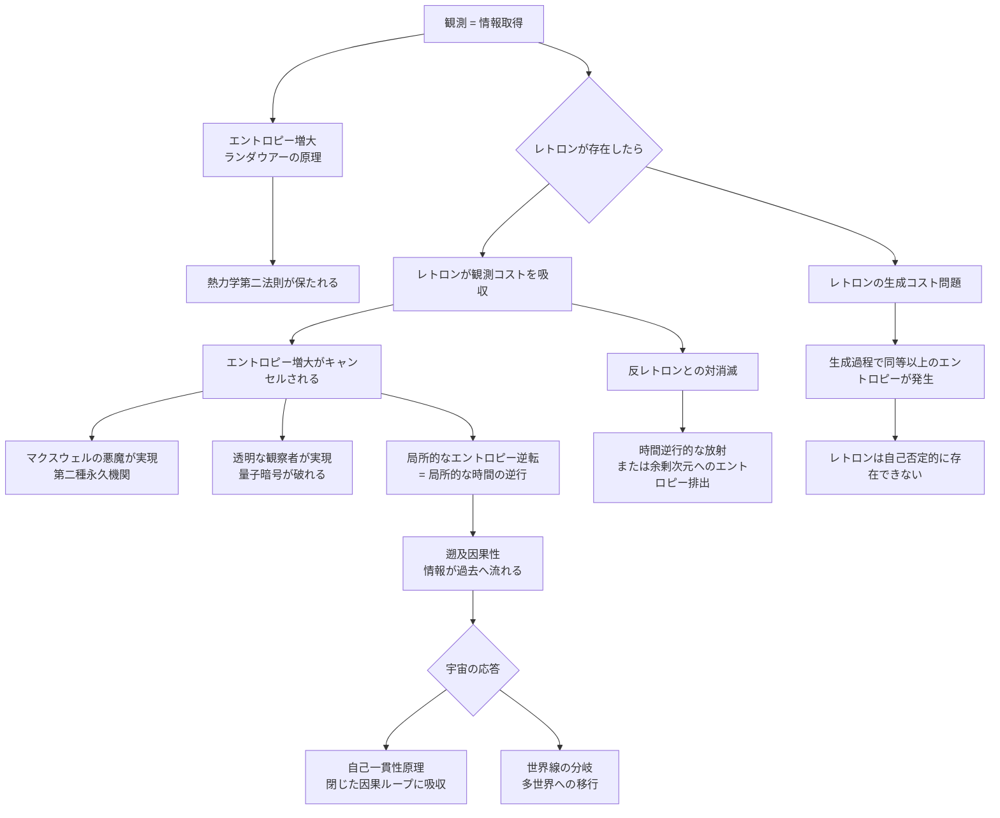

## 1. 概要 (Abstract)

観測はなぜ系を乱すのか。

量子力学の教科書的な答えは「光子を当てるから」だが、これは表面的な説明に過ぎない。より深い理由は**情報とエントロピーの等価性**にある。何かを「知る」ということは、宇宙のどこかのエントロピーを増大させることと不可分だ——ランダウアーの原理が示すように、1ビットの情報を消去するだけで最低限の熱が発生する。観測が系を乱すのは光子のせいではなく、情報を得ること自体がエントロピーを生み出すからだ。

では、負のエントロピーを持つ粒子が存在したとしたら？

**レトロン**は遡及因果性（retrocausality）から名を取った思考実験上の粒子だ。高エントロピーの領域に引き寄せられ、接触した系のエントロピーを吸収して局所的な秩序をもたらす。マクスウェルの悪魔が「観測のコスト」を払えず夢に終わったなら、レトロンはそのコストを肩代わりする存在として設計されている。

> **命題：** 「負のエントロピーを担う粒子が存在すれば、熱力学第二法則は破れ、因果律は逆行する——しかしその粒子はどこから来るのか？」

---

## 2. 実現不可能性の根拠 (Infeasibility Rationale)

### 物理的限界

熱力学第二法則——孤立系のエントロピーは自然に減少しない——は宇宙で最も頑強な法則のひとつだ。クラウジウスの不等式はこれを数学的に表現し、無数の実験がこれを支持してきた。

レトロンが存在するためには、その負のエントロピーの「源」が必要だ。しかし宇宙全体を見渡しても、エントロピーは一方的に増大し続けている——ビッグバン以来、宇宙のエントロピーは増大の一途をたどっており、負のエントロピーを供給できるリザーバーは存在しない。仮にレトロンがある場所のエントロピーを減らしても、それは必ず別の場所でより大きなエントロピーの増大を伴う。局所的な秩序化は代償を必ず要求する。

「系全体」の視点で見ると、さらに問題がある。レトロンがエントロピーを吸収して消滅するとき、そのレトロン自体が消えることで「負エントロピーの担い手」が失われる——これは系のエントロピーが吸収分だけ戻ることを意味するのか、それとも消滅によってエントロピーが別の形で放出されるのか。正味の収支がゼロにならない可能性が残り、この点は本記事では未考察のままだ。レトロンを「消耗品」として扱うM2の整理（wiim_045参照）は射程の有限性を説明するが、系全体のエントロピー収支の問いへの答えとはなっていない。

### 技術的限界

レトロンを「生成」しようとすると、自己矛盾に陥る。

負のエントロピーを持つ粒子を作り出す過程は、それ自体が物理的な操作だ。物理的な操作はエントロピーを生み出す。レトロン1個を生成するためには、生成過程で少なくとも同等以上のエントロピーが発生しなければならない——レトロンが吸収できる負エントロピーより生成コストの方が必ず大きい。これはレトロン生成が**自己否定的**であることを意味する。

マクスウェルの悪魔が「記憶消去コスト」によって打ち消されたように、レトロンは「生成コスト」によって打ち消される。安全弁がどこかに必ず存在する。

### 論理的限界

最も根本的な問題は**時間の矢**との衝突だ。

エントロピーが増大するから「過去から未来へ」という時間の方向が生まれる。レトロンが局所的にエントロピーを逆転させるとき、それはその領域において時間が逆行することを意味する。情報は「過去」に向かって流れ始める——これが遡及因果性（retrocausality）だ。

未来の情報が過去に届くとき、因果パラドックスが生じる。「レトロンを使って過去に情報を送り、レトロン自体の生成を妨害する」という自己矛盾的な状況が論理的に構成できてしまう。レトロンは存在するだけで因果律の構造を解体する。

---

## 3. 実験の設定 (Setup)

### レトロンとマクスウェルの悪魔

マクスウェルの悪魔は1867年に提案された古典的な思考実験だ。気体分子を観測して「速い分子」と「遅い分子」に仕分けする悪魔は、熱平衡から仕事を取り出す——しかし悪魔の観測記録を消去するコストが仕事量を上回るため、第二法則は保たれる。

レトロンがいれば様相が変わる。

```
悪魔が分子を観測（エントロピー増大）
        ↓
レトロンが観測コストを吸収（エントロピーを -S だけ減らす）
        ↓
記憶消去が不要になる
        ↓
熱平衡から純粋に仕事を取り出し続ける
        ↓
第二種永久機関の完成
```

悪魔が操作するチャンバーの温度差は永続し、エンジンは永遠に動き続ける。ただしレトロンの供給が続く限り、という条件つきだ。

### レトロンと量子観測——透明な観察者の実現

量子測定は系を乱す。その本質的な理由はエントロピーの増大だ。レトロンが観測のエントロピーコストを吸収すれば、測定後も量子系の状態が乱れない——**透明な観察者**が物理的に実現する。

| 通常の観測 | レトロンありの観測 |
|-----------|----------------|
| 測定→波動関数崩壊→重ね合わせ消失 | 測定→レトロンがコスト吸収→重ね合わせ保存 |
| 量子ゼノン効果：頻繁な観測で状態が凍りつく | 量子ゼノン効果が消える |
| 量子暗号：盗聴すれば痕跡が残る | 量子暗号：盗聴が検知不能になる |

量子暗号の安全性はまさに「観測がエントロピーを生む」ことに依存している。レトロンはこの安全保証を根底から崩す。

### レトロンの対消滅と「時間逆行的な放射」

レトロンが吸収した負エントロピーはどこへ行くのか。最も自然な帰結は**反レトロンとの対消滅**だ。

> レトロン ＋ 反レトロン → 対消滅 → エントロピー中性の放射

対消滅の際に放出されるエネルギーは、通常の粒子対消滅とは性質が異なる可能性がある。エントロピーが「ゼロに戻る」過程は時間的に対称な放射として観測されるかもしれない——因果的な前後関係が曖昧な波として。

あるいはコーラ粒子（wiim_013）が余剰次元にエネルギーを持ち出すように、レトロンは余剰次元からエントロピーを「借りてくる」構造も考えられる。その場合、余剰次元側のエントロピーが増大し続けるという別の問題が生じる。

---

## 4. 考察と予測 (Speculation)

### ネゴトンとの対称性——負の物理量の系譜

WIIMの世界観には「負の物理量を持つ粒子」という系譜がある。

| 粒子 | 負の物理量 | 逆転する物理法則 |
|------|-----------|----------------|
| ネゴトン（wiim_010） | 負の質量 | 重力が逆転 |
| **レトロン** | **負のエントロピー** | **熱力学が逆転** |

ネゴトンがグラビトーペイクの構成素材として実用化されたように、レトロンも工学的に利用されうる——しかしレトロンの工学的応用は「時間の逆行」という副作用を伴う点で、ネゴトンより根本的に危険だ。ネゴトンは重力を逆転させるが時間軸は変えない。レトロンは時間軸そのものを揺るがす。

### 「レトロン経済」——負エントロピーの通貨化

もしレトロンが安定的に生成・保存できるなら、それは最も希少で最も価値の高い「商品」になる。熱力学第二法則を局所的に回避できる量が通貨になる——エントロピーの支払いを肩代わりする能力の市場だ。

しかし先述の通り、レトロンの生成コストは必ず吸収能力を上回る。レトロンは「採掘すればするほど損をする資源」であり、その市場は原理的に成立しない。レトロン経済は自己崩壊する。

### 因果律の修復——宇宙の自己一貫性

レトロンによる遡及因果が実現したとき、宇宙は因果パラドックスにどう対処するか。

ひとつの可能性は**宇宙の自己一貫性原理**だ。過去に情報が届いても、それは「すでにそうだったこと」として歴史に吸収される——タイムトラベルが過去を変えられないのと同じ論理で、レトロンが生み出す遡及因果も「閉じた因果ループ」として宇宙の一貫性を保つ。

もうひとつの可能性は**世界線の分岐**だ。レトロンが過去に情報を送るたびに宇宙が分岐し、「レトロンが存在する宇宙」は常に複数の歴史が共存する多世界へと移行する。

いずれの場合も、レトロンが一個でも存在した瞬間に宇宙の因果構造は取り返しのつかない変容を遂げると考えられる。

---

## 5. 図解 (Diagrams)



---

## 6. 関連記事 (Related)

- [wiim_010](wiim_010.md) — ネゴトン（負の質量粒子・レトロンとの対称性）
- [wiim_013](wiim_013.md) — コーラ粒子（余剰次元への排出機構との接続）
- [wiim_029](wiim_029.md) — コーラ粒子の重力勾配誘導（レトロンのエントロピー勾配誘導との類似）
- [wiim_035](wiim_035.md) — グラビトーペイクの逆説（エネルギー保存と発散機構の比較）
- wiim_??? — マクスウェルの悪魔と情報熱力学（本記事の前提となる思考実験の詳細）
- wiim_??? — 時間の矢と熱力学（エントロピーが時間方向を定義する根拠）
- [wiim_005](../cosmology/wiim_005.md) — 時間遡行粒子（CPT対称性破れによるマクロな時間逆行との対比）
- [wiim_015](wiim_015.md) — エントロピーが減少する宇宙（宇宙規模の時間反転との対比）

> **世界設定の独立性について**: wiim_005・wiim_015・本記事（wiim_037）はいずれも時間の逆行・遡及に関わるが、それぞれ独立した思考実験世界を想定している。同一世界にこれらが共存するケース——たとえばエントロピー減少宇宙にレトロンが発生し時間遡行粒子も存在するとき何が起きるか——は未論考であり、複合設定は別途の検討が必要だ。
