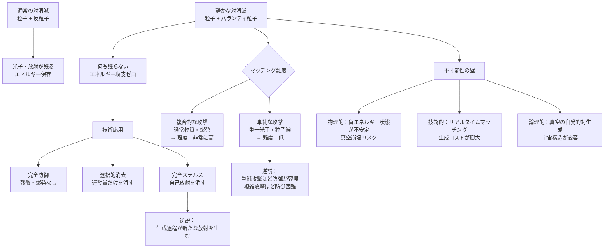

## 1. 概要 (Abstract)

通常の対消滅は静かではない。電子と陽電子が出会えば2本のガンマ線が走り、陽子と反陽子が出会えば高エネルギーの粒子群が四方に散る。エネルギーは消えない——形を変えて宇宙に残り続ける。

パランティ粒子（g161）は異なる。通常粒子が正のエネルギーを持つのに対し、パランティ粒子は負のエネルギーを持つ。両者が出会えばエネルギー収支は文字通りゼロになり、光子も残骸も衝撃波も出ない。**何も残らない。**

この「静かな対消滅」が技術として制御できるなら、あらゆる物理的な攻撃を痕跡なく無効化できる。飛来するミサイルを爆発させずに消す。照射されたエネルギービームを反射も吸収もせずに消す。迫る重力波を散乱させることなく消す。盾ではなく「消去」による防御だ。

> **命題：** 「パランティ粒子で攻撃を打ち消せるなら完全防御が実現する——しかし消去するためには消去対象と完全に対応するパランティ粒子が必要であり、その生成コストは消去できる攻撃の複雑さに比例して膨大になる。」

---

## 2. 実現不可能性の根拠 (Infeasibility Rationale)

### 物理的限界

静かな対消滅の前提は**安定した負エネルギー状態**の存在だ。現代の量子場理論ではこれが成立しない。

CPT定理は反粒子が正のエネルギーを持つことを要求する——陽電子は電子と同じ質量（同じ正のエネルギー）を持ち、だからこそ対消滅は光子を放出する。負のエネルギーを持つ粒子を仮定すると、量子真空のエネルギーが無限に低い状態に向かって「落ち」続ける——真空そのものが不安定化し、宇宙は瞬時に崩壊する。

ディラックはかつて反粒子を「負エネルギーの海に開いた穴」として解釈したが、現代QFTはこの描像を正のエネルギーで時間を逆行する粒子として再解釈した。負エネルギーの安定粒子は、物理学がその存在を認めない理由そのものに支えられている。

### 技術的限界

仮にパランティ粒子が生成できたとしても、**マッチング問題**が立ちはだかる。

静かな対消滅が成立するには、消去対象と完全に対応するパランティ粒子が必要だ。エネルギー・運動量・スピン・内部量子数のすべてが鏡像関係でなければならない。単純な粒子一個を消すだけでも精密な対応が要求される上に、現実の攻撃対象は無数の粒子で構成されている。

カシミールフォージ（wiim_023）でエキゾチック物質を生成するような設備をリアルタイムで稼働させ、攻撃の詳細を瞬時に分析し、対応するパランティ粒子を生成・照射する——この一連の処理を攻撃が到達するより前に完了させることは、現在どころか理論上も極めて困難だ。

### 論理的限界

最も根本的な問題は**真空の安定性**だ。

パランティ粒子が存在できる物理法則では、量子真空も「通常粒子とパランティ粒子の対」を自発的に生成する。通常の仮想粒子対はエネルギーを借りて即座に消えるが、パランティ粒子対はエネルギー収支ゼロで生成できるため消える理由がない——真空は対生成を無限に繰り返し、あらゆる空間がパランティ粒子で満ちて宇宙の構造が根本から変容する。

静かな対消滅を可能にする物理法則は、その法則が適用される宇宙を即座に別の何かに変えてしまう。

---

## 3. 実験の設定 (Setup)

### マッチング難度——攻撃の複雑さと無効化コストの関係

攻撃が単純なほど対応するパランティ粒子の生成が容易で、複雑なほど困難になる。これは通常の盾とは逆の性質だ——通常の盾は複雑・大規模な攻撃ほど突破されやすいが、静かな対消滅では単純な攻撃の方が「簡単に消せる」。

| 攻撃の種類 | マッチング難度 | 備考 |
|-----------|-------------|------|
| 単一光子ビーム | 低 | エネルギーと偏光が一致するパラ光子1個 |
| 粒子線（陽子ビームなど） | 中 | 運動量分布に対応したパランティ粒子束 |
| 重力波 | 高 | 計量の振動をパラ版で打ち消す——アンキロン（wiim_022）との併用が考えられる |
| 通常物質（ミサイル・艦船） | 非常に高 | 数10²⁷個以上の粒子すべてに対応するパラ版が必要 |
| 熱・乱流・爆発 | 極めて高 | 高エントロピー状態は状態の特定自体が困難 |

**逆説：** 最も破壊力の高い攻撃（大質量・高エントロピー）が最も無効化コストが高い。一方で精密に制御された単純な攻撃（レーザー、粒子線）の方が理論上は無効化しやすい。

### 選択的消去——「止める」ではなく「消す」

静かな対消滅は完全消去だけでなく、**部分的な消去**にも応用できる可能性がある。

飛来するミサイルの運動エネルギー成分だけに対応するパランティ粒子を当てれば、爆発することなくミサイルを静止させられる。物質そのものは残り、運動量だけが消える。通常の「盾で受け止める」とは根本的に異なる——衝撃も反作用もない停止だ。

ただしこの「選択的消去」は、消去したい物理量を量子数レベルで分離して対応するパランティ粒子を生成することを要求する。技術的難度は完全消去より高い。

### ステルス応用——自己放射の消去

防御だけでなく、**自分自身の放射を消す**ステルス応用も考えられる。

艦船のエンジンは熱と電磁波を放射し、ワープドライブは重力波を発生させ、レーダーに反射する。これらの放射にリアルタイムで対応するパランティ粒子を照射し続ければ、観測可能なシグネチャがすべて消える。グラビトーペイク（wiim_010）が重力波を遮断・散乱させるのに対し、静かな対消滅は重力波を「存在しなかったこと」にする。

ただしステルスのためにパランティ粒子を生成する過程自体がエネルギーを消費し、新たな放射を生む。消しながら生むという循環が完全ステルスを阻む。

---

## 4. 考察と予測 (Speculation)

### 攻防の非対称——「盾」より「消去」の方が難しい

静かな対消滅が技術化された世界では、防御コストが攻撃コストを大きく上回る可能性がある。

通常の武器は「作って撃てば終わり」だが、静かな対消滅による防御は「撃たれた瞬間に対応するパランティ粒子をリアルタイムで生成し照射する」必要がある。攻撃側は単純な系（高速・高密度の粒子線）を使えばマッチングを困難にできる一方、防御側は複雑な生成装置を常時稼働させなければならない。

**攻撃が単純なほど防御困難、攻撃が複雑なほど防御可能**という奇妙な逆転が生じる。

### 情報の消滅——量子情報保存の問題

通常の対消滅では、粒子が持っていた量子状態の情報は光子などに「変換」されて保存される——量子情報保存則の要請だ。静かな対消滅では情報ごと消える。これはブラックホール情報パラドックスと同種の問題を引き起こす。

消えた粒子が持っていた量子情報はどこへ行くのか。余剰次元に流れるのか、それとも情報そのものが「存在しなかったこと」になるのか——後者なら因果律の根幹を揺るがす。

### ネゴトンとの複合——二重パランティ粒子

ネゴトン（wiim_010）は負の質量を持つ。ネゴトンに対応するパランティネゴトンは負の質量かつ負のエネルギーを持つ「二重否定」の粒子だ。通常の正質量・正エネルギーの粒子とパランティネゴトンが対消滅すれば：

```
通常粒子（+m, +E）+ パランティネゴトン（-m, -E）→ 静かな消滅
```

ただしネゴトンとパランティネゴトンの間にも通常の対消滅（ネゴトン+反ネゴトン）が起きうるため、物質・反物質・パランティ物質・パランティ反物質の四種が混在する環境は制御が極めて複雑になると考えられる。

---

## 5. 図解 (Diagrams)



---

## 6. 関連記事 (Related)

- [wiim_037](wiim_037.md) — レトロン（負エントロピー粒子・パランティ粒子の具体例）
- [wiim_010](wiim_010.md) — ネゴトン（負の質量・パランティネゴトンの前提）
- [wiim_023](wiim_023.md) — カシミールフォージ（パランティ粒子生成の候補手段）
- [wiim_022](wiim_022.md) — アンキロン（重力波無効化との併用可能性）
- [wiim_035](wiim_035.md) — グラビトーペイクの逆説（静かな対消滅との防御技術比較）
- wiim_??? — 真空崩壊（静かな対消滅が誘発する宇宙論的リスク）
- wiim_??? — 量子情報消滅（静かな対消滅と情報保存則の衝突）
