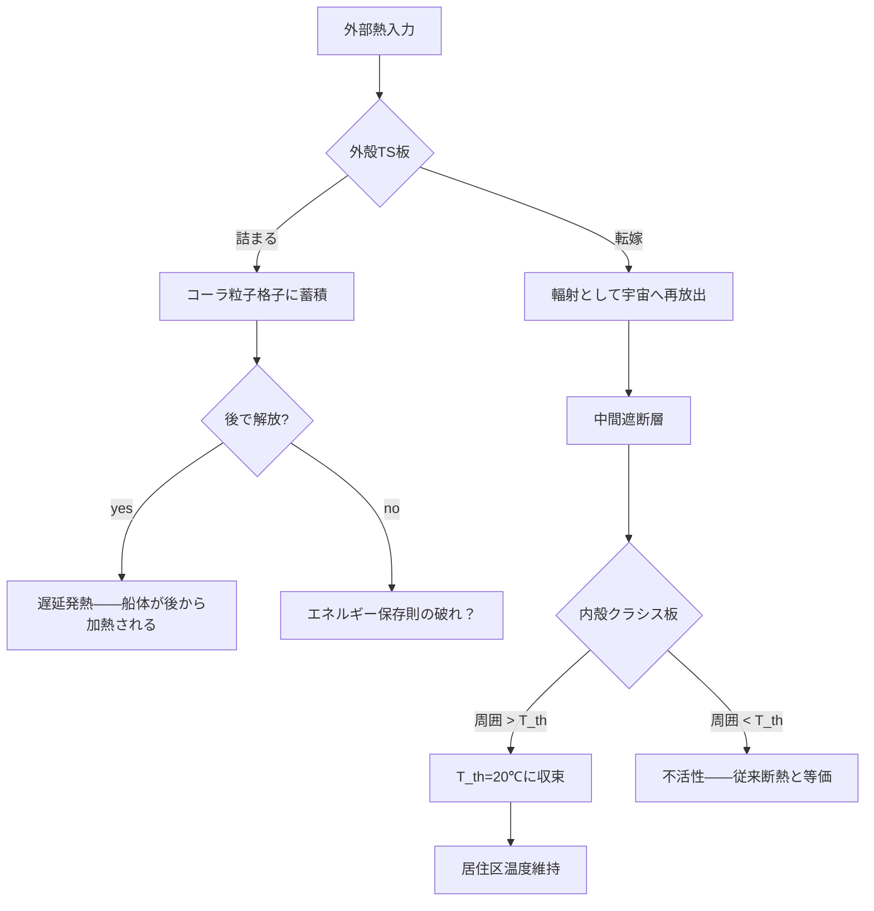

## 概要

宇宙空間は熱管理の観点からは極めて過酷な環境だ。太陽に面した船体は120℃を超え、影側は−160℃まで落ちる。大気圏再突入では衝撃波が船体表面を数千℃に加熱する。従来の宇宙船はこれらを断熱材・ヒーター・ラジエーター・アブレーターという四種の異なる技術で個別に対処してきた。

コーラ粒子（wiim_013）の格子素材であるテルモスタシス板（TS板）とテルモクラシス板を組み合わせた多層船体——**テルモスタシス船体**——は、これら四種の機能を単一の素材体系で代替できる可能性がある。

しかし、エネルギー保存則という根本的な壁が立ちはだかる。「温度変化を拒絶する」とは「エネルギーをどこかへ逃がす」ことと等価であり、真空中ではその逃がし先が極端に制限される。

---

## 実現不可能性の根拠

### 物理的限界——転嫁先のない真空

TS板は外部からの熱入力を「転嫁」する——吸収せず、反射・散乱によって入射元や周囲へ押し返す。地上や大気中であれば転嫁先は無数にある。しかし宇宙空間という真空では転嫁の受け手が極端に限られる。

転嫁できる経路は実質的に輻射のみだ。輻射で再放出するならば、船体は入射エネルギーを一旦受け取ってから放出するのと物理的に等価になる——つまりTS板が「吸収した後で再放射する」通常の熱放射と区別がつかなくなる。これはキルヒホッフの法則（g193）に戻ってしまう。

TS板が本質的にキルヒホッフの法則を破る物質だとすれば、吸収もせず放射もしない——エネルギーが界面で文字通り「詰まる」ことになる。このエネルギーがどこへ行くかはコーラ粒子の物理に依存しており、現時点では未解明だ。

コーラ粒子が余剰次元に内在的な足場を持つ（wiim_013）という定義から、「詰まったエネルギーが余剰次元へ転嫁される」という解釈が浮かぶ。しかしこれは「熱管理」ではなく**エネルギーの行方不明化**に等しい。宇宙全体のエネルギー保存則は余剰次元を含めた系全体で成立するはずであり、余剰次元へ流れ込んだエネルギーはその次元のエネルギー収支を変える——あるいは余剰次元が「無限に受け取れるゴミ捨て場」だとすれば、それ自体が新たな物理的問題を生む。余剰次元の安定性についてはグラビトーペイクのパラドックス（wiim_035）が未解決であり、余剰次元転嫁が安全に成立する条件は現時点で保証されていない。

### 技術的限界——格子制御と閾値設計

テルモクラシス板の効果発現条件は、コーラ粒子格子の固有振動数と隣接物質の振動数が共鳴帯域に入ることだ。この閾値温度 T_th は格子間隔によって決まるとされるが、原子スケールの精度で間隔を制御しながら船体面積分の素材を製造することは、コーラ粒子の生成技術（wiim_039参照）が成熟していない現段階では不可能に近い。

また、T_th の精度がわずかにずれると「居住温度域を維持するはずの内殻クラシス板が機器を損傷する温度に収束させる」事態が起きる。マージンの狭い設計が要求される。

### 論理的限界——多層構造の相互干渉

外殻TS板が転嫁した熱輻射の一部は、船体を回り込んで中間層や内殻クラシス板に再入射する。内殻クラシス板は「周囲温度が T_th を超えているとき」に活性化するので、TS板が集中させた高温輻射がクラシス板をその温度に向けて収束させようとする。

外殻が転嫁しようとし、内殻が別の温度に引き込もうとする——二つの素材が互いの効果を打ち消し合う可能性がある。多層配置が単純に機能を足し合わせてくれる保証はない。

---

## 実験の設定

宇宙船の船体を以下の三層構造で構成する。

| 層 | 素材 | 役割 |
|----|------|------|
| 外殻 | テルモスタシス板（TS板） | 外部熱入力を拒絶・転嫁 |
| 中間層 | 熱遮断型コーラ粒子素材 | 外殻と内殻を熱的に切り離す |
| 内殻 | テルモクラシス板（T_th=20℃） | 居住区画を一定温度に均一化 |

三つの環境で船体の振る舞いを検討する。

**環境A：太陽近傍（直射100kW/m²相当）**
外殻TS板が太陽輻射を転嫁。転嫁先は宇宙空間側の輻射として再放出されるか、詰まるかの二択となる。

**環境B：深宇宙（背景放射2.7K）**
周囲温度が T_th=20℃を大きく下回るため、内殻クラシス板の活性化条件が満たされない。外殻TS板が内部の発熱（機器・乗員）を閉じ込める役割に転じる。

**環境C：大気圏再突入（衝撃波加熱・数千℃）**
衝撃波による運動エネルギーの熱変換は膨大だ。TS板がこれを全転嫁しようとすれば、船体前方に超高温の「熱の壁」が形成される可能性がある。

---

## 考察と予測

### 環境A：局所的な熱集中問題

TS板が転嫁した輻射は、船体周囲の宇宙空間に高密度の光子場を作る。船外作業の宇宙飛行士や隣接する別の船体がその輻射を受ける可能性がある。「自分の船体を守る」ことが「周囲を危険にする」ことと等価になる。

### 環境B：受動的断熱の成立

深宇宙ではTS板が断熱材として機能し、内部熱を閉じ込める。クラシス板が不活性のため、居住区温度は乗員・機器の発熱量とTS板の断熱効率の釣り合いで決まる——従来型の断熱設計と本質的に変わらない。テルモスタシス系の特性が生きるのは能動的な熱入力がある場面に限られる。

### 環境C：「詰まった熱」の行き先が最大の問題

再突入時に転嫁されたエネルギーが詰まる場合、コーラ粒子格子がそのエネルギーを吸収するかどうかが分岐点だ。コーラ粒子は波動関数に従わないため、エネルギーが量子的な別の形——未観測のコーラ粒子励起状態——に変換される可能性がある。この励起エネルギーが後で解放されるとすれば、再突入後に船体が突然発熱するという逆説的な帰結が生まれる。

### クラシス板の逆効果

大気圏突入時に外殻が転嫁した熱が船体後部に回り込み、内殻クラシス板を活性化させると、クラシス板は「外部の高温環境に居住区を均一化しようとする」動作を開始する可能性がある。テルモクラシス板の活性化は「周囲が T_th より高いとき」であり、転嫁された高温輻射がまさにその条件を作り出す。設計の工夫で切り離せるかどうかが技術的な核心となる。

---

## 関連記事

- [wiim_013](physics/wiim_013.md) コーラ粒子の基本定義
- [wiim_039](quantum/wiim_039.md) コーラ粒子の量子的特性と波動関数への非従属
- [wiim_035](physics/wiim_035.md) グラビトーペイクの逆説——本記事の余剰次元転嫁設計は wiim_035 §4「仮説採用時の設計への展開」を前提とする。wiim_035 のパラドックスが未解決である限り、本設計の根拠は仮説的なものにとどまる
- [wiim_022](physics/wiim_022.md) アンキロン——場による物理量の固着という同型論理
- [wiim_043](biology/wiim_043.md) 宇宙ゴケ——コスモシェルと生体素材の組み合わせとの比較
- [wiim_045](wiim_045.md) — 恒温の二つの原理——コーラ粒子による拒絶型とレトロンによるエントロピー浄化型
- [wiim_044_thermal_unit](../notes/wiim_044_thermal_unit.md) — 自律熱管理ユニット——カシミール給電型双方向テルモクラシス系の設計論

