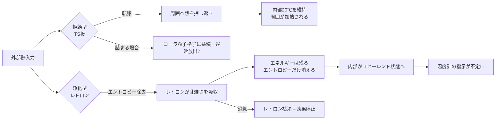

## 概要

温度を一定に保つという目標に対して、全く異なる二つの原理が存在する。

一つは**拒絶型**——コーラ粒子（wiim_013）の格子素材であるテルモスタシス板・テルモクラシス板が採用する方式で、熱の移動そのものを拒絶・転嫁することで温度変化を防ぐ。もう一つは**エントロピー浄化型**——レトロン（wiim_037）を用いる方式で、熱エネルギーの流入は受け入れるがエントロピー成分だけを除去し、系の乱雑さが増えないようにすることで温度上昇を抑える。

どちらの原理も現在の物理学では実現不可能だが、その不可能性の根拠はまったく異なる。二つを対照的に論じることで、「温度とは何か」という問いが浮かび上がる。

---

## 実現不可能性の根拠

### 物理的限界

**拒絶型（コーラ粒子）**：熱の移動を拒絶するとき、エネルギーは消えない。転嫁——周囲への押し返し——が必然的に発生する。地上環境では転嫁先が豊富だが、宇宙空間という真空では転嫁できる受け手が輻射のみに限られる。輻射で再放出するならキルヒホッフの法則（g193）に従う通常の熱放射と変わらなくなる。「拒絶」と「再放射」の区別が真空中で消えてしまう。

**浄化型（レトロン）**：熱力学第二法則はエントロピーが増大する方向を定めているが、レトロンは負のエントロピーを持つ粒子として定義される。系からエントロピーを取り除くとき、そのエントロピーはどこかへ移動しなければならない。完全に消去するならエントロピー保存則に矛盾する。レトロン自身が「エントロピーを吸収して消える」なら、レトロンは消耗品であり、無限には使えない。

ここで「消耗品」と「遡及因果」の整合を補足する。レトロンは遡及因果性を持つ粒子だが（wiim_037）、その遡及の射程は**吸収したエントロピー量に比例する有限値**をとる。レトロンが消費されるとは、射程を使い切って遡及効果が局所的に完結し消滅することを意味する——因果の中断ではなく完結だ。射程が有限であることは物理的にも必然であり、無限遡及が許されると因果律の一貫性を根底から崩すことになる。消耗品としての性質はこの有限射程の別の表現に他ならない。

### 技術的限界

**拒絶型**：テルモクラシス板の閾値温度 T_th はコーラ粒子格子の間隔で決まる。ナノスケールの精密加工が必要であり、わずかな製造誤差が目標温度のずれに直結する。また双方向動作（T_th 以下でも能動的に温度を引き上げる）には外部エネルギー供給が必要で、カシミール板との組み合わせ（wiim_044補遺）が現実的な解として浮かぶが、板間距離の維持という別の技術課題を生む。

**浄化型**：レトロンの生成・供給・制御の技術がほぼ未定義だ。レトロンが消耗品ならば補充系が必要になり、その補充系自体がエネルギーを必要とする。「レトロンを使って恒温を維持する」ためのインフラコストが、維持によって得られる利益を上回る可能性がある。

### 論理的限界

**拒絶型**：コーラ粒子は「波動関数に従わない」と定義されているため、隣接する通常物質との界面で量子的な相互作用がどのように成立するかが未定義のままだ。拒絶するとはどの物理的プロセスが起きないことを指すのか——光子の吸収遷移が起きない、フォノンの伝達が起きない、どちらも、あるいは別の何かか——が特定されなければ、「拒絶」は言葉の上だけの概念に留まる。

**浄化型**：温度は「エネルギーの統計的分布の広がり」として定義される。エントロピーを除去すると分布が狭くなり、全粒子が同じエネルギー状態に揃う——これはレーザーや BEC（ボース・アインシュタイン凝縮）と同様の高度にコヒーレントな状態だ。このとき温度計は何を示すか。温度は統計的な概念であり、全粒子が同一エネルギーなら「温度がない」状態とも解釈できる。「恒温を維持した」のか「温度という概念が消えた」のかの区別が難しくなる。

---

## 実験の設定

同一の熱環境（宇宙空間・太陽近傍100 kW/m²相当の輻射）に、二種類の恒温体を置く。

- **試料A**：テルモスタシス板（T_th=20℃）で包まれた立方体
- **試料B**：レトロンを継続供給された素材で構成された同サイズの立方体

両者を同条件に置き、内部温度・外部への影響・エネルギーの行き先を比較する。

---

## 考察と予測

### 試料Aの振る舞い：転嫁の軌跡

テルモスタシス板は入射輻射を反射・転嫁する。船体周囲に高密度の光子場が形成され、試料Aの周囲だけが局所的に高温になる。試料A内部は20℃を維持するが、その代償として外部環境が加熱される。

恒温は達成されるが、試料Aは熱的に「孤立」しているのではなく、周囲に熱を押し付けることで成立している。試料Aを宇宙船に用いると、船外作業者や近接する物体が危険になる可能性がある。

### 試料Bの振る舞い：コヒーレンスへの収束

レトロンがエントロピーを除去し続けると、内部の熱運動が次第に整列していく。理想的にはBECに近い高コヒーレント状態に向かう。

温度計を内部に置くと、初期は20℃付近を示すかもしれないが、浄化が進むにつれて温度の定義が崩れていく。「全粒子が同じエネルギーで揃った状態」は熱力学的な温度ゼロに相当するが、粒子はエネルギーを持っている——量子力学的な「冷たいが動いている」状態だ。

除去されたエントロピーはレトロンとともに系外へ出ていくと考えられるが、それはどこへ向かうのか——宇宙全体のエントロピー収支に影響を与えるかもしれない。

### 二つの原理の本質的な差異

| 観点 | 拒絶型（コーラ粒子） | 浄化型（レトロン） |
|------|--------------------|--------------------|
| エネルギーの扱い | 受け取らない | 受け取って整列させる |
| エントロピーの扱い | 変化しない（入らない） | 能動的に除去する |
| 環境への影響 | 周囲を加熱する | 周囲のエントロピーを変化させる |
| 消耗品の有無 | なし（格子は劣化しない前提） | あり（レトロンは消費される） |
| 恒温の安定性 | 受動的・安定 | 能動的・供給依存 |
| 極限状態 | 転嫁先が消える（真空問題） | 温度概念が消える（BEC問題） |

---

## 数式による表現

二つの原理を熱流の観点で対比する。通常の熱移動では流入熱量 Q が系の温度変化 ΔT を生む。拒絶型では Q が界面で反射されるため系に入らない（Q_in ≒ 0）。浄化型では Q は入るが、レトロンの働きでエントロピー変化 ΔS が相殺される——エネルギーを持ちながらエントロピーを持たない状態、すなわち ΔS = 0 かつ Q ≠ 0 という通常の熱力学では成立しない条件が「恒温」の正体だ。

---

## 関連記事

- [wiim_013](physics/wiim_013.md) コーラ粒子の基本定義
- [wiim_037](physics/wiim_037.md) レトロン——負のエントロピーを持つ粒子
- [wiim_039](quantum/wiim_039.md) 量子永久機関——真空エネルギーの搾取
- [wiim_044](physics/wiim_044.md) テルモスタシス船体——拒絶型の宇宙応用
- [wiim_015](physics/wiim_015.md) エントロピーが減少する宇宙
