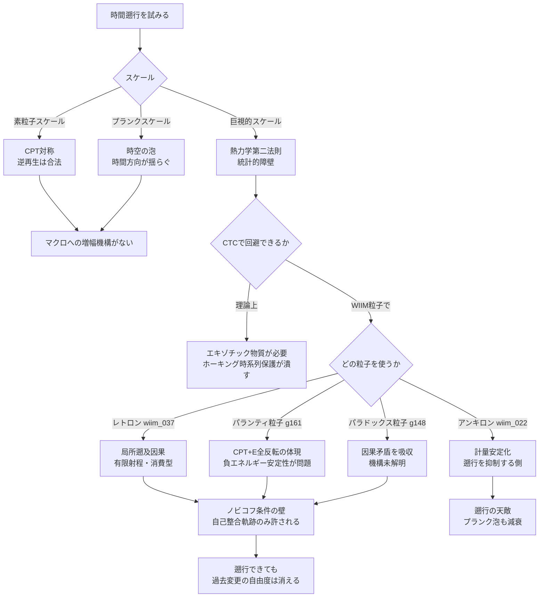
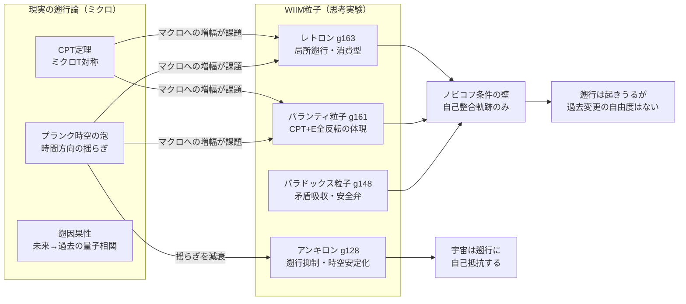

## 概要

「時間を逆戻りできるか」——この問いは物理学の最も古く、最も未解決な問いのひとつだ。

興味深いことに、素粒子物理の基本法則のほとんどは**時間反転対称**（T対称）だ。電子が散乱する反応を逆再生しても、同じく物理法則に従う。では時間は本質的に双方向なのか。

そうはなっていない。私たちが経験する時間は一方向にしか進まない。この非対称性の源は基本法則にではなく、**統計と初期条件**にある——熱力学第二法則による「時間の矢」だ。

この記事では、現実の素粒子物理・量子重力が示す遡行の可能性と、WIIMの思考実験粒子（レトロン・パランティ粒子・アンキロン・パラドックス粒子）を検討材料として、遡行の条件と限界を多角的に問う。

---

## 実現不可能性の根拠

### 物理的限界——時間の矢はエントロピーから生まれる

大半の素粒子反応はT対称だが（弱い相互作用ではCP対称性の破れを通じてT対称性も厳密には成立しない）、巨視的系では時間は一方向にしか進まない。この非対称性の原因は**熱力学第二法則**だ。系のエントロピー（乱雑さの度合い）は統計的に増大し続ける——コーヒーにミルクを混ぜると白くなるが、白いコーヒーが自然に分離することは確率的にほぼゼロだ。

「時間を逆戻りする」とは、すべての粒子の速度を反転させることに等しい。物理法則は禁じないが、巨視的な系全体のエントロピーを整合的に減少させる反転が「自然に」起きる確率は事実上ゼロだ。エントロピー減少の宇宙（wiim_015）はこの困難を別の角度から論じている。

### 技術的限界——CTCのエネルギー問題

一般相対性理論は**閉じた時間的曲線**（CTC）を数学的に許す。十分に曲がった時空では、ある点から出発して同じ点に戻る時間的経路が存在しうる。しかしCTCの実現には負のエネルギー密度を持つエキゾチック物質が必要で、現在の物理学では安定した供給源がない。

ホーキングの**時系列保護仮説**はさらに踏み込む——CTCが生じようとすると、その経路上で量子場の真空エネルギーが発散し、CTC自体を潰す。宇宙は時間遡行に対して自己防衛する傾向があると考えられる。

### 論理的限界——ノビコフの罠

**祖父パラドックス**は時間遡行の論理的障壁だ。過去に戻って自分の祖父を殺せば、自分は生まれず、遡行もできず——循環する矛盾が生まれる。

ノビコフの自己整合性条件はこれを回避する。「遡行できる経路は、もともとそうだった軌跡しかない」——過去を変えるような行動は何らかの理由で阻まれる。この条件は遡行の可能性を認めつつ、過去を変える自由度を完全に奪う。遡行できても、意味ある変更はできない。

---

## 実験の設定

現実の遡行論とWIIM粒子を対比させるため、以下を検討材料とする。

| 検討材料 | 分類 | 遡行への寄与 | 限界 |
|---------|------|------------|------|
| CPT定理 | 現実（素粒子物理） | ミクロでは時間反転が合法 | マクロへの統計的障壁 |
| プランク時空の泡 | 現実（量子重力） | Planckスケールで時間方向が揺らぐ | マクロへの増幅機構がない |
| 遡因果性・弱測定 | 現実（量子力学） | 未来の測定が過去の状態に相関 | 情報の遡行ではなく相関の問題 |
| レトロン（wiim_037） | WIIM粒子 | 有限射程の遡及因果を実現 | 消費型・射程限定・ノビコフ条件 |
| パランティ粒子（g161） | WIIM粒子 | CPT+E全反転の体現 | 安定負エネルギーが標準理論外 |
| アンキロン（wiim_022） | WIIM粒子 | 計量安定化で時間揺らぎを抑制 | 遡行を阻む側に立つ |
| パラドックス粒子（g148） | WIIM粒子 | 因果矛盾を自動解消する安全弁 | 生成機構が未解明 |

---

## 考察と予測

### 現実の遡行論——どこまで届くか

**CPT定理**が示すのは素粒子スケールでの時間反転の合法性だ。電子と陽電子の対消滅を逆再生すれば光子から対が生成される——これは実際に起きる。しかしこの可逆性は個別反応の対称性であり、多数の粒子が絡む巨視的系では、可能な逆再生のほぼすべてが統計的障壁に阻まれる。

**プランクスケールの時空の泡**はより根本的だ。プランク時間（約5.4×10⁻⁴⁴秒）以下では時空のトポロジー自体が量子揺らぎし、時間の向きが確率的に未定義になる可能性がある。これは「ミクロでは時間が双方向に揺れている」ことを示唆するが、その揺らぎをマクロに伝える増幅機構が存在しない。**量子力学の遡因果性**（アハラノフの二状態ベクトル形式）では、未来の測定が過去の量子状態に「さかのぼって」影響を与える解釈が成立する。ただしこれは情報の逆流ではなく量子相関の問題であり、マクロな過去変更には繋がらない。

### レトロン——唯一の局所的遡行機構

レトロン（wiim_037）は、WIIMにおいて時間遡行に最も直接的に関わる思考実験上の粒子だ。負のエントロピーを吸収して消滅することで、消滅点の近傍に遡及因果効果をもたらす——因果の局所的な「巻き戻し」が起きる。

ただしこの遡行には三つの限界がある。**射程の有限性**：遡及できる時間的距離は吸収したエントロピー量に比例し、無限遡行は不可能（wiim_045）。**消費型**：一度使用すると粒子は消滅し、繰り返せない。**ノビコフ条件との整合**：レトロンが誘発できる遡行も自己整合的な軌跡に限られると考えられる——「もともとそうなるはずだった」変更のみが許される。

レトロンは「時間遡行の実現」ではなく、**「因果の局所的な再配置」**として解釈するのが正確だ。

### パランティ粒子——時間対称性の物質化

パランティ粒子（g161、虚反粒子）はCPT対称性を電荷・パリティ・時間に加えてエネルギー符号反転（E共役）まで拡張した帰結として位置づけられる思考実験上の粒子だ。通常粒子との対消滅でエネルギー収支がゼロになる「静かな消滅」が起きると考えられる（wiim_038）。

時間遡行との関係では、時間反転T共役を含む全対称性の**粒子としての体現**という意味で特別だ。パランティ粒子が存在するならば、T対称性が物質として具現化したことになる。しかし安定した負エネルギー状態は標準理論に収まらず、パランティ粒子は「時間対称性の具現化」ではあっても、それ自体が遡行の手段になるわけではない。プランク泡で時間方向が揺らぐ領域が「パランティ粒子が自然に生成される環境」に相当する可能性はある。

### アンキロン——遡行の天敵

アンキロン（wiim_022）は計量変化率への粘性的抵抗として機能し、時空の急激な変動を安定化させる。プランクスケールの時空の泡が時間方向の揺らぎを生む可能性があるとすれば、アンキロンはその揺らぎを減衰させる側に立つ。

興味深いことに、アンキロンはホーキングの時系列保護仮説と同じ役割を自然界から引き受ける。「遡行を抑制する機構が宇宙に内在している」という主張の、WIIM的な粒子表現だ。アンキロンが高密度な領域では、レトロンの遡及効果すら弱まる可能性がある——遡行機構と抑制機構が空間的に競合する。

### パラドックス粒子——矛盾を飲み込む安全弁

パラドックス粒子（g148）は、時空歪曲操作の後に生じる因果矛盾を自動的に解消する機構として観測される仮説上の何かだ。遡行が実際に起きて過去の因果構造に矛盾が生じたとき、パラドックス粒子はその矛盾を「吸収」してノビコフ条件を事後的に満たす役割を果たすと考えられる。

ただし生成機構は未解明のまま（g148）。遡行が可能になるほど時空が歪んだとき、宇宙はその矛盾を自動解消するリソースを持っているのかもしれない——あるいは持っていないのかもしれない。もし持っていないなら、レトロンが引き起こした遡及効果が因果矛盾に達した瞬間、パラドックス粒子の供給が尽きて「矛盾が未解消のまま残る」事態が生じうる。

---

## 図解

---

## 関連記事

- [wiim_005](../cosmology/wiim_005.md) — 時間遡行粒子のエントロピー増大によるタイムマシン
- [wiim_015](wiim_015.md) — エントロピーが減少する宇宙：時間の矢が逆を向いた世界
- [wiim_022](wiim_022.md) — アンキロン：時空の計量に錨を打つ粒子
- [wiim_037](wiim_037.md) — レトロン：負のエントロピーを持つ粒子と因果の逆行
- [wiim_038](wiim_038.md) — 静かな対消滅：パランティ粒子による完全無効化
- [wiim_045](wiim_045.md) — 恒温の二つの原理：レトロンによるエントロピー浄化型
- 用語: レトロン g163 / パランティ粒子 g161 / アンキロン g128 / パラドックス粒子 g148 / 時間膨張 g010
- [wiim_051](wiim_051.md) — パラポジ粒子との衝突——量子数の幽霊状態は何をもたらすか

