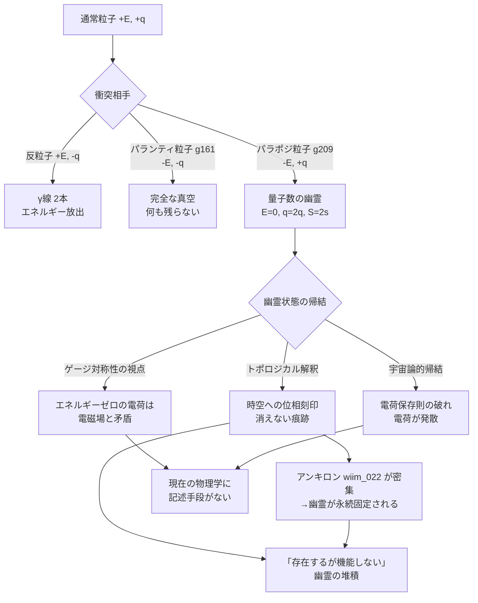
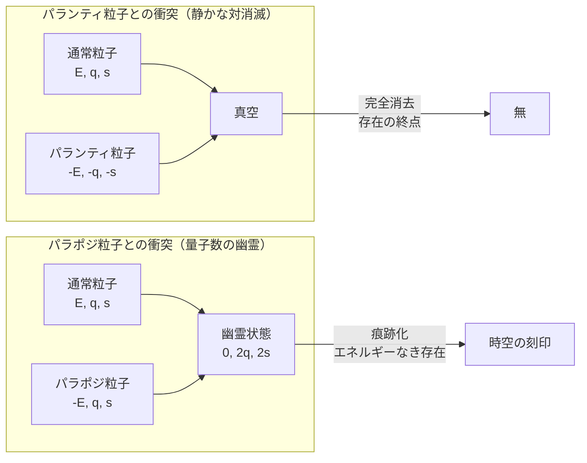

## 概要

パランティ粒子（g161）が「存在を消す」粒子であるなら、パラポジ粒子（g209）は「存在の痕跡だけを残す」粒子だ。

パラポジ粒子はパランティ粒子の対概念として定義される思考実験上の粒子で、エネルギー符号のみが反転し、CPT共役を持たない。電荷・スピン・パリティは通常粒子と同符号のままだ。

通常粒子との衝突では、エネルギーが打ち消されてゼロになる一方、電荷とスピンは消えずに倍加する。残るのは「エネルギーを持たないのに量子数だけが存在する状態」——**量子数の幽霊**だ。

この幽霊状態は場の量子論の基礎と真っ向から衝突する。電荷はエネルギーを持つ電磁場の源であるはずで、エネルギーゼロの電荷という概念は理論の根幹を揺さぶる。本記事では、この衝突がもたらす帰結を物理的・技術的・論理的に追う。

---

## 実現不可能性の根拠

### 物理的限界——ゲージ対称性との矛盾

電磁気学の基礎であるゲージ対称性は、電荷と電磁場を不可分に結びつける。電荷は電磁場の源であり、電磁場はエネルギーを持つ——この連鎖はマクスウェル方程式の根幹だ。

「エネルギーゼロで電荷だけが残る」幽霊状態は、この連鎖を断ち切ることを要求する。電荷があれば周囲に電場が生まれ、その電場はエネルギーを持つ。エネルギーがゼロだとすれば、電場も生まれず、電荷も存在できない——幽霊状態は自己矛盾を抱える。

スピンも同様だ。スピンは角運動量であり、回転する系はエネルギーを持つ。エネルギーゼロのスピン非ゼロ状態は量子力学の基本的な関係（スピンと回転の対称性）と相容れない。

### 技術的限界——幽霊は検出できない

幽霊状態を観測しようとすると、即座に困難に直面する。あらゆる検出器は何らかの形でエネルギーのやり取りを通じて粒子を感知する。エネルギーを持たない状態は、検出器に何も「渡す」ことができない。

電荷が倍加しているならば、電場を生じて検出できるはずだ——しかし物理的限界の節で示したように、エネルギーゼロの電場は矛盾を含む。結果として幽霊状態は「存在するかどうか分からないまま時空に刻まれる」という、検証不可能な存在になる。

パラポジ粒子そのものを生成・制御する手段もない。標準理論の粒子加速器はエネルギーと衝突断面積を利用して粒子を生成するが、負エネルギーかつCPT非対称という性質を持つパラポジ粒子の生成経路は現在の理論体系に存在しない。

### 論理的限界——電荷の発散と保存則の崩壊

幽霊状態は電荷保存則に深刻な疑問を投げかける。

通常の対消滅（粒子＋反粒子）では電荷は打ち消されてゼロになる。静かな対消滅（wiim_038）では全ての量子数がゼロになる。しかしパラポジ粒子との衝突では電荷が**倍加**する——これは電荷が「生成された」ことを意味し、電荷保存則の明白な破れだ。

さらに、宇宙にパラポジ粒子が継続的に存在するとする。衝突が繰り返されるたびに幽霊状態の電荷は倍加し続ける。個々の幽霊は伝播できないが、宇宙全体の総電荷は発散に向かう。電磁気力の強さが宇宙全体で増大し続け、宇宙の構造自体が変容するだろう——あるいは、この発散を防ぐ未知の機構が宇宙に備わっているはずだ、という逆説的な要請が生まれる。

---

## 実験の設定

電子とパラポジ電子の衝突を思考実験として設定する。

- **衝突前の状態**

| 粒子 | エネルギー | 電荷 | スピン |
|------|-----------|------|--------|
| 電子（通常粒子） | +E | −e | 1/2 |
| パラポジ電子（g209） | −E | −e | 1/2 |
| 合計 | **0** | **−2e** | **1** |

- **衝突後の幽霊状態**: エネルギー 0、電荷 −2e、スピン 1

比較対象として、パランティ粒子（g161）との衝突も並べる。

| 衝突相手 | 残るもの | 名称 |
|---------|---------|------|
| 反粒子（陽電子） | γ線 2本（光子） | 通常の対消滅 |
| パランティ粒子 | 何もない（真空） | 静かな対消滅（wiim_038） |
| パラポジ粒子 | 電荷 −2e、スピン 1、エネルギー 0 | 量子数の幽霊 |

---

## 考察と予測

### 幽霊状態のトポロジカル解釈

エネルギーゼロで量子数を持つ状態の最も自然な物理的類比は**トポロジカル欠陥**だ。磁気モノポールや渦糸（ボルテックス）は、量子場の位相が空間の一点に巻き付いた構造として存在する。これらは「取り除けない位相的な縫い目」として時空に刻まれ、局所的にはエネルギーを持ちつつも大域的に消えない。

幽霊状態はこの類比の極限——「エネルギーを持たないトポロジカル刻印」——として解釈できるかもしれない。電荷とスピンが時空構造そのものに書き込まれ、粒子としては存在せず、場としても現れず、しかし位相的には消えない残滓として残る。

### パランティ粒子との対称性——消去と痕跡

パランティ粒子との対比は際立っている。

静かな対消滅（wiim_038）は「完全な消去」だ——エネルギーも電荷も何もかもが消え、真空だけが残る。パラポジ粒子との衝突はその対称物として「完全な痕跡化」——エネルギーという「現れ」は消え、量子数という「刻印」だけが残る。パランティ粒子が存在を無に帰すなら、パラポジ粒子は存在をエネルギーのない幽霊に変換する。

| | パランティ粒子（g161） | パラポジ粒子（g209） |
|-|----------------------|---------------------|
| 対称性 | CPT+E 全反転 | E 反転のみ |
| 衝突後 | 完全な真空 | 量子数の幽霊 |
| 意味 | 存在の消去 | 存在の痕跡化 |
| 電荷保存 | 保たれる | 破れる |

### アンキロンと幽霊の安定化

アンキロン（wiim_022）は計量変化率への粘性的抵抗として時空を安定化させる。幽霊状態がトポロジカル欠陥として時空に刻印されるなら、アンキロンはその刻印を**固定する**側に働く可能性がある。アンキロンが高密度な領域では、幽霊状態が拡散・消滅することなく時空の「傷」として永続するかもしれない。

逆に言えば、アンキロンの少ない不安定な時空では幽霊状態が揺らぎに溶け込んで消える可能性もある——幽霊の寿命はアンキロン密度に依存するという予測が立つ。

### 宇宙論的帰結——電荷発散の果て

電荷保存則が局所的に破れ続ける宇宙を想像してみる。パラポジ粒子が存在するたびに通常粒子の電荷が倍加して幽霊化し、実効的な電荷量が増え続ける。クーロン力が強まり、原子の構造が変化し、化学の基礎が崩れる。

ただし幽霊状態は伝播せず、エネルギーも持たないため「電荷はあるが力を及ぼせない」可能性もある——検出も不可能で、影響も及ぼさない。その場合、幽霊は宇宙の地平線の内側に静かに蓄積し続け、物理に何の痕跡も残さない「存在するが機能しない電荷の堆積」として宇宙の背景に溶け込む。

どちらの解釈が正しいかは、「エネルギーのない電荷が電場を生むかどうか」という問いに帰着する——そしてその問いには、現在の物理学は答えを持たない。

---

## 図解

---

## 関連記事

- [wiim_038](wiim_038.md) — 静かな対消滅：パランティ粒子による完全無効化
- [wiim_022](wiim_022.md) — アンキロン：時空の計量に錨を打つ粒子
- [wiim_049](wiim_049.md) — 時間遡行は可能か：素粒子物理からWIIM粒子まで
- wiim_??? — トポロジカル欠陥が宇宙に刻む非対称性
- wiim_??? — 電荷保存則が局所的に破れる宇宙
- 用語: パラポジ粒子 g209 / パランティ粒子 g161 / アンキロン g128 / トポロジカル欠陥
