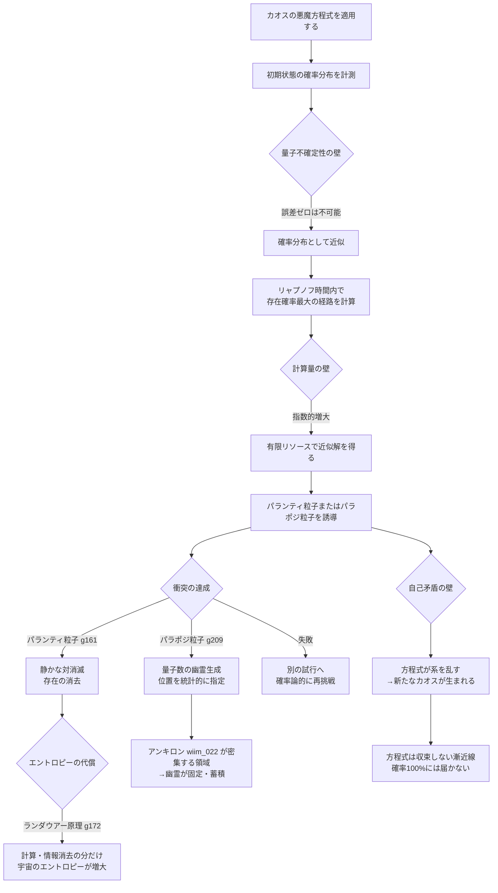
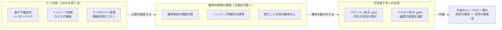

## 概要

カオス系（g179）は決定論的でありながら予測不可能だ。初期条件のわずかな差が指数関数的に増幅され、バタフライ効果（g178）として知られる予測不能性を生む。しかしこれは「完全に予測できない」ことを意味しない——**確率分布として**粒子の存在位置を予測することは、理論的に許される。

カオスの悪魔（g210）の方程式とは、その確率的予測を極限まで高度化した仮説的な体系だ。100%の制御は原理的に不可能だが、将来の理論発展によって「粒子がどこに現れる確率が最も高いか」を精密に計算できるとしたら——それは意図的な粒子衝突や、パランティ粒子（g161）・パラポジ粒子（g209）との対消滅を工学的に設計する基盤になりうる。

本記事では、この方程式の理論的可能性と、それでも突破できない三つの限界を追う。

---

## 実現不可能性の根拠

### 物理的限界——リャプノフ時間の壁

カオス系の予測可能な時間幅は**リャプノフ時間**によって決まる。初期条件の誤差は1ステップごとに一定の割合で増幅し、リャプノフ指数と呼ばれる増幅率が大きいほど予測は早く破綻する。どれだけ精密に初期状態を測定しても、有限の誤差がある以上、予測精度は時間とともに劣化する。

さらに深刻なのは量子スケールの制約だ。ハイゼンベルクの不確定性原理は、粒子の位置と運動量を同時に任意の精度で知ることを禁じる。カオスの悪魔方程式がどれほど高度になっても、量子的な初期条件の不確定性は消えない——これが確率100%という上限を原理的に封じる「硬い壁」だ。

### 技術的限界——計算量の指数爆発と観測のバックアクション

カオス系の将来状態を正確にシミュレーションするための計算量は、予測する時間範囲と精度に対して指数関数的に増大する。現実の系では相互作用する粒子数が膨大であり、宇宙に存在するすべての計算資源を投じても有限時間後の状態しか予測できない。

観測もまた問題だ。粒子の現在位置を知るには何らかの形で粒子と相互作用しなければならない——光子を当てる、電場で感知するなど。この相互作用は系にエネルギーを注入し、観測しようとした状態を変えてしまう。観測精度を上げようとするほど、系への干渉が増す。カオスの悪魔方程式はこの「観測のバックアクション」を計算に組み込めるが、完全には消去できない。

### 論理的限界——方程式が系の一部になる自己矛盾

カオスの悪魔方程式を実際に運用するには、計算装置が現実の宇宙内に存在する必要がある。計算装置もまた質量とエネルギーを持ち、重力場や電磁場を通じて制御対象の粒子と相互作用する。方程式が制御しようとしている系に方程式自身が影響を与える——予測モデルが現実に干渉する自己参照的な矛盾だ。

加えて、**ランダウアー原理**（g172）は情報処理に不可避のエネルギーコストを課す。カオスの悪魔方程式が状態を計算・更新するたびに情報が消去され、エントロピーが必ず宇宙のどこかで増大する。局所的な秩序の獲得は、宇宙全体の無秩序の増大を代償とする——マクスウェルの悪魔（g059）が陥ったのと同じ熱力学的トレードオフだ。

---

## 実験の設定

カオスの悪魔方程式を使って、パランティ粒子との「静かな対消滅」（wiim_038）を工学的に設計する思考実験を設定する。

**目標**: 標的とする通常粒子（電子）の位置に、パランティ粒子が確率最大の経路で衝突するよう誘導する。

| 段階 | 操作 | 制限 |
|------|------|------|
| 初期状態の計測 | 電子の位置・運動量の確率分布を測定 | 不確定性原理により誤差は消せない |
| 方程式の計算 | リャプノフ時間内の確率密度を推算 | 計算量が指数的に増大 |
| パランティ粒子の誘導 | 確率最大経路へ向けて射出 | 誘導行為が電子の状態を乱す |
| 衝突の達成 | 静かな対消滅が起きる | 達成確率は100%未満 |

比較として、同じ設定でパラポジ粒子を誘導した場合も示す。

| 誘導対象 | 衝突後の状態 | 方程式の役割 |
|---------|------------|------------|
| パランティ粒子（g161） | 完全な真空（静かな対消滅） | 存在消去の精密制御 |
| パラポジ粒子（g209） | 量子数の幽霊（wiim_051） | 幽霊生成位置の統計的指定 |

---

## 考察と予測

### 確率的制御の上限——「十分に高い」はどこか

カオスの悪魔方程式が与えるのは確率の最大化であり、保証ではない。しかし現実の粒子加速器でも衝突は確率論的に設計されている——LHCでは毎秒数億回の陽子衝突を繰り返し、統計的に目標反応を「釣り上げる」。カオスの悪魔方程式の達成目標は「一回の衝突で確率100%」ではなく「試行あたりの成功確率を現在の加速器技術より飛躍的に高める」ことだ。

この枠組みでは、リャプノフ時間の壁を「予測有効期間」として扱い、その時間内に衝突を実現するよう誘導設計することで原理的な限界を回避できる。量子的不確定性は残るが、確率分布として取り込んだ上での最適化は可能だ。

### エントロピーのトレードオフ——対消滅は宇宙のどこかを乱す

パランティ粒子との静かな対消滅（wiim_038）は電荷もエネルギーも何も残さない。しかしその衝突を設計するためにカオスの悪魔方程式が計算を行い、情報を消去した瞬間、ランダウアー原理（g172）によりエネルギーが熱として宇宙に放散される。

「粒子を完全に消す」という操作は、消去の代償として宇宙全体のエントロピーを増大させる。存在の消去は宇宙の無秩序の増大を要求する——局所的な「静けさ」は全体的な「騒がしさ」と等価だ。

### パラポジ粒子の幽霊を意図的に配置する

パラポジ粒子との衝突は量子数の幽霊（wiim_051）を生成する——エネルギーゼロで電荷・スピンだけが時空に刻まれる状態だ。カオスの悪魔方程式でその衝突位置を統計的に制御できるなら、幽霊の生成位置を指定することができる。

時空の特定の場所に幽霊を意図的に配置することで何が起きるか。アンキロン（wiim_022）が密集する領域で幽霊が固定されれば（wiim_051）、電荷密度の偏りが空間的に制御された形で蓄積する。これは「幽霊状態自体はエネルギーを持たないまま、量子数の地図を時空に書き込む」行為に等しい。ただし衝突を設計するカオスの悪魔方程式の計算にはランダウアー原理（g172）によるエネルギーコストが生じる——「幽霊の書き込み」は無償ではなく、その精度の代償は計算側が支払う。カオスの悪魔方程式はそのような時空への情報書き込みの精度と、支払うエネルギーコストのトレードオフを決める。

### 方程式の自己進化——カオスがカオスを学ぶ

カオスの悪魔方程式が予測精度を高めるためには、過去の予測誤差から学習する必要がある。しかし学習するたびに方程式自体が変化し、それ以前の予測との整合性が崩れる。方程式が系を学べば学ぶほど、方程式自身が新たな変数として系に組み込まれ、系はより複雑なカオスへと進化する。

カオスの悪魔方程式は目標に近づきながら目標を遠ざける——収束しない漸近線として、「十分に高い確率」を永遠に追いかける存在かもしれない。

---

## 図解

---

## 関連記事

- [wiim_038](wiim_038.md) — 静かな対消滅：パランティ粒子による完全無効化
- [wiim_051](wiim_051.md) — パラポジ粒子との衝突：量子数の幽霊状態は何をもたらすか
- [wiim_022](wiim_022.md) — アンキロン：時空の計量に錨を打つ粒子
- [wiim_015](wiim_015.md) — エントロピーが減少する宇宙：時間の矢が逆を向いた世界
- [wiim_020](wiim_020.md) — アカシックレコードが重力場による自己強化型情報網だったら
- wiim_??? — 情報消去のエネルギーコスト：ランダウアー限界を超える計算機は存在できるか
- 用語: カオスの悪魔 g210 / マクスウェルの悪魔 g059 / ラプラスの悪魔 g204 / バタフライ効果 g178 / ランダウアー原理 g172 / パランティ粒子 g161 / パラポジ粒子 g209
- [wiim_054](wiim_054.md) — カオスの創発文法——階層的折り畳み評価が相転移を起こすとき
- [wiim_053](../quantum/wiim_053.md) — 粒子に個性を持たせることができるか——量子的同一性とトポロジカル粒子の標識問題

