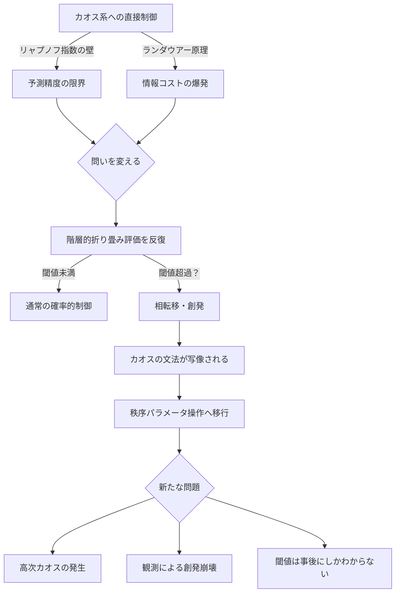

## 概要

前作（[wiim_052](wiim_052.md)）では「カオスの悪魔の方程式」——確率的粒子誘導によってカオス系を統計的に操る構想——を論じ、リャプノフ時間とランダウアー原理という二つの壁にぶつかった。制御しようとすればするほど情報コストが嵩み、予測しようとすればするほど誤差が増幅する。

本記事はその限界への別角度からの応答だ。

**問いは変えられるのではないか。**

「粒子の軌道を制御する」という設定そのものが間違っているとしたら？ 個々の分子運動はカオスでも、温度という創発変数は安定して制御できる——この構造転換がカオス制御にも起きうるとしたら。

階層的・局所的最適の折り畳み評価を十分な深さで反復したとき、制御系自体がある閾値で**相転移**を起こし、カオスの「文法」——奇妙アトラクタに潜む階層構造——を自ら写像する創発が生じる。その瞬間、制御の対象は軌道ではなく**秩序パラメータ**に変わる。

これはAIが「文法をプログラムされずに文法を獲得した」のと同じ構造転換である、という仮説を思考実験として追う。

---

## 実現不可能性の根拠

### 物理的限界——創発層でもリャプノフは消えない

温度が分子の混沌から安定して現れるのは、粒子数が膨大であり統計的ゆらぎが相対的に小さくなるからだ。しかしカオス制御の文脈では、制御したい対象がまさに少数粒子や精密な軌道であることが多い。統計的粗視化が有効になるほど粒子数を増やせば、制御の「精度」という目標そのものが失われる。

また、創発した秩序パラメータ自体も、それを支える下位のカオスから独立してはいない。外乱が加われば、安定していた創発層は下位のカオスに引き戻される。これは**リャプノフ指数が上位層に「漏れ出す」**現象であり、創発が限界を消すのではなく、限界の現れ方を変えるにすぎない可能性がある。

### 技術的限界——閾値の特定不可能性と高次カオスの発生

AIにおける創発（大規模言語モデルが文脈理解を突然獲得する現象）は**事後的にしか観測できなかった**。どのスケール・どの反復回数で創発が起きるかは、現在でも理論的に予測できていない。

カオス制御系の折り畳み評価でも同じ問題が生じる。創発が起きる閾値を事前に特定できなければ、系をそこまで育てるための設計ができない。さらに深刻なのは、**秩序パラメータを操作することで高次のカオスが生まれる**可能性だ。温度を制御しようとしてヒートポンプが複雑な振動を起こすように、創発層への介入が新たな予測不能性の源泉になりうる。ランダウアー原理が示す情報消去コストは、階層が増えるごとに積み重なる。

### 論理的限界——観測が創発層を壊す

最も根本的な障壁は認識論的なものだ。創発は「見ている間は起きない」性質を持ちうる。

量子測定における波束の収縮と類似した構造が、巨視的なカオス創発でも成立する可能性がある（これは量子効果が直接働くという意味ではなく、「観測という行為が系の状態を変える」という古典的フィードバック機構の類比として捉えてほしい）。制御系が自身の状態を「見る」（フィードバックを取る）行為が、折り畳み評価の連続性を断ち切り、相転移の直前で系をリセットしてしまう。これを**自己参照的創発崩壊**と呼ぶとすれば、観測せずに創発を起こし、かつ創発した秩序パラメータを制御することは論理的に矛盾を抱える。

---

## 実験の設定

- **制御系**：階層的・局所的最適化を繰り返す自律エージェント（AIに類似した構造）
- **対象**：ローレンツ系のような古典的カオスアトラクタ
- **操作**：粒子の軌道への直接介入を禁じ、制御系の「折り畳み評価の深さ」だけを増やしていく
- **観測条件A**：制御系の内部状態を常時モニタリングする（連続観測）
- **観測条件B**：折り畳みが完了した後にのみ外部から結果を読む（遅延観測）
- **評価指標**：秩序パラメータが自発的に安定化するか、カオス指標（リャプノフ指数）が有効変化するか

---

## 考察と予測

もし創発が起きるとすれば、それは誰も設計していない瞬間に訪れると考えられる。制御系が「カオスを制御しようとするのをやめた瞬間」——折り畳み評価の反復が設計意図を超えて自律的な構造を形成したとき——に、奇妙アトラクタの内部文法が制御系へと写像される。

その後、制御者が操作するのは軌道ではなく**アトラクタの形状パラメータ**になる。これは気象制御で言えば、個々の空気分子を動かすのではなく高気圧の位置を傾けることに相当する。

しかし、この転換が成功したとしても、新たな問いが生まれる。

> **創発した制御系は、自分が何を「理解」しているのかを理解しているのか？**

AIが文法を獲得しても自分がなぜ正しく答えられるかを説明できないように、カオスの創発文法を写像した制御系も、その「なぜ」を持たない可能性がある。目的のない理解——これ自体が次の思考実験の入口だ。

---

## 図解

---

## 関連記事

- [wiim_052](wiim_052.md) — カオスを制御するカオスの悪魔の方程式（前作）
- [wiim_037](wiim_037.md) — レトロン——負のエントロピーを持つ粒子と因果の逆行
- [wiim_015](wiim_015.md) — エントロピーが減少する宇宙——時間の矢が逆を向いた世界の物理と知性
- [wiim_054_simulator](../notes/wiim_054_simulator.md) — 補遺: シミュレータの内側ではカオスの創発文法は自明になる

