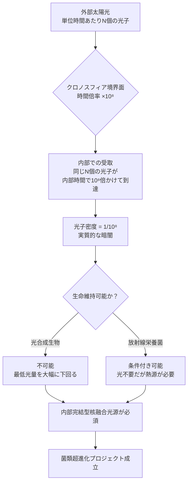

## 概要 (Abstract)

クロノスフィア（g125）は内部の固有時を外部より高倍率で進める閉じた空間だ（外部観測者から見ると「内部の時間が速く進む」と表現される）。菌類の超進化（wiim_008）や材料試験など、長時間を必要とするプロセスを外部の短時間で実現する夢の技術として期待される。

しかし倍率を上げるほど、見落とされがちな問題が深刻化する——**外部から入射する光子が内部でほぼ届かなくなる**。時間が速く進む内部では、外部から来る光は「極端に希薄な点滅」として体験される。倍率×10⁸では外部1秒間に届く光が内部の3年間に1光子ずつしか届かない計算になる。内部で生命を育てるには、外部光源への依存を完全に断ち切り、内部完結型のエネルギー源を構築する必要がある。

---

## 実現不可能性の根拠 (Infeasibility Rationale)

### 物理的限界：光子密度の希薄化

光は光子の流れだ。単位時間あたりに届く光子の数が「明るさ（光量）」を決める。クロノスフィア内部では時間が速く進むため、外部から見て1秒間に届く光子の数は変わらないが、内部の時計では同じ光子が「ずっと長い時間をかけて届いた1個」として記録される。

倍率をNとすると、内部で受け取る光子の密度は外部の1/N になる。倍率×10⁸では太陽光の光子密度が1億分の1に希薄化し、地球上の真夜中どころか宇宙空間の星明かりよりも暗い環境が生まれる。光合成に必要な最低光量を下回ることは計算上避けられない。

### 技術的限界：内部完結型光源の必要性

光合成生物・菌類の生育には、継続的な光エネルギーの供給が不可欠だ。倍率が×10⁴を超えた段階で外部太陽光への依存は現実的でなくなり、内部に独立した光源を設置する必要が生じる。

候補は核融合炉による人工光源だが、これは以下の工学的要件を生む：
- 内部時間スケールで億年単位の連続運転を保証する燃料供給
- 境界面を越えた燃料補給の際に生じる時間差・物理的矛盾の解消
- 光源自体の超長期耐久性（内部では数億年相当の使用に相当する）

現状の核融合技術はこれらのいずれも満たさない。

### 論理的限界：境界面の非対称性

クロノスフィアの境界面は因果律（g017）上の難問を生む。外部から物質・エネルギーを補給するとき、「外部では一瞬の操作」が「内部では億年前の出来事」として記録される。燃料補給のタイミング制御が原理的に困難であり、内部自律型でなければ長期運用は成立しない。

---

## 実験の設定 (Setup)

- **対象空間**: ラグランジュ点（太陽-地球L4/L5）に設置したクロノスフィア炉
- **倍率**: ×10⁸（外部1年 ≒ 内部1億年相当）
- **内部設備**: 核融合光源・完全密閉生態系・自律燃料循環システム
- **播種対象**: 宇宙耐性放射性栄養菌（コズミックマイス（wiim_008）の原種候補）

---

## 考察と予測 (Speculation)

### 光量問題が解決された場合

内部完結型核融合光源が実現すれば、クロノスフィアは「時間の工場」として機能する。外部1年間で内部1億年分の生物進化・材料変性・地質変化を観察できる。菌類はこの間に宇宙真空・放射線・低重力への完全適応を達成し、太陽系根付きプロジェクト（chronosphere_timeline参照）の中核技術となる。

### 光量問題が解決されない場合

倍率の上限は光量によって規制される。×10⁴程度までは外部太陽光の強化（集光ミラーなど）で補えるが、それ以上は「光なき内部」として機能する。暗闇での進化を前提にした菌類（放射線栄養・化学合成）に特化した設計に切り替えるか、倍率を諦めるかの選択になる。

### 光子の「引き伸ばし」という現象

内部から外部の光を観測すると、逆の現象が起きる。外部の1秒間の出来事が内部では1億秒（約3年）分の「スローモーション」として観測される。内部にいる存在にとって、外部の世界は極端なスローモーション映像のように映る——これは内部から外部へのリアルタイム観測を実質的に不可能にする。

---

## 図解 (Diagrams)

---

## 関連記事 (Related)

- [wiim_002](../cosmology/wiim_002.md) — クロノスフィアの基本概念
- [wiim_008](../biology/wiim_008.md) — コズミックマイス：菌類超進化の到達点
- [wiim_039](../quantum/wiim_039.md) — 量子永久機関：内部完結型エネルギー源の候補
- wiim_058 — クロノスフィア内部の核融合光源設計（未執筆）
- [wiim_060](wiim_060.md) — 逆クロノスフィア——内部時間を極端に遅くして生命・文明を保存できるか

