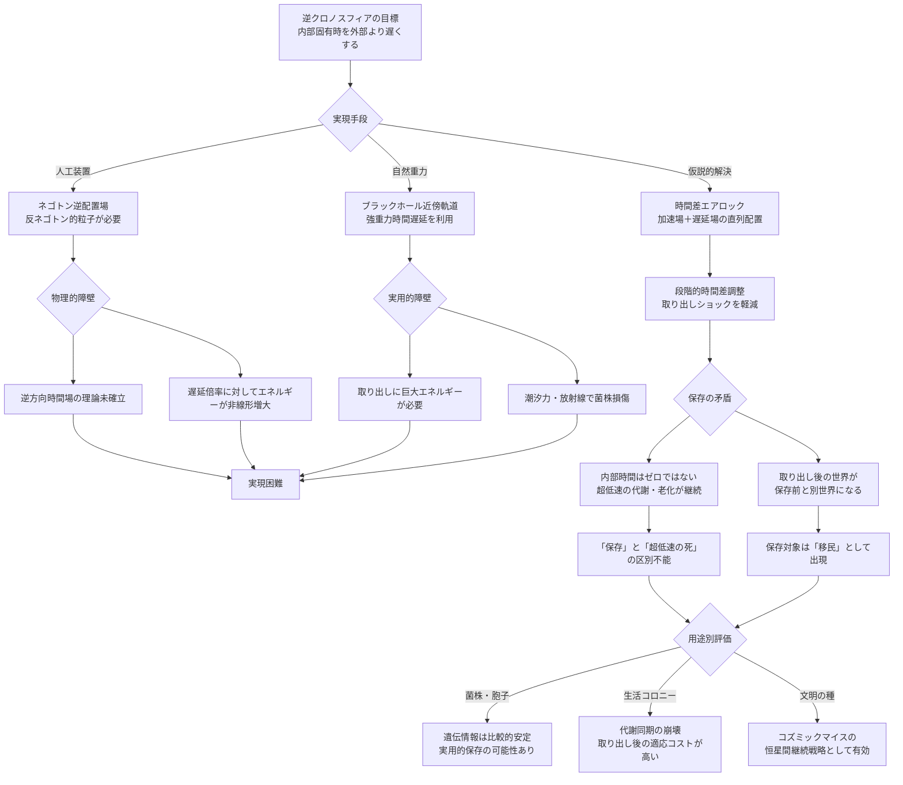

## 概要 (Abstract)

クロノスフィア（wiim_002）は、ネゴトン（g126）の精密配置によって内部の固有時（その場所における時計の進み方）を外部より速く進ませる装置だ。外部で数日しか経たない間に内部では億年が流れ、菌類の超高速進化を実現する。

では逆方向——内部の固有時を外部より極端に遅くすること——は可能か。これが「逆クロノスフィア」の問いだ。内部では時間がほぼ止まったように流れ、外部では文明が興亡を繰り返す億年が過ぎ去る。生命・遺伝情報・菌株を長期保存する「生きたアーカイブ」として機能させられるなら、コズミックマイス（wiim_008）の文明継続戦略の核になる。

自然界にはこれを実現する構造が存在する——ブラックホール近傍の極端な重力場だ。問題は、それを人工的に制御可能な装置として実現できるかだ。

---

## 実現不可能性の根拠 (Infeasibility Rationale)

### 物理的限界

一般相対性理論によれば、重力が強い場所では固有時の進行が遅くなる（重力時間遅延）。ブラックホールの事象地平線に近づくほどこの効果は大きくなり、地平線上では外部から見て固有時が完全に止まる。

しかしこれを人工装置として実現するには、局所的に極端な質量・エネルギー密度を作り出さなければならない。通常クロノスフィアがネゴトン（g126）の精密配置で固有時を「加速」させるなら、逆クロノスフィアには逆方向の場——ネゴトンと逆位相の時間偏差を生む粒子あるいは配置——が必要になる。しかし通常クロノスフィアとは逆向きの時間場を安定に維持する理論的根拠は現時点で存在しない。

エネルギー的にも非対称だ。時間を加速する場合は「余分な固有時を内部で使い切る」方向であり、エネルギー赤字は定常的に発生する（wiim_057）。時間を遅らせる場合は「固有時の流れを抑制する」方向であり、抑制に必要なエネルギーは遅延倍率に対して非線形に増大すると考えられる。完全な時間停止は無限のエネルギーを要する。

### 技術的限界（境界面問題）

通常クロノスフィア（wiim_002）でも境界面問題——内外の時間差が物質・信号の出し入れを困難にする——は存在した。逆クロノスフィアではこの問題がより深刻になる。

内部時間が遅い装置から何かを取り出すとき、内部では「今しがた入れた」ものが、外部では数万年後に出てくる。境界面を越えるたびに時間差が蓄積し、内外の同期は不可逆に崩れる。

特に生命体の出し入れは致命的だ。内部から取り出した菌類は、外部時間では億年後の宇宙に突然放り出される。物理環境・化学組成・天体配置のすべてが変わっており、「保存した菌を取り出して使う」という目的そのものが達成困難になる。心理的・生態的な整合コストは計り知れない。

### 論理的限界

「保存」の概念が内部矛盾を抱えている。

逆クロノスフィアの内部では、時間が遅いが**ゼロではない**。代謝は遅く進み、細胞は老化し、変異は蓄積する。完全な時間停止は物理的特異点（ブラックホール内部あるいはプランクスケールの時空崩壊）に等しく、生命を生きたまま取り出せる保証がない。

「十分に遅ければ保存と等価だ」と割り切るなら、遅延倍率の設計次第で「保存」と「超低速の死」を区別できない状態が生まれる。内部で千年に一度の細胞分裂が起きているとき、それは「生きている」のか「死にかけている」のか——外部からは判定できない。

さらに取り出し時の問題がある。長期保存後に取り出した生命体は、外部世界の時間スケールに対して完全に異質な存在になっている。それはもはや「保存されていたもの」ではなく、「別の時間軸から来た移民」だ。

---

## 実験の設定 (Setup)

- **装置**：ネゴトン（g126）逆配置型の時間遅延場生成器（外部年1年≒内部1日を目標倍率とする）
- **保存対象A（菌株）**：クロノスフィア実験炉で進化させたコズミックマイス前駆株の胞子
- **保存対象B（コロニー）**：天体間移動中の生活菌糸コロニー（移動期間：外部換算500年）
- **取り出し試験**：内部時間1ヶ月ごとに一部を取り出し、通常環境での生存・増殖能力を観測
- **比較対照**：同種の菌株を極低温保存（-196℃）・完全真空保存と比較し、遅延保存の優位性を検証

---

## 考察と予測 (Speculation)

### 自然逆クロノスフィアとしてのブラックホール

自然界で最も実用的な逆クロノスフィアはブラックホールの重力圏だ。事象地平線のすぐ外側——フォトン球（光子の周回軌道）よりやや外の安定軌道——に菌株カプセルを投入すれば、外部時間換算で億年のアーカイブが実現する。

ただし「取り出し」が問題だ。軌道から脱出するためには巨大なエネルギーが必要であり、脱出の過程で強烈な潮汐力・放射線・重力勾配にさらされる。菌株を無傷で取り出すには「引き上げ技術」の確立が前提となる。

### フォトン球曲率の反転——回転原理からの逆算

クロノスフィアの回転原理（補遺wiim_002_rotation_principle）では、球状シェル上を光速に近い速度で回転する粒子・光子が時間膨張することで、シェル内部の固有時が外部より速く進む仕組みが論じられた。そこでは「フォトン球曲率を完全捕捉より僅かに弱めた不安定軌道」が安全な光漏洩制御に使えるとされている。

この配置を逆方向に倒すとどうなるか——シェル曲率を「完全捕捉」を超えた状態にすると、シェルは光もエネルギーも一切外部に逃がさない自己封鎖状態に近づく。ブラックホールの事象地平線に漸近する人工構造だ。この状態では内部の固有時は外部より遅くなる。つまり通常クロノスフィア（曲率：弱め）→逆クロノスフィア（曲率：強め）は、フォトン球曲率という単一のパラメータの連続的な調整として記述できる可能性がある。

この連続性が実現すれば、通常クロノスフィアのシェル設計を転用した逆クロノスフィアの構築が視野に入る。ただし「完全捕捉」超えの状態では補給経路の確保が原理上困難になり、密閉された保存装置として機能させるには外部からの物質・エネルギー供給を事前に内部に蓄えるか断つかを選択しなければならない。

### 反ネゴトン場と時間差エアロック

ネゴトン（g126）が固有時を加速する粒子ならば、逆方向の時間偏差を生む「反ネゴトン」的な粒子または逆配置が存在するという仮説が成り立つ。この場合、通常のクロノスフィア（加速場）と逆クロノスフィア（遅延場）を直列に配置した「時間差エアロック」構造が考えられる。

内部で保存中の菌株をエアロックに移し、加速場と遅延場をゆっくり切り替えることで、急激な時間差ショックなしに外部世界へ「着地」させる——そのような段階的移行機構が実現すれば、取り出し問題の一部が解消される。

### コズミックマイスの文明継続戦略

コズミックマイス（wiim_008）が太陽系規模の分散知性に到達したとき、最大の脅威は恒星の寿命だ。太陽の残り寿命は約50億年だが、菌類文明の時間感覚では「もうすぐ」に等しい可能性がある。

逆クロノスフィアが機能するなら、菌類知性体の「種」——多様な進化株、記憶の断片、遺伝的多様性の核——を恒星死滅まで保存し、次の恒星系へ向かう恒星間旅行中に休眠させ、到着後に再展開するという「文明の種」戦略が成立する。これはストレインバンクの宇宙スケール版だ。

内部時間が遅い装置の中で菌類が「主観的には短い眠り」を経験し、外部では億年が過ぎ去る——その非対称性こそが文明継続を可能にする。ただし「取り出した後の世界」がどれほど変わっているかを、眠りにつく前の知性体が想像できるかは別問題だ。

---

## 図解 (Diagrams)

---

## 関連記事 (Related)

- [wiim_002](../cosmology/wiim_002.md) — クロノスフィア——通常方向（時間加速）との対比
- [wiim_002_rotation_principle](../notes/wiim_002_rotation_principle.md) — クロノスフィアの回転原理——フォトン球曲率の連続性
- [wiim_008](../biology/wiim_008.md) — コズミックマイス——文明継続戦略の担い手
- [wiim_057](wiim_057.md) — クロノスフィア内部の光量問題——エネルギー収支の非対称性
- [wiim_058](../biology/wiim_058.md) — クロノスフィア内在化——逆方向との比較
- [chronosphere_timeline](../notes/chronosphere_timeline.md) — クロノスフィア年表——時系列での位置づけ
