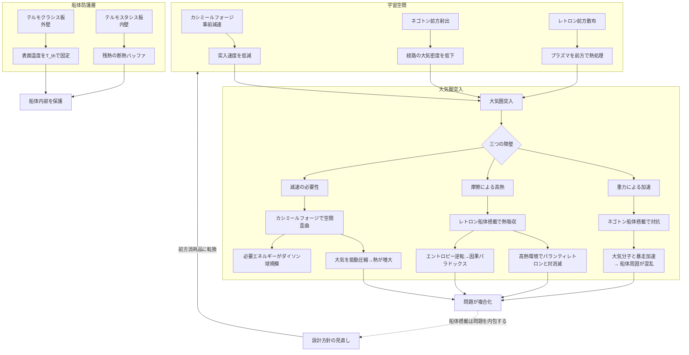

## 1. 概要 (Abstract)

宇宙から地上への降下——大気圏突入——は、宇宙輸送における「ラストワンマイル問題」の核心だ。宇宙空間では重量制限が事実上消えるが、大気圏に差しかかった瞬間に三つの物理的障壁が同時に復活する。**重力による加速**、**大気との摩擦による高熱**、そして**十分な減速**である。

> **前提:** WIIM世界観の架空粒子・装置——ネゴトン（g126）、カシミールフォージ（g133）、レトロン（g163）——を再突入に適用できると仮定する。
> **命題:** 「もしこれら三つを組み合わせて大気圏突入を行えば、宇宙船と積み荷を安全に地上へ届けられるか？」

この思考実験は「できる」という答えに辿り着かない。それぞれの粒子・装置が持つ根本的な不安定性が、解決しようとした問題よりも多くの問題を生み出すからだ。

---

## 2. 実現不可能性の根拠 (Infeasibility Rationale)

- **物理的限界:** ネゴトン（負の実質量）は正の質量を持つ大気分子と相互作用するたびに「暴走加速（runaway motion）」を引き起こす傾向がある。レトロンは局所的なエントロピー逆転を起こすことで時間の矢に逆行し、因果パラドックスを誘発する。どちらも大気という「正の質量・高エントロピーの嵐」の中でこそ最も不安定になる。

- **技術的限界:** カシミールフォージが空間を歪曲するために必要なエネルギーはカルダシェフスケール・タイプII文明（ダイソン球規模）相当とされる。大気圏突入のたびにダイソン球規模のエネルギーを消費する輸送手段は、コストの観点から実用に至らない。

- **論理的限界:** 三つを同時に使うと干渉が生じる。レトロンがエントロピーを吸収しようとする空間に、カシミールフォージが空間歪曲を加えると、歪曲バブルの境界でエントロピー勾配が急変し、レトロンがパランティレトロン（g161）と対消滅するリスクが高まる。問題を解くための道具が互いに打ち消し合う。

---

## 3. 実験の設定 (Setup)

1. **船体:** 中型輸送船。船体外壁にネゴトン場生成機を搭載し、機関部にカシミールフォージを内蔵する。
2. **冷却層:** 船体表面にレトロン散布システムを設置。再突入熱が発生するタイミングに合わせてレトロンを船体表面に放出する。
3. **突入条件:** 地球相当の惑星への軌道降下。初速は第一宇宙速度（約7.9 km/s）程度。
4. **目標:** 積み荷を破損させず、船体温度を通常の再突入（約1,600℃）より大幅に低く抑えて着陸する。

---

## 4. 考察と予測 (Speculation)

### ネゴトンによる重力制御——暴走の海へ

船体周囲にネゴトン場を形成すれば、地球の重力を「薄める」ことで降下速度の増加を抑えられると期待される。ネゴトンは負の実質量を持つため、正の重力場に対して反発力を生じる。原理上は成立する。

しかし大気圏に入った瞬間に問題が顕在化する。大気を構成する窒素・酸素は全て正の質量を持つ。ネゴトン場はこれら無数の気体分子と相互作用し、微小な暴走加速を至る所で引き起こす。船体近傍の大気が局所的に異常加速を始め、乱流どころか予測不能な衝撃波が船体を包む。ネゴトン場の強度を弱めれば暴走は収まるが、そうすると重力制御の効果も消える。グラビトーペイク（g129）の格子構造を緩衝材として配置する案も検討されるが、格子自体が大気分子と相互作用するため根本的な解決にはならない。

### カシミールフォージによる時空歪曲——大気が「邪魔」をする

カシミールフォージはアルクビエレドライブ（ワープドライブ）のバブル生成原理を応用し、船体周囲の空間を局所的に歪曲させることで速度を制御する装置だ。本来は超光速航法のためのものだが、バブルの前後非対称性を調整することで「ブレーキ」として使えるのではないか——という発想が生まれる。

引力方向への転用も理論上は可能と考えられる。バブルの収縮側を進行方向前方に設定すれば、空間が縮む方向に船を「引き込む」形の制御ができる。ただしこの場合、船体前方の空間が縮むと同時に、そこにある大気も圧縮される。通常の空力加熱でさえ手に負えないのに、さらに大気を能動的に圧縮すれば熱は桁違いに増大する。また、必要エネルギーがダイソン球規模という問題は消えない。これを大気圏突入のたびに使うことは現実的な輸送設計ではない。

### レトロンによる熱吸収——マクスウェルの悪魔は消える

大気圏突入で生じる熱は摩擦による運動エネルギーの変換——つまりエントロピーの増大そのものだ。レトロンは負のエントロピーを担う粒子であり、接触した系のエントロピーを吸収する。マクスウェルの悪魔を物理的に実現する存在として、再突入熱の吸収に使えると期待される。

しかし三つの壁が立ちはだかる。

第一に、レトロンが局所的にエントロピーを逆転させることは時間の矢に逆行することを意味し、遡及因果性を引き起こす。高熱環境（＝高エントロピー環境）ほどレトロンへの需要が高まるが、エントロピー逆転の幅が大きくなるほど因果パラドックスのリスクも増す。

第二に、レトロンを消耗品として使う場合、生成コストが吸収できるエントロピー量を上回る——これは第二種永久機関を求めることと等価であり、熱力学の壁に直面する（wiim_045 参照）。

第三が最も即座の問題だ。大気圏突入時の高温環境ではパランティ粒子（g161）が発生しやすいと考えられる。パランティレトロンと通常のレトロンが出会うと静かな対消滅（wiim_038）が起き、レトロンは使用される前に消滅してしまう可能性がある。

### 三つを同時に使うと

理論上、最も合理的な使用順序は次の通りだ。

1. **まずレトロンで熱を先に抑制する**（熱が発生する前に展開する）
2. **次にネゴトンで降下速度を緩和する**（重力を弱めて加速を抑える）
3. **最後にカシミールフォージで最終調整する**（着地直前の微調整）

しかしこの手順には根本的な矛盾がある。レトロンを展開した空間にネゴトン場を重ねると、負の質量（ネゴトン）が局所的なエントロピー逆転（レトロン）の影響を受けてエネルギー挙動が予測不能になる。さらにカシミールフォージが空間を歪曲すると、歪曲バブルの境界でエントロピー勾配が急変し、レトロンとパランティレトロンの対消滅を誘発するリスクがある。

三つの道具は単独で使っても限界があり、組み合わせると互いの弱点を増幅し合う。

### テルモスタシス・テルモクラシスという代替案

上記の三粒子が抱える問題——暴走加速・巨大エネルギーコスト・自己否定・因果パラドックス——はいずれも「自分自身を壊す」方向に働く。それに対し、コーラ粒子（g127）ベースの素材はより安定した熱対策を提供する可能性がある。

**テルモスタシス板（g194）**はコーラ粒子格子が隣接物質の格子振動固有値を書き換えられなくする「熱固定場」を発生させる。外部からの温度変化を極端に抑制するため、再突入熱が船体内部に侵入するのを防ぐ断熱バッファとして機能する。ただし吸収したエネルギーの行き先が未解明であり、長時間・高強度の再突入では蓄積限界に達する可能性が残る。

**テルモクラシス板（g195）**は逆方向の原理——自身の設定温度（T_th）を周囲に伝播させる。外壁に設置してT_thを適切な値に設定すれば、触れてくる高温プラズマを強制的にその温度へ引き下げることができる。共鳴結合が成立しない温度域では自動停止する自己制限機構があるため、際限なく冷却が暴走することもない。

三粒子と根本的に異なるのは、**これらが「自分を壊さない」**点だ。因果パラドックスも暴走加速も生じない。再突入の熱管理において最も現実的な選択肢はこちらだと考えられる。

### 架空粒子を「前方・宇宙側」に向けて使う

ネゴトン・レトロン・カシミールフォージの問題点の多くは「船体の周囲・内部で使う」ことから生じる。これらを**船体前方の空間や宇宙側に向けて使う消耗品**として割り切ることで、別の効果が得られる可能性がある。

**ネゴトンを前方に射出する：** 船が突入する前方の大気にネゴトン場を展開すると、正の質量を持つ大気分子が暴走加速反応を起こして前方から押し散らされる。船の通る経路の空気密度が局所的に下がり、摩擦熱の発生源そのものが減少する。暴走の混乱は船から離れた前方空間で起きるため、船体への直接被害を切り離せる。ただし前方大気の乱流は依然として船に追いつく可能性があり、完全な回避にはならない。

**レトロンを前方に散布する：** 船体表面ではなく突入経路の前方大気中にレトロンを散布すれば、高温プラズマが船体に接触する前に熱を吸収させることができる。船体上でパランティレトロンと対消滅するリスクは下がるが、高温プラズマ中での対消滅の問題は消えない。消耗品として大量に使う前提で設計すれば、ある程度の熱前処理として機能する余地はある。

**カシミールフォージを宇宙空間で使う：** 大気圏突入前の宇宙空間でフォージを使って速度を落としてから突入すれば、大気との相対速度が小さくなり発生する熱は大幅に下がる。エネルギーコストはどこで使っても同じだが、大気圧縮という二次問題は回避できる。宇宙空間には圧縮する大気が存在しないからだ。

**統合的な役割分担：** これらを組み合わせると、各要素が相互に補完する構造が見えてくる。

1. **カシミールフォージ（宇宙空間）** — 突入前に速度を下げる
2. **ネゴトン前方射出** — 突入経路の大気密度を局所的に下げる
3. **レトロン前方散布** — 残った熱の前処理
4. **テルモクラシス板（外壁）** — 船体表面温度をT_thでキャップ
5. **テルモスタシス板（内壁）** — 最終的な断熱バッファ

架空粒子を「船内で制御する技術」ではなく「前方に向けて捨てる消耗品」として扱うことで、自己否定・暴走・対消滅の問題を船体から切り離す発想の転換だ。コストと消耗品調達の問題は残るが、根本的な不安定性を船体内部に抱え込まずに済む。

---

## 5. 図解 (Diagrams)

---

## 6. 関連記事 (Related)

- [wiim_003](wiim_003.md) — 負の質量を持つ粒子による局所的時間加速（ネゴトン元記事）
- [wiim_010](wiim_010.md) — グラビトーペイク——重力波を遮断・散乱させる物質（ネゴトン格子の応用）
- [wiim_023](wiim_023.md) — カシミールフォージ——仮想粒子の増幅でエキゾチック物質を量産できたら
- [wiim_037](wiim_037.md) — レトロン——負のエントロピーを持つ粒子と因果の逆行
- [wiim_038](wiim_038.md) — 静かな対消滅——パランティ粒子による完全無効化
- [wiim_044](wiim_044.md) — テルモスタシス船体——コーラ粒子格子素材による宇宙熱管理の限界
- [wiim_045](wiim_045.md) — 恒温の二つの原理——コーラ粒子による拒絶型とレトロンによるエントロピー浄化型
- [wiim_013](wiim_013.md) — 空間を超越する粒子——コーラ粒子の仮説（架空粒子の挙動比較として）
