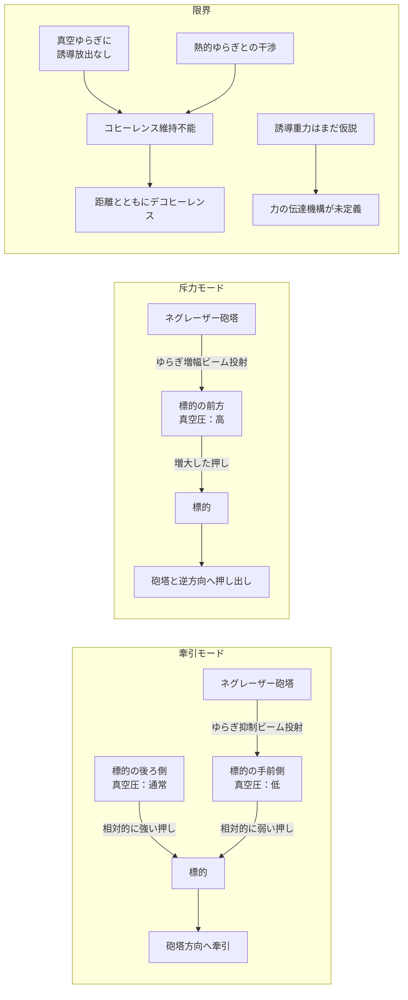

## 1. 概要 (Abstract)

実在するトラクタービームがある。**光学トゥイーザー**だ。位相の揃ったレーザー光の放射圧で、ミクロの粒子を非接触で捕捉・牽引できる。しかしこれは光圧の話であり、宇宙船や小惑星を動かす力には遥かに届かない。

wiim_031（真空非対称牽引ビーム）では、カシミール効果の「真空圧力の非対称」を指向性ビームとして投射することで、マクロスケールのトラクタービームを構想した。しかし抑制側（ゆらぎを減らして引き寄せる）の原理は示せても、増幅側（ゆらぎを増やして押し返す）の材料が欠けていた。

> **前提:** 真空ゆらぎをレーザーのように位相整合させてコヒーレントビームとして投射できると仮定する。
> **命題:** 「もし真空ゆらぎのコヒーレント化が実現したなら、同一の装置で牽引と反重力を切り替えるネグレーザー（g246）は機能するか？」

この思考実験は、光学トゥイーザーの真空版という現実的な着想から出発しながら、「真空に位相を揃える手段が存在するか」という根本問題に突き当たる。

---

## 2. 実現不可能性の根拠 (Infeasibility Rationale)

- **物理的限界:** 通常のレーザーは光子の誘導放出によってコヒーレンスを維持する。しかし真空ゆらぎには誘導放出に相当するメカニズムが存在しない——ゆらぎは場のゼロ点エネルギーとして全空間に等方的に満ちており、特定モードだけを「揃える」外部機構がない。仮に位相整合できたとしても、周囲の熱的ゆらぎとの相互作用でデコヒーレンスが起き、距離とともに急速に位相が乱れる。さらにカシミール力は距離の四乗で減衰するため、コヒーレント化による増幅がこの壁を越えられるかは疑わしい。

- **技術的限界:** 真空ゆらぎの特定モードだけを選択的に励起・増幅する「位相整合カシミール共振器」の設計は現状で理論的見通しがない。必要エネルギーはカシミールフォージ（g133）と同様にカルダシェフスケール・タイプII文明（ダイソン球規模）相当とされる。加えて牽引モードと斥力モードは「ゆらぎを抑制する」と「ゆらぎを増幅する」という全く逆の操作であり、同一装置での切り替えには根本的に異なる内部構造が必要になる。

- **論理的限界:** ネグレーザーの核心的前提は誘導重力（g149）——「重力＝真空ゆらぎ×物質の相互作用」という仮説だ。コヒーレントなゆらぎ場の投射が人工的な重力場の局所生成と等価になるのは、この仮説が成立する場合のみだ。誘導重力は現在も検証されていない。また仮に成立するとしても、コヒーレント化されたゆらぎが「力」として物体に伝達される媒介機構——光子・重力子等に相当するもの——が未定義のままだ。

---

## 3. 実験の設定 (Setup)

1. **装置:** カシミールフォージ（g133）派生の位相整合カシミール共振器を中核とするネグレーザー砲塔。牽引モードと斥力モードを切り替えられると仮定する。
2. **標的A（牽引実験）:** 軌道上の無人貨物コンテナ（数トン）。装置から100m離れた位置に設置。
3. **標的B（斥力実験）:** 同コンテナを今度は装置から押し離す方向で試験。
4. **標的C（人工重力実験）:** 宇宙船内部にネグレーザーを設置し、床方向に向けて連続放射。乗員が感じる擬似重力を計測。
5. **目標:** 三実験それぞれで意図した方向に力が発生するかを確認する。

---

## 4. 考察と予測 (Speculation)

### 光学トゥイーザーとの連続性——どこまで延長できるか

光学トゥイーザーは実在する。レーザー光を細く絞ったとき、焦点付近の光強度勾配が粒子を引き寄せる——これは光の電場が粒子の電荷分布に作用する勾配力だ。ネグレーザーの牽引モードはこれを「実光子の放射圧」から「コヒーレントな真空ゆらぎの圧力差」に置き換えたものと解釈できる。

両者の本質的な違いは「媒質の有無」だ。光は電磁場という明確な媒質を持ち、その振動が光子として伝播する。真空ゆらぎは場そのものがゆらいでいるのであって、「ゆらぎが移動する」ではない。コヒーレント化された真空ゆらぎが遠隔地に力として届くには、ゆらぎの状態が空間を通じて伝達される機構——事実上の新しい物理——が必要になる。

### ネゴトンとの本質的な違い

ネゴトン（g126）は負の実質量を持つ物質だ。物質を使うため、正の質量を持つ大気分子と相互作用するたびに暴走加速（runaway motion）が起き、大気圏内での制御が破綻する（wiim_063参照）。

ネグレーザーは空間状態——真空ゆらぎの分布——を操作する。ゆらぎは物質ではないため、大気分子と直接衝突しない。同じ反重力効果を求めるとき、ネゴトンが「物質と物質がぶつかる問題」を抱えるのに対し、ネグレーザーは「ゆらぎを遠隔地まで届かせる問題」を抱える。前者は制御不能な暴走、後者はデコヒーレンスという、問題の性格が根本的に異なる。

### 人工重力への転用可能性

誘導重力（g149）の枠組みが成立するなら、ネグレーザーは重力そのものの局所生成に使える。船内の床方向にネグレーザーを向けて連続放射すれば、乗員はその方向に引き寄せられ——つまり人工重力が生まれる。

この用途では牽引力が小さくても構わない。人間が感じる「1G」は9.8 m/s² の加速度だが、継続して発生させるだけでよく、瞬間的な大出力は必要ない。コスモシェル（g132）内のHaC居住施設では居住者の健康維持のために重力環境が不可欠であり、回転による遠心力（従来の人工重力案）に代わる方法としてネグレーザーが候補になりうる。

### 小惑星軌道制御（重力トラクタ）への応用

現実でも検討される「重力トラクタ」は、探査機が小惑星のそばに浮かんで重力で互いに引き合うことで軌道を徐々に変える技術だ。しかし探査機自身も引っ張られるため、スラスターで常に位置を保つ必要があり効率が悪い。

ネグレーザーなら装置と小惑星の間ではなく小惑星の後方にゆらぎ抑制域を形成し、後ろから「押す」形で軌道を変えられる可能性がある。力は微小でも、数年から数十年の連続印加で十分な軌道変更が実現できる。HaC計画（hac_replistar_plan参照）のアステロイド選定・移動フェーズでの活用候補として有望だ。

---

## 5. 図解 (Diagrams)

---

## 6. 関連記事 (Related)

- [wiim_031](wiim_031.md) — 真空非対称牽引ビーム（前提記事・抑制側の原理）
- [wiim_023](wiim_023.md) — カシミールフォージ（エキゾチック物質生成・ネグレーザーの基盤技術）
- [wiim_010](wiim_010.md) — グラビトーペイク（真空操作の防御的応用・対称概念）
- [wiim_003](wiim_003.md) — 負の質量を持つ粒子（ネゴトン・反重力の比較対象）
- [wiim_063](wiim_063.md) — 架空粒子による大気圏突入緩和（ネグレーザーの応用文脈）
- wiim_??? — 人工重力の生成——真空ゆらぎ制御による居住環境設計（未執筆）
