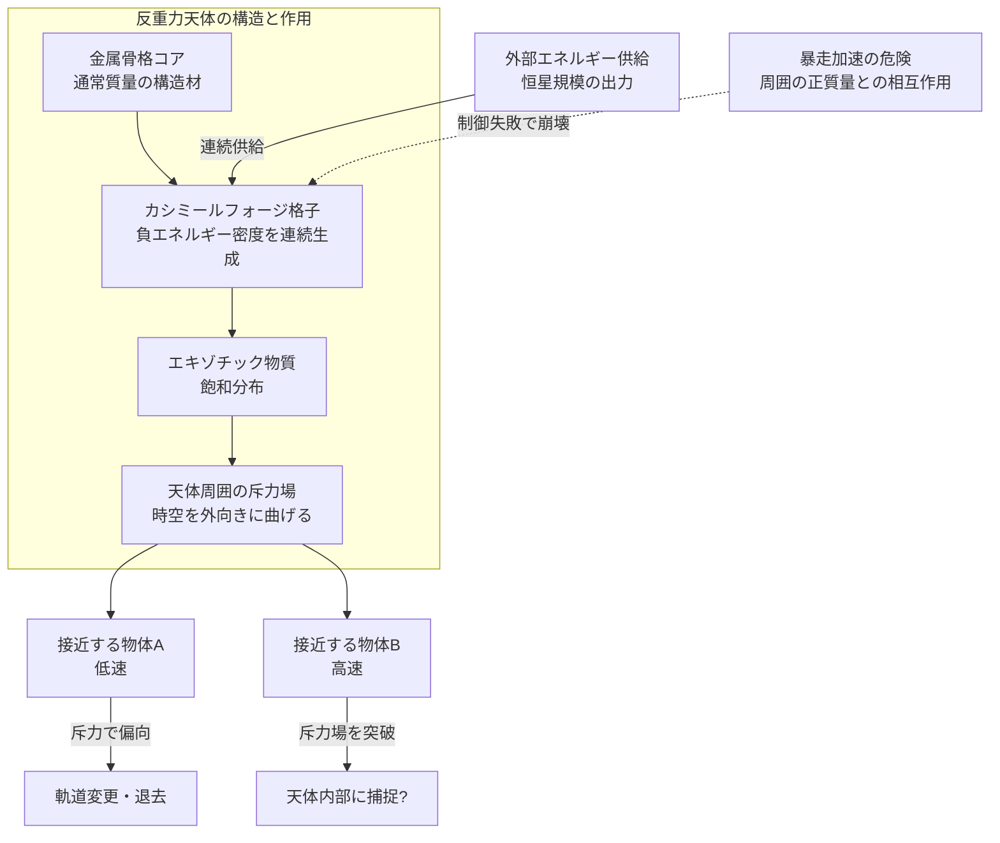

## 1. 概要 (Abstract)

重力はすべての質量が互いに引き合う力だ。現代物理学はこれを「物質が時空を曲げる」と記述し、その曲がり方は常に引力方向——内側へ、互いへ——を向く。

では、時空を逆方向に曲げる天体を人工的に作れるとしたら？

> **前提:** カシミールフォージ（g133）が惑星規模の出力でエキゾチック物質（g068）を連続生成できると仮定する。
> **命題:** 「もし天体スケールの構造物にエキゾチック物質を飽和させたなら、その天体は周囲に斥力場を放出し、接近する物体を押し返すか？」

ネグレーザー（wiim_064）が「ビームとして指向性の斥力を投射する」のに対し、この思考実験は「天体そのものが負のエネルギー密度の源となり、全方位的に斥力場を放つ」という問いだ。小惑星サイズの反重力天体が実現すれば、惑星防衛シールド・宇宙航行の反発ゲート・恒星系規模のエネルギー転換体として機能しうる。しかし現実の物理はこの構想に対して三つの層から抵抗する。

---

## 2. 実現不可能性の根拠 (Infeasibility Rationale)

### 物理的限界——エネルギー条件と時空の幾何

一般相対論では「エネルギー条件」と呼ばれる制約群が、物質が時空を曲げられる方向を縛る。特に「弱いエネルギー条件」は「どの観測者から見てもエネルギー密度は非負でなければならない」と主張し、「支配的エネルギー条件」はエネルギーの流れが因果的でなければならないと要求する。

斥力場を持つ天体はこれらを全て破る必要がある。カシミール効果（g009）は局所的に負のエネルギー密度を実現するが、それは2枚の金属板の「間」という極めて局所的・一時的な状態だ。量子不等式（フォード＝ローマン不等式）は、負のエネルギー密度が持続できる時間と空間の範囲に厳しい上限を設けており、天体スケールで維持するにはその上限を宇宙論的スケールで超える必要がある。

さらに、負の質量を持つ物体が正の質量の物体に近づくと「暴走加速（runaway motion）」と呼ばれる現象が生じ、エネルギー保存則が破綻する可能性がある。反重力天体が他の天体と相互作用するたびにこの暴走が始まれば、制御された斥力場という構想は崩壊する。

### 技術的限界——カシミールフォージの規模問題

カシミールフォージはワープドライブ用のエキゾチック物質生成を目的とした架空装置だが、その駆動には既にカルダシェフスケール・タイプII文明（ダイソン球 g034 規模）のエネルギーが必要とされる（wiim_023参照）。天体全体をエキゾチック物質で飽和させるには、それをはるかに上回る——おそらくタイプIII文明（銀河規模エネルギー）相当の——連続供給が必要になる。

加えて、エキゾチック物質は生成するだけでなく「安定した状態に維持」しなければならない。量子揺らぎの干渉、宇宙線の衝突、周辺の通常物質との相互作用により、負エネルギー密度領域は絶え間なく崩壊しようとする。この崩壊を食い止める材料工学・場の制御技術は、現在の物理学には存在しない。

### 論理的限界——「斥力場」概念の内部矛盾

通常の重力場は質量の分布から自然に生まれる。「重力場を持つ天体」とは「質量がある天体」の言い換えだ。しかし「斥力場を持つ天体」という概念は、その天体自身の内部でどのような構造が斥力を維持しているかを問わない限り、定義として不完全だ。

エキゾチック物質で満たされた天体の「質量」は正か負か？もし全体として負の有効質量を持つなら、その天体は自分自身を外側に向かって爆発的に飛散させる——つまり構造そのものが自壊する。内部の正エネルギー成分（構造材・装置）と負エネルギー成分（エキゾチック物質）のバランスを取らなければならないが、その均衡点の外側では斥力が消え、内側ではエキゾチック物質が過剰になって崩壊が加速する、という狭い均衡点の維持が求められる。

---

## 3. 実験の設定 (Setup)

1. **天体コア:** 直径2kmの小惑星サイズ金属骨格。内部にカシミールフォージを格子状に配置し、エキゾチック物質の分布を全体に均等化する制御システムを内蔵する。
2. **エネルギー供給:** 天体表面を覆う光電変換フィルムと、軌道上のパワービーム受信アンテナからの外部供給を組み合わせる。定常稼働には恒星1個分の出力が必要と見積もられる。
3. **試験シナリオA（静止斥力場）:** 天体を恒星系外縁部の安定軌道に置き、接近する実験用探査機（1トン）に対して斥力が働くか計測する。
4. **試験シナリオB（慣性遮断）:** 天体を惑星と恒星の間のラグランジュ点に設置し、惑星へ向かう小惑星の軌道を斥力場で自動的に偏向させる「惑星防衛シールド」として機能するか評価する。
5. **試験シナリオC（推進利用）:** 宇宙船が反重力天体を後ろに置くことで「坂を下りるように」斥力で加速できるか、その最大速度と燃料消費を比較する。

---

## 4. 考察と予測 (Speculation)

### ネゴトンとの設計上の違い

ネゴトン（g126）は負の実質量を「粒子」として持つ物質だ。粒子である以上、大気分子や構造材と直接衝突して暴走加速が起き、制御が破綻する（wiim_063参照）。

反重力天体はこれと異なるアプローチをとる。コアの構造材は通常の正質量物質とし、その「内部」にのみエキゾチック物質を封じ込める設計だ。外部から見た天体の「実効質量」を負にするのではなく、天体表面付近の空間の曲率を反転させること——つまり天体の外側に「時空を膨らませる」勾配を作ること——が目標だ。

この設計思想はネグレーザー（wiim_064）の「ゆらぎの分布を操作して力を生む」と同じ原理を、連続的な面的放射に拡張したものと言える。

### 惑星防衛への転用

現実に提案されている小惑星偏向技術の中で、いちばん穏やかなのが「重力トラクタ」——探査機が小惑星のそばに数年間浮かんで重力で軌道を変える——だ。しかし探査機自身も引っ張られるため効率が悪い。

反重力天体が機能するなら、これを迎撃対象小惑星の進行方向前方に置くだけで、接近するほど斥力が強まる自動偏向システムが実現する。HaC計画のアステロイド採掘・移動フェーズ（wiim_023参照）と組み合わせると、採掘済みの空洞小惑星を反重力天体コアとして再利用し、同一の構造物が採掘→惑星防衛→航路標識として機能する可能性がある。

### 恒星系規模の「反発ゲート」

恒星系への入口に反重力天体を置くと、外部から低速で接近する物体は強い斥力にぶつかり通過できない。一方、高速で接近した物体は斥力場の勾配が小さい時間に滑り込み、内側に入ると斥力が逆に加速方向に働いて「弾き出される」——スリングショット効果の斥力版になる。

この構成は意図せず一方向の「宇宙的関所」を生む。内側から外に出る際は後押しされ、外側から入るには非常に高い速度が必要になる。宇宙文明が恒星系の境界に斥力天体を置くなら、純粋な防衛目的か、または「飛び出す船を加速する」出口ブースターとして利用するかの二択になるだろう。

### 「反重力天体」が安定する唯一の条件

理論上、正の質量の殻の内部に負のエネルギー密度の球を封じ込めた「サンドイッチ構造」はワームホール（g036）と類似した幾何を持つ。ワームホールの喉を維持するエキゾチック物質がそのままこの天体の斥力源となり、天体全体がミクロのワームホールを大量に内包する「多孔性時空構造」として機能する可能性がある。

この場合、天体の外部には弱いながらも全方向的な斥力場が生じ、同時に天体の内部は通常よりもカーブの歪んだ時空となる。内部に入り込んだ物体は出られなくなるかもしれない——反重力天体が外側は排除し内側は捕獲する、矛盾した「裏返しのブラックホール」になる可能性が考察される。

---

## 5. 図解 (Diagrams)

---

## 6. 関連記事 (Related)

- [wiim_023](wiim_023.md) カシミールフォージ——仮想粒子の増幅でエキゾチック物質を量産できたら
- [wiim_031](wiim_031.md) 真空非対称牽引ビーム——誘導重力が正しければカシミール効果はトラクタービームになる
- [wiim_064](wiim_064.md) ネグレーザー——真空ゆらぎのコヒーレント化による引力・反重力ビームは実現できるか
- [wiim_063](wiim_063.md) 架空粒子による大気圏突入緩和——ネゴトン・カシミールフォージ・レトロンの限界と代替案
- [wiim_003](wiim_003.md) 負の質量を持つ粒子による局所的時間加速
- [wiim_010](wiim_010.md) グラビトーペイク——重力波を遮断・散乱させる物質の逆説
- [wiim_027](wiim_027.md) ストレンジスター・ワープゲート——重力チューニングによる固定式時空歪曲点
