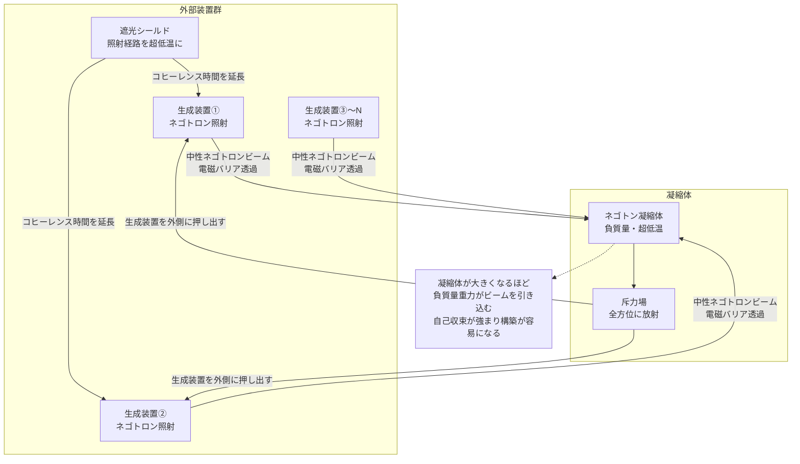

## 1. 概要 (Abstract)

反重力天体（wiim_065）の構想には根本的な構築問題があった。ネゴトン（g126）凝縮体を作るためには生成装置が必要だが、その装置は正質量を持つ。正質量物質が凝縮体に近づくと暴走加速（runaway motion）が発生し、装置ごと破壊されてしまう。「凝縮体を作る装置が、凝縮体によって壊される」という自己矛盾だ。

> **前提:** 正電荷と負電荷を持つネゴトンを対として生成し、電気的に中性の複合体——**ネゴトロン（g247）**——として束ねて照射できると仮定する。
> **命題:** 「もし球面状に配置した外部生成装置から全方位にネゴトロンビームを照射できるなら、生成装置が凝縮体の内部に入ることなく反重力天体を組み上げられるか？」

この構想の核心は「**生成装置は外側に留まる**」ことだ。ネゴトロンは電磁バリアを透過し、凝縮体の負質量重力に引き寄せられて中心に収束する。装置は正質量物質のまま安全な外部に留まりつつ、凝縮体だけを成長させられる。

---

## 2. 実現不可能性の根拠 (Infeasibility Rationale)

### 物理的限界——ネゴトロンの束縛問題

ネゴトロンは正電荷ネゴトンと負電荷ネゴトンの対だ。通常の電子と陽電子の対（ポジトロニウム）なら、異符号電荷同士の電磁引力で束縛される。しかしネゴトロンの構成粒子は**負の慣性質量**を持つ。

ここに根本的な逆転が起きる。負の慣性質量では、力の方向と加速の方向が逆になる（F=maのmが負）。異符号電荷の電磁引力は粒子を「互いに向かって引っ張る」が、負の慣性質量がその力への応答を逆転させ、粒子は**互いに遠ざかる方向に加速する**。電磁気力が事実上の斥力として機能してしまうのだ。

ネゴトロンを束縛できるのは、負質量同士が互いに引き合う**重力引力**のみとなる。しかし粒子2個の間の重力は電磁力の遥か下——標準模型の結合定数の比較では10⁴⁰倍以上の差がある。ネゴトロンはコヒーレンス時間が極めて短い、非常に脆い複合体と考えられる。

### 技術的限界——スケール・エネルギー・精度

ネゴトロン生成にはカシミールフォージ（g133）が必要であり、その稼働エネルギーは既にカルダシェフスケール・タイプII文明相当だ（wiim_023参照）。球面状に多数の生成装置を展開するとなれば、エネルギー要求はさらに増す。

照射精度も深刻な課題だ。凝縮体が成長して斥力場が強まると、正質量の生成装置は外側へ押し出され、照射距離が伸びる。距離が伸びればビームの発散が増し、収束精度が落ちる。さらにネゴトロンの短いコヒーレンス時間が、長距離飛行中の自然解離を招く。照射経路全体を超低温に保つための遮光シールドの展開は、それ自体が天体工学的な難事業だ。

### 論理的限界——成長の制御と停止

外部照射方式には「止め方」の問題がある。凝縮体が大きくなるほど生成装置を外側に押しやる力が増し、ネゴトロン供給を止めても凝縮体は慣性で成長を続ける可能性がある。

加えて、臨界質量を超えると凝縮体の斥力場が周辺の全天体に影響を及ぼし始める。恒星系内に置けば惑星軌道を乱す、恒星からの放射が偏向されるなど、設計外の影響が連鎖する。反重力天体は「作り始めたら制御不能になる兵器」になりうる——これは構築者の意図とは無関係な帰結だ。

---

## 3. 実験の設定 (Setup)

1. **第一段階（核の種）:** 直径10mのネゴトン凝縮体の「種」を事前に別の方法で用意する。この時点では暴走加速問題は残るが、スケールが小さいため影響が限定的だ。
2. **第二段階（装置の展開）:** 種を中心に、半径1000kmの球面上に100基のネゴトロン生成装置を等間隔で配置する。各装置にはスラスターと超低温シールドを装備する。
3. **第三段階（照射開始）:** 全装置から同期してネゴトロンビームを中心に向けて照射。コヒーレンス時間確保のため照射経路を極低温に冷却しつつ進める。
4. **第四段階（自己収束フェーズ）:** 凝縮体が成長するにつれて負質量重力が強まり、ネゴトロンが中心に引き寄せられる自己収束が始まる。装置は斥力で外側に押されながら、スラスターで距離を調整して照射を継続する。
5. **観測目標:** 凝縮体の質量（絶対値）が装置1基の質量と等しくなった時点での斥力場強度・装置の位置・ネゴトロンのコヒーレンス距離を計測する。

---

## 4. 考察と予測 (Speculation)

### 自己収束と自己保護の正フィードバック

外部照射方式の最も優れた性質は、成長するほど構築が容易になることだ。

凝縮体が小さい段階では、ネゴトロンの引き付ける力が弱く、精密な照射制御が必要だ。しかし凝縮体が大きくなると、負質量重力が「ビームを引き込む漏斗」として機能し始める。照射の方向が多少ずれても、凝縮体の引力が補正してくれる。銃で的を撃つよりも、川が海に流れ込むような収束だ。

同時に、斥力場が正質量物質を自動的に遠ざけるため、外部装置との接触ゼロが維持される。凝縮体が育つほど外部装置も安全になるという、建設と防御が同時に強化される構造だ。

### 遮光シールドの二重機能

照射経路を超低温に保つために展開する遮光シールドは、同時に**ネゴトロン生成装置のエネルギー問題を部分的に解決する**可能性がある。

恒星光を遮断した領域では温度が宇宙マイクロ波背景放射の2.7Kに近づき、さらに放射冷却を加えれば1K以下も可能だ。この超低温場でカシミールフォージが稼働すれば、熱的ノイズが低減されてエキゾチック物質の生成効率が上がると期待される。遮光シールドはネゴトロンのコヒーレンス維持と生成効率向上を同時に担う多機能構造体になる。

### 「反発ゲート」としての完成形

完成した反重力天体は恒星系の入口に設置する「反発ゲート」（wiim_065参照）として機能する。外部照射方式で運用する場合、外側に留まる生成装置群が「ゲートの骨格」を形成し、凝縮体が「斥力場の源」として中央に浮かぶ構成になる。

装置群が恒星系の外縁で太陽光を集めながら稼働し、凝縮体への継続的なネゴトロン補給を行う——これは太陽光を動力として反重力場を維持する、一種の「反重力ダイソン構造」として解釈できる。

### 万一の解体方法

建設よりも重要かもしれないのが、解体の手順だ。照射を停止すれば新しいネゴトロンの供給が止まる。凝縮体はその後、既存のネゴトンが持つ量子的な解離（ネゴトロンとは逆に、凝縮体内のネゴトン同士が何らかの理由で分離する過程）によって自然減衰するか、外部から正質量物質を少量接触させて制御的に崩壊させる方法が考えられる。後者は暴走加速を利用した「爆発的解体」であり、非常に危険だが最も確実だ。

---

## 5. 図解 (Diagrams)

---

## 6. 関連記事 (Related)

- [wiim_065](wiim_065.md) 反重力天体——エキゾチック物質とカシミールフォージで斥力場を生成できるか
- [wiim_023](wiim_023.md) カシミールフォージ——仮想粒子の増幅でエキゾチック物質を量産できたら
- [wiim_003](wiim_003.md) 負の質量を持つ粒子による局所的時間加速
- [wiim_010](wiim_010.md) グラビトーペイク——重力波を遮断・散乱させる物質の逆説
- [wiim_063](wiim_063.md) 架空粒子による大気圏突入緩和——ネゴトン・カシミールフォージ・レトロンの限界と代替案
- [wiim_064](wiim_064.md) ネグレーザー——真空ゆらぎのコヒーレント化による引力・反重力ビームは実現できるか
