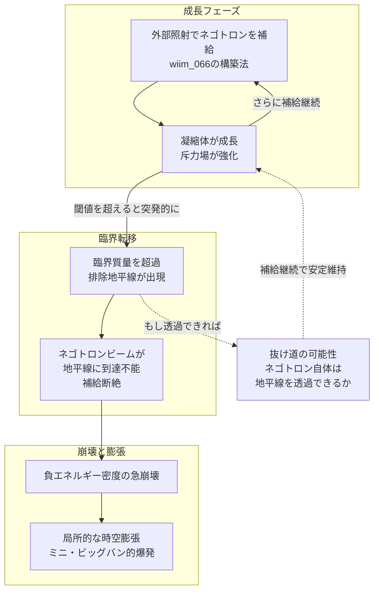

## 1. 概要 (Abstract)

ホワイトホールは一般相対論が許す時空の解だ。ブラックホールを時間反転させた構造で、内部からは何でも出てくるが、外部からは何も入れない。理論上は存在できるが、現実での観測例はなく、生成・維持の機構も不明のままだ。

wiim_066で論じたネゴトン（g126）凝縮体の外部照射構築法を極限まで推し進めると、この「侵入不能な天体」に物質的に近い構造が生まれうる。

> **前提:** wiim_066の外部照射方式でネゴトン凝縮体を臨界規模まで成長させられると仮定する。
> **命題:** 「もし凝縮体の斥力が光速相当に達する『排除地平線』が形成されるなら、その天体はホワイトホールと等価か？　そして地平線が閉じた瞬間、外部からのエネルギー供給が断絶して崩壊が起き、局所的なミニ・ビッグバンが発生するか？」

wiim_065が「反重力天体とは何か」を、wiim_066が「どう作るか」を問うたとすれば、この記事は「作り切ったとき何が起きるか」を問う三部作の最終章だ。

---

## 2. 実現不可能性の根拠 (Infeasibility Rationale)

### 物理的限界——排除地平線の形成条件

通常のブラックホールの事象の地平線はシュヴァルツシルト半径として記述される。正の質量Mを持つ天体では、この半径より内側では脱出速度が光速を超える。ネゴトン凝縮体の「排除地平線」はこの対称物として、侵入に必要な速度が光速に達する距離——言い換えれば光子ですら凝縮体に近づけなくなる境界——として定義できる。

しかしここで量子不等式（フォード＝ローマン不等式）が立ちはだかる。この不等式は「負のエネルギー密度を維持できる空間的広がりと持続時間の積に上限がある」と定める。排除地平線を形成するほどの規模で負のエネルギー密度を維持するには、この上限を天文学的スケールで超える必要がある。カシミール効果（g009）が局所的に負エネルギーを実現するとはいえ、その量は地平線形成に必要な規模の遥かに下だ。

さらに、負質量の「ネゴトン版シュヴァルツシルト解」が一般相対論の方程式として成立するかどうか自体が未解決問題だ。負のエネルギー密度はエネルギー条件を破るため、方程式の解が物理的に意味を持つかどうかの保証がない。

### 技術的限界——供給断絶の自己矛盾

wiim_066の外部照射方式は、排除地平線が「開いている」あいだしか機能しない。ネゴトロン（g247）ビームは電磁バリアを透過できるが、排除地平線は電磁力ではなく時空の幾何そのものによる侵入不能面だ。

排除地平線が形成された瞬間、外部からのネゴトロンビームは地平線に到達できなくなる。凝縮体への補給が絶たれる。負エネルギー密度は量子的に不安定であり、補給なしでは崩壊が始まる——つまり**地平線の完成が自身の崩壊の引き金を引く**。これは「完成した途端に壊れる構造物」という工学的な悪夢だ。

加えて、排除地平線スケールに達するまでに必要なエネルギーはカルダシェフスケール・タイプIII文明（銀河規模）を超えると見積もられる。wiim_066で論じた遮光シールドや自己収束機構を最大限に活用しても、この壁は越えられない可能性が高い。

### 論理的限界——ホワイトホールとの非等価性

一般相対論のホワイトホールは時空のトポロジーとして定義される。維持にエネルギーは不要で、時空構造そのものが「侵入を禁じる」。一方、ネゴトン凝縮体の斥力は物質の配置から生まれる——つまり**補給なしには維持できない人工構造物**だ。

真のホワイトホールは古典的には永続するが不安定だ（わずかな擾乱でブラックホールに転化するとされる）。ネゴトンホワイトホールは逆の意味で不安定だ——補給が続く限り成長し、補給が止まると崩壊する。「外から何も入れない」という効果は似ていても、物理的な根拠が全く異なる。この非等価性は、ネゴトンホワイトホールを真のホワイトホールの「代替物」とは呼べないことを意味する。

---

## 3. 実験の設定 (Setup)

1. **初期条件:** wiim_066の外部照射方式で育てたネゴトン凝縮体（直径1000km・質量絶対値が小惑星帯全体相当）を出発点とする。
2. **照射の継続:** 球面上の生成装置群からネゴトロンビームを継続照射し、凝縮体を臨界質量まで成長させる試みを行う。
3. **観測A（排除地平線の検出）:** 凝縮体周囲に光学プローブを配置し、特定距離から発した光が凝縮体方向に曲げられる（通常重力）のか、逆に遠ざけられる（反重力）のかを計測する。斥力が光速相当になった距離が排除地平線候補だ。
4. **観測B（供給断絶の瞬間）:** 排除地平線が形成された直後のネゴトロンビームの挙動を記録する。ビームが地平線で反射・屈折・消滅するかを観測する。
5. **観測C（崩壊過程）:** 補給断絶後の凝縮体の膨張・爆発・放射スペクトルを記録し、ビッグバンのインフレーション期との比較可能なデータを得る。

> **観測限界の注記:** 光学プローブ・検出器はすべて正質量物質であるため、排除地平線に近づくほど斥力場に弾かれ、観測可能な最近接距離に上限がある。地平線の直近データは原理的に取得できず、崩壊過程の観測も爆発余波が装置を押し流す危険を伴う。遠距離観測と間接的な重力波・電磁波スペクトルによる補完が不可欠だ。

---

## 4. 考察と予測 (Speculation)

### 排除地平線の「閾値」効果

凝縮体が成長するにつれて斥力場は単調に強まるが、排除地平線の形成は連続的な変化ではなく**閾値的な転移**として起きると考えられる。

通常物質でブラックホールを作る場合も、質量が臨界値を超えた瞬間に地平線が「出現」する。ネゴトンホワイトホールでも同様に、凝縮体の負質量絶対値が臨界値を超えた瞬間に排除地平線が出現し、その外側の時空の幾何が急変する。この転移は観測者にとって突発的な斥力場の強化として現れるだろう——周囲の天体が急に弾き飛ばされる現象だ。

### 崩壊とミニ・ビッグバン

排除地平線形成直後に補給が断絶し崩壊が始まる場合、何が起きるか。

凝縮体の内部に蓄積された巨大な負のエネルギー密度が急激に解放される。負エネルギー密度の崩壊は、その領域の時空が急激に「元に戻る」——つまり局所的な時空の膨張として現れる可能性がある。

これはインフレーション宇宙論における真空のエネルギーが急膨張を駆動する機構と構造的に似ている。ビッグバンの一部のモデルでは、初期宇宙が巨大なホワイトホールから物質を噴出したと仮説される。ネゴトン凝縮体の崩壊は、この「ホワイトホール的ビッグバン」を人工的に再現する試みの思考実験的類比となる。

ただし規模の差は圧倒的だ。ビッグバンは観測可能宇宙全体を生んだが、ネゴトン凝縮体が「小惑星帯全体の質量」程度では、生まれる「ミニ・ビッグバン」は恒星系内に局所的な高エネルギー爆発をもたらす程度に留まると推測される。

### ホワイトホールとの決定的な差——「抜け道」の存在

真のホワイトホールでは地平線を境に絶対的な侵入不可能性が成立する。しかしネゴトンホワイトホールには抜け道がある。

ネゴトロンは電磁バリアを透過するように、排除地平線を越えられる可能性がある——それは**ネゴトロン自身**だ。負質量の複合体であるネゴトロンは、凝縮体の負質量重力に引き寄せられるため、地平線が形成された後も内部に到達できるかもしれない。これは真のホワイトホールとの根本的な違いだ。もしこれが成立するなら、排除地平線形成後もネゴトロンビームによる補給が続けられ、「補給断絶による崩壊」シナリオは回避される——安定したネゴトンホワイトホールが維持できる可能性が開ける。

### ビッグバン起源論への接続

宇宙論の一部では「ビッグバンはブラックホール内部で生まれた別の宇宙」という仮説や、「ビッグバンはホワイトホールの爆発」という見方がある。ネゴトンホワイトホールの崩壊が空間膨張を引き起こすなら、この仮説に対して思考実験的な支持を与える。

さらに、もし初期宇宙に巨大なネゴトン凝縮体が存在したとすれば、その崩壊による時空膨張がインフレーション期の急膨張を説明する物質的メカニズムになりうる——現在の量子場理論によるインフレーション説（真空のエネルギーが膨張を駆動）とは別の、「物質的な反重力源が膨張を引き起こした」という競合仮説だ。

---

## 5. 図解 (Diagrams)

---

## 6. 関連記事 (Related)

- [wiim_065](wiim_065.md) 反重力天体——エキゾチック物質とカシミールフォージで斥力場を生成できるか
- [wiim_066](wiim_066.md) ネゴトン凝縮体の外部照射構築法——ネゴトロンビームで反重力天体を組み上げる
- [wiim_023](wiim_023.md) カシミールフォージ——仮想粒子の増幅でエキゾチック物質を量産できたら
- [wiim_003](wiim_003.md) 負の質量を持つ粒子による局所的時間加速
- [wiim_014](wiim_014.md) 宇宙のルート権限を奪取せよ——物理定数ハッキングによる超光速航法
