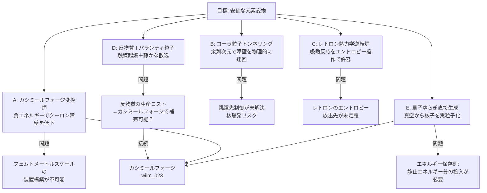

## 1. 概要 (Abstract)

錬金術師が夢見た「安価な元素変換」は、現代物理が明確に禁じている——しかしWIIM世界の架空粒子はその禁を破れるかもしれない。

> **前提:** WIIMの架空概念（カシミールフォージ・コーラ粒子・レトロン・パランティ粒子・量子ゆらぎ増幅）を核変換（g272）の機構として適用できると仮定する。
> **命題:** 「もしクーロン障壁（g271）を安価に回避できたなら、元素変換は日常的な資源生産技術になりえるか？」

元素変換の根本的な壁は**クーロン障壁**だ。同じ正電荷を持つ原子核を核力の届く距離（約1フェムトメートル）まで近づけるには、太陽中心（約1500万K）あるいは人工核融合炉（1億K以上）に匹敵するエネルギーが必要となる。現在唯一「安価な触媒」として実在が確認されているのはミュオン触媒核融合（g273）だが、エネルギー収支は赤字のままだ。

本記事ではマイコプラズマギカ（g130）の生物的核変換とは異なる、**物理的・工学的アプローチ**を5つ比較し、どれがどの問題をどこまで解決できるかを論じる。

---

## 2. 実現不可能性の根拠 (Infeasibility Rationale)

- **物理的限界:** クーロン障壁の高さはMeVオーダー（百万電子ボルト）。化学反応（eVオーダー）と比べて約100万倍のエネルギー差がある。量子トンネル効果（g097）は原理的にこの壁をすり抜けられるが、核子（陽子・中性子）のような重い粒子はトンネル確率が質量の指数乗で減衰するため、常温での自発的な核融合は事実上起きない。太陽ですら量子トンネルだけでは核融合反応が極めて遅く、超高温との組み合わせで初めて実用的な出力が生まれる。

- **技術的限界:** 現実の核変換技術——加速器・核融合炉・原子炉中性子照射——はいずれも莫大なエネルギーと設備を必要とし、「安価」とは程遠い。ミュオン触媒核融合（g273）は常温付近で動作する唯一の実在例だが、ミュオン1個あたりの触媒回数が有限（約100〜300回）で、生産コストが得られるエネルギーを上回る。これが「アルファ固着問題」と呼ばれる壁だ。

- **論理的限界:** クーロン障壁を下げることは、意図しない核反応も誘発しやすくなることを意味する。反応の「選択性」——どの原子核をどの元素に変換するかの制御——は、障壁を下げるほど困難になる。安価化と制御性はトレードオフの関係にあり、どちらかを得ると必ずもう一方が難しくなる。

---

## 3. 実験の設定 (Setup)

1. **対象:** 水素→炭素・窒素・鉄・金など、軽元素から任意の元素への核変換を目標とする。
2. **評価軸:** 制御のしやすさ・エネルギー効率・安全性・既存WIIM設定との整合の4軸で各アプローチを比較する。
3. **共通制約:** エネルギー保存則は満たすこと。「無から質量を生む」ことは問わないが、エネルギー収支の帳尻は最低限議論する。

---

## 4. 考察と予測 (Speculation)

### アプローチA：カシミールフォージ型変換炉

カシミールフォージ（wiim_023）が生成する負エネルギー密度ポケットを核反応点に適用する。カシミール効果は真空中の電磁モード密度の非対称性から生まれ、カシミールフォージはこれを人工的に増幅してエキゾチック物質を生成する装置だ。この負エネルギー領域がクーロンポテンシャルを実効的に引き下げると仮定すると、核同士が接近するのに必要な温度・エネルギーが劇的に低下しうる。

装置として設計できるため、生物的制約がなく制御性は5手法中最も高い。しかし本質的な問題として、クーロン障壁を有意に下げるために必要な板間距離はフェムトメートルスケール（核子の大きさ自体と同等）であり、マクロな装置への拡張経路が現行物理にはない。

### アプローチB：コーラ粒子による余剰次元トンネリング

コーラ粒子（g013）は余剰次元を経由して空間的距離を実質ゼロにする性質を持つ。同様の性質を陽子・中性子に付与できれば、クーロン障壁を物理的に「迂回」させることができる——距離がゼロなら障壁を越える必要がそもそもない。

このアプローチは原理的にエネルギー消費を最小化できる点で魅力的だ。しかし「どの核へ跳躍するか」の制御が未解決で、ランダムな空間跳躍が核破砕の連鎖を引き起こせば核爆発と区別がつかなくなる。コーラバブルワープ（wiim_032）での制御問題が核スケールで再現されるイメージだ。安全性は5手法中最も低い。また、余剰次元を経由して核子の位置を変換する際、余剰次元側でどのようなエネルギー収支が生じるかは未定義のままだ——問題を「回避」しているのか「余剰次元へ先送り」しているのかが設定上の重要な問いとして残る。

### アプローチC：レトロン熱力学逆転炉

核変換には2種類のエネルギー収支がある。鉄（Fe）より軽い元素への核融合は**発熱**（エネルギーを放出）だが、鉄より重い元素の合成は**吸熱**（エネルギーを消費）だ。金・ウランなどの重元素を合成しようとすると、星の爆発（超新星）規模のエネルギーが必要になる。

レトロン（wiim_037）は局所的に熱力学の矢を逆転させ、エントロピーを減少させる粒子だ。吸熱反応の「進みにくさ」はエントロピー増大則に由来するため、レトロンで局所エントロピーを抑制すれば重元素合成を熱力学的に「許容」状態へ持ち込める可能性がある。エネルギー保存則には抵触しないが、減少したエントロピーは必ずどこかへ放出されなければならず、レトロン自身が何を犠牲にするかの設定が課題として残る。静かな反応という意味では安全性が最も高い。

### アプローチD：反物質触媒＋パランティ粒子安全機構

反物質（g067）の反陽子は陽子と衝突すると対消滅エネルギーで核破砕を連鎖的に引き起こす（反陽子触媒核変換）。これは現実に研究されている手法で、少量の反物質が大量の核変換を起爆できる「触媒」として機能する。

WIIMではここにパランティ粒子（g161）を組み合わせる。パランティ粒子は対消滅を「静かな消滅」に変換し、余剰エネルギーの爆発的放出を抑制する（wiim_038）。この2者の連携によって、反物質触媒の威力を保ちながら爆発的なエネルギー放出を制御可能な形に整流できる可能性がある。最大のボトルネックは反物質の生産コストだが、カシミールフォージが真空から反粒子を生成できるという設定（wiim_023との接続）があれば、この障壁は原理的に突破できる。エネルギー効率は対消滅の高効率を活かして5手法中最高になりうる。

### アプローチE：量子ゆらぎからの直接核子生成

「変換」でなく「生成」という根本的に異なる軸。真空ゆらぎ（量子揺らぎ）から粒子対が実粒子として取り出されるには、極めて強い外部エネルギー場が必要だ——これは「Schwinger機構」（強電場による対生成）として理論的に知られており、カシミール効果そのものとは別物である点に注意が必要だ。カシミール効果は真空の電磁モード密度の変化であり、エネルギーを「生産」するのではなく「配置エネルギーを解放」するに過ぎない。カシミールフォージがこのSchwingerメカニズムを局所的に再現する規模の増幅を実現できると仮定すると、特定の質量・電荷を持つ核子を真空から引き出し、変換の起点となる原子すら不要にできる可能性がある。

ただしエネルギー保存則は厳格に成立する。陽子1個を真空から生成するには、その静止エネルギー（約938MeV）に相当するエネルギーの投入が必要だ。「無から作れる」わけではなく、「どこからエネルギーを引き出すか」という問いは残る。宇宙に遍在するゼロ点エネルギーをどこまで引き出せるかはWIIM的な未解決問題であり（wiim_039との接続点）、「生成源としての真空」という概念の整合性が問われる。

### 哲学的な問い

- 元素変換が日常技術になった世界では、「希少元素」という概念が消える。希少性に価値の根拠を置く経済システムはどう変容するか？
- クーロン障壁を任意に下げられる技術は、同時に核兵器の製造障壁を消す技術でもある。「安価な核変換」の解放は必然的に「安価な核兵器」の解放を意味するか？

---

## 5. 図解 (Diagrams)

---

## 6. 関連記事 (Related)

- [wiim_023](wiim_023.md) — カシミールフォージ——仮想粒子の増幅でエキゾチック物質を量産できたら
- [wiim_024](../biology/wiim_024.md) — マイコプラズマギカ——最小生命体による生物的核変換が可能な世界（生物的アプローチとの比較）
- [wiim_037](wiim_037.md) — レトロン——負のエントロピーを持つ粒子と因果の逆行
- [wiim_038](wiim_038.md) — 静かな対消滅——パランティ粒子による完全無効化
- [wiim_039](../quantum/wiim_039.md) — 量子永久機関——非対称カシミール板と真空エネルギーの搾取
- [wiim_068](../biology/wiim_068.md) — マイコプラズマギカと宇宙菌糸知性の共生——深宇宙で「何でも作れる」生態系は成立するか
