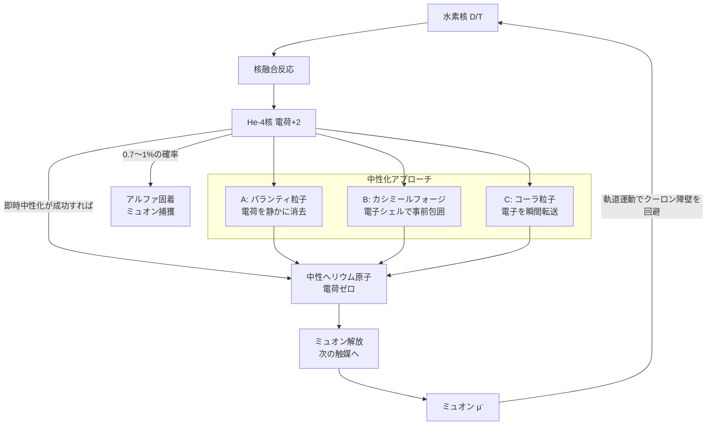

## 1. 概要 (Abstract)

常温核融合の唯一の実在する扉——ミュオン触媒核融合——は、生まれた瞬間に自分の産物に足をすくわれる。その呪縛を断ち切れるか。

> **前提:** 核融合の直後、生成されたヘリウム-4核（アルファ粒子）を電気的に中性化する機構をWIIM世界の架空概念で実装できると仮定する。
> **命題:** 「もしアルファ固着（g274）を完全に防げたなら、ミュオン触媒核融合は常温核融合炉として実用化するか？」

ミュオン触媒核融合（g273）は、ミュオン（電子の約207倍の質量を持つ素粒子）がクーロン障壁（g271）を回避しながら水素の核融合を触媒する手法だ。加熱も閉じ込めも不要で、原理的には常温付近で核融合反応が起きる——現実に存在する唯一の「常温核融合」だ。

しかし1つの宿命的な問題がある。核融合で生まれたヘリウム-4核は正電荷+2を帯びており、負電荷を持つミュオンをその電磁力で引きつけて捕獲してしまう。これがアルファ固着問題だ。約0.7〜1%の確率で起きるこの捕獲により、ミュオン1個が触媒できる反応回数は平均100〜300回に限られ、エネルギー収支は赤字のままだ。

もし核融合の瞬間にヘリウム-4核へ電子2個を即座に与えて中性の**ヘリウム原子**にできれば、ミュオンは電磁的な「引力」を感じなくなり、固着確率は理論上ゼロになりうる。本記事ではこの「即時中性化」をWIIM世界の3つの架空概念で実装する可能性を論じる。

---

## 2. 実現不可能性の根拠 (Infeasibility Rationale)

- **物理的限界:** ヘリウム-4核が生成されてからミュオンが捕獲されるまでの時間は、フェムト秒（10⁻¹⁵秒）以下のスケールだ。この時間内に電子2個をオングストローム以下の精度で核に届けるには、実質的に光速を超えた情報伝達が必要になる。プラズマ中を漂う通常の電子がこの制約時間内に「偶然に近づく」確率は核融合反応の確率と同程度かそれ以下であり、システマティックな解決策にならない。

- **技術的限界:** 核融合点は極めて高いエネルギー密度を持つ環境であり、電子を供給しても瞬時に熱エネルギーで剥離されてしまう。また「今まさに生成されたHe-4核」をどう識別して標的にするかという問題がある。量子的に同一な粒子を個別に識別することはハイゼンベルクの不確定性原理の観点から制約があり、「このHe-4核だけを中性化する」という操作の精度保証は困難だ。

- **論理的限界:** ミュオンのアルファ固着は量子的な確率過程であり、「捕獲が起きる前に中性化を完了する」には中性化プロセスが捕獲プロセスより必ず先に完了することを保証しなければならない。しかし量子力学的には捕獲と中性化の「どちらが先か」自体が確率分布を持つ。因果の順序を量子的確率過程で制御するのは、決定論的な介入を量子の不確定性の上に重ねるという構造上の矛盾を含む。

---

## 3. 実験の設定 (Setup)

1. **反応系:** 重水素（D）と三重水素（T）または重水素同士（D-D）のミュオン触媒核融合反応を対象とする。生成物はHe-4核（アルファ粒子）と中性子。
2. **目標:** He-4核が生成された直後、ミュオンが捕獲される前に電子2個を付与して中性ヘリウム原子にする。
3. **評価:** 3つのWIIMアプローチ（パランティ粒子・カシミールフォージ・コーラ粒子）について、(a) 制約時間内の応答可能性、(b) 設定上の整合性、(c) 実現した場合の効果を比較する。

---

## 4. 考察と予測 (Speculation)

### アプローチA：パランティ粒子による電荷静消

パランティ粒子（g161）は対消滅を「静かな消滅」に変換する粒子だ（wiim_038）。その本質は「激烈なエネルギー放出を伴う過程を静寂化する」ことにある。この機能を「正電荷の静かな消去」へ拡張することは、設定の自然な延長として考えられる。

核融合直後にパランティ粒子がHe-4核の+2電荷と反応し、電荷を爆発的なエネルギー放出なしに消去する。結果としてHe-4核は電気的に中性な状態へ移行し、ミュオンが引きつけられる対象が消える。

この手法の利点は「電子を外から供給しない」点だ。電荷そのものを消去するなら、電子を時間内に届けるという物理的制約を迂回できる。ただし現行設定でパランティ粒子は「反粒子との対消滅の静寂化」を主機能としており、「正電荷の消去」への拡張は設定改訂が必要だ。また消去された電荷エネルギーの行き先——どこへ何が放出されるのか——の整合性も詰める必要がある。

### アプローチB：カシミールフォージによる電子シェル包囲

カシミールフォージ（wiim_023）は真空の電磁モード密度を局所的に操作してエキゾチック物質を生成する装置だ。本来の機能は負エネルギー密度の場を生成することだが、ここではその拡張用途として、核融合点の周囲に電子リッチな負エネルギー領域——「電子シェル」——を事前形成しておくという設定を仮定する。

核融合が起きた瞬間、生成されたHe-4核はすでに電子シェルの内部に存在する。電子は「届ける」のではなく「あらかじめ包囲している」ため、応答時間の制約を原理的に迂回できる。Schwinger機構（強電場による実粒子対生成）に近いメカニズムで、シェル内の負エネルギー場が電子を実粒子化してHe-4を包む。

問題はカシミールフォージの生成物がエキゾチック物質（負エネルギー密度を持つ）であり、通常の電子とは異なる存在であることだ。「負エネルギー電子」でHe-4を中性化した場合、生成されるヘリウム原子が通常の原子と同じ振る舞いをするかは未定義の領域になる。

### アプローチC：コーラ粒子による電子瞬間転送

コーラ粒子（g013）は余剰次元を経由して空間的距離を実質ゼロにする（wiim_013）。コーラ粒子チャネルを通じてどこか別の場所に蓄えた電子を「核融合の瞬間」にHe-4核の座標へ転送すれば、光速の制約を受けない応答が原理的に可能だ。

電子の「貯蔵庫」をあらかじめ用意しておき、核融合を検出した瞬間にコーラ粒子チャネルを開いて2個の電子を転送する——という制御系として設計できる。この手法は電荷を消去するのでなく正規の電子を供給するため、生成されるヘリウム原子の物理的性質は通常と同じになる。

再び浮上するのはコーラ粒子の「跳躍先制御」問題だ（wiim_069）。電子の転送先をHe-4核の位置にサブオングストローム精度でピンポイント指定する機構が必要で、この制御精度をどう実現するかは未解決のまま残る。また、余剰次元を経由した転送は「余剰次元側のエネルギー収支」という問題を先送りにしているにすぎず、電子が余剰次元を通過する際に余剰次元側でどのような代償が生じるかは設定として未定義だ。

### 即時中性化が実現した場合の連鎖効果

3つのアプローチのいずれかが機能した場合、ミュオン触媒核融合に何が起きるかを考えると、変化は劇的だ。

ミュオンのアルファ固着が排除されると、触媒サイクルを止める要因がなくなる。ミュオン自体の寿命は約2.2マイクロ秒であり、この時間内に触媒できる回数が理論的な上限となる。反応1回あたり約10⁻¹⁰秒かかるとすると、理論上限は約2万2000回——現在の100〜300回から2桁近く伸びる計算だ。エネルギー収支は黒字に転じ、常温核融合炉としての実用化が視野に入る。

さらに、核融合の連続触媒が可能になれば、核変換（g272）の工業的応用への道も開ける。水素系燃料の核融合エネルギー取り出しだけでなく、アルファ凝縮（g275）状態の核を標的にした低エネルギー元素変換炉として、マイコプラズマギカ（g130）の生物的核変換に依存しない工学的な代替手段が誕生しうる。

### 哲学的な問い

- ミュオン触媒核融合が「電荷中性化」という一点の工夫で実用化するとしたら、現代物理学はなぜ70年近くこの解を見つけられなかったのか？問題の本質は技術的難題なのか、それとも「問いの立て方」が誤っていたのか？
- エネルギー問題が解決した世界では、希少資源の争奪という現代文明の根本的な対立構造が消える。その先に現れる対立軸は何か？

---

## 5. 図解 (Diagrams)

---

## 6. 関連記事 (Related)

- [wiim_069](wiim_069.md) — 架空粒子で元素変換は安価になるか——クーロン障壁を回避する5つの思考実験
- [wiim_023](wiim_023.md) — カシミールフォージ——仮想粒子の増幅でエキゾチック物質を量産できたら
- [wiim_038](wiim_038.md) — 静かな対消滅——パランティ粒子による完全無効化
- [wiim_024](../biology/wiim_024.md) — マイコプラズマギカ——最小生命体による生物的核変換が可能な世界
- [wiim_068](../biology/wiim_068.md) — マイコプラズマギカと宇宙菌糸知性の共生——深宇宙で「何でも作れる」生態系は成立するか
