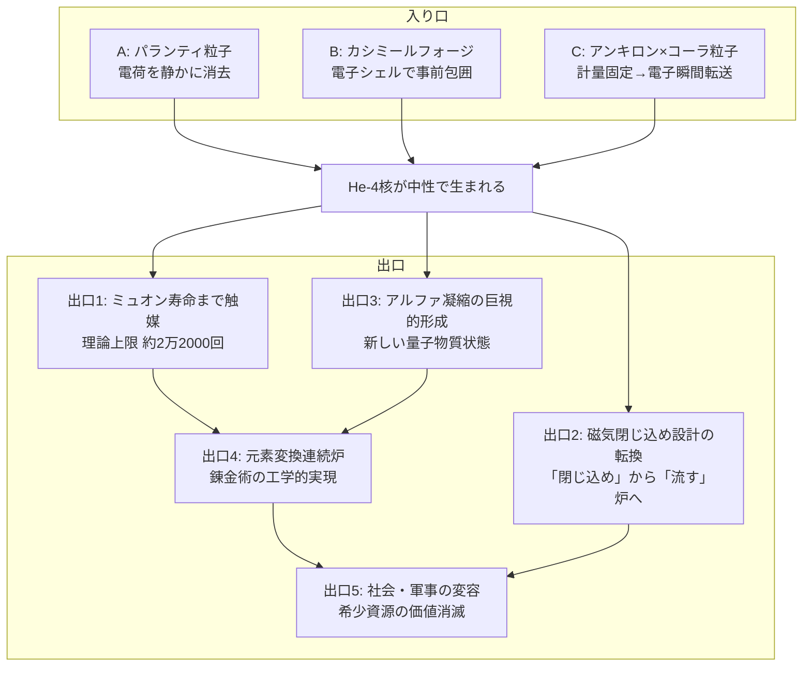

## 1. 概要 (Abstract)

ヘリウム-4核が「電荷ゼロ」で生まれる世界では、物理・工学・文明のどれが最初に変わるか。

> **前提:** wiim_070 で論じた3つの手段——パランティ粒子・カシミールフォージ・アンキロン×コーラ粒子——のいずれかによって、核融合生成物のヘリウム-4核が電気的に中性な状態で生まれると仮定する。
> **命題:** 「もし核融合生成物が電荷ゼロで生まれるなら、ミュオン触媒核融合から始まる連鎖はどこまで世界を変えるか？」

ミュオン触媒核融合（g273）のアルファ固着問題（g274）は、核融合で生まれたヘリウム-4核の正電荷（+2）がミュオンを電磁的に捕獲してしまうことに起因する。本記事ではその「入り口」——中性化の手段——を前提として受け取り、**「出口」として何が変わるか**に考察の重心を置く。

変化は単なるエネルギー収支の改善にとどまらない。中性粒子としてのヘリウム-4が生まれることは、核融合炉の設計思想から、物質の新しい量子状態、元素変換の工業化、そして深宇宙での資源生産まで、連鎖的に開いていく。

---

## 2. 実現不可能性の根拠 (Infeasibility Rationale)

中性化の手段を与えても、「出口」が自動的に成立するわけではない。各帰結にはそれぞれ固有の障壁が残る。

- **物理的限界:** 中性のHe-4が生成されても、ミュオン自体の寿命は約2.2マイクロ秒で変わらない。ミュオンを生産するために必要なエネルギーは依然として膨大であり、中性化だけで「触媒1個あたりのコスト」が消えるわけではない。黒字化には触媒回数の劇的な増加と同時に、ミュオン生産コストの別途削減が必要だ。

- **技術的限界:** 中性のHe-4は電磁場で制御できない。これは「閉じ込め不要」という利点と同時に、「生成物を回収・方向制御できない」という根本的な問題でもある。中性粒子の制御は中性子工学に近い技術基盤を要求し、既存の核融合工学の延長では対応できない。

- **論理的限界:** 中性化機構を炉内のすべての反応点で常時維持するには、パランティ粒子・カシミールフォージ・コーラ粒子のいずれも炉全体をカバーする密度で動作させなければならない。その維持エネルギーが核融合の収益を上回る可能性がある——中性化コストが再びエネルギー収支を赤字に引き戻す逆説だ。

---

## 3. 実験の設定 (Setup)

1. **入り口（前提として与える3手段）:**
   - **A: パランティ粒子（g161）** — He-4の+2電荷を静かに消去する。電子供給でなく電荷消去のため、応答時間の制約を迂回できる（wiim_070）。
   - **B: カシミールフォージ（wiim_023）** — 核融合点の周囲に電子シェルを事前形成し、He-4が生まれた瞬間に包囲する拡張用途（wiim_070）。
   - **C: アンキロン（wiim_022）× コーラ粒子（g013）** — アンキロンが核融合点の計量テンソルを固定し、コーラ粒子がその座標を参照して電子を余剰次元経由で瞬間転送する。アンキロンは物質を直接捕捉できないが（計量への固着のみ）、コーラ粒子の跳躍先を計量レベルで誘導する間接的な組み合わせとして機能しうる（wiim_070）。

2. **出口（本記事の主題）:** A・B・Cいずれかが機能し、He-4が中性で生まれる状況を与件として、何が変わるかを5段階で論じる。

---

## 4. 考察と予測 (Speculation)

### 出口1：ミュオン触媒の寿命解放

アルファ固着が排除されると、ミュオンを止める要因がなくなる。ミュオンの寿命は約2.2マイクロ秒であり、反応1回あたり約10⁻¹⁰秒とすると理論上限は約2万2000回——現在の100〜300回から約100倍だ。

この跳躍によってエネルギー収支は黒字に転じ、常温付近で動作する実用的な核融合炉が初めて視野に入る。ミュオン生産コストはなお課題として残るが、1個のミュオンが2万回以上の核融合を触媒できるなら、生産コストを薄める計算が大幅に改善される。

### 出口2：磁気閉じ込め概念の崩壊と再構築

トカマク型をはじめとする従来の核融合炉は「プラズマを強力な磁場で閉じ込める」という発想を根幹に持つ。膨大なエネルギーを閉じ込め磁場の生成と維持に消費する。なぜHe-4を閉じ込めるかには複合的な理由があるが、最も重要なのは**アルファ加熱**だ。D-T核融合で生成されたHe-4は3.5 MeVの運動エネルギーを持ち、プラズマ内に留まることでプラズマ自体を加熱する——これが「燃焼プラズマ」の自己持続を支える。中性のHe-4が炉外へ飛び出してしまえば、このアルファ加熱が失われる。

しかし、これは**常温核融合が成立していることを前提とすれば消える問題**だ。そもそも中性化の目的はアルファ固着を排除してミュオン触媒核融合を実用化することにあり、ミュオン触媒核融合は常温付近で動作する。維持すべき高温プラズマが存在しないため、アルファ加熱という概念が最初から不要になる。論理の流れは「中性化→常温核融合が成立→プラズマ不要→アルファ加熱も不要→中性He-4が飛び出すことが純粋な利点になる」と一本に通じる。

中性のHe-4が炉壁・遮蔽材に衝突して3.5 MeVを熱として落とすのは、中性子の14.1 MeVを遮蔽材で回収するのと同じ仕組みであり、損失ではなく収益だ。設計思想は「閉じ込めてエネルギーを搾り出す」から「生成物を自然に流して熱として受け取る」へ転換する——磁場閉じ込めに投じていたエネルギーが解放され、炉全体の効率は大幅に改善される。

### 出口3：アルファ凝縮の巨視的形成

ヘリウム-4（He-4）はスピン0のボソン（ボース粒子）だ。中性の状態で大量に生成されると、互いに電磁的に反発する必要がなくなり、ボース＝アインシュタイン凝縮に似た量子集団状態——アルファ凝縮（g275）——が巨視的スケールで形成される可能性がある。

これは核物理と量子統計の交点に現れる、現在の物理学では観測されていない新しい物質状態だ。炭素-12のホイル状態（3個のアルファ粒子が希薄なガス状クラスターを形成する励起状態）の人工的な巨視化版として理解できるかもしれない。このアルファ凝縮体が何らかの特殊な物性——超流動的挙動・特異な熱伝導・量子コヒーレンスの長距離伝播——を持つかは完全に未知の領域だ。

### 出口4：元素変換連続炉——錬金術の工学的実現

出口1〜3が積み重なると、核融合を「元素変換の一ステップ」として連鎖させる連続炉が原理上成立する。ミュオンが寿命まで触媒し続ける環境では、D-D融合→He-4→He-4の重ね合わせ→より重い核種へ、という変換ステップを炉内で制御しながら繰り返すことができる。

鉄より重い元素の合成は吸熱プロセスであり（wiim_069）、エネルギーの持ち出しが必要だ。しかしミュオン触媒核融合の発熱を外部から供給する形にすれば、重元素合成炉は自己エネルギーで動作できる可能性がある。錬金術師が夢見た「任意の元素を作る技術」が工学システムとして成立する。

マイコプラズマギカ（g130）の生物的核変換が「生命が持つ元素変換能力」なら、この連続炉は「機械が持つ元素変換能力」——2つのアプローチが核変換（g272）という共通の目標に異なる方向から到達する。深宇宙での資源生産（wiim_068）への接続点として、コズミックマイスとの共生に依存しない工学的代替手段が誕生する。

### 出口5：社会・軍事への波及

核融合エネルギーが日常インフラになった世界で、元素変換が製造技術として確立されると、希少資源の地政学的価値が消える。レアアース・貴金属・放射性元素のすべてが「合成可能な素材」になるからだ。現代の資源争奪に根ざした国家間対立の構造は根本から変容する。

軍事面での含意はより複雑だ。中性粒子は電磁的な探知が困難であり、核融合の連鎖制御も従来と異なる機構が必要になる。核抑止論は「相互確証破壊」を前提とするが、中性核融合生成物の登場はその前提に亀裂を入れる可能性がある——防御と攻撃のどちらが先に適応するかという非対称性の問題として。

### 哲学的な問い

- 「入り口」（中性化手段）と「出口」（文明変容）の間には複数の技術的ジャンプがある。どの段階が最も高い障壁か——物理か、工学か、社会か？
- 元素変換が「製造技術」になった世界では、希少性を価値の根拠とするすべての経済システムが再設計を迫られる。「価値」とは何かという問いが物理学から経済哲学へと転移する。

---

## 5. 図解 (Diagrams)

---

## 6. 関連記事 (Related)

- [wiim_070](wiim_070.md) — 核融合生成物の即時中性化——アルファ固着をゼロにすればミュオン触媒核融合は実用化するか（本記事の「入り口」）
- [wiim_069](wiim_069.md) — 架空粒子で元素変換は安価になるか——クーロン障壁を回避する5つの思考実験
- [wiim_068](../biology/wiim_068.md) — マイコプラズマギカと宇宙菌糸知性の共生——深宇宙で「何でも作れる」生態系は成立するか
- [wiim_023](wiim_023.md) — カシミールフォージ——仮想粒子の増幅でエキゾチック物質を量産できたら
- [wiim_022](wiim_022.md) — アンキロン——時空の計量に錨を打つ架空粒子
- [wiim_038](wiim_038.md) — 静かな対消滅——パランティ粒子による完全無効化
- [wiim_024](../biology/wiim_024.md) — マイコプラズマギカ——最小生命体による生物的核変換が可能な世界
