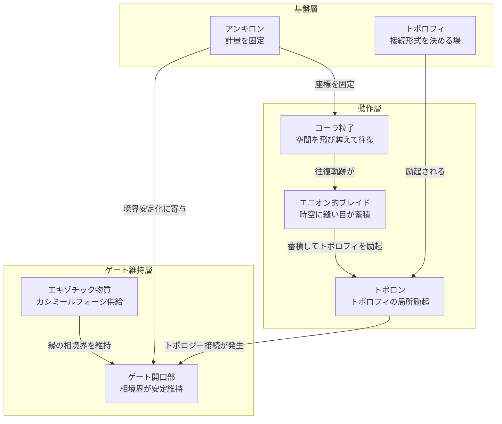

## 1. 概要 (Abstract)

ワープゲートを「2点間を結ぶ固定式の時空接続」として実現するには、計量を歪めるだけでは足りない。計量の歪みはあくまで「空間の形」を変えるにすぎず、入口と出口が位相的につながるという「トポロジーの変換」には原理的に届かない。

ストレンジスター・ワープゲート（wiim_027）は、ストレンジスターの重力チューニングとカシミールフォージによってワープに適した環境を醸成する方法を論じた。しかしそこでは「入口と出口をどう接続するか」という根本問題が未解決のままだった。

本記事はその問いに取り組む。鍵となる概念は三つだ——時空のトポロジー接続形式を決定する架空の場「トポロフィ（g293）」、その局所励起事象「トポロン（g294）」、そして空間を経由せずに別の場所に現れるコーラ粒子（g127）の「マヨラナ的自己対」解釈だ。コーラ粒子が入口と出口の間を繰り返し往復することで、エニオン的なブレイドが時空に刻まれ、トポロフィが励起されてトポロンが維持される——そのような機構を構想する。

---

## 2. 実現不可能性の根拠 (Infeasibility Rationale)

### 物理的限界——トポロフィの量子化不能性

通常の場の量子化は「固定された時空多様体を背景として場を定義し、その場を量子化することで粒子を得る」という手順を踏む。しかしトポロフィは、その「固定された時空多様体」そのものを書き換える場だ。量子化しようとすると、定義域となる多様体が「量子化の最中に変わる」という自己矛盾が生じる。

この矛盾は根本的だ。トポロンを「生成・消滅する粒子」として扱うことができない以上、ゲートを「開閉するスイッチ」のように設計することは原理的に不可能になる。

コーラ粒子（g127）もまた別の壁を持つ。波動関数に従わないため出現位置が量子確率的であり、「特定の出口座標に確実に送り込む」という操作が矛盾をはらむ。出口を決めようとすればコーラ粒子の本質的な非局所性が失われ、出口を決めなければゲートは機能しない。

### 技術的限界——エニオンの次元の壁

エニオンは3次元空間には存在できない。量子ホール効果や特殊な薄膜系など、厳密な2次元系でのみ出現する準粒子であり、3次元の宇宙空間でエニオン的ブレイドを時空スケールで生成・維持する手段は現在の物理学にない。

コーラ粒子の往復軌跡がエニオン的ブレイドに相当すると仮定しても、それを「制御可能な往復」として実装できるかは別問題だ。コーラ粒子の出現位置は確率的であり（g127参照）、入口と出口を「狙い通りに往復する」ようにコーラ粒子を誘導する技術は存在しない。

### 論理的限界——マヨラナ解釈の自己矛盾

コーラ粒子がマヨラナ的自己対——始点と終点が同一粒子の2つの側面——であるなら、「始点から終点への移動」という概念自体が崩れる。移動がないなら軌跡もなく、ブレイドも形成されない。

これは理論の自己矛盾だ。ゲートペアリング問題を解くためにマヨラナ解釈を採用すると、それがブレイドによるトポロン維持の機構を壊す。「コーラ粒子が移動する」と「コーラ粒子が自己対である」は両立しにくく、どちらか一方を選べばもう一方の機構が機能しなくなる。

---

## 3. 実験の設定 (Setup)

1. **コーラ粒子発生装置**をゲート入口座標に設置し（wiim_013参照）、単一コーラ粒子を放出する。
2. 放出されたコーラ粒子の「到達座標」を全方向の計量センサーで記録する——この座標が出口候補となる。
3. 同一の発生装置から多数回放出し、到達座標の統計分布を取る。マヨラナ解釈が正しければ、到達座標は完全ランダムではなく「入口との位相的対称点」に集中するはずだ。
4. 統計的に有意な集中が確認された座標にアンキロン（g128）を配置し、計量を固定する。
5. コーラ粒子の往復を継続しながら、入口・出口双方の計量センサーでトポロフィの局所励起（トポロンの発生）を監視する。
6. トポロン発生が確認された場合、カシミールフォージ（g133）からエキゾチック物質（g068）を供給してトポロンを維持し、通過可能なゲート開口部が形成されるかを検証する。

---

## 4. 考察と予測 (Speculation)

### コーラ粒子の往復がエニオンブレイドになる可能性

エニオンの本質は「世界線の編み込みがトポロジーを定義する」ことだ。2次元平面上でエニオンを交換すると波動関数に位相が蓄積し、その積み重ねが位相的構造を形成する。

コーラ粒子が入口と出口の間を繰り返し往復するとき、その軌跡は——空間を「飛び越える」という特性ゆえに——通常の粒子とは異なる「縫い目」を時空に刻む可能性がある。十分な往復回数が積み重なると、縫い目が安定したトポロジカル構造に成長し、それがトポロフィの持続的励起——トポロンの維持——につながるという仮説だ。

この描像に従えば、ゲートは「一瞬で開く」ものではなく、往復回数に比例して徐々に安定していく構造物になる。施工に時間がかかる橋のように、一定の「縫い合わせ回数」を超えてはじめて通過可能になる。

### ゲートペアリング問題の変換

従来のゲート構想における最大の謎は「入口と出口をどう対応付けるか」だった。コーラ粒子のマヨラナ的解釈はこの問題の立て方を変える。コーラ粒子が放出された瞬間に始点と終点が対として確定するなら、ペアリングは設計者が決めるのではなく、コーラ粒子の物理が自然に決定することになる。

ただし、前述の論理的限界が示す通り、この解釈はブレイド機構と矛盾する。現時点では「どちらの解釈がより基本的か」は決着していない。マヨラナ解釈が正しければゲートは一発で開くが制御できず、ブレイド解釈が正しければ制御できるが開くまでに時間がかかる——この二択が理論の分岐点になる。

### アンキロンとの役割分担

ゲートが要求する性質は一見矛盾している。「固定されていて（座標がずれない）、かつ別の場所につながっている（トポロジーが変換されている）」という両立だ。

アンキロン（g128）は計量テンソルの変化率に粘性抵抗を与え、座標系を安定させる。トポロンはその計量が定義される多様体の接続形式を書き換える。アンキロンが「土台を固める」、トポロンが「固まった土台に穴を開けて別の土台と結ぶ」という分業により、矛盾した要件を階層で満たせる可能性がある。

### 超電導アナロジーから見るゲートの縁

超電導体では、内部に磁場が入れない（マイスナー効果）という相境界が安定して維持される。これは「通常の電磁気的性質を持つ外部」と「ゲージ対称性が破れた内部」という2つの相が、境界面で安定して共存していることを意味する。

ワープゲートの開口部は、通常時空とトポロン励起時空の相境界だ。マイスナー効果的な視点で見れば、この境界を安定させるには「どちらの相も境界近傍で安定して共存できる条件」が必要になる。これはトポロジーの問題ではなく工学的問題であり、カシミールフォージとアンキロンを組み合わせた素材設計として扱える。ゲート開口部の縁がなぜ崩れずに維持されるかを説明するアナロジーとして、超電導の相境界は有効な設計指針を与える。

---

## 5. 図解 (Diagrams)

---

## 6. 関連記事 (Related)

- [wiim_027](wiim_027.md) — ストレンジスター・ワープゲート：ゲート環境の醸成（本記事の前提）
- [wiim_013](wiim_013.md) — コーラ粒子：空間を超越する粒子の仮説
- [wiim_022](wiim_022.md) — アンキロン：計量テンソルに錨を打つ粒子
- [wiim_023](wiim_023.md) — カシミールフォージ：エキゾチック物質の生成基盤
- [wiim_030](wiim_030.md) — パラドックス粒子：因果矛盾の解消という対称的構造
- [wiim_032](wiim_032.md) — コーラバブルワープ：コーラ粒子場による余剰次元跳躍
