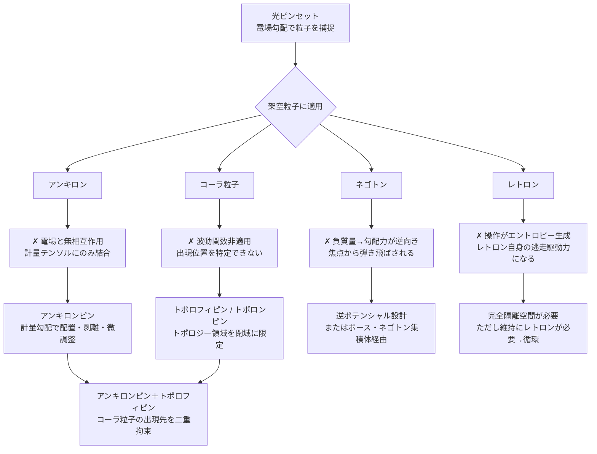

## 1. 概要 (Abstract)

光ピンセット（g313）は、集光したレーザーの放射圧と光強度勾配を利用してミクロの粒子を非接触で捕捉・操作する実在の技術だ。DNA・細胞・ウイルスをピコニュートン精度で操るこのツールを、WIIM世界の架空粒子に適用したとき何が起きるか。

> **前提:** アンキロン・コーラ粒子・ネゴトン・レトロンが実在する。
> **命題:** 「もし光ピンセットでこれらの架空粒子を操作しようとしたら、何が起き、何が必要になるか？」

光ピンセットが依拠するのは「電場が誘電体の電荷分布と相互作用する」という基本原理だ。この原理は量子力学の波動関数を前提とし、正の実質量と通常の電磁相互作用を持つ粒子を対象としている。架空粒子はそれぞれ異なる仕方でこの前提を裏切る——そしてその裏切りの構造こそが、代替的な閉じ込め機構の設計図になる。

---

## 2. 実現不可能性の根拠 (Infeasibility Rationale)

- **物理的限界:** 光ピンセットの勾配力は、誘電体が電場強度の勾配に応じて分極し焦点方向へ引き寄せられる機構に依る。コーラ粒子（g127）は波動関数に従わないため分極が定義できない。ネゴトン（g126）は負の実質量のため勾配力が逆向きに働き、焦点は引力の中心ではなく斥力の中心として作用する。レトロン（g163）は捕捉操作に伴うエントロピー生成がそのままレトロンへの引力源となり、操作が自己消費トリガーになる。

- **技術的限界:** アンキロン（g128）は計量テンソルへの固着を持つが物質を直接捕捉する能力がなく、「光ピンセットでアンキロンを掴む」ではなく「計量操作でアンキロンの配置を制御する」という間接的設計が求められる。コーラ粒子には電磁的アプローチが通じないため、時空トポロジーそのものを操作する機構が代替として必要になる。ネゴトンは逆ポテンシャルの設計という通常とは逆転した工学的発想を要する。

- **論理的限界:** レトロンの閉じ込めは原理的な循環に陥る。エントロピー勾配ゼロの完全隔離空間を維持するにはレトロン自身が必要になり、「閉じ込めるためにレトロンが要る」という自己参照が生じる。マクスウェルの悪魔が永久機関にならない理由——情報消去にはエントロピーコストが伴う（ランダウアーの原理）——と同型の矛盾構造だ。

---

## 3. 実験の設定 (Setup)

四つの架空粒子それぞれについて、光ピンセット的な操作を試みる。

### アンキロン（g128）

アンキロンは計量テンソルの変化率そのものに結合する粒子であり、電荷・質量・カラー荷などの通常属性を持たないと仮定される。集光レーザーで電場勾配を形成しても相互作用が定義されず、光ピンセットは機能しない。

代替として、計量変化率の局所的な操作——計量の「谷」構造の生成——によりアンキロンを特定座標へ誘導できると考えられる。さらに計量変化率をゼロに抑える局所操作を加えると固着力が弱まり、アンキロンを**剥離・再配置**できる。この機構を**アンキロンピン**と呼ぶ。光ピンセットが光強度勾配で粒子を操るように、アンキロンピンは計量勾配でアンキロンを配置・微調整する工具だ。

なおアンキロンは計量座標を固定するのみで物質を直接捕捉する能力はない。アンキロンピンで固定した座標を別の概念（コーラ粒子など）が参照するという**間接的な組み合わせ**として機能する。

### コーラ粒子（g127）

コーラ粒子は波動関数に従わず、空間を経由せずに別の場所へ出現する粒子だ。波動関数に依存する電場との誘電分極が成立せず、出現位置を確率的に特定する手段もないため、光ピンセットは機能しない。

コーラ粒子の本質は「出現先の空間的制約がない」点にある。ならばその**出現可能な空間**自体を制限すればよい。トポロフィ場（g293）を局所的に励起して閉じた多様体構造を作ることで、コーラ粒子が出現できるトポロジー領域を特定の閉域に絞り込める。この機構を**トポロフィピン**、またはその離散励起事象（トポロン、g294）を利用した精密指定版を**トポロンピン**と呼ぶ。

アンキロンピンが「どの計量座標か」を固定し、トポロフィピンが「どのトポロジーか」を指定することで、コーラ粒子の出現先をミクロ単位で二重拘束する設計が可能になる。

### ネゴトン（g126）

ネゴトンは負の実質量を固有属性に持つ粒子だ。負の質量は通常の誘電体とは逆向きに加速するため、光ピンセットの焦点はネゴトンに対して引力ではなく斥力の中心として機能し、弾き飛ばされる。

代替として二つの経路が考えられる。一つは**逆ポテンシャル設計**——通常粒子を捕捉するポテンシャルの「谷」はネゴトンには「山」として作用するが、逆に通常では山になる構造がネゴトンには谷になる。もう一つは**ボース・ネゴトン**の利用だ。ネゴトンがボーズ統計に従う場合、超低温環境でBEC（ボーズ・アインシュタイン凝縮）的な集積体が生じる可能性があり、集団として操作する経路が開ける。個々のネゴトンへの直接操作ではなく、集積体全体を単一の量子状態として扱う発想だ。

ただしネゴトンは正の質量との相互作用で暴走加速が生じるとされており、光子（レーザー）との相互作用がこの条件に該当するかは未定義の問題として残る。

### レトロン（g163）

レトロンは負のエントロピーを担い、高エントロピーの領域に自然に引き寄せられる粒子だ。レーザーを照射すると焦点付近に電磁場エントロピーが生成され、そのエントロピーにレトロン自身が引き寄せられて焦点から外れようとする——捕捉操作がそのまま逃走の駆動力になる。

エントロピー勾配ゼロの完全隔離空間を作れれば、レトロンの自発移動の駆動力がなくなり理論上は閉じ込められる。しかしその空間を維持すること自体がエントロピー操作を意味し、その操作コストを吸収するためにレトロンが必要になる。「レトロンを閉じ込めるためにレトロンが要る」という自己参照的な循環が生じ、外部からの完全な閉じ込めは原理的に困難と考えられる。

---

## 4. 考察と予測 (Speculation)

### 「掴めない理由」の四類型

各粒子が光ピンセットと相性が悪い理由はそれぞれ異なる。アンキロンは電磁場との**相互作用の定義がない**。コーラ粒子は**波動関数の枠組みが適用されない**。ネゴトンは**符号が反転している**。レトロンは**操作が逆効果になる**。これは偶然ではなく、各粒子がそれぞれ異なる次元で「通常の物理前提」を外していることの反映だ——そしてその外し方の違いが、異なる代替機構を要求する。

### アンキロンピン＋トポロフィピンの組み合わせ

最も発展的な設計は、アンキロンピンとトポロフィピンの組み合わせによるコーラ粒子の精密制御だ。アンキロンピンが計量座標を固定し、トポロフィピンがその座標のトポロジー形式を指定することで、コーラ粒子が「出現すべき場所」が二重に拘束される。ワープゲート基礎理論（wiim_074）が想定するアンキロンとトポロンの役割分担と接続するこの設計は、ミクロ単位の空間制御技術の起点となりうる。

### レトロン問題の普遍性

レトロンが捕捉不可能な構造は、マクスウェルの悪魔が永久機関にならない理由と同型だ。系の一部を制御しようとすると制御コストが必ず外部に出る。レトロンの場合そのコストが「エントロピーの流出」であり、流出先がレトロンの引力源になる。ランダウアーの原理の一変奏として解釈できる。

### 哲学的な問い

- 「掴む」という操作は、対象が通常の物理的枠組みに従うことを前提とする。枠組みの外側にある存在に対して「操作する」とはどういうことか。
- トポロフィピンで「出現可能な空間」を制限することは、コーラ粒子の自由を奪っているのか、それとも出現先の定義を変えているだけか。

---

## 6. 図解 (Diagrams)

---

## 7. 関連記事 (Related)

- [wiim_022](wiim_022.md) — アンキロン：時空の計量に錨を打つ架空粒子
- [wiim_013](wiim_013.md) — コーラ粒子の仮説：空間を超越する粒子
- [wiim_003](wiim_003.md) — ネゴトン：負の質量を持つ粒子による局所的時間加速
- [wiim_037](wiim_037.md) — レトロン：負のエントロピーを持つ粒子と因果の逆行
- [wiim_074](wiim_074.md) — ワープゲート基礎理論：アンキロンとトポロンの役割分担
- [wiim_064](wiim_064.md) — ネグレーザー：光学トゥイーザーの架空拡張
