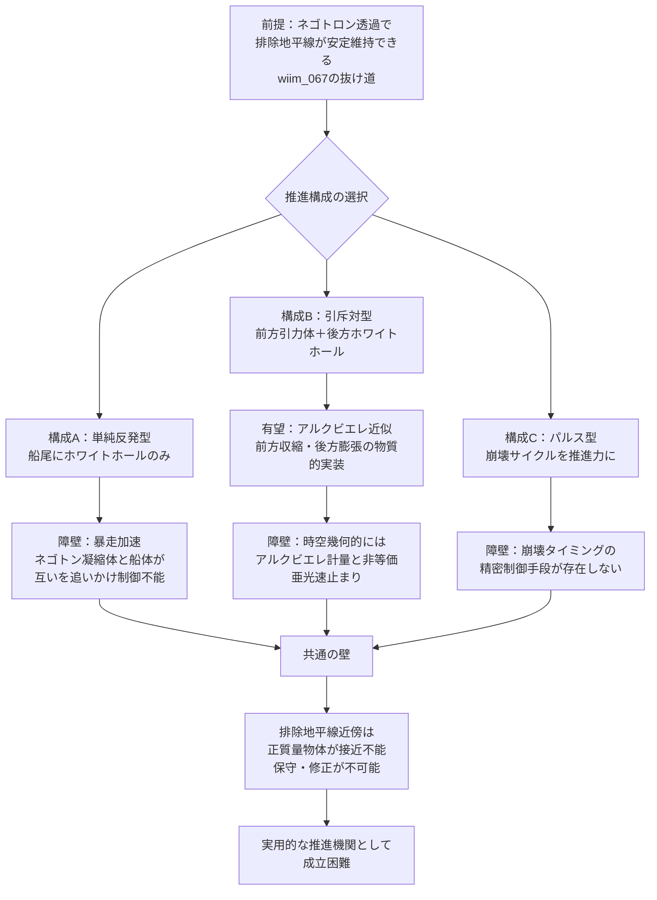

# ネゴトンホワイトホールワープ——安定維持した排除地平線を推進力に転用できるか

## 概要

ネゴトン凝縮体が臨界規模に達すると、周囲に光子すら近づけない**排除地平線**が形成される（wiim_067）。wiim_067では排除地平線の完成が補給断絶を引き起こし、崩壊してミニ・ビッグバンを起こすシナリオを主軸として論じた。しかしwiim_067後半には「抜け道」が示されていた——[ネゴトロン（g247）](../../glossary/terms/g247.md)は負質量を持つため、排除地平線を透過して内部の凝縮体に到達できる可能性があり、安定した補給が継続できるかもしれないという可能性だ。

> **前提:** wiim_067の「ネゴトロン透過」シナリオが成立し、安定したネゴトンホワイトホール（排除地平線を維持したままのネゴトン凝縮体）を制御できると仮定する。
> **命題:** 「もし排除地平線が崩壊せずに維持できるなら、その斥力を宇宙船の推進力——**ネゴトンホワイトホールワープ**——として逆用できるか？」

排除地平線は正質量物質を弾き飛ばす。これを船尾に配置すれば、「押す推進剤」を必要としない反重力エンジンになりうる。さらに前方に高密度の引力源（通常の重力天体）を置けば、引力と斥力の組み合わせでアルクビエレ計量に物質的に近似した時空幾何が実現する可能性がある。

---

## 実現不可能性の根拠

### 物理的限界：ネゴトン凝縮体と宇宙船の間の暴走加速

[ネゴトン（g126）](../../glossary/terms/g126.md)は正質量との相互作用で**暴走加速（runaway motion）**を引き起こす。正質量物体Aとネゴトン物体Bが互いに力を及ぼし合うとき、Aはネゴトンに引き寄せられ、Bは逆方向に加速する——外部から見るとAとBが互いを追いかけて同じ方向に永続的に加速し続ける現象だ。

排除地平線を船尾に置いた場合、宇宙船の構造材（正質量）は凝縮体に引き寄せられる向きに力を受け、同時に凝縮体は宇宙船から逃げる方向に加速する。「宇宙船を前に押す」のではなく、「凝縮体が宇宙船から遠ざかりながら宇宙船も凝縮体を追いかける」形の暴走加速が生じる。制御された推進力を取り出すには、この非対称な力学を封じる機構が必要だが、それ自体が未解決問題だ。

### 技術的限界：排除地平線は「保守不可能な船外機関」である

安定維持には継続的なネゴトロンビームの補給が必要だ（wiim_066の外部照射方式）。宇宙船がネゴトンホワイトホールを推進ユニットとして船尾に搭載する場合、ビーム照射装置は白穴から十分離れた船体前方に設置されなければならない。

しかし排除地平線の外縁付近では正質量物体に強力な斥力が作用するため、乗員も整備ロボットもホワイトホール周辺に接近できない。異常が発生してもアクセス不能なまま崩壊が進む。宇宙船の加速時には内部のネゴトン凝縮体も慣性を持ちながら独自に運動するため、ビームの照準を継続的に補正し続ける必要があり、制御系の複雑さは指数的に増す。

加えて、排除地平線はネゴトロンビーム照射経路上にも存在する。ビームが地平線を透過できるという「抜け道」が成立する条件は、量子的なネゴトロンに対してのみ有効かどうかが未確認であり、高密度・高出力のビームが地平線付近でどう振る舞うかは理論的に未解決だ。

### 論理的限界：これはアルクビエレ計量の「近似」ではなく「別物」である

アルクビエレ計量では、時空の泡全体が移動することで内部の物体は慣性を感じない。これに対しネゴトンホワイトホールワープは、物質的な斥力場と引力源の組み合わせによる「力積推進」だ。内部の乗員は推進力に比例した慣性加速度を受け続け、宇宙船の構造材は絶えず応力にさらされる。

最大速度も光速を超えない。暴走加速によりネゴトン側の加速は際限なく続きうるが、正質量側（宇宙船）の速度は相対論的質量増大の壁で頭打ちとなる。ハッブル地平線の突破という[ギャラクシードライブ（g321）](../../glossary/terms/g321.md)の目標に対しては、モードB（重力操作型）と同じく亜光速の「現実的な下限」の一形態として位置づけられる。

---

## 実験の設定

- **主体**: カルダシェフスケール3〜4型文明。ネゴトロン生成・照射設備を船体全周に備え、継続照射による白穴維持が可能と仮定する

### 構成A：単純反発型

船尾に安定したネゴトンホワイトホールを配置し、排除地平線の斥力で宇宙船を前方へ押す。最もシンプルな構成だが、暴走加速の制御問題が最も顕在化しやすい。

### 構成B：引斥対型（アルクビエレ近似）

船尾にネゴトンホワイトホール（斥力）、船首方向に密度の高い引力天体あるいは小規模ブラックホールを配置し、前後から挟む形で非対称な時空幾何を生成する。アルクビエレ計量が「前方収縮・後方膨張」を時空の歪みで実現するのに対し、この構成は「前方引力・後方斥力」を物質配置で近似する。時空幾何的には等価でないが、加速ベクトルの方向は一致する。

### 構成C：パルス型

排除地平線を安定維持するのではなく、意図的に成長→排除地平線形成→崩壊（ミニ・ビッグバン）を繰り返し、崩壊時の爆発エネルギーを推進力として使うパルス推進方式。wiim_067で描かれた崩壊シナリオを「事故」ではなく「エンジンサイクル」として制御する試みだ。

---

## 考察と予測

構成Bの「引斥対」は概念的に最も洗練されている。正のブラックホールとネゴトンホワイトホールの対——引力の極と斥力の極——が時空に非対称な勾配を刻む様は、宇宙論的なダイポールと見なせる。[バーディーン・ペッターソン効果（g320）](../../glossary/terms/g320.md)が示すように、回転ブラックホールの周囲では降着円盤が自転軸に整列する。引斥対の場合、ネゴトンホワイトホール側の斥力場と前方ブラックホールの引力場が相互作用することで、空間そのものに「流れ」に似た構造が生じる可能性がある。これがアルクビエレ計量への物質的近似としてどこまで成立するかは、新たな思考実験の余地を残す。

構成Cのパルス推進は、ミニ・ビッグバン的崩壊エネルギーを制御できるなら最も高い瞬間推力を生む。しかし崩壊のタイミングと規模を精密に制御する手段が現在の理論には存在しない。制御できない爆発を「推進力」と呼ぶことはできず、この方式は「爆発的破壊」と「推進」の境界で揺れ動く。

暴走加速の問題はどの構成でも根本的に残る。逆説的だが、これは「推進効率が無限に高い」ことを意味する側面もある——外部エネルギーなしに加速が継続しうるからだ。しかしその「効率の良さ」はエネルギー保存則との緊張をはらんでおり、WIIM世界観においても物理的な辻褄合わせが必要な未解決の課題として残る。

---

## 図解

---

## 関連記事

- [wiim_065](wiim_065.md) 反重力天体——エキゾチック物質とカシミールフォージで斥力場を生成できるか
- [wiim_066](wiim_066.md) ネゴトン凝縮体の外部照射構築法——ネゴトロンビームで反重力天体を組み上げる
- [wiim_067](wiim_067.md) ネゴトンホワイトホール——排除地平線が閉じるとき、反重力天体はビッグバンを起こすか
- [wiim_079](../cosmology/wiim_079.md) ギャラクシードライブ——カルダシェフ4型文明が銀河を乗り物としてハッブル地平線を超えられるか
- [wiim_003](wiim_003.md) 負の質量を持つ粒子による局所的時間加速
