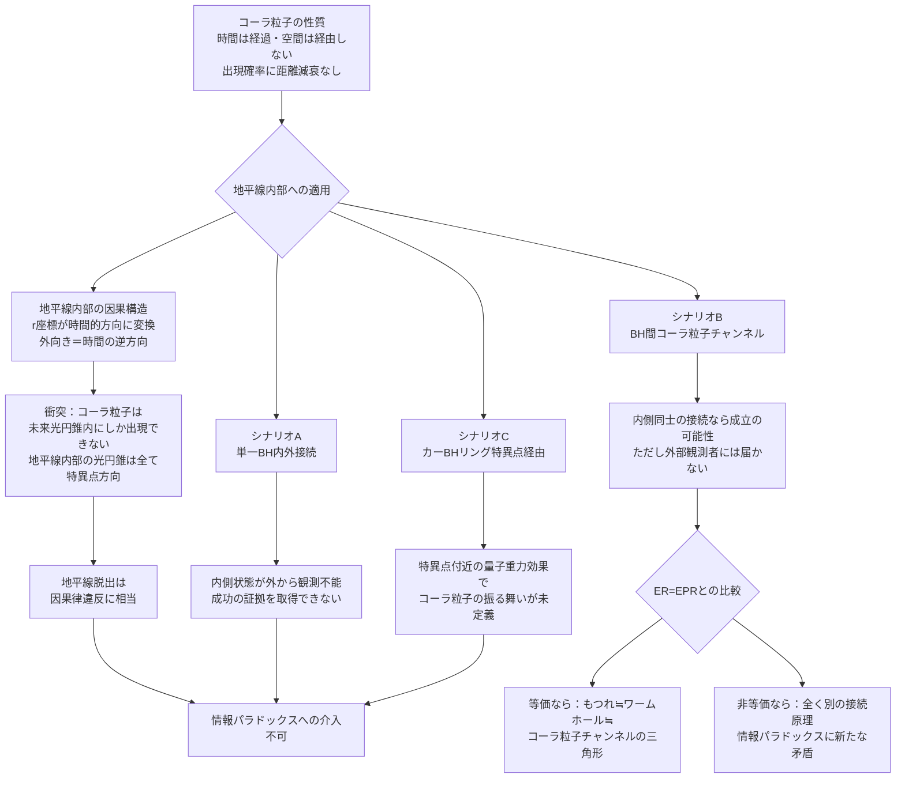

# コーラ粒子は事象の地平線を抜けられるか——ブラックホール内外の空間超越と因果律の衝突

## 概要

[コーラ粒子（g127）](../../glossary/terms/g127.md)は「時間は経過するが空間を経由せずに別の場所へ出現する」粒子として定義される。通常の物質が持つ「距離とともに出現確率が減衰する」機構を持たず、量子的な因果律の範囲内で任意の位置に再出現できる。

ブラックホールの事象の地平線は、通常の粒子が一方向にしか超えられない境界だ。地平線の内側からは光すら脱出できない。では、空間を経由しないコーラ粒子は、この境界を無効化できるだろうか。

> **命題1:** コーラ粒子は事象の地平線の内側から外側に「出現」できるか。
> **命題2:** もし出来るなら、2つのブラックホールをコーラ粒子チャンネルで接続できるか。また、それはブラックホール情報パラドックスをどう変えるか。

これは単なる「FTL移動の変奏」ではない。事象の地平線は**空間的な壁**ではなく**因果構造の境界**であり、コーラ粒子の「時間は経過する」という定義と正面から衝突する。

---

## 実現不可能性の根拠

### 物理的限界：地平線の内側では「外向き」が時間の逆方向を意味する

事象の地平線の内側では、一般相対性理論の時空構造が劇的に変わる。地平線の外では「空間方向」だった r 座標（中心からの距離）が、内側では**時間的な方向**になる。平たく言えば、「特異点に近づく」ことが「時間が進む」ことと等価になる。

この結果、地平線の内側では「外側へ向かう」ことが「過去へ移動する」ことを意味する。コーラ粒子は「時間は経過する」と定義されているため、その次の出現点は必ず自身の未来光円錐の内部に限られる。地平線内部の未来光円錐は全て特異点方向を向いており、「外側への出現」は未来光円錐の外——すなわち因果律違反の領域——にしか存在しない。

コーラ粒子が「空間を超越する」が「時間的因果律を守る」という定義は、地平線内部においてこの制約と直接衝突する。コーラ粒子の空間超越が「因果律に反しない範囲での量子的な非局所性」であるなら、地平線内部からの脱出は原理的に不可能だ。

### 技術的限界：内部への「注入」自体が観測不能の操作を要求する

コーラ粒子 2 体を量子的にもつれさせ、一方をブラックホール内に送り込んで接続チャンネルを確立する案を考える。しかしブラックホールの内部構造は外部から観測できない（ホーキング放射は thermal であり内部の量子状態情報を直接運ばない）。

「内部にコーラ粒子を意図的に配置する」ためには、内部の座標を指定する必要があるが、外部観測者にとって地平線内部の空間座標は情報として取得不可能だ。外から「内部 X 点にコーラ粒子を送り込む」という操作は、観測不可能な変数への干渉を意味し、外部から制御可能な物理操作として定義できない。

### 論理的限界：情報パラドックスの解消が新たな矛盾を生む

もしコーラ粒子が地平線を透過できるとすれば、ブラックホールに落下した情報を外部に運び出せる。これはブラックホール蒸発に伴う**情報パラドックス**——情報が消滅するかどうかという問い——をある意味で「解消」する。

しかしこの解消は新たな問題を引き込む。量子力学のユニタリー性（情報は保存される）が保たれる一方、**量子複製不可能定理**が破れる可能性がある。落下する観測者が地平線内側で情報を保持しつつ、コーラ粒子が同じ情報を外側に運んだとき、情報が2箇所に同時に存在することになる。これは量子情報の基本原理と矛盾する。ブラックホール相補性（内側の観測者と外側の観測者は情報を「両方見られない」という協定）が成立している間は問題が表面化しないが、コーラ粒子はその協定をすり抜ける手段になりうる。

---

## 実験の設定

- **主体**: コーラ粒子の生成・観測が可能な文明
- **対象**: カー（回転）ブラックホール（[g099](../../glossary/terms/g099.md)）——リング状特異点を持ち、理論上はリングの中心を通り抜けると「別の宇宙」に出られるとされる構造を持つ

### シナリオA：単一ブラックホールの「内外接続」試験

コーラ粒子を地平線外側で生成し、量子もつれのパートナーを地平線の内側に落下させる。外側のパートナーが「出現先として内側を選ぶ」または「内側のパートナーが外側に出現する」かを観測する。

観測困難点：内側のパートナーの状態は外から確認できない。成功の証拠は「外側のコーラ粒子が消滅した」あるいは「外側に追加のコーラ粒子が出現した」という間接的なシグナルにしか現れない。

### シナリオB：ブラックホール間のコーラ粒子チャンネル

2つのブラックホールBH-AとBH-Bを用意する。BH-Aの外側でコーラ粒子を生成し、一方のパートナーをBH-Aに落下させ、もう一方をBH-Bの近傍で観測する。コーラ粒子がBH-Aの内側から「出現先としてBH-Bの内側を選ぶ」ならば、2つのブラックホールが非幾何学的チャンネルで接続されたことになる。

これはER=EPR（量子もつれで結ばれたブラックホールは時空の幾何として連結されているという仮説）と比較可能な構造だ。ER=EPRが「幾何学的トンネル（ワームホール）による接続」を提唱するのに対し、コーラ粒子チャンネルは「空間超越による非幾何学的接続」という別の原理で同様の結果をもたらす可能性がある。

### シナリオC：カーブラックホールのリング特異点を経由した「迂回」

カーブラックホールのリング状特異点は、理論上その中心を通り抜けると「別の宇宙」に通じるとされる（カー計量の解析的延長）。コーラ粒子がリング特異点付近で「別宇宙側に出現する」可能性はあるか。特異点付近では曲率が無限大に近づき、量子重力効果が無視できなくなる領域だ。コーラ粒子の「出現確率に距離の減衰がない」という性質が、曲率無限大の環境でどう変化するかは未定義だ。

---

## 考察と予測

コーラ粒子の定義における最も重要な未決事項は「因果律をどの程度遵守するか」だ。定義上「量子確率的であれば因果律との折り合いはつくかもしれない」とされており、これは「コーラ粒子の出現先は確定的に選べない」ことを意味する。

この確率性は地平線問題に重要な含意を持つ。コーラ粒子が地平線内部から「外側に出現する確率がゼロでない」としても、それを意図的な情報転送チャンネルとして使えるかどうかは別問題だ。確率的な出現の中に有意な情報を載せるためには、多数のコーラ粒子を制御して統計的なパターンを作る必要があるが、地平線内部からの出現確率の制御は外部からは不可能だ。

シナリオBのブラックホール間チャンネルが成立したとして、その接続は**一方向**になる可能性が高い。BH-Aに落下したコーラ粒子がBH-Bの内側に出現しても、それはBH-Bの内部で特異点に向かうだけだ。外側への情報転送は達成されない。2つのブラックホールの「内側同士」がつながるという意味では接続だが、外部の観測者には何も届かない。

最も示唆的な問いは、コーラ粒子チャンネルによるBH-BH接続がER=EPRと等価かどうかだ。ER=EPRでは幾何学的ワームホールと量子もつれが同一物の異なる記述とされる。コーラ粒子チャンネルは幾何学的でなく空間超越的な接続だ——もしこれがER=EPRと等価であるなら、「ワームホール≒もつれ≒コーラ粒子チャンネル」という三角形が成立し、コーラ粒子が時空のトポロジーと量子情報の間をつなぐ第三の柱として位置づけられる可能性がある。

---

## 図解

---

## 関連記事

- [wiim_013](wiim_013.md) 空間を超越する粒子——コーラ粒子の仮説
- [wiim_074](wiim_074.md) ワープゲート基礎理論——コーラ粒子のマヨラナ的自己対とエニオンブレイドによるトポロジー接続
- [wiim_001](../cosmology/wiim_001.md) 光速を超えた場合の因果律
- [wiim_028](../cosmology/wiim_028.md) 重力子と光子の二重搬送FTL通信——エキゾチック物質チャネルによる宇宙際通信
- [wiim_079](../cosmology/wiim_079.md) ギャラクシードライブ——カルダシェフ4型文明が銀河を乗り物としてハッブル地平線を超えられるか
