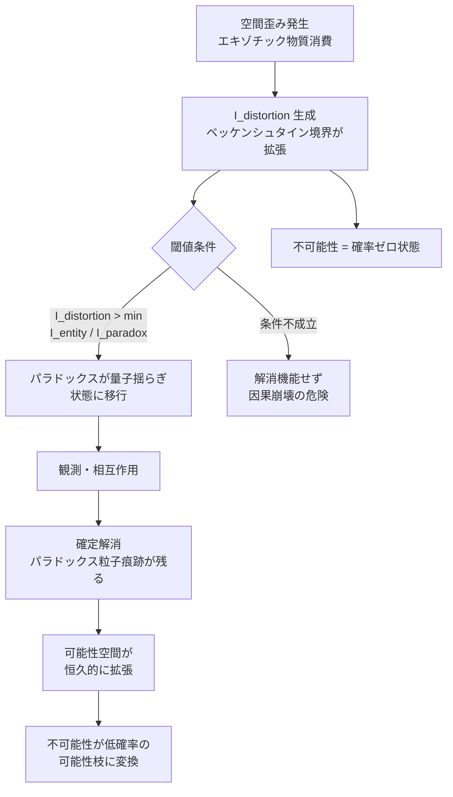

## 1. 概要 (Abstract)

FTL航法や時間遡行を実現するには、時空間を大きく歪める必要がある（[wiim_001](../cosmology/wiim_001.md)）。しかし歪みは単なる「通路の開通」ではない——歪んだ領域は、歪む前よりも多くの情報を収容できる空間に変化する。

この情報収容量の増加は「現実に起きうる可能性の数が増える」ことを意味する。不可能性とは確率ゼロの可能性にすぎないとすれば、情報量の増加はその確率を引き上げ、それまで禁じられていた状態を「低確率の可能性の一つ」へと変換する。

> **命題:** 空間歪みが生成する情報量が、発生するパラドックスの情報量を超えたとき、因果矛盾は量子揺らぎ状態に移行し、観測・相互作用のタイミングで自動的に確定解消する。

この枠組みを**パラドックス解消公理**と呼ぶ。本記事は三つの柱——閾値条件・解消プロセス・メカニズム——を通じて、この命題を検討する。また、パラドックス粒子（[wiim_030](wiim_030.md)）の「なぜ」に対する情報論的な根拠として機能することも論じる。

---

## 2. 実現不可能性の根拠 (Infeasibility Rationale)

### 物理的限界

パラドックス解消公理が働くためには、まず「歪みが生成する情報量 I_distortion」を定義する必要がある。その根拠として最有力なのが**ベッケンシュタイン束縛**——ある空間領域が収容できる最大情報量はその境界面積に比例するという原理だ。

空間が歪むと境界面積が変化し、それに伴い収容可能な情報量が変動する。理論上は I_distortion の計算が可能だ。しかし問題は「パラドックスの情報量 I_paradox」の定義にある。因果矛盾は通常の物質・エネルギーではなく、「出来事の関係構造の矛盾」だ。この関係構造をビット数で表す標準的な方法は現在存在しない。閾値を評価できなければ、方程式は原理を述べるに留まり、予測ツールとしては機能しない。

### 技術的限界

仮に I_paradox を定義できたとしても、実時間での計測は極めて困難だと考えられる。FTL操作の最中に I_distortion と I_paradox を同時に観測するには、歪み自体が作り出す情報の変化を「外側」から測定する系が必要だ。しかし歪みの内部にいる観測者は、歪みの影響を受けた測定器しか持てない——これは「曲がった定規で曲がりを測る」問題と同型だ。

外部観測者を置く場合は、FTL操作の結果が外部に届くまでに因果矛盾が顕在化している可能性があり、測定のタイミング問題が生じる。

### 論理的限界

最大の問題は、パラドックス解消公理が「不可能性は確率ゼロの可能性である」という前提を置く点にある。これは直感的に説得力があるが、論理的には「禁止」と「確率ゼロ」は異なる概念だ。熱力学第二法則によるエントロピー減少は確率ゼロではなく禁止ではないが、因果律違反（過去への情報送信など）は、禁止として扱われる——少なくとも現在の物理学では。

この区別を無効化するには、因果律そのものが確率的ルールである（禁止ではなく圧倒的に非選好な状態にすぎない）という立場が必要になる。それは一つの仮説であり、検証されていない。

---

## 3. 実験の設定 (Setup)

### 思考実験の構成

- **主体:** FTL航行中の船と、時空の外部で観測する別の観測者
- **操作:** エキゾチック物質を大量消費し、意図的にパラドックスを引き起こす（例：過去に「出発しない」という信号を送る）
- **変数:** エキゾチック物質の消費量（＝ I_distortion に比例）と、引き起こすパラドックスの「重さ」（I_paradox）

### 閾値条件の評価

| 状況 | I_distortion vs I_paradox | 予測される結果 |
|------|--------------------------|----------------|
| 大量消費・軽微なパラドックス | I_distortion > I_paradox | 量子揺らぎ移行→解消確定 |
| 大量消費・重大なパラドックス | I_distortion ≈ I_paradox | 部分的解消・不安定状態 |
| 少量消費・任意のパラドックス | I_distortion < I_paradox | 解消機能せず・因果崩壊 |

「軽微/重大」の定量的定義が未解決である点は、理論の現状の限界を反映している。wiim_030のエキゾチック物質消費量の下限が経験的に存在することは、この閾値条件が正しければ説明できる——下限以下では I_distortion < I_paradox が成立し、解消が起動しない。

### 観測窓

パラドックス解消公理によれば、閾値を超えてから「解消確定」までの間に観測窓が存在する。この窓の間、矛盾は量子揺らぎ状態にあり、原理的には「矛盾が顕在化する未来」と「矛盾が解消される未来」が重ね合わさっている。観測者が相互作用した瞬間に枝が確定する——これはパラドックス粒子の「痕跡が後から発見される」という観測事実と整合する。

---

## 4. 考察と予測 (Speculation)

### 不可能性の再定義

パラドックス解消公理の最も根本的な含意は、**不可能性を絶対禁止ではなく情報量不足として読み替える**点にある。

現在の物理法則が「禁じている」とされる現象の多くは、それが起きた場合に生じる矛盾の情報量が、通常の時空が収容できる情報量を大幅に超えるために「起きない」のかもしれない。ブラックホール内部でしか成立しない物理が存在するように、十分な歪みがあれば「解消可能な矛盾」の範囲が広がると考えられる。

### wiim_030の二理論との関係

パラドックス粒子（[wiim_030](wiim_030.md)）の生成機構には二つの競合仮説がある。パラドックス解消公理は、その両方に対して情報論的な土台を与える。

**理論A（時間的ディラックの海）との接続:** エキゾチック物質が「海に穴を開ける」のは、それまで充填済みだった逆因果方向の状態を「空席」にすることだ。これは利用可能な状態数の増加——つまり情報収容量の増加——と読み替えられる。穴の大きさが I_distortion に対応し、閾値条件を超えた穴にのみ逆因果状態（パラドックス粒子）が流入できる。

**理論B（因果真空ゆらぎ）との接続:** 真空ゆらぎの増幅は、微小な可能性枝が可視化・実態化するプロセスだ。これはまさに「確率ゼロから非ゼロへの引き上げ」であり、パラドックス解消公理のメカニズムそのものだ。増幅が閾値に達した瞬間に解消が起動する——理論Bの非線形な消費量・保護能力の関係は、I_distortion が累積的に積み上がる性質を反映していると解釈できる。

### 解消の「コスト」

エネルギーは保存される。パラドックスが解消されるとき、その情報的な「処理コスト」はどこへ行くのか。

一つの考え方は、解消によって I_distortion が消費されるというものだ——パラドックスの解消がエキゾチック物質の追加消費として現れる。これはwiim_030の「エキゾチック物質の枯渇リスク」と直接つながる。解消が重なるほど燃料が減り、やがて因果保護の余裕がなくなる。

もう一つの考え方は、解消コストが歪みの「後ろ」に転嫁されるというものだ。操作後の時空がわずかに構造を変え、パラドックス粒子の痕跡として残る——これが観測される現象だ。どちらのコスト負担が正しいかは、パラドックスの規模によって異なる可能性がある。

### 「観測で確定する」構造の普遍性

量子力学では観測が波動関数を収縮させる。因果律の世界では、観測者の存在が「どの歴史が選ばれるか」を決定する。パラドックス解消公理は、因果律もまた量子的な構造を持つという立場を含意する。

これは多世界解釈（観測で世界が分岐する）とも異なる。分岐するのではなく、歪みによって一時的に重ね合わせられた可能性が、観測によって一本の歴史に収束する。「ルールの例外」が起きるのではなく、「ルールがより広い文脈で機能する」と言い直すことができる。

---

## 5. 数式による表現 (Mathematical Notation)

パラドックス解消公理の閾値条件を不等式で示す。

$$I_{\text{distortion}} > \min(I_{\text{entity}},\; I_{\text{paradox}})$$

ここで各項はベッケンシュタイン束縛を参照して定義される——ある領域が収容できる最大情報量は境界半径とエネルギーによって上界が定まるという原理だ。空間歪みは境界半径を変化させることで $I_{\text{distortion}}$ を変動させる。$I_{\text{entity}}$・$I_{\text{paradox}}$ の具体的な計算法は未定義のままであり、これが理論の現在の限界を示している。

---

## 6. 図解 (Diagrams)

---

## 7. 関連記事 (Related)

- [wiim_030](wiim_030.md) — パラドックス粒子（本記事が情報論的な根拠を与える対象）
- [wiim_001](../cosmology/wiim_001.md) — 光速を超えた場合の因果律（FTLと因果矛盾の基本構造）
- [wiim_023](wiim_023.md) — カシミールフォージ（I_distortion の生成源となるエキゾチック物質の量産）
- [wiim_056](../philosophy/wiim_056.md) — ベッケンシュタイン限界の突破（情報密度と時空の関係）
- [wiim_049](wiim_049.md) — 時間遡行の条件と限界（パラドックスが顕在化するケースの網羅）
- wiim_??? — パラドックス粒子を利用したタイムパラドックスマシンの設計（未執筆）
