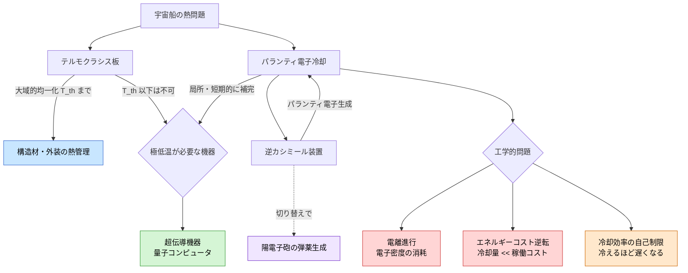

## 1. 概要 (Abstract)

[wiim_085](../quantum/wiim_085.md) では、パランティ電子（パランティ粒子（g161）の電子版）と通常電子の静かな対消滅（[wiim_038](wiim_038.md)）により、電子の熱運動エネルギーがディラック海（g145）の量子モードへ転嫁され、熱として創発しない可能性を論じた。本記事はその帰結として「ではそれを宇宙船の熱管理システムに実際に使えるか」を問う。

宇宙船の熱管理にはすでにテルモクラシス板（g195）という有力な技術がある。コーラ粒子（g127）格子の共鳴により周囲温度を設定閾値温度 T_th へ引き込む素材だが、T_th が製造時に固定されるためそれ以下の温度は原理的に達成できない。超伝導機器・量子コンピュータのような極低温域が必要な用途では不足する。

この思考実験が問うのは、**「パランティ電子照射による電子蒸発冷却を、テルモクラシス板の届かない極低温域をカバーする補完システムとして設計できるか」** だ。

---

## 2. 実現不可能性の根拠 (Infeasibility Rationale)

### 物理的限界

根本的な障壁は [wiim_085](../quantum/wiim_085.md) および静かな対消滅（[wiim_038](wiim_038.md)）と同一だ——**安定した負エネルギー状態は標準的な量子場理論に存在しない**。パランティ電子の前提そのものが現在の物理学の外側にある以上、この冷却システム全体がその制約を引き継ぐ。

### 技術的限界

仮にパランティ電子が生成できるとして、二つの工学的障壁がある。

**① エネルギーコストの逆転**：逆カシミール装置（カシミールフォージ（g133）の逆転設計）の稼働には、通常のカシミールフォージと同様にカルダシェフスケール・タイプII文明に近い莫大なエネルギーが必要と考えられる。一方、冷やす対象（例：船内量子コンピュータ）が持つ熱エネルギーはそれに比べて微量だ。「1ジュールの熱を除去するために桁外れのエネルギーを消費する」という構造では、宇宙船の動力源として成立しない。

**② 電離管理**：パランティ電子は対象物質の電子を消滅させていく。金属なら導電性の低下、絶縁体なら化学結合の切断、半導体なら素子の破壊が進む。冷却効果を維持しながら電子密度の消耗を許容範囲に収めるには、原子単位で電子密度をリアルタイム監視しながら照射量を制御する精密フィードバックが必要となり、宇宙船の運用環境（振動・放射線・真空変動）での実現は極めて困難だ。

### 論理的限界

**冷却効率の自己制限**：電子蒸発冷却は冷えるにつれて効率が落ちる。熱電子の運動速度（熱速度）は温度の平方根に比例するため、温度が下がると電子の動きが鈍くなりパランティ電子との衝突頻度も減少する。「冷やすほど冷やしにくくなる」漸近的な限界が存在し、絶対零度への接近は理論上も不可能だ。これは従来の蒸発冷却が最終段階でレーザー冷却などを必要とするのと同じ構造的問題だ。

---

## 3. 実験の設定 (Setup)

### 想定される宇宙船冷却システムの構成

| 層 | 担当技術 | 温度域 |
|---|---|---|
| 外装熱均一化 | テルモクラシス板（高温設定） | 太陽光照射側の過熱を抑制 |
| 構造材の定常冷却 | テルモクラシス板（低温設定） | 機器室の基準温度維持 |
| 精密機器の追加冷却 | パランティ電子冷却 | T_th 以下の極低温域 |

パランティ電子冷却は常時稼働ではなく、超伝導機器の起動前・量子回路の初期化時など「目標温度に到達するまでの短期集中冷却」として使うことで、エネルギーコストの問題を部分的に緩和できる可能性がある。

### 陽電子砲との設備共用

逆カシミール装置はディラック海に穴を開ける操作の入り口として、**パランティ電子の生成と陽電子の生成の両方**を担いうる。穴の引き出し方（電子側か陽電子側か）を切り替えることで、同一設備から冷却用パランティ電子と陽電子砲の弾薬を切り替え生産できる可能性がある。ただしこの共用は「どちらの用途も同一の根本的障壁を持つ」ことも意味する——一方が実現すれば他方も実現するし、一方が不可能なら他方も不可能だ。

---

## 4. 考察と予測 (Speculation)

### テルモクラシス板との役割分担

テルモクラシス板は「周囲を T_th に引き込む」能動的な恒温化装置であり、宇宙船全体の大域的な熱管理に適している。一方、パランティ電子冷却は「特定の対象から電子ごと熱を除去する」局所的・短期的な冷却だ。大域と局所、恒温と一時的降温という補完関係が成立するとすれば、両者は競合ではなく階層的な役割分担として設計できる。

### 廃棄時の漏れ戻りリスク

[wiim_085](../quantum/wiim_085.md) が論じた「真空版ホーキング過程」——ディラック海に転嫁されたエネルギーが長時間後に漏れ戻る可能性——は宇宙船運用においては逆説的なリスクになる。漏れ戻りの時定数がミッション期間より十分長ければ「実用上の永久冷却」として機能するが、宇宙船の廃棄・解体時には蓄積されたエネルギーが漏れ出して熱を放出することになる。「廃棄時に熱暴走する」という新しいリスクカテゴリが生まれ、廃棄プロセスの設計に影響する。

### レトロンとの比較

レトロン（g163）もエントロピーの局所的な逆転という形で冷却に寄与しうるが、生成過程でそれ以上のエントロピーが発生する自己否定的な問題を抱える（[wiim_037](wiim_037.md)・[wiim_045](wiim_045.md)）。パランティ電子冷却はエントロピーを「消す」のではなく「ディラック海に転嫁する」という点で構造が異なり、エネルギー収支が正当化しやすい——ただしエネルギーコストの逆転という別の問題を引き受けることになる。

どちらの冷却方式も「問題を別の場所に移すが総計は保存される」という共通の論理構造を持っており、「冷却技術」ではなく「熱の移送先設計」という問いとして捉え直せる。

---

## 5. 図解 (Diagrams)

---

## 6. 関連記事 (Related)

- [wiim_085](../quantum/wiim_085.md) — パランティ電子と非熱的エネルギー存在様式（本記事の入り口）
- [wiim_044](wiim_044.md) — テルモスタシス船体——コーラ粒子格子素材による宇宙熱管理の限界
- [wiim_045](wiim_045.md) — 恒温の二つの原理——テルモクラシス板とレトロンの比較
- [wiim_063](wiim_063.md) — 架空粒子による大気圏突入緩和——再突入熱制御との接続
- [wiim_038](wiim_038.md) — 静かな対消滅——パランティ粒子による完全無効化（共有する根本障壁）
- [wiim_037](wiim_037.md) — レトロン——比較対象の冷却方式
