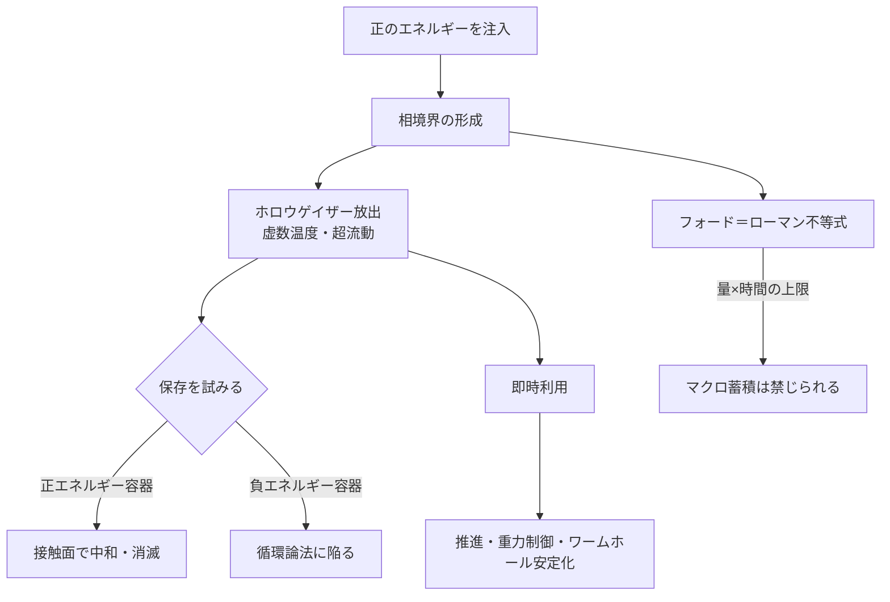

## 1. 概要 (Abstract)

負のエネルギー密度は、カシミール効果やスクイーズド光として実験的に実在することが確かめられている。では、それを「抽出」してマクロな規模で蓄積・利用することはできるだろうか。

> **前提:** 正と負のエネルギーの間に圧力差が存在し、その差を利用してサイフォン方式で負エネルギーを引き出せるとする。  
> **命題:** 「もしディラックの海から負のエネルギーをサイフォンで汲み出せたら、何が起こるか？」

「ディラックの海」は現代の場の量子論では発見的モデルに位置付けられるが、負エネルギー密度という概念自体は現代物理でも実在する。フォード＝ローマン不等式がその上限を定めていることは、逆に言えば「制約の中で実在する」ことを意味している。この記事では、その制約をどう乗り越えうるか、あるいは越えられないかを論じる。

---

## 2. 実現不可能性の根拠 (Infeasibility Rationale)

- **物理的限界:** フォード＝ローマン不等式は、負のエネルギー密度の大きさとその持続時間の積に厳しい上限を課している。わずかな負エネルギーをごく短時間しか保てないという制約であり、マクロな規模での蓄積はこの不等式が根本的に禁じていると考えられる。

- **技術的限界:** 相境界（正と負のエネルギーが接する面）を安定してスケールアップする手段が存在しない。またサイフォンから流れ出る担体量子であるホロウゲイザーは虚数温度状態にあり、通常の正エネルギーでできた容器壁に接触した瞬間に中和・消滅すると考えられる。「汲んでも入れる器がない」という問題である。

- **論理的限界:** 仮に制限なく負エネルギーを取り出せるとすれば、それは熱力学第二法則の破綻を意味する。エントロピーの増大を逆転させたり、永久機関を構成したりすることが可能になり、さらには因果律を逆転させた閉じた時間的曲線（CTC）の生成につながるおそれがある。

---

## 3. 実験の設定 (Setup)

1. **ディラックサイフォンの起動:** 正のエネルギーを局所的に注入し、真空中に相境界を形成する。油田の水圧破砕（フラッキング）に類似した操作で、正負エネルギーの境界に「亀裂」を開く。
2. **ホロウゲイザーの放出:** 相境界面はブラックホールの事象地平線に類似した構造を持ち、境界からホーキング的輻射としてホロウゲイザーが自然放出される。ホロウゲイザーは虚数温度状態にあるため粘性ゼロの超流動的性質を示し、障壁なく流れ続ける。
3. **保存の試み:** 流れ出たホロウゲイザーを何らかの容器に保存しようとする。しかし容器を構成する正エネルギー物質との接触面で中和が起きる。容器自体を負エネルギーで作れないかという発想も生まれるが、そのためにはすでに負エネルギーが手元にある必要があり、循環論法に陥る。
4. **フォード＝ローマン不等式の壁:** 抽出量を増やそうとすると、不等式の制約により持続時間が急速に短くなる。大量に抽出しようとするほど、その負エネルギーは瞬時に消えてしまう。

---

## 4. 考察と予測 (Speculation)

### 虚数温度という新しい熱力学

ホロウゲイザーが置かれる虚数温度の状態は、通常の熱力学とは根本的に異なる性質を持つと考えられる。通常の超流動は極低温で実現するが、虚数温度の系では「冷やす」という操作自体が逆転し、ある種の活発さが生まれる。KSS境界（粘性とエントロピー密度の比の下限）がこの系では反転し、粘性が負になる——つまり流れが自己加速する——可能性すら示唆される。

### 小規模抽出の可能性

マクロな蓄積は不可能であっても、カシミール効果が示すように局所的・瞬間的な負エネルギー密度の生成は現実に起きている。ディラックサイフォンは、この現象を意図的に制御する工学的延長として位置付けられる。フォード＝ローマン不等式の「量×時間」の制約内で、極小規模・極短時間の抽出サイクルを高速に繰り返すことで、実効的な負エネルギー流束を作り出せるかもしれない。

### 容器問題の迂回策

保存の問題に対する一つの発想は、「保存しない」ことである。抽出した負エネルギーを即座に目的（推進力・重力制御・ワームホール口の安定化）に転用し、蓄積のステップを省く設計が考えられる。ディラックサイフォンを推進装置に直接組み込むイメージである。

---

## 5. 図解 (Diagrams)

---

## 6. 関連記事 (Related)

- [wiim_088](wiim_088.md) — 負のエネルギーを制御できたなら何が変わるか（本記事の続編）
- 用語: ディラックサイフォン（g342）、虚数温度（g343）、ホロウゲイザー（g344）
