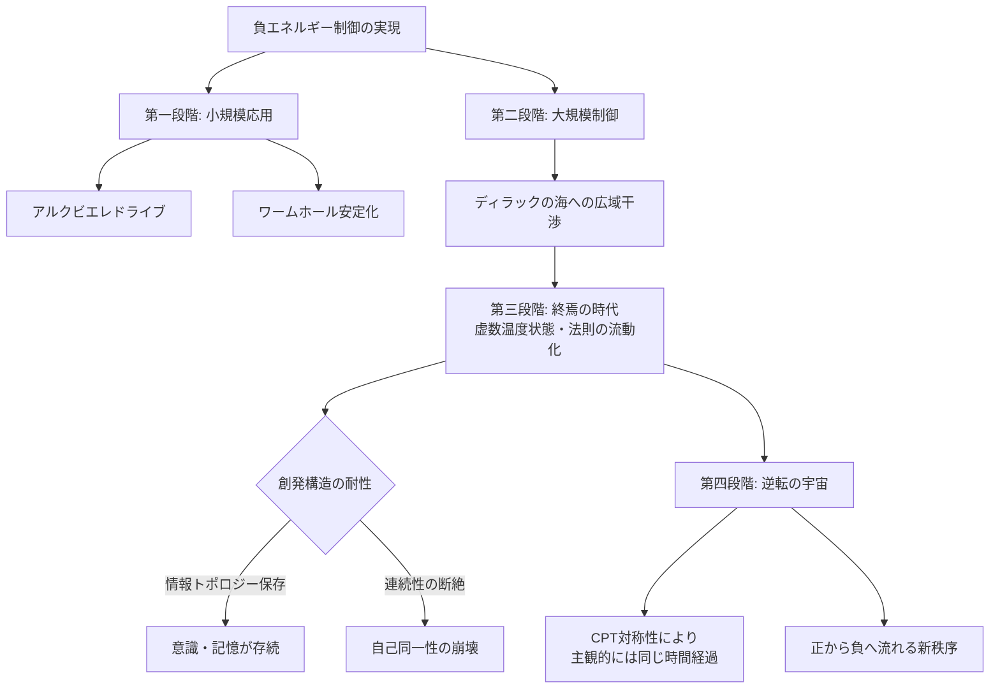

## 1. 概要 (Abstract)

[wiim_087](wiim_087.md) では、ディラックサイフォンによる負エネルギーの抽出がフォード＝ローマン不等式や容器問題によって根本的に困難であることを論じた。この記事ではその前提を受け取り、「それでも制御できたとしたら」という問いを掘り下げる。

> **前提:** wiim_087 で論じた困難を何らかの手段で乗り越え、負のエネルギーを自由に抽出・利用できるとする。  
> **命題:** 「負エネルギーの制御が実現した宇宙では、最終的に何が起こるか？」

小規模な応用（ワームホール・宇宙船推進）から始まり、やがて宇宙論的スケールへと波及する帰結の連鎖を追う。その終点には、ディラックの海そのものが「逆転」し、時間の矢が揺らぐ可能性が待っている。

---

## 2. 実現不可能性の根拠 (Infeasibility Rationale)

この記事が問う不可能性は、「さらにその先」——負エネルギー制御を宇宙論的スケールにまで拡張することの限界である。

- **物理的限界:** ディラックの海全体を逆転させるほどの負エネルギー操作は、観測可能宇宙全体のエネルギースケールを要すると考えられる。局所的な制御とは次元が異なり、現在の宇宙でそれを実現する物理的基盤が存在しない。

- **技術的限界:** 正負エネルギーが行き来できる相転移期（ここでは「終焉の時代」と呼ぶ）において、因果的連鎖に依存する創発構造——記憶・自己同一性・意思決定——を維持する基盤が流動化する。意識を支える情報トポロジーがこの移行に耐えられるかどうかは、現在の物理学が答えを持たない問いである。

- **論理的限界:** 時間の矢が逆転した宇宙では、「行為」が「結果」に先行するという因果の順序が崩れる。観測者が自らの観測を事前に「知っている」状態が常態となり、知識・選択・責任という概念の枠組み自体が別の記述を要する。

---

## 3. 実験の設定 (Setup)

1. **第一段階——小規模応用:** ディラックサイフォンが安定稼働し、アルクビエレドライブのエキゾチック物質調達問題が解決される。トラバーサブルワームホールの口を開いたまま維持することも可能になる。この段階では宇宙の物理法則は通常通りであり、負エネルギーは「使って消える」消耗品として扱われる。

2. **第二段階——大規模制御:** 文明が負エネルギー技術を数千年にわたって蓄積し、恒星系・銀河スケールで展開する。この段階で、ディラックの海への局所的な干渉が積み重なり、正負エネルギーの大局的な分布に影響が及び始める。

3. **第三段階——終焉の時代:** 正負エネルギーの境界が広域で流動化し、宇宙の相転移期に入る。この時期は虚数温度状態に対応すると考えられ、通常の熱力学が成立しない。物理法則の「定数」が局所的に揺らぎ、光速・プランク定数・重力定数が場所と時間によって異なる値を示す可能性がある。

4. **第四段階——逆転の宇宙:** 揺り戻しが完了し、宇宙が「正から負へ流れる」状態に安定する。CPT対称性により、この宇宙の住人にとっては物理法則が変わっただけで、主観的な時間経過はこれまでと変わらない。

---

## 4. 考察と予測 (Speculation)

### ディラックの海の揺り戻しという宇宙観

現在の宇宙を「負のエネルギー圧が高く、負から正へ流れ込んでいる過渡期」と捉える解釈がある。この見方に立てば、現在我々が観測する物理法則は一時的な状態であり、揺り戻しによって正から負へ流れる時代が訪れる。負エネルギーの意図的な制御は、この宇宙論的転換を人工的に先取りする——あるいは加速させる——操作として位置付けられる。

### 創発構造の耐性

思考・意識・身体はすべて複雑系の創発によるものである。創発的構造は基盤となる物理法則の「符号」に依存するのではなく、情報のパターンと関係性に依存すると考えられる。正負が逆転しても情報トポロジーが保存されるなら、意識は存続しうる。ペンローズの等角的循環宇宙論（CCC）がアイオン（宇宙期）の間で情報を引き継ぐ可能性を示唆するように、相転移を越えた構造の連続性は原理的に否定されない。

### CPT対称性と主観的時間

電荷（C）・パリティ（P）・時間（T）の複合反転のもとで物理法則は不変である。厳密には、これは三者を同時に反転した場合の不変性であり、時間反転単独の保証ではない。ただし観測者の主観という視点では、時間が巨視的に逆転した宇宙の住人も「自分が順方向に生きている」と感じると考えられる。終焉の時代の移行期は外側から見れば時間の逆転だが、その宇宙内の観測者には「物理定数が変化した」体験として現れるかもしれない——時間の向きが変わったとは気づかないまま。

### 虚数温度が時代を区切る

終焉の時代は虚数温度状態に対応すると解釈できる。「冷やすほど活発になる」反転した熱力学が宇宙全体を支配する相転移期であり、ホロウゲイザーが個々の装置から放出される現象のスケールアップとして捉えられる。この時期を経て、宇宙は新たな「正の温度」——逆転後の通常状態——へと落ち着く。

---

## 5. 図解 (Diagrams)

---

## 6. 関連記事 (Related)

- [wiim_087](wiim_087.md) — ディラックサイフォンは負のエネルギーを抽出できるか（前提記事）
- [wiim_015](wiim_015.md) — エントロピーが減少する宇宙——時間の矢が逆を向いた世界の物理と知性
- 用語: ディラックサイフォン（g342）、虚数温度（g343）、ホロウゲイザー（g344）
